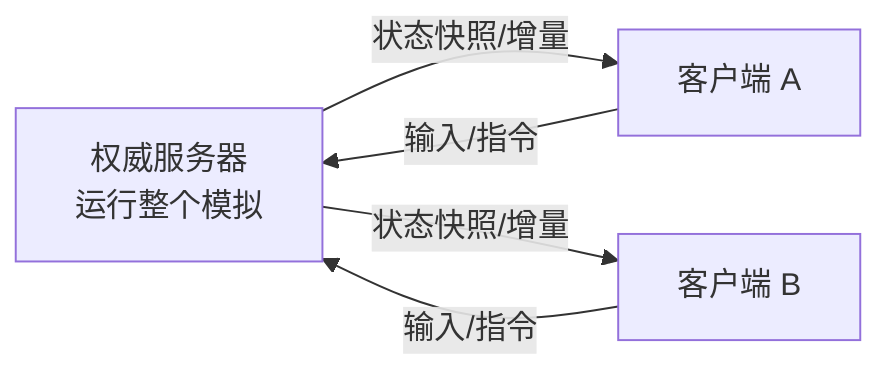
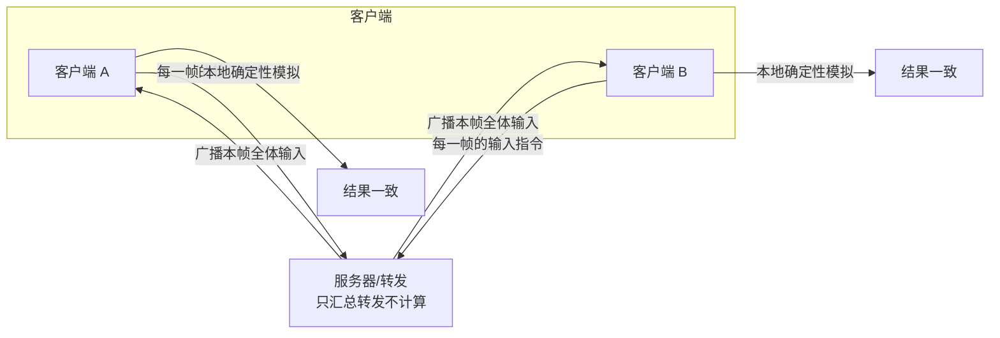
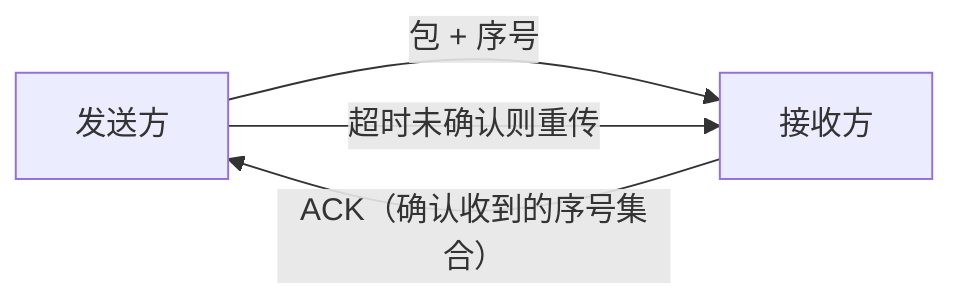

# 网络同步

> 前置说明：以下为 **引擎无关** 的通用实现思路，适用于任何联网游戏。文末附 UE5 / 其他引擎的落地对照。假设场景为常见的"多人在线对战/合作"

多人游戏里，每台机器各自运行一份游戏世界，但玩家必须"看到同一个世界"。**网络同步（Network Synchronization / Replication）** 就是让多台机器上的世界状态保持一致、且体验流畅的技术

!!! info "一句话总结"

    网络同步的核心 = 决定 **"同步什么"**（状态 or 输入）+ **"谁说了算"**（权威）+ **"怎么传"**（可靠/不可靠 + 频率/优先级）+ **"怎么补偿延迟"**（预测/插值/回滚）

| 矛盾 | 说明 |
| --- | --- |
| **一致性 vs 流畅性** | 完全一致就要等服务器，等就"卡"；本地先动就可能有偏差 |
| **带宽有限** | 不能每帧把所有对象全量发出去，必须"按需、按频率、按优先级" |
| **延迟（Latency）** | 网络往返几十~几百毫秒，必须用预测/插值掩盖 |
| **作弊与公平** | 不能让客户端自己决定结果，需要权威裁决 |
| **确定性** | 两台机器各自计算，必须保证逻辑一致（或由同一方算好再发） |

按游戏类型选型：

| 游戏类型 | 推荐范式 | 权威 | 典型方案 |
| --- | --- | --- | --- |
| FPS / TPS | 状态同步 | 服务器 | 属性/位置同步 + 客户端预测 + 延迟补偿 |
| 动作 / 格斗 | 状态同步 或 帧同步 | 服务器 / 主机 | 格斗常用帧同步保公平 |
| RTS | 帧同步 | 主机/服务器转发 | 输入锁步，千军万马省带宽 |
| MOBA | 混合 | 服务器 | 状态同步 + 视野(战争迷雾)管理 |
| MMO | 状态同步 | 服务器 | AOI 兴趣管理 + 分区/分线 |
| 休闲派对 | 状态同步/客户端权威 | 主机或服务器 | 简单可靠消息为主 |

## 1 先定架构：谁说了算

### 1.1 客户端-服务器（Client-Server）

- 一台 **权威服务器（Dedicated Server）** 拥有世界真相；客户端只发"意图"，服务器裁决后广播结果
- 变体 **监听服务器（Listen Server）**：房主的机器既当服务器也当玩家，适合合作游戏
- 优点：易反作弊、易做权限控制；缺点：服务器成本高、玩家体验依赖服务器延迟

### 1.2 点对点（P2P）

- 无中心服务器，各机器互相直连；常见做法是 **一方做 Host**（托管式 P2P），或纯对等
- 优点：省服务器成本、延迟低；缺点：防作弊难、NAT 穿透复杂、主机掉线问题多

### 1.3 权威模型决定"谁可信"

| 权威模型 | 谁算结果 | 适用 | 风险 |
| --- | --- | --- | --- |
| **服务器权威** | 服务器计算一切关键状态 | FPS、竞技、MMO | 服务器压力大 |
| **客户端权威** | 各自客户端说了算后互相同步 | 休闲、派对、非竞争 | 极易作弊 |
| **主机权威（P2P）** | 主机代行服务器职责 | 合作联机 | 主机作弊/掉线 |

!!! warning "设计第一问"

    开始写代码前先回答：**"位置、血量、胜负这些关键状态，由谁的机器最终决定？"** 网络同步 80% 的复杂度来自这个选择

## 2 核心范式：同步"状态"还是同步"输入"

这是网络同步最重要的分叉，直接决定后续所有技术：

### 2.1 状态同步（State Sync / Snapshot）

服务器算出权威状态，把 **状态**（位置、血量……）发给客户端，客户端负责渲染/预测。

- 优点：客户端逻辑简单、易反作弊、网络差也能玩（预测兜底）
- 缺点：服务器开销大、带宽与频率要求高
- 适用：**FPS、动作、MMO**（UE、Unity Netcode 多为此类）

### 2.2 帧同步 / 锁步（Lockstep / Deterministic Simulation）

只同步 **输入指令 + 帧号**；每台机器用 **完全确定性的模拟** 跑出相同结果，无需同步状态

- 优点：**省带宽**（只传输入）、天然支持回放/观战、实现"人少但单位多"（RTS 千军万马）
- 代价：**必须确定性**——浮点运算、遍历顺序、随机种子都不能有平台差异；慢机拖累全体（需落后同步）
- 适用：**RTS、格斗、部分 MOBA**

| 维度 | 状态同步 | 帧同步（锁步） |
| --- | --- | --- |
| 同步内容 | 状态（结果） | 输入（原因） |
| 带宽 | 随对象数量增长 | 只随玩家数增长，极省 |
| 客户端逻辑复杂度 | 低（渲染为主） | 高（必须全量模拟） |
| 防作弊 | 容易（服务器权威） | 难（每台都有全部逻辑） |
| 网络差的体验 | 好（可预测/插值） | 差（全体被最慢者拖累） |
| 回放/观战 | 需额外记录 | 天然支持 |
| 典型游戏 | FPS、MMO、动作 | RTS、格斗 |

## 3 传输层：可靠与不可靠

### 3.1 选 UDP 还是 TCP

| 协议 | 特点 | 游戏中的问题 |
| --- | --- | --- |
| **TCP** | 保证有序、可靠 | 队头阻塞：一个包丢了，后续全卡住；重传无差别 |
| **UDP** | 快、可丢包、无序 | 需要自己实现可靠性 |

主流游戏做法：**基于 UDP，自建"可选择可靠性"的传输层**——把"是否可靠"交给应用层决定

### 3.2 自建可靠层（在 UDP 之上）

实现可靠传输的四件套：

| 机制 | 作用 |
| --- | --- |
| **序号（Sequence）** | 检测丢失、去重、排序 |
| **ACK / NAK** | 接收方批量告知"哪些收到了" |
| **重传** | 对超时/未确认的包重新发送 |
| **排序缓冲** | 把乱序到达的数据按序投递给上层 |

### 3.3 应用层分"通道"

不要所有消息一刀切，把通信分成若干 **逻辑通道**：

| 通道 | 可靠性 | 典型内容 |
| --- | --- | --- |
| 可靠消息 | 必须到达、按序 | 进入房间、拾取、伤害结算、聊天 |
| 不可靠消息 | 丢了就丢 | 高频位置、朝向、临时特效 |
| 可靠但允许覆盖 | 关键状态 | 血条等最终会一致的数值 |
| 流式 | 大块数据 | 地图下载、语音 |

## 4 状态同步

选定"状态同步"后，工程上要解决带宽、流畅性、公平三件事：

##### 4.1 少发：兴趣管理与增量

- **兴趣管理 / AOI（Area of Interest）**：只给"能看到/相关"的客户端发"附近对象"的更新
- **增量（Delta）**：只发"变化的部分"，不整对象重发
- **死区（Deadband）**：位置变化小于阈值（如 1cm）就不发
- **频率与优先级**：重要/近距离对象发得更频繁，带宽紧张时优先保证它们

##### 4.2 快照与插值：让画面平滑

- 服务器按固定频率（如 20~30Hz）发 **快照**；接收端缓存最近若干快照
- 两次快照之间用 **插值（Interpolation）** 补出中间位置，移动看起来连续而非跳变
- 配 **抖动缓冲（Jitter Buffer）**：缓存少量快照以吸收网络抖动

##### 4.3 客户端预测：让"自己"立即响应

- 自己的角色不傻等服务器：**输入立即本地执行（预测）**
- 服务器随后返回权威结果；若与预测不一致，发 **纠正（Correction）**，客户端 **回滚（Rollback）** 后重放
- 这是 FPS/动作"手感不卡"的关键

##### 4.4 延迟补偿：让"别人"公平

- 服务器判命中时，把世界 **回滚到"开枪者当时看到的时间点"** 再判定，避免高延迟玩家吃亏（射击游戏常用）

##### 4.5 权威一致：初始同步 + 定期对账

- 新玩家加入：发送 **全量初始快照**
- 运行中：只发增量
- 可选：周期性对世界状态做 **hash 校验**，发现不一致则强制重同步（防止长期漂移）

## 5 帧同步

选定"帧同步"后，难点全在 **确定性**：

| 要点 | 说明 |
| --- | --- |
| **确定性模拟** | 同一输入序列 → 完全相同的输出。禁止随机、浮点平台差异、可变遍历顺序 |
| **帧率同步** | 以"逻辑帧"推进（如每秒 30 逻辑帧），与渲染帧率解耦 |
| **输入帧打包** | 每逻辑帧把"所有玩家的输入"打包广播，落后帧需等待（最慢者决定节奏） |
| **落后追赶（Catch-up）** | 慢机丢帧后"快进"补回同步点 |
| **确定性随机** | 随机数由种子+帧号推导，所有机器一致 |

## 6 工程实现通用建议

!!! info "网络代码结构"

    1. **消息即数据**：定义紧凑的二进制协议（命令码 + 字段），版本化以便热更新
    2. **序列化优先用位打包**：枚举/布尔用位，浮点按需截断精度，省字节就是省带宽
    3. **事件驱动发包**：只有"状态真的变了"才产生同步包，避免每帧无脑全量
    4. **逻辑帧与渲染帧分离**：服务器按逻辑帧 Tick，客户端渲染帧只管插值显示
    5. **超时与恢复**：定义"多久没收到就判定断线"，并支持重连后的 **重同步**
    6. **把网络层抽象成接口**：逻辑层只调用 `Send(msg)` / 订阅 `OnReceive`，换传输（UDP/TCP/WebSocket）不影响游戏逻辑

## 7 反作弊视角（选型时就要想）

- **关键数值、胜负判定放权威方**（服务器或可信主机），客户端只提交输入并受校验
- **限制客户端输入频率**，防止脚本按键加速
- **敏感计算**（伤害、掉落）绝不在客户端做
- 状态同步天然更利于反作弊；帧同步每台机器都掌握全部逻辑，作弊风险更高

!!! note "UE5 与 Unity 对照"

    - UE5：默认 **状态同步**——`Replicated` 属性 + RPC，基于 UDP 自研可靠层，内置预测/插值/延迟补偿（[UE5 网络同步](../../../application/unreal_engine/game_framework/network_synchronization.md)）
    - Unity：官方 Netcode for GameObjects 同为状态同步；帧同步常用第三方（如 Mirror 的 lockstep 或自研确定性模拟）
    - 无论引擎，"范式选择 + 权威 + 可靠分层 + 延迟补偿"这套设计都是通用的
