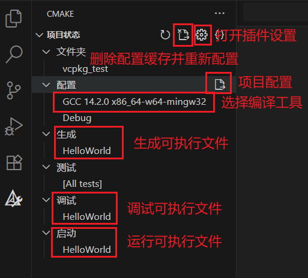

# CMake

!!! info "AI 解释"

    CMake 是一个 **跨平台的自动化构建工具**，用于管理软件的编译、测试和打包过程。它通过简单的配置文件（`CMakeLists.txt`）生成标准的构建文件（如 Makefile、Visual Studio 项目等），从而适配不同的编译环境和操作系统
    
    **核心特点**
    
    1. **跨平台支持**
       
        - 支持 Windows、Linux、macOS 等操作系统
        - 可生成多种构建系统的文件（如 Makefile、Ninja、Xcode 项目、Visual Studio 解决方案等）
    
    2. **简洁的配置语法**
    
        - 使用 `CMakeLists.txt` 文件定义项目结构、依赖和编译规则，语法比直接编写 Makefile 更易读
    
    3. **模块化与可扩展性**  
    
        - 提供内置模块（如查找库 `FindPackage`）和自定义函数/宏，支持复杂项目管理
        - 可集成第三方工具（如 CTest 测试、CPack 打包）
    
    4. **依赖管理**  
    
        - 自动检测系统环境（如编译器、库路径）
        - 支持导出和导入依赖（通过 `find_package` 或 `FetchContent`）
    
    **常见应用场景**
    
    - **C/C++ 项目**：管理多目录、多库的复杂依赖
    - **跨平台开发**：同一套配置适配不同操作系统
    - **开源项目**：方便用户自行编译（如 LLVM、OpenCV 等均使用 CMake）
    - **现代工具链集成**：支持与 Git Submodule、Conan（包管理器）、CUDA 等结合
    
    **优势 vs 传统工具**
    
    | 对比项          | CMake                     | 直接写 Makefile          |
    |-----------------|---------------------------|--------------------------|
    | **跨平台**      | 自动适配不同系统          | 需手动修改规则           |
    | **语法**        | 声明式，更简洁            | 命令式，冗长易错         |
    | **维护性**      | 适合大型项目              | 适合小型项目             |

## 1 安装

官网下载并安装：[Download CMake](https://cmake.org/download/){:target="_blank"}

## 2 在 VS Code 中

[VS Code 教程](../../application/vscode/index.md){:target="_blank"}

安装扩展：CMake Tools

<figure markdown="span">
    { width="600" }
</figure>

<figure markdown="span">
    { width="600" }
</figure>

编译文件步骤：

1. 选择编译工具
2. 配置项目
3. 生成可执行文件
4. 调试 / 运行可执行文件

## 3 CMakeLists.txt

```text linenums="1"
cmake_minimum_required(VERSION 3.10)

# 设置项目名称和版本
project(MyProject VERSION 1.0)

# 设置C++标准
set(CMAKE_CXX_STANDARD 17)
set(CMAKE_CXX_STANDARD_REQUIRED ON)

# 添加可执行文件
add_executable(my_app main.cpp src/utility.cpp)

# 包含目录
target_include_directories(my_app PUBLIC include)

# 查找并链接库
find_package(OpenCV REQUIRED)
target_link_libraries(my_app PRIVATE OpenCV::OpenCV)

# 安装目标
install(TARGETS my_app DESTINATION bin)
```

### 3.1 语法

每个 `CMakeLists.txt` 文件必须以以下命令开头：

```text linenums="1"
cmake_minimum_required(VERSION 3.10)  # 指定CMake最低版本要求
project(MyProject)                    # 定义项目名称
```

1. 变量

    1. `set(VAR_NAME value)`：设置变量
    2. `message(STATUS "VAR_NAME = ${VAR_NAME}")`：打印变量

2. `add_executable(executable_name source1.cpp source2.cpp)`：添加可执行文件
3. 添加库

    1. `add_library(library_name STATIC source1.cpp source2.cpp)`：添加静态库
    2. `add_library(library_name SHARED source1.cpp source2.cpp)`：添加动态库

4. `find_package(package_name CONFIG REQUIRED)`：查找包
5. `target_include_directories(target_name PUBLIC ${PROJECT_SOURCE_DIR}/include)`：包含目录
6. `target_link_libraries(executable_name library_name)`：链接库

7.条件语句

```text linenums="1"
if(condition)
    # ...
elseif(condition2)
    # ...
else()
    # ...
endif()
```

8.循环

```text linenums="1"
foreach(var IN ITEMS item1 item2 item3)
    message(STATUS "var = ${var}")
endforeach()
```

---

常用变量：

1. `PROJECT_NAME`: 项目名称
2. `PROJECT_SOURCE_DIR`: 项目根目录
3. `PROJECT_BINARY_DIR`: 构建目录
4. `CMAKE_CURRENT_SOURCE_DIR`: 当前处理的 `CMakeLists.txt` 所在目录
5. `CMAKE_CURRENT_BINARY_DIR`: 当前构建目录

作用域：

1. `PRIVATE`：仅用于当前目标的构建，不会传播给链接此目标的其他目标
2. `INTERFACE`：不用于当前目标的构建，仅传播给链接此目标的其他目标
3. `PUBLIC`：既用于当前目标的构建，也传播给链接此目标的其他目标

### 3.2 多目录项目结构

```text linenums="1"
project_root/
├── CMakeLists.txt
├── src/
│   ├── CMakeLists.txt
│   └── ... (源文件)
├── include/
│   └── ... (头文件)
└── tests/
    ├── CMakeLists.txt
    └── ... (测试文件)
```

```text linenums="1" title="根目录的 CMakeLists.txt"
cmake_minimum_required(VERSION 3.10)
project(MyProject)

# 添加子目录
add_subdirectory(src)
add_subdirectory(tests)
```

```text linenums="1" title="src/CMakeLists.txt"
# 添加库
add_library(my_library STATIC source1.cpp source2.cpp)
target_include_directories(my_library PUBLIC ../include)
```

```text linenums="1" title="tests/CMakeLists.txt"
# 添加测试可执行文件
add_executable(test_my_library test1.cpp test2.cpp)
target_link_libraries(test_my_library my_library gtest_main)

# 添加测试
enable_testing()
add_test(NAME my_test COMMAND test_my_library)
```

#### 3.2.1 例子

详见 [vcpkg 4.1.1](./vcpkg.md#411-例子){:target="_blank"}