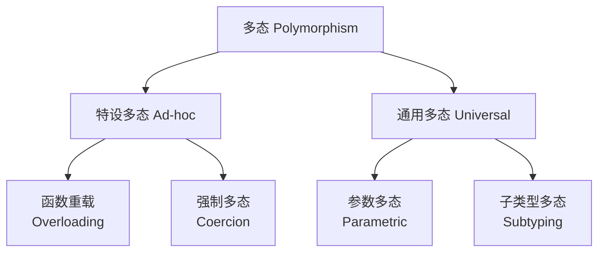
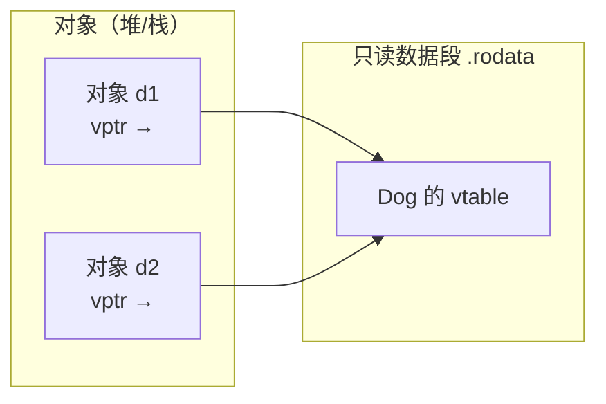
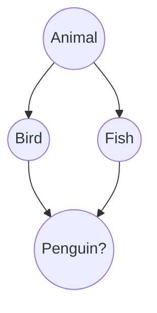

# 继承与多态

[C++ Inheritance](../../../zju/basic_courses/OOP/ch7.md){:target="_blank"}<br/>
[c++ Polymorphism](../../../zju/basic_courses/OOP/ch8.md){:target="_blank"}

## 1 函数重写、隐藏与 `override`

### 1.1 隐藏（Name Hiding）

派生类中只要定义了 **同名函数**（不看参数），就会隐藏基类中 **所有** 同名的重载版本：

```cpp linenums="1"
class Base {
public:
    void f()        { cout << "f()\n"; }
    void f(int x)   { cout << "f(int)\n"; }
};

class Derived : public Base {
public:
    void f() { cout << "Derived f()\n"; }   // 隐藏了 Base 的 f(int)
};

int main() {
    Derived d;
    d.f();       // ✓ 调用 Derived::f()
    // d.f(1);   // ✗ 编译错误！Base::f(int) 被隐藏了
}
```

若想保留基类的重载版本，使用 `using` 声明：

```cpp linenums="1"
class Derived : public Base {
public:
    using Base::f;   // 把 Base 的 f 都引入进来
    void f() { cout << "Derived f()\n"; }
};
// 现在 d.f(1) 可以调用了
```

### 1.2 `override` 与 `final`

```cpp linenums="1"
class Base {
public:
    virtual void f() {}
    virtual void g() const {}
};

class Derived : public Base {
public:
    void f() override {}      // ✓ 正确重写
    // void g() override {}   // ✗ 编译错误！签名不匹配（少了 const）
};

class FinalClass final {};    // 不能被继承的类
// class X : public FinalClass {};  // ✗ 编译错误
```

- `override`：显式声明"我在重写虚函数"，编译器会检查签名是否匹配，防止笔误
- `final`：修饰函数表示"禁止再重写"，修饰类表示"禁止被继承"

## 2 多态

多态（Polymorphism）源自希腊语，意为"多种形态"。在编程语言理论中，它的核心定义是：**同一个接口/符号，作用于不同类型的对象时，表现出不同的行为**

这是编程语言设计中最重要的抽象机制之一。从语言理论的角度，多态有一套经典分类

计算机科学家 Cardelli 和 Wegner 提出了广为接受的分类，把多态分为四大类：



!!! tip "参数多态（Parametric Polymorphism）—— 泛型/模板"

    **同一段代码适用于所有类型**，类型作为"参数"传入。这是最"纯粹"的多态
    
    ```cpp linenums="1"
    // C++ 模板
    template <typename T>
    T max(T a, T b) { return a > b ? a : b; }
    // max(1, 2)、max(1.5, 2.5)、max("a", "b") 都能用，同一份逻辑
    ```
    
    ```python linenums="1"
    # Python 天然参数多态（动态类型）
    def identity(x):
        return x   # 对任何类型都成立
    ```
    
    ```rust linenums="1"
    // Rust 泛型
    fn identity<T>(x: T) -> T { x }
    ```
    
    **特点**：一份代码，对所有类型一视同仁，**不针对具体类型做特殊处理**。对应不同语言的"泛型（Generic）""模板（Template）""多态类型（Polymorphic Type）"

!!! tip "特设多态（Ad-hoc Polymorphism）—— 重载"

    **同名函数，针对不同类型有各自独立的实现**。"Ad-hoc"意思是"针对特定情况的"，即每个类型有专门写的一份代码
    
    ```cpp linenums="1"
    // 函数重载：三个 add 是三个不同的实现
    int    add(int a, int b)       { return a + b; }
    double add(double a, double b) { return a + b; }
    std::string add(std::string a, std::string b) { return a + b; }
    
    // 运算符重载也是特设多态
    Complex operator+(const Complex& a, const Complex& b);
    ```
    
    ```java linenums="1"
    // Java 方法重载
    void print(int x) { /* ... */ }
    void print(String s) { /* ... */ }
    ```
    
    **特点**：表面上是"一个名字"，底层是 **多个实现**，编译器/语言根据参数类型选择调用哪一个

!!! tip "子类型多态（Subtype Polymorphism）—— 继承 + 虚函数"

    这就是大家最熟悉的 OOP 多态：**基类引用/指针指向派生类对象，运行时调用派生类的实现**
    
    ```cpp linenums="1"
    class Animal { public: virtual void speak() = 0; };
    class Dog : public Animal { public: void speak() override { /* 汪汪 */ } };
    class Cat : public Animal { public: void speak() override { /* 喵喵 */ } };
    
    void makeSound(Animal& a) { a.speak(); }   // 同一句 a.speak()，行为不同
    ```
    
    ```java linenums="1"
    // Java：接口 + 继承
    interface Animal { void speak(); }
    ```
    
    **特点**：通过 **继承关系**（is-a）建立类型层级，用 **动态绑定** 实现"调用哪个实现由运行时类型决定"。这是最常被称作"多态"的那一种

!!! tip "强制多态（Coercion Polymorphism）—— 隐式类型转换"

    编译器 **自动把一种类型转成另一种类型**，使操作"看起来"能作用于多种类型
    
    ```cpp linenums="1"
    int a = 10;
    double b = 3.14;
    double c = a + b;    // a 被隐式转成 double，+ 才能成立
    
    char ch = 'A';
    int code = ch;       // char 隐式提升为 int
    ```
    
    **特点**：不是"为多类型提供多实现"，而是"把不同类型先 **统一** 成一种类型再操作"。它是编译器/语言的自动行为

工程上更常按"何时确定调用哪个实现"来分：

| 维度 | 编译期多态（静态） | 运行期多态（动态） |
|---|---|---|
| **决定时机** | 编译时确定 | 运行时确定 |
| **机制** | 重载、模板、泛型 | 虚函数、接口、鸭子类型 |
| **开销** | 零（可内联） | 有间接调用开销 |
| **灵活性** | 类型必须编译期已知 | 可处理"运行时才知道的类型" |
| **典型语言** | C++ 模板、Rust 泛型 | C++ 虚函数、Java 接口、Python |

!!! tip "编译期多态：模板的代码生成"

    ```cpp linenums="1"
    template <typename T>
    T max(T a, T b) { return a > b ? a : b; }
    
    max(1, 2);      // 编译器生成 int 版本
    max(1.5, 2.5);  // 编译器生成 double 版本
    // 编译后是两份独立的机器代码，无运行时开销
    ```

!!! tip "运行期多态：虚函数的间接调用"

    ```cpp linenums="1"
    Animal* a = new Dog();
    a->speak();   // 运行时查 vtable 才知道调用 Dog::speak
    ```

!!! tip "不同语言的多态实现"

    | 语言 | 参数多态 | 子类型多态 | 特色 |
    |---|---|---|---|
    | **C++** | 模板（编译期展开） | 虚函数 + vtable | 静态动态都强 |
    | **Java** | 泛型（**类型擦除**） | 接口 + 继承 | 泛型被擦除为 Object |
    | **C#** | 泛型（**运行时具体化**） | 接口 + 继承 | 泛型在运行时保留类型 |
    | **Rust** | 泛型 + trait（默认静态分发） | `dyn Trait`（动态分发） | 无继承，用 trait 实现多态 |
    | **Go** | —（无泛型，1.18 前） | **interface（隐式实现）** | 鸭子类型风格 |
    | **Python/JS** | 天然（动态类型） | **鸭子类型** | 无需继承，有方法就能调 |

!!! tip "多态的本质价值"

    1. **开闭原则**：对扩展开放、对修改关闭——新增类型无需修改已有代码
    2. **降低耦合**：调用方只依赖抽象（接口/基类），不依赖具体类型
    3. **代码复用**：同一份逻辑（如 `makeSound`）能处理一族类型
    4. **可替换性**：Liskov 替换原则——派生类可替换基类使用

## 3 虚函数与多态

当一个类含有虚函数时，编译器会为它做两件事：

1. 为该类生成一张 **虚函数表（vtable）**—— 一个存放虚函数地址的数组
2. 让该类的每个对象内部多一个隐藏指针 **vptr**，指向所属类的 vtable

调用虚函数时，编译器把 `p->f()` 编译成一次 **间接跳转**：

```cpp linenums="1"
p->f();   // 大致等价于：(*p->vptr[n])(p)
```

先通过 `vptr` 找到 vtable，再取出第 `n` 个槽位的函数地址并调用。因此实际执行的是 **对象真实类型** 对应的版本，这就是多态的运行时基础

### 3.1 存储位置

| 内容 | 存储位置 | 数量 | 何时生成 |
|---|---|---|---|
| **vtable** | 只读数据段（`.rodata` / `.rdata`） | **每个多态类一张**，该类的所有对象共享 | 编译期生成 |
| **vptr** | **对象内部**（堆/栈/数据段，取决于对象本身在哪） | **每个对象一个** | 构造函数中设置 |

#### 3.1.1 vtable 存在只读数据段

vtable 由编译器在编译期确定，内容不可变（函数地址是编译期已知的），所以被放入 **只读数据段**。同一类的所有对象共享同一张 vtable，这正是为什么虚函数机制几乎不增加对象内存 —— 只多了 **一个 vptr**（64 位下 8 字节）



#### 3.1.2 vptr 存在对象内部

vptr 是对象数据的一部分，对象在哪它就在哪：

- 对象在栈上 → vptr 在栈上
- 对象在堆上（`new`）→ vptr 在堆上
- 对象是全局变量 → vptr 在数据段

至于 vptr 在对象内的 **具体偏移**，标准不规定，是 ABI 的实现细节。实践上（GCC/Clang/MSVC）单继承时通常放在对象内存的 **最开头**（偏移 0），这样取 vptr 最快：

```text
对象内存布局（单继承，常见实现）：
┌──────────────────────┐
│ vptr  (8 字节)        │ ← 偏移 0
├──────────────────────┤
│ 基类数据成员           │
├──────────────────────┤
│ 派生类数据成员         │
└──────────────────────┘
```

!!! tip "RTTI 信息也挂在 vtable 附近"

    在实践中（Itanium ABI / MSVC），vtable 的槽位数组之前还存有 `type_info` 指针（RTTI 的运行时类型信息）。所以 `typeid(*p)`、`dynamic_cast` 能工作，正是靠 vptr → vtable → type_info 这条链。

!!! tip "虚函数调用的开销"

    ```cpp linenums="1"
    Animal* p = new Dog();
    p->move();
    ```
    
    非虚调用：`call Animal::move`（直接跳转，可内联优化）
    
    虚调用：`mov rax, [p]` → 取 vptr；`mov rax, [rax + 8*n]` → 取第 n 个槽位；`call rax` → 间接调用
    
    代价主要是 **一次间接寻址 + 难以内联**（除非编译器能静态证明对象的真实类型，如 `devirtualization` 优化）。这也是为什么"无关继承的类不要随便加 virtual"

### 3.2 构造/析构函数中调用虚函数的行为

这是最容易踩坑的地方，核心规则只有一句：**在构造函数和析构函数（及其调用的其他函数）中调用虚函数，不会发生动态绑定，调用的是"当前正在构造/析构的那个类"的版本**

#### 3.2.1 构造函数中的虚调用

```cpp linenums="1"
class Base {
public:
    Base() { f(); }                       // ① 构造中调用虚函数
    virtual void f() { cout << "Base::f\n"; }
};

class Derived : public Base {
public:
    Derived() {}                          // ②
    void f() override { cout << "Derived::f\n"; }
};

int main() {
    Derived d;
    // 输出：Base::f（不是 Derived::f！）
}
```

输出是 `Base::f` 而不是 `Derived::f`。**原因**：

构造 `Derived d` 时，执行顺序是"先基类后派生类"：

1. 进入 `Base::Base()` 时，`Derived` 的成员 **还没初始化**，此刻对象在语义上"只是"一个 `Base`。编译器把 vptr 设置为 **Base 的 vtable**
2. 因此 `Base()` 里调用的 `f()` 通过 vptr 绑定到 `Base::f`
3. `Base()` 结束后，vptr 才被改成 **Derived 的 vtable**，之后虚调用才会绑定到 `Derived` 版本

如果这里真的动态绑定到 `Derived::f`，就会在派生类成员尚未构造时访问它们 → **未定义行为**。所以标准强制构造/析构中的虚调用是静态绑定的，这本质是一种安全保护

#### 3.2.2 析构函数中的虚调用

对称地，析构顺序是"先派生类后基类"：

```cpp linenums="1"
class Base {
public:
    virtual ~Base() { f(); }             // 析构中调用虚函数
    virtual void f() { cout << "Base::f\n"; }
};

class Derived : public Base {
public:
    ~Derived() {}
    void f() override { cout << "Derived::f\n"; }
};

int main() {
    Derived d;
    // 析构时输出：Base::f
}
```

当 `~Derived()` 执行完、进入 `~Base()` 时，`Derived` 的部分 **已经析构完了**，此时 vptr 已被重新设回 **Base 的 vtable**，所以 `f()` 绑定到 `Base::f`

!!! tip "vptr 在构造/析构期间的动态变化"

    以构造一个三层继承对象 `C → B → A` 为例：
    
    | 阶段 | 正在执行的构造函数 | vptr 指向 |
    |---|---|---|
    | 1 | `A::A()` | A 的 vtable |
    | 2 | `B::B()` | B 的 vtable |
    | 3 | `C::C()` | C 的 vtable |
    
    析构时完全倒过来：
    
    | 阶段 | 正在执行的析构函数 | vptr 指向 |
    |---|---|---|
    | 1 | `C::~C()` | C 的 vtable |
    | 2 | `B::~B()` | B 的 vtable |
    | 3 | `A::~A()` | A 的 vtable |
    
    所以"在哪个类的构造/析构里，就调用哪个类的虚函数版本"

!!! question "如果在构造函数调用了纯虚函数，会怎么样"

    **结论：这是未定义行为（Undefined Behavior），绝大多数情况下程序会直接崩溃（终止）**
    
    要理解原因，需要串联两条规则：
    
    1. **构造函数中调用虚函数是静态绑定的**——调用的是"当前正在构造的那个类"的版本，而不是派生类重写的版本
    2. 当构造函数属于 **定义纯虚函数的那个基类** 时，静态绑定绑到的就是 **纯虚函数本身**——而它没有实现
    
    纯虚函数在虚函数表中 **没有真实地址**，编译器填的是一个特殊占位符（如 Itanium ABI 下的 `__cxa_pure_virtual`）：
    
    ```text
    Base 的 vtable:
    ┌─────────────────────────────┐
    │ type_info (RTTI)            │
    ├─────────────────────────────┤
    │ __cxa_pure_virtual  ← f()   │   ← 纯虚函数槽位，不是真实函数
    └─────────────────────────────┘
    ```
    
    这个占位符被调用时，运行时会报错并终止程序
    
    | 编译器 | 典型表现 |
    |---|---|
    | GCC / Clang | 打印 `pure virtual method called`，然后 `terminate called without an active exception`，`abort` |
    | MSVC | 抛出运行时错误（如 `R6025 - pure virtual function call`），程序终止 |
    
    **注意**：由于是未定义行为，标准 **不保证** 一定有友好报错——也可能静默崩溃、段错误，或（理论上）任何行为。不要依赖具体的报错信息

    !!! tip "一个重要的例外：纯虚函数有定义时"

        纯虚函数 **可以有函数体**（定义必须写在类外）：
        
        ```cpp linenums="1"
        class Base {
        public:
            Base() { Base::f(); }  // ✓ 限定名调用，合法！调用下面的定义
            virtual void f() = 0;
        };
        
        // 纯虚函数的定义（写在类外）
        void Base::f() {
            std::cout << "Base::f 的定义\n";
        }
        ```
        
        关键区别：
        
        | 调用方式 | 是否合法 | 说明 |
        |---|---|---|
        | `Base::f()`（限定名） | ✓ **合法** | 直接调用纯虚函数的定义，不走虚调用机制 |
        | `f()`（构造函数里的虚调用） | ✗ **UB** | 走 vtable，vtable 里仍是 `__cxa_pure_virtual` 占位符，不指向你的定义 |
        
        也就是说：**纯虚函数即使有定义，构造函数里不加限定名的 `f()` 依然会崩溃**——因为虚调用走的是 vtable 占位符，而不是你写的定义

    !!! question "为什么标准不直接禁止（编译错误）"
    
        编译器 **无法静态检测** 所有情况。比如：
        
        ```cpp linenums="1"
        class Base {
        public:
            Base() { init(); }            // 调用非虚函数
            void init() { f(); }          // init 内部调用了纯虚函数 —— 编译期很难追踪
            virtual void f() = 0;
        };
        ```
        
        构造函数调用了 `init()`，`init()` 又调用了纯虚函数 `f()`。这种 **间接调用链** 在编译期难以全部静态分析，所以标准只能把它定为"未定义行为"而不是"编译错误"，把责任交给程序员

### 3.3 多继承下的 vtable

多继承时，每个"带虚函数的基类子对象"都有自己独立的 vptr 和 vtable：

```cpp linenums="1"
class Base1 {
public:
    virtual void f1() { cout << "Base1::f1" << endl; }
    virtual void f2() { cout << "Base1::f2" << endl; }
};

class Base2 {
public:
    virtual void g1() { cout << "Base2::g1" << endl; }
    virtual void g2() { cout << "Base2::g2" << endl; }
};

class Derived : public Base1, public Base2 {
public:
    virtual void f1() override { cout << "Derived::f1" << endl; }   // 覆盖 Base1::f1
    virtual void g1() override { cout << "Derived::g1" << endl; }   // 覆盖 Base2::g1
    virtual void h1() { cout << "Derived::h1" << endl; }            // 新增
};
```

```text
Derived 对象:
+---------------------------+  ← 对象起始地址 (假设为 0x1000)
| vptr1 (指向 Base1 相关的虚函数表) |  ← 8 字节
+---------------------------+
| Base1 的其他成员变量       |
+---------------------------+
| vptr2 (指向 Base2 相关的虚函数表) |  ← 8 字节，位置在 0x1000 + sizeof(Base1部分)
+---------------------------+
| Base2 的其他成员变量       |
+---------------------------+
| Derived 自己的成员变量     |
+---------------------------+
```

```text
vtable1 内容:
[0] -> Derived::f1()   (覆盖 Base1::f1)
[1] -> Base1::f2()     (未覆盖)
[2] -> Derived::h1()   (Derived 新增的虚函数，放在第一个基类的表中)
[3] -> 特殊调整函数     (称为 "thunk"，用于 this 指针调整)

vtable2 内容:
[0] -> Derived::g1()   (覆盖 Base2::g1)
[1] -> Base2::g2()     (未覆盖)
[2] -> 特殊调整函数     (thunk，用于 this 指针调整)
```

#### 3.3.1 this 指针调整

当通过 `Base2*` 指针调用 `g1()` 时：

```cpp linenums="1"
Derived d;
Base2* p = &d;  // 发生了指针偏移！p 指向 Derived 对象内部的 Base2 子对象
p->g1();        // 调用 Derived::g1()
```

问题：`Derived::g1()` 函数期望收到的 `this` 指针是整个 `Derived` 对象的起始地址（即指向 `vptr1` 的位置），但 `p` 指向的是 `Base2` 子对象的起始地址（即 `vptr2` 的位置）

解决方法：编译器在 `Base2` 的虚函数表中插入了一个 "thunk"（调整桩）

`p->g1()` 调用流程:

1. 从 `p` 指向的位置读取 `vptr2`
2. 从 `vtable2` 的 `[0]` 位置取出函数地址 (实际是 thunk)
3. 调用 thunk
4. thunk 内部执行：`this = this - offset` (调整到 `Derived` 对象的起始地址)
5. thunk 跳转到真正的 `Derived::g1(this)`

## 4 纯虚函数与抽象类

```cpp linenums="1"
class Shape {                       // 抽象类
public:
    virtual double area() const = 0;   // 纯虚函数
    virtual ~Shape() {}
};

class Circle : public Shape {
    double r;
public:
    double area() const override { return 3.14 * r * r; }
};

// Shape s;   // ✗ 抽象类不能实例化
Circle c;     // ✓ 实现了所有纯虚函数才能实例化
```

- 纯虚函数用 `= 0` 声明，没有函数体
- 含纯虚函数的类是 **抽象类**，不能创建对象
- 派生类必须实现所有纯虚函数，否则它也是抽象类

## 5 虚析构函数

```cpp linenums="1"
class Base {
public:
    ~Base() { cout << "Base 析构\n"; }
};

class Derived : public Base {
    int* data = new int[100];
public:
    ~Derived() { delete[] data; cout << "Derived 析构\n"; }
};

int main() {
    Base* p = new Derived();
    delete p;   // 只调用了 ~Base()，Derived 的 data 泄漏！
}
```

**问题**：通过基类指针 `delete` 派生类对象时，若基类析构函数不是虚函数，只会调用基类析构，派生类的析构（和资源释放）不会执行 → **内存泄漏**

**解决**：把基类析构函数声明为 `virtual`：

```cpp linenums="1"
class Base {
public:
    virtual ~Base() { cout << "Base 析构\n"; }   // 虚析构
};
// 现在 delete p 会先调用 ~Derived()，再调用 ~Base()
```

!!! danger "经验法则"

    只要一个类 **设计为被继承**（含虚函数或会被多态使用），就应把析构函数声明为 `virtual`。反过来，若类 **不含任何虚函数**、也不作为基类，则不必加 virtual（省一个 vptr 的开销）

!!! question "构造函数可以是虚函数吗"

    **不能。** 构造函数 **绝对不能** 声明为虚函数，C++ 标准直接禁止这样做，编译器会报错。这与"析构函数可以是（而且往往应该是）虚函数"形成了鲜明的对比
    
    语法上：编译直接报错
    
    机制上：vptr 还没初始化，虚调用无从谈起。虚函数依赖对象内部的 **vptr** 来找到虚函数表。但关键问题是：**vptr 是在构造函数执行期间才被初始化的**。也就是说，**在构造函数开始执行之前，vptr 根本不存在**。如果构造函数本身是虚的，编译器就要在"还没有 vptr"的情况下通过 vptr 去查找调用哪个构造函数——这在机制上自相矛盾，是"先有鸡还是先有蛋"的问题
    
    语义上：多态需要对象，而构造正是创建对象。多态的意义是"根据对象的 **实际类型** 决定调用哪个函数"。但构造对象时 **总是明确知道要创建哪个类**，根本不存在"运行时才知道类型"的场景，因此构造函数没有多态的需求，声明成虚函数毫无意义

    !!! tip "替代方案：模拟“虚构造函数”效果"

        虽然构造函数不能是虚的，但有时我们确实需要"**根据运行时类型创建对象**"。这可以用以下模式实现：
        
        虚克隆（Virtual Clone / 原型模式）：
        
        ```cpp linenums="1"
        class Animal {
        public:
            virtual ~Animal() {}
            virtual Animal* clone() const = 0;   // 虚"拷贝构造"：克隆自己
        };
        
        class Dog : public Animal {
        public:
            Animal* clone() const override {
                return new Dog(*this);    // 调用 Dog 的拷贝构造
            }
        };
        
        class Cat : public Animal {
        public:
            Animal* clone() const override {
                return new Cat(*this);
            }
        };
        
        int main() {
            Animal* p = new Dog();
            Animal* copy = p->clone();   // 运行时创建了正确的类型（Dog）
            // copy 是 Dog*，但通过 Animal* 使用
        }
        ```
        
        工厂模式：
        
        ```cpp linenums="1"
        // 工厂根据参数返回不同类型的对象
        std::unique_ptr<Animal> createAnimal(const std::string& type) {
            if (type == "dog") return std::make_unique<Dog>();
            if (type == "cat") return std::make_unique<Cat>();
            return nullptr;
        }
        ```

## 6 多重继承与菱形继承

### 6.1 多重继承

```cpp linenums="1"
class Flyable { public: void fly(); };
class Swimmable { public: void swim(); };

class Duck : public Flyable, public Swimmable {
    // 同时继承两个基类
};
```

多重继承会导致 **菱形继承（钻石问题）**：



```cpp linenums="1"
class Animal { public: int age; };
class Bird  : public Animal {};
class Fish  : public Animal {};
class Duck  : public Bird, public Fish {};
// Duck 对象里有两份 age：Bird::age 和 Fish::age，产生二义性
```

### 6.2 虚继承解决菱形问题

```cpp linenums="1"
class Animal { public: int age; };
class Bird  : virtual public Animal {};   // 虚继承
class Fish  : virtual public Animal {};
class Duck  : public Bird, public Fish {};
// Duck 对象里只有一份 Animal 子对象
```

虚继承让共同基类在最终派生类中只保留一份，消除二义性，但会增加实现复杂度和运行时开销（虚基类通过指针访问）

## 7 继承中的其他注意点

1. **友元关系不继承**：基类的友元不会自动成为派生类的友元
2. **静态成员共享**：基类的 `static` 成员在整个继承层次中只有一份，所有派生类共享
3. **构造函数、析构函数、赋值运算符、友元函数都不被继承**（但派生类构造时仍会调用基类构造）
4. **类型转换**：派生类对象可隐式转换为基类引用/指针（向上转型），反之（向下转型）需 `static_cast` / `dynamic_cast`（多态时）

```cpp linenums="1"
Derived d;
Base& b = d;              // ✓ 向上转型（隐式）
Derived* pd = dynamic_cast<Derived*>(&b);  // 向下转型需显式转换
```
