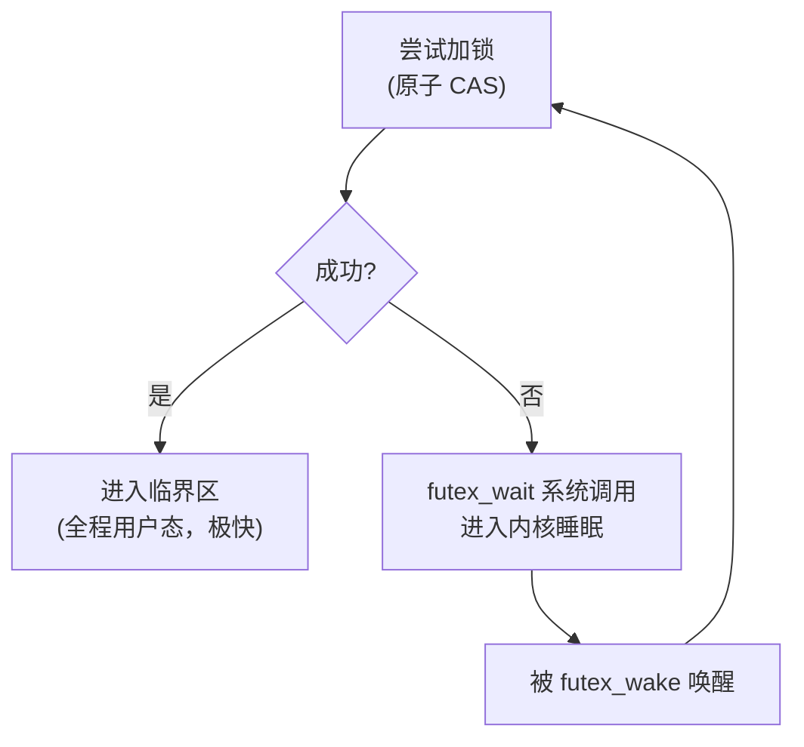
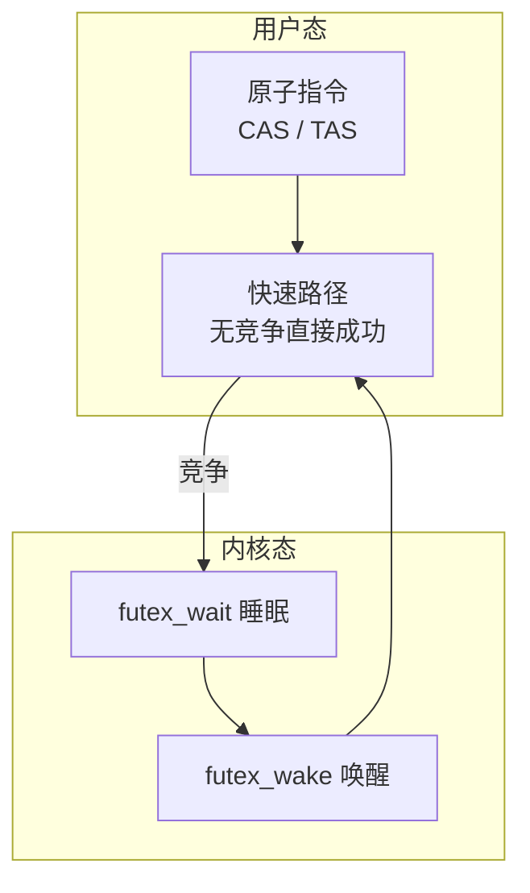

# 并发支持库

## 1 线程 `std::thread`

`std::thread` 表示一个可执行线程，构造时传入可调用对象即启动线程

```cpp linenums="1"
#include <thread>
#include <iostream>

void worker(int id) {
    std::cout << "thread " << id << '\n';
}

int main() {
    std::thread t1(worker, 1);          // 启动线程，传参
    std::thread t2([] { std::cout << "lambda\n"; });

    t1.join();   // 阻塞等待线程结束
    t2.join();
}
```

关键成员与规则：

1. `join()`：等待线程结束。每个线程必须被 `join` 或 `detach`，否则析构时 `std::terminate`
2. `detach()`：分离线程，让它独立运行（不推荐，难以安全同步）
3. `joinable()`：判断线程是否可被 `join`
4. `get_id()`、`hardware_concurrency()`（返回可用 CPU 核心数）
5. 线程对象不可复制，只能移动

参数传递注意：默认按值拷贝，引用需要 `std::ref`

```cpp linenums="1"
int x = 0;
std::thread t([](int& v) { v = 42; }, std::ref(x));
```

`std::this_thread` 命名空间提供辅助函数：

```cpp linenums="1"
std::this_thread::sleep_for(std::chrono::milliseconds(100));
std::this_thread::sleep_until(deadline);
std::this_thread::yield();              // 主动让出 CPU
std::this_thread::get_id();
```

`thread_local` 关键字声明线程局部变量，每个线程持有独立副本

## 2 互斥量与锁

### 2.1 互斥量类型

| 类型 | 说明 |
| -- | -- |
| `std::mutex` | 基础互斥量，不可重入 |
| `std::recursive_mutex` | 可递归加锁（同一线程可重复 lock） |
| `std::timed_mutex` | 支持 try_lock_for / try_lock_until |
| `std::recursive_timed_mutex` | 递归 + 超时 |
| `std::shared_mutex` | 读写锁 (C++17)，多读者互斥写者 |

### 2.2 RAII 锁

永远不要手动调用 `lock()`/`unlock()`（异常不安全），应使用 RAII 包装：

```cpp linenums="1"
#include <mutex>

std::mutex mtx;
int counter = 0;

void increment() {
    std::lock_guard<std::mutex> lock(mtx);   // 构造加锁，析构解锁
    ++counter;
}
```

| 锁 | 特点 |
| -- | -- |
| `std::lock_guard` | 最轻量，构造时加锁，不可手动解锁 |
| `std::unique_lock` | 灵活，可延迟加锁、提前解锁、转移所有权 |
| `std::scoped_lock` | (C++17) 可同时锁多个互斥量，避免死锁 |
| `std::shared_lock` | 配合 `shared_mutex` 的读锁 |

`unique_lock` 的灵活用法：

```cpp linenums="1"
std::unique_lock<std::mutex> lock(mtx, std::defer_lock); // 延迟加锁
lock.lock();
// ... 临界区 ...
lock.unlock();        // 提前解锁
lock.lock();          // 重新加锁
```

`scoped_lock` 以固定顺序锁多个互斥量，避免死锁：

```cpp linenums="1"
std::mutex a, b;
void swap_both() {
    std::scoped_lock lock(a, b);   // 等价于 std::lock(a, b) + 两个 guard
}
```

读写锁示例：

```cpp linenums="1"
#include <shared_mutex>
std::shared_mutex rw;
void read()  { std::shared_lock lock(rw);  /* 多线程可同时读 */ }
void write() { std::unique_lock lock(rw);  /* 独占写 */ }
```

### 2.3 一次性初始化

```cpp linenums="1"
std::once_flag flag;
void init() { /* 只执行一次的初始化 */ }

std::call_once(flag, init);   // 保证多线程下 init 只执行一次
```

## 3 条件变量 `std::condition_variable`

条件变量用于等待某个条件成立，必须配合互斥量使用，是生产者-消费者模型的核心

```cpp linenums="1"
#include <mutex>
#include <condition_variable>
#include <queue>

std::mutex mtx;
std::condition_variable cv;
std::queue<int> q;
const int MAX = 10;

void producer() {
    for (int i = 0; ; ++i) {
        std::unique_lock<std::mutex> lock(mtx);
        cv.wait(lock, [] { return q.size() < MAX; }); // 队列满则等待
        q.push(i);
        lock.unlock();
        cv.notify_one();            // 唤醒一个消费者
    }
}

void consumer() {
    while (true) {
        std::unique_lock<std::mutex> lock(mtx);
        cv.wait(lock, [] { return !q.empty(); });     // 队列空则等待
        int v = q.front(); q.pop();
        lock.unlock();
        cv.notify_one();            // 唤醒一个生产者
    }
}
```

要点：

1. `wait(lock, pred)` 等价于 `while (!pred()) wait(lock);`，自动处理虚假唤醒
2. `notify_one()` 唤醒一个等待线程；`notify_all()` 唤醒全部
3. 必须在加锁状态下调用 `wait`；等待期间锁被自动释放，唤醒后重新获取
4. `condition_variable` 只支持 `unique_lock<std::mutex>`；`condition_variable_any` 支持任意可锁定类型（开销略大）

## 4 原子操作与内存序 `std::atomic`

原子类型保证操作不可分割，是无锁编程的基础，性能远高于互斥量

### 4.1 基本用法

```cpp linenums="1"
#include <atomic>

std::atomic<int> cnt{0};

void add() {
    cnt.fetch_add(1, std::memory_order_relaxed);
    // 等价于 cnt++; 或 cnt += 1;
}

bool old = cnt.exchange(5);          // 交换
bool ok = cnt.compare_exchange_strong(expected, desired); // CAS
```

`std::atomic` 支持整型、指针、布尔等，整型原子支持 `+=`、`fetch_add`、`fetch_sub`、`fetch_or` 等。`std::atomic_flag` 是最简单的原子布尔类型（自旋锁基础）

### 4.2 内存序 `memory_order`

C++ 内存模型定义了 6 种内存序，从弱到强：

| 内存序 | 语义 |
| -- | -- |
| `relaxed` | 仅保证原子性，无同步/顺序约束 |
| `consume` | 数据依赖排序（很少使用，编译器实现受限） |
| `acquire` | 后续读写不能重排到此操作之前 |
| `release` | 之前读写不能重排到此操作之后 |
| `acq_rel` | `acquire` + `release` |
| `seq_cst` | 顺序一致性，默认且最强，全序 |

典型使用：`release` 用于发布数据，`acquire` 用于读取数据：

```cpp linenums="1"
std::atomic<bool> ready{false};
int data = 0;

void producer() {
    data = 42;                                  // 普通写入
    ready.store(true, std::memory_order_release); // 发布
}

void consumer() {
    while (!ready.load(std::memory_order_acquire)) {} // 获取
    // 保证能看到 data == 42
}
```

> 实践建议：不确定时用默认 `seq_cst`；性能敏感场景用 `acquire`/`release`；只有单纯计数器用 `relaxed`

## 5 异步与 Future `std::async` / `std::future`

`<future>` 提供任务级并发，通过"未来值"传递结果，无需手动管理线程

### 5.1 `std::async`

```cpp linenums="1"
#include <future>

int compute(int x) { return x * x; }

int main() {
    std::future<int> fut = std::async(std::launch::async, compute, 10);
    // 主线程做其他事...
    int result = fut.get();   // 阻塞直到结果就绪；只能调用一次
}
```

`std::launch` 策略：

1. `std::launch::async`：强制新线程异步执行
2. `std::launch::deferred`：延迟到 `get()` 时在当前线程执行
3. `async` | `deferred`（默认）：由实现决定

### 5.2 `std::promise` 与 `std::future`

`promise` 在生产者端设置值，`future` 在消费者端读取：

```cpp linenums="1"
std::promise<int> prom;
std::future<int> fut = prom.get_future();

std::thread t([&prom] { prom.set_value(42); });   // 设置结果

int v = fut.get();   // 阻塞等待
t.join();
```

`promise` 还可以通过 `set_exception` 传递异常，由 `future::get()` 重新抛出

### 5.3 `std::packaged_task`

将可调用对象包装成异步任务，可直接传给线程：

```cpp linenums="1"
std::packaged_task<int(int)> task(compute);
std::future<int> fut = task.get_future();

std::thread t(std::move(task), 10);   // packaged_task 只可移动
t.detach();
int v = fut.get();
```

### 5.4 `std::shared_future`

普通 `future` 只能 `get()` 一次；`shared_future` 可被多个线程共享读取：

```cpp linenums="1"
std::shared_future<int> sf = fut.share();   // 或 std::async(...).share()
```

## 6 C++20 新特性

### 6.1 `std::jthread`

`jthread` 在析构时自动 `join`，并支持协作式取消：

```cpp linenums="1"
#include <thread>

std::jthread worker([](std::stop_token st) {
    while (!st.stop_requested()) {
        // 工作...
    }
});
// 作用域结束时自动 join，无需手动管理
```

可通过 `jthread::request_stop()` 发送停止请求，`std::stop_token` 检查是否被请求停止。相比 `thread` 更安全，避免了忘记 `join` 导致的崩溃

### 6.2 `std::latch`

等待一定次数后放行所有线程：

```cpp linenums="1"
#include <latch>

std::latch done(3);   // 需要 3 次 count_down

void worker() {
    // 准备工作...
    done.arrive_and_wait();   // 计数减一并等待
    // 所有线程就绪后继续
}
```

### 6.3 `std::barrier`

`latch` 只能使用一次，`barrier` 可重复使用，适合分阶段并行（如并行循环的每轮迭代之间同步）：

```cpp linenums="1"
#include <barrier>

std::barrier sync(4);
for (int phase = 0; phase < 10; ++phase) {
    // 并行工作...
    sync.arrive_and_wait();   // 等待本轮所有线程完成
}
```

### 6.4 信号量 `std::counting_semaphore` / `std::binary_semaphore`

```cpp linenums="1"
#include <semaphore>

std::counting_semaphore<10> sem(5);   // 最大计数 10，初始 5

sem.acquire();   // 计数减一（阻塞直到 >0）
// 使用资源...
sem.release();   // 计数加一
```

`binary_semaphore` 是最大计数为 1 的特化，相当于互斥量

### 6.5 其他

1. `std::atomic_ref<T>`：对非原子对象提供原子访问（C++20）
2. `std::atomic<std::shared_ptr>`（C++20）/ `std::atomic<std::weak_ptr>`
3. `std::atomic::wait` / `notify_one` / `notify_all`：原子类型的等待通知（C++20）

## 7 底层原理：互斥锁 / 读写锁 / 条件变量

这三者都建立在 **硬件原子指令** 和 **操作系统内核的睡眠/唤醒机制** 之上。理解它们，需要先了解最底层的两块基石

### 7.1 两块基石

#### 7.1.1 硬件原子指令

CPU 提供不可分割的原子操作，如 x86 的：

- `lock cmpxchg`（Compare-And-Swap，CAS）：比较并交换
- `xchg`（Test-And-Set，TAS）：交换
- ARM 的 `LDXR/STXR`（Load-Linked / Store-Conditional）

这些指令在 **总线/缓存层面加锁**，保证多核并发下只有一个核能成功修改。所有锁的最底层都靠它们实现"读-改-写"的原子性

#### 7.1.2 内核的睡眠/唤醒

线程竞争失败时不能傻等（浪费 CPU），要让出 CPU 进入睡眠。Linux 靠 `futex` 系统调用完成：

- `futex_wait`：让线程睡眠，挂到等待队列
- `futex_wake`：唤醒等待队列上的线程



### 7.2 互斥锁（Mutex）

互斥锁是 **两阶段** 设计：**快速路径走用户态原子操作，竞争时才进内核**。以 glibc 的 `pthread_mutex`（`std::mutex` 底层）为例：

锁就是一个整数（或几个整数）状态：

```text
0 = 未锁定
1 = 已锁定（无等待者）
2 = 已锁定（有等待者，解锁时需要唤醒）
```

加锁过程：

```cpp linenums="1"
// 快速路径：无竞争时，纯用户态
if (atomic_compare_exchange(&state, 0, 1)) {
    return;   // 成功加锁，没进内核
}

// 慢速路径：有竞争
while (true) {
    // 先自旋一小段时间（adaptive spinning），希望锁很快释放
    // 自旋失败后：
    atomic_store(&state, 2);          // 标记"有等待者"
    futex_wait(&state, 2);            // 系统调用，睡眠
    if (atomic_compare_exchange(&state, 0, 2))
        return;                       // 醒来后抢到锁
}
```

解锁过程：

```cpp linenums="1"
if (atomic_exchange(&state, 0) == 1) {
    return;                 // 没有等待者，直接返回
}
futex_wake(&state, 1);      // 有等待者，唤醒一个
```

| 机制 | 说明 |
|---|---|
| **快速路径** | 无竞争时只做一次 CAS，**不进内核**，开销极小 |
| **慢速路径** | 竞争时 `futex_wait` 睡眠，让出 CPU |
| **内存屏障** | 加锁隐含 acquire 语义、解锁隐含 release 语义，防止临界区代码被编译器/CPU 重排到锁外 |
| **自适应自旋** | 锁很快会释放时先自旋，避免频繁进内核的开销 |

### 7.3 读写锁（Read-Write Lock）

读写锁（`std::shared_mutex`）允许 **多个读者并发**、**写者独占**。核心是把一个原子状态变量 **拆成两部分**：

```text
┌─────────────────────────┬──────────┐
│      读者计数 (高位)       │ 写者标志  │
└─────────────────────────┴──────────┘
```

经典实现（如 glibc 的 `pthread_rwlock`）：用一个 32 位整数，**低位存写者标志，高位存读者计数**

读锁（共享锁）：

```cpp linenums="1"
// 尝试加读锁
loop:
    state = atomic_load(&rwlock);
    if (没有写者 && 没有等待的写者) {
        if (atomic_compare_exchange(&rwlock, state, state + 1))  // 读者计数 +1
            return;   // 成功
        goto loop;
    }
    // 有写者（或写者优先策略下有写者在等）：睡眠等待
    futex_wait(...);
```

写锁（独占锁）：

```cpp linenums="1"
loop:
    state = atomic_load(&rwlock);
    if (state == 0) {   // 没有任何读者和写者
        if (atomic_compare_exchange(&rwlock, 0, WRITER_FLAG))
            return;
        goto loop;
    }
    // 有读者或写者占用：睡眠等待
    futex_wait(...);
```

| 机制 | 说明 |
|---|---|
| **读者计数** | 原子 `fetch_add`，多个读者可同时进入 |
| **写者标志** | 写者加锁要求"读者计数 == 0 且写者标志 == 0" |
| **写者优先** | 避免写者被源源不断的读者"饿死"（starvation） |
| **读多写少场景** | 读者并发度大幅提升，优于互斥锁 |

### 7.4 条件变量（Condition Variable）的底层原理

条件变量本质是 **等待队列 + 与互斥锁的协作**，用于"等待某个条件成立"

`wait` 需要完成三件事：**① 释放锁 → ② 加入等待队列 → ③ 睡眠**。这三步 **必须原子地** 完成，否则会出现经典 bug：

```text
线程 A：判断条件不满足，准备 wait
线程 B：修改条件，调用 notify
线程 A：释放锁，然后睡眠……
```

如果 A 是"先释放锁，再睡眠"，B 可能在 A 释放锁之后、睡眠之前调用 `notify`——此时 A 还没进入等待队列，**这次唤醒就丢失了**，A 永远睡下去

**解决方案**：内核把"释放锁 + 入队 + 睡眠"做成原子操作（futex 的 `FUTEX_WAIT_REQUEUE` 等机制），保证 `notify` 要么发生在入队前（此时条件已变，`wait` 会重新检查），要么发生在入队后（正常唤醒）

`wait` 的内部流程：

```cpp linenums="1"
// condition_variable::wait(lock) 的伪代码
void wait(unique_lock<mutex>& lock) {
    // 1. 把当前线程加入条件变量的等待队列
    // 2. 原子地"释放 lock + 睡眠"（内核完成，防丢失唤醒）
    futex_wait(...);       // 睡眠
    // 3. 被唤醒后，重新获取 lock
    lock.lock();
}
```

`notify` 的内部流程：

```cpp linenums="1"
void notify_one() {
    // 从等待队列取出一个线程，唤醒它
    futex_wake(&cv, 1);
    // 被唤醒的线程会尝试重新获取锁，成功后才从 wait 返回
}
```

!!! question "为什么 `wait` 必须配合互斥锁"

    1. **条件本身是共享数据**（如队列大小），判断条件必须加锁
    2. **释放锁 + 睡眠必须原子**，否则丢失唤醒
    3. 被唤醒后要**重新获取锁**，才能安全地继续访问共享数据

    ```cpp linenums="1"
    // 带谓词的 wait：等价于
    while (!pred()) wait(lock);   // 循环检查，防止虚假唤醒

    // 手写等价逻辑
    while (!q.empty() == false) {
        // 条件不满足，释放锁并睡眠
    }
    ```

!!! tip "虚假唤醒（Spurious Wakeup）"

    即使没有 `notify`，线程也可能从 `wait` 返回（如信号中断、内核调度原因）。因此 **必须用 `while` 循环重新检查条件**，而不是 `if`：
    
    ```cpp linenums="1"
    // 错误：if 只检查一次，虚假唤醒后会误继续
    if (q.empty()) cv.wait(lock);
    
    // 正确：while 循环，唤醒后重新检查
    while (q.empty()) cv.wait(lock);
    ```
    
    这也是标准库带谓词的 `wait(lock, pred)` 在内部做的事：`while (!pred()) wait(lock);`

### 7.5 三者对比总结

| 机制 | 底层实现 | 关键点 |
|---|---|---|
| **互斥锁** | CAS + futex | 两阶段：无竞争走用户态 CAS，竞争进内核睡眠 |
| **读写锁** | 原子状态拆分 | 读者计数 + 写者标志，读并发写独占 |
| **条件变量** | 等待队列 + 原子 wait | 释放锁 + 入队 + 睡眠必须原子，防丢失唤醒 |



**共同点**：

1. 都依赖 **硬件原子指令** 保证状态修改的原子性
2. 竞争时都通过 **内核 futex** 睡眠/唤醒，避免忙等浪费 CPU
3. 无竞争时都尽量 **留在用户态**，性能极高

**区别**：

- 互斥锁：一维状态（锁/未锁）
- 读写锁：二维状态（读者数 + 写者标志）
- 条件变量：本身不是锁，是"等待队列"，必须 **配合互斥锁** 解决"等待某条件"的问题
