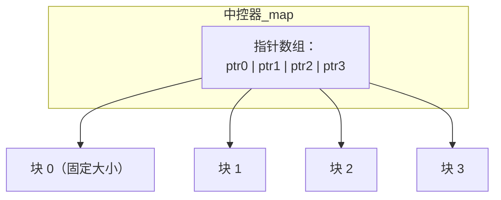

# 容器库

[OOP - Container](../../../zju/basic_courses/OOP/ch2.md){:target="_blank"}

1. 顺序容器：按照元素存入的相对位置来组织数据

    1. `std::vector`：动态数组。支持快速的随机访问，在尾部插入/删除速度快，但在中间或头部操作较慢
    2. `std::deque`：双端队列。支持快速的随机访问，且在头部和尾部插入/删除都很快
    3. `std::list`：双向链表。不支持随机访问，但在任意位置插入和删除速度都很快
    4. `std::forward_list` (C++11)：单向链表。比 `list` 更节省内存，只支持单向遍历
    5. `std::array` (C++11)：固定大小数组。大小在编译时确定，内存分配在栈上（如果作为局部变量），支持快速随机访问

2. 关联容器：元素按关键字（Key）自动排序（底层通常由红黑树实现），查找、插入和删除的平均时间复杂度为 $O(\log n)$

    1. `std::set`：集合。元素唯一且按升序自动排序
    2. `std::map`：映射/字典。存储键值对（Key-Value），键唯一且按键排序
    3. `std::multiset`：多重集合。允许存在重复元素的 `set`
    4. `std::multimap`：多重映射。允许存在多个相同键的键值对的 `map`

3. 无序关联容器：C++11 引入，底层通常通过哈希表（Hash Table）实现，元素没有特定顺序。查找、插入和删除的平均时间复杂度为 $O(1)$

    1. `std::unordered_set`：无序集合。键唯一，不排序
    2. `std::unordered_map`：无序映射。键值对，键唯一，不排序
    3. `std::unordered_multiset`：无序多重集合。允许重复元素的 `unordered_set`
    4. `std::unordered_multimap`：无序多重映射。允许重复键的 `unordered_map`

4. 容器适配器：不是真正的新容器，而是基于上述现有容器包装出来的接口，以提供特定的行为

    1. `std::stack`：栈。后进先出（LIFO），默认基于 `deque` 实现
    2. `std::queue`：队列。先进先出（FIFO），默认基于 `deque` 实现
    3. `std::priority_queue`：优先队列。元素出队的顺序由优先级决定（默认底层是大顶堆，基于 `vector` 实现）

!!! tip "迭代器的类型"

    C++ 的迭代器按能力从弱到强分为五类：

    ```mermaid
    graph LR
        A["输入迭代器"] --> B["前向迭代器"]
        B --> C["双向迭代器"]
        C --> D["随机访问迭代器"]
    ```

    | 迭代器类型 | 支持的操作 | 代表容器 |
    |---|---|---|
    | 输入迭代器 | `*it`、`++it` | 流迭代器 |
    | 前向迭代器 | 上述 + 可多次遍历 | `forward_list` |
    | 双向迭代器 | 上述 + `--it` | `list`、`set`、`map` |
    | **随机访问迭代器** | 上述 + `it+n`、`it[n]`、`it1<it2`、`it2-it1` | **`vector`、`deque`、`array`** |

    | 容器 | 迭代器类型 |
    |---|---|
    | `vector` / `deque` / `array` | 随机访问迭代器 |
    | `list` / `set` / `map` | 双向迭代器 |
    | `forward_list` / `unordered_set` / `unordered_map` | 前向迭代器 |

## 1 `std::vector`

`vector` 在内存中是一段连续的线性空间，和普通数组 `[]` 相同。在标准库的具体实现中，`vector` 内部通常由三个迭代器（本质是裸指针）来控制：

1. `_M_start`：指向已分配内存的起始位置
2. `_M_finish`：指向当前最后一个实际元素的下一个位置（对应 `size()`）
3. `_M_end_of_storage`：指向已分配内存的末尾（对应 `capacity()`）

!!! tip "`size()` 和 `capacity()` 的区别"

    - `size()`：容器中实际有多少个元素
    - `capacity()`：容器目前在不重新分配内存的情况下，最多能容纳多少个元素

当不断向 `vector` 添加元素，直到 `size() == capacity()` 时，再添加新元素就会触发扩容（Reallocation）。扩容并非在原内存后无缝拼接（因为原内存后面的物理空间可能已被其他程序占用），而是分为以下三步：

1. 开辟新空间：向操作系统申请一块更大的连续内存空间
2. 拷贝/移动原数据：将旧内存空间里的数据拷贝（或利用 `noexcept` 的移动构造函数移动）到新空间中
3. 释放旧空间：销毁旧内存的元素，并将旧内存交还给操作系统

!!! question "扩容因子为什么是 1.5 倍或 2 倍"

    采用按倍数扩容（成几何级数增长）而不是每次固定增加 n 个字节，是为了保证在尾部插入元素的均摊时间复杂度能够达到 $O(1)$。如果你每次只扩容增加 10 个容量，那每填满 10 个就要进行一次极度耗时的全量数据搬运，导致插入性能退化成 $O(N)$

!!! question "`reserve()` 和 `resize()` 的区别"

    - `reserve(n)`：只修改 capacity（容量）。它向系统申请足够容纳 n 个元素的内存，但不会构造任何新对象，size 保持不变。如果预先知道要存多少数据，强烈建议先 `reserve` 以避免多次引起性能骤降的扩容机制
    - `resize(n)`：修改 size（实际大小）。如果 n 大于当前的 size，不仅会扩容，还会调用元素的默认构造函数把新空间填满；如果 n 小于当前 size，则会销毁多余的元素

!!! question "`push_back()` 和 `emplace_back()` 的区别"

    - `push_back()`：接收一个已经存在的对象，或者接收一个临时对象。它需要先调用构造函数生成这个对象，然后再调用拷贝/移动构造函数将对象放进 vector 的内存中
    - `emplace_back()`：利用 C++11 的可变参数模板和完美转发，直接将构造对象所需的参数传递给 `vector` 底层，在分配好的内存空间上直接原地调用构造函数

!!! question "如何真正释放 `vector` 占用的内存"

    当你调用 `v.clear()` 时，它只会调用所有已有元素的析构函数，将 size 变为 0，但 capacity 保持不变，底层的物理内存并未还给操作系统

    C++11 及以后可使用 `v.shrink_to_fit()`，请求容器降低其容量以匹配其大小

使用 `vector` 迭代器遍历时，如果同时进行了插入或删除操作，很容易导致程序崩溃

1. 插入元素导致的失效：如果插入导致了扩容，整个容器的数据都被搬迁到了新的物理地址。此时所有指向原 `vector` 的迭代器、指针、引用将全部失效；如果插入没有导致扩容，那么插入点之后的所有迭代器会失效（因为后面的元素都被整体向后挪动了一个位置）
2. 删除元素导致的失效：删除一个元素后，被删元素及其之后的所有元素的位置都会前移。因此，指向被删元素及后续元素的迭代器都会失效

!!! question "vector 的迭代器是什么类型"

    `std::vector<T>::iterator` 是 **随机访问迭代器（Random Access Iterator）**。由于 vector 内存连续，它的迭代器在底层通常直接就是 **裸指针 `T*`**（如 GCC 的 libstdc++、MSVC 的实现）

    随机访问迭代器要求支持的能力，裸指针天生全都满足：

    ```cpp linenums="1"
    std::vector<int> v = {1, 2, 3, 4, 5};
    std::vector<int>::iterator it = v.begin();   // 本质等价于 int* 指向 v[0]

    *it;        // 解引用
    it[2];      // 下标访问，等价于 *(it + 2)
    it + 3;     // 前进 3 位（O(1)）
    it - 1;     // 后退 1 位
    it += 2;    // 原地前进
    it1 < it2;  // 比较两个迭代器
    it2 - it1;  // 得到两个迭代器的距离（元素个数）
    ```

    因为 vector 的元素在内存中 **连续排列**，指针加减一个整数就能直接定位到任意元素，所以用 `T*` 做迭代器是最自然、零开销的实现

## 2 `std::deque`

`std::deque`（Double-Ended Queue，双端队列）是一种 **分段连续** 的线性容器。它最大的特点是：**在头部和尾部插入/删除元素都很快**（$O(1)$），同时支持随机访问。它也是 `std::stack` 和 `std::queue` 的默认底层容器

`deque` 不是像 `vector` 那样一整块连续内存，而是由 **多个固定大小的缓冲区（块）** 拼接而成，这些块通过一个 **中控器（map）** 统一管理：



```text
中控器（指针数组）:  [*] [*] [*] [*] [*]
                     |   |   |   |   |
                     v   v   v   v   v
                   ┌───┬───┬───┬───┬───┐
                   │块0│块1│块2│块3│块4│   ← 每个块是固定大小的数组
                   └───┴───┴───┴───┴───┘
```

要点：

1. 每个 **块** 是一个固定大小的数组（如 512 字节，或可存 N 个元素）
2. **中控器** 是一个指针数组，每个指针指向一个块
3. 逻辑上连续（迭代器 `++` 能平滑跨块），**物理上分段**（块之间不连续）

`deque` 的迭代器比 `vector` 复杂得多——为了支持"跨块前进"，它需要同时记录四个位置信息：

```cpp linenums="1"
// deque 迭代器的简化结构
struct deque_iterator {
    T*   cur;    // 当前指向的元素
    T*   first;  // 当前块的起始位置
    T*   last;   // 当前块的末尾位置
    T**  node;   // 指向中控器中"当前块"的指针
};
```

当 `++it` 走到 `cur == last`（当前块末尾）时，迭代器通过 `node` 找到下一个块，跳到新块的 `first`。这就是 deque 支持随机访问却不需要整块连续内存的原理

!!! tip "扩容机制：只加块，不搬旧数据"

    这是 deque 相比 vector 的 **核心优势**。vector 扩容要"整块搬家"（申请更大内存 + 拷贝旧数据 + 释放旧内存），而 deque 扩容只需：
    
    1. 申请一个新的块
    2. 在中控器里登记新块的指针
    3. 如果中控器满了，再申请一个更大的中控器（只搬指针，不搬元素）
    
    ```text
    扩容前： [块0][块1][块2]
    扩容后： [块0][块1][块2][块3]  ← 旧元素完全不动，只加一个新块
    ```
    
    所以 deque 的 **扩容成本极低**，且旧元素的 **地址不会改变**

!!! question "为什么 stack 默认用 deque 而不是 vector"

    1. vector 扩容要整块搬运，单次延迟高（尖刺感强）
    2. vector 的 capacity 只增不减，高峰期过后仍霸占内存
    3. deque 扩容只加块，延迟低、内存平滑

!!! question "为什么 queue 默认用 deque 而不是 vector 或者 list"

    `vector` 没有 `pop_front()` 成员函数——它是 **动态数组**，头部删除需要把所有元素整体前移一位，复杂度 $O(N)$，与"队列出队要快"的需求完全冲突

    `list` 其实 **满足所有接口要求**：`push_back` 和 `pop_front` 都是 $O(1)$，理论上能做 queue 的底层。但 list 有劣势：

    1. **每个节点有额外开销**：双向链表每个节点要存 2 个指针（前驱 + 后继），内存占用大
    2. **频繁堆分配**：每次 `push` 都要 `new` 一个节点，每次 `pop` 都要 `delete` 一个节点，分配/释放开销高
    3. **缓存不友好**：节点分散在内存各处，遍历时频繁跳转

    | 需求 | vector | list | **deque** |
    |---|---|---|---|
    | 尾部插入 `push_back` | $O(1)$ 均摊 | $O(1)$ | **$O(1)$** |
    | 头部删除 `pop_front` | ✗ 无此方法 / $O(N)$ | $O(1)$ | **$O(1)$** |
    | 内存开销 | 无额外开销 | 每节点 2 指针 | 少量中控器开销 |
    | 堆分配次数 | 少（扩容才分配） | **每次 push 都分配** | 少（按块分配） |
    | 缓存友好 | 极好 | 差 | **较好（块内连续）** |

    deque 的优势：

    1. **`push_back` 和 `pop_front` 都是 $O(1)$**，完美匹配队列需求
    2. **按块分配**：一个块能存多个元素，不像 list 每插一个就 `new` 一次，分配次数大幅减少
    3. **分段连续**：块内元素连续，缓存局部性远好于 list
    4. **扩容不搬旧数据**：只加新块，延迟低、内存平滑

### 2.1 常用方法

```cpp linenums="1"
#include <deque>
#include <iostream>

int main() {
    std::deque<int> d;

    // 尾部操作（同 vector）
    d.push_back(1);
    d.pop_back();

    // 头部操作（deque 独有优势，vector 没有）
    d.push_front(0);     // 头部插入 O(1)
    d.pop_front();       // 头部删除 O(1)

    // 随机访问
    d[0];
    d.at(0);             // 越界抛异常
    d.front();           // 头元素
    d.back();            // 尾元素

    // 容量
    d.size();
    d.empty();
}
```

!!! tip "复杂度对比"

    | 操作 | `vector` | `deque` |
    |---|---|---|
    | 尾部插入/删除 | $O(1)$ 均摊 | $O(1)$ |
    | **头部插入/删除** | $O(N)$（要搬移所有元素） | **$O(1)$** |
    | 随机访问 | $O(1)$ | $O(1)$（但多一层中控器间接寻址） |
    | 中间插入/删除 | $O(N)$ | $O(N)$ |
    | 扩容代价 | 高（整块搬移） | 低（只加块） |
    | 内存连续性 | 完全连续 | 分段连续 |

!!! tip "deque vs vector 深度对比"

    | 维度 | `vector` | `deque` |
    |---|---|---|
    | 内存布局 | **一整块连续**内存 | **分段连续**（多个块） |
    | 缓存友好 | **极好**（顺序访问命中率高） | 略差（跨块时要跳转） |
    | 头部插入 | 慢 $O(N)$ | 快 $O(1)$ |
    | 扩容 | 搬移所有旧元素 | 只新增块，旧元素不动 |
    | 元素地址稳定性 | 扩容后全部失效 | 头尾插入时旧元素地址不变 |
    | 迭代器 | 裸指针即可 | 复杂结构（四指针） |
    | 适用场景 | 频繁尾部操作 + 顺序遍历 | 需要**头尾两端操作** |

!!! question "为什么 deque 头部插入的复杂度为 $O(1)$"

    deque 由多个固定大小的块组成。初始分配第一个块时，实现会把第一个元素放在块的中间，让块的前面和后面都留有空闲位置：

    ```cpp linenums="1"
    初始 push_back(1)：   [ _ _ 1 _ _ ]
                                ↑
                            元素放中间，前后都留空
    ```

    于是 push_front 就变成了"往前面那个空格子里写"：

    ```cpp linenums="1"
    push_front(0)：  [ _ 0 1 _ _ ]     ← 直接写在前面的空位，O(1)
    push_front(-1)： [ -1 0 1 _ _ ]    ← 继续向前写，O(1)
    ```

    每次只写一个元素、只移动 start 迭代器指针一步，已有元素原地不动

    当第一个块前面的空位用完后，push_front 也不会去搬移任何东西，而是：

    1. 申请一个新的块
    2. 把它挂到中控器的最前面
    3. 把新元素写到新块的末尾

    整个过程：旧元素一个都没动，只是中控器多登记了一个新块指针，start 迭代器跨到新块

!!! tip "迭代器失效规则"

- **头尾插入**：已有元素的迭代器 **不失效**（但 `end()` 可能失效）
- **中间插入**：所有迭代器失效（元素被搬移）
- **删除**：被删元素及之后的迭代器失效

这与 vector 不同——vector 一旦扩容，**所有** 迭代器都失效；而 deque 头尾插入不影响已有元素的位置

!!! question "什么时候用 deque"

    1. **需要头尾两端快速插入/删除**：如双端队列、滑动窗口（配合单调队列）
    2. **实现 stack / queue**：标准库默认底层容器
    3. **大量元素但不想搬移**：元素很大、拷贝代价高时，deque 扩容不搬旧数据
    4. **不需要缓存极致友好**：顺序遍历为主的场景 vector 更优

    ```cpp linenums="1"
    // 典型场景：双端 BFS、滑动窗口最值
    std::deque<int> window;   // 单调队列求滑动窗口最大值
    while (!window.empty() && window.back() < x) window.pop_back();
    window.push_back(x);
    ```

## 3 `std::list` 和 `std::forward_list`

`std::list` 是一个双向循环链表。它的元素在物理内存中是非连续分配的。每次插入一个新元素，都会调用分配器在堆上动态分配一个链表节点的内存。不支持随机访问

由于 `list` 的节点是独立分配的，它们在内存中的绝对地址永远不会变，因此，插入元素不会导致任何迭代器失效。删除元素只有指向被删除元素的那个迭代器会失效

由于 `list` 的迭代器只是双向迭代器，而不是随机访问迭代器，所以它不能使用 `<algorithm>` 库里的某些算法（比如 `std::sort`）。为此，`list` 在类内部自己实现了一套专属的高效算法成员函数（见下文）

---

`std::forward_list` 是单向链表，每个节点只有一个 `next` 指针，内存开销比 `list` 减半

它没有 `size()` 方法。因为要获取单链表长度必须遍历 `O(N)`，C++ 标准委员会为了防止程序员误以为它是常数时间而掉进性能陷阱，干脆不提供这个方法（可用 `std::distance` 计算）

它只能往前走，迭代器是前向迭代器 (Forward Iterator)，不支持 `--it`

!!! question "vector 和 list 的区别"

    | 维度 | `vector` | `list` |
    |---|---|---|
    | 底层结构 | 动态数组（连续） | 双向链表（分散） |
    | 随机访问 | $O(1)$ | ✗ 不支持 |
    | 尾部插入 | $O(1)$ 均摊 | $O(1)$ |
    | 中间插入 | $O(N)$ | $O(1)$（需先定位） |
    | 缓存友好 | 好 | 差 |
    | 迭代器失效 | 扩容全失效、中间操作后半失效 | 仅被删元素失效 |
    | 迭代器类型 | 随机访问迭代器 | 双向迭代器 |
    | 排序 | `std::sort` | `list::sort`（成员） |
    | 额外内存 | 无 | 每节点 2 个指针 |

### 3.1 `std::list` 常用方法

增删改查：

| 方法 | 作用 | 复杂度 |
|---|---|---|
| `push_back(x)` / `emplace_back(args...)` | 尾部插入 | $O(1)$ |
| `push_front(x)` / `emplace_front(args...)` | 头部插入 | $O(1)$ |
| `pop_back()` / `pop_front()` | 尾部/头部删除 | $O(1)$ |
| `insert(pos, x)` | 在迭代器 pos 前插入 | $O(1)$ |
| `emplace(pos, args...)` | 在 pos 前原地构造 | $O(1)$ |
| `erase(pos)` | 删除 pos 指向的元素 | $O(1)$ |
| `clear()` | 清空所有元素 | $O(N)$ |
| `remove(x)` | 删除所有等于 x 的元素 | $O(N)$ |
| `remove_if(pred)` | 删除所有满足条件的元素 | $O(N)$ |

```cpp linenums="1"
#include <list>
#include <iostream>

std::list<int> l = {1, 2, 3, 4, 5};

l.push_back(6);       // 尾插：1 2 3 4 5 6
l.push_front(0);      // 头插：0 1 2 3 4 5 6
l.pop_back();         // 尾删：0 1 2 3 4 5
l.pop_front();        // 头删：1 2 3 4 5

auto it = l.begin();
++it;                 // 指向 2
l.insert(it, 100);    // 在 2 前插入：1 100 2 3 4 5
l.erase(it);          // 删除 2：1 100 3 4 5

l.remove(100);        // 删除所有 100：1 3 4 5
l.remove_if([](int x) { return x % 2 == 0; });  // 删除偶数：1 3 5
```

访问与容量：

| 方法 | 作用 |
|---|---|
| `front()` / `back()` | 首 / 尾元素引用 |
| `size()` / `empty()` | 元素个数 / 是否为空 |
| `begin()` / `end()` | 首 / 尾后迭代器 |
| `rbegin()` / `rend()` | 反向迭代器 |

!!! warning "`list` 没有 `[]` 和 `at()`"

    链表不支持随机访问，不能用下标访问元素。要访问第 n 个元素，只能遍历或用 `std::advance`：
    
    ```cpp linenums="1"
    auto it = l.begin();
    std::advance(it, 2);   // 前进 2 步，O(n)
    ```

专属算法成员函数：

`list` 的迭代器是 **双向迭代器**，不能直接用 `<algorithm>` 的 `std::sort`，所以它内置了一套专属算法：

| 方法 | 作用 | 复杂度 |
|---|---|---|
| `sort()` | 链表归并排序 | $O(N\log N)$ |
| `splice(pos, other)` | 把 other 整个拼接到 pos 前 | $O(1)$ |
| `splice(pos, other, it)` | 把 other 的单个元素 it 移动到 pos 前 | $O(1)$ |
| `splice(pos, other, first, last)` | 把 other 的一段移动到 pos 前 | $O(1)$ |
| `merge(other)` | 合并两个已排序链表，other 被清空 | $O(N)$ |
| `unique()` | 移除连续重复元素（先去重再 sort） | $O(N)$ |
| `reverse()` | 反转链表 | $O(N)$ |

```cpp linenums="1"
std::list<int> a = {5, 2, 4, 1, 3};
a.sort();                    // 排序：1 2 3 4 5

std::list<int> b = {1, 2, 2, 3, 3, 3};
b.unique();                  // 移除连续重复：1 2 3

std::list<int> c = {1, 3, 5};
std::list<int> d = {2, 4, 6};
c.merge(d);                  // 合并两个有序链表：1 2 3 4 5 6
// d 现在为空

// splice：O(1) 剪切，不拷贝元素
std::list<int> e = {1, 2, 3};
std::list<int> f = {10, 20, 30};
auto it = e.begin();         // 指向 1
e.splice(it, f);             // 把 f 整个剪切到 1 前面
// e：10 20 30 1 2 3，f：空
```

### 3.2 `std::forward_list` 常用方法

`forward_list` 是单向链表，**只能向前遍历**。它没有 `size()`、`back()`、`push_back()`、`pop_back()`，且插入/删除发生在"指定元素 **之后**"，所以多了一个特殊的 `before_begin()`

增删改查：

| 方法 | 作用 | 复杂度 |
|---|---|---|
| `push_front(x)` / `emplace_front(args...)` | 头部插入 | $O(1)$ |
| `pop_front()` | 头部删除 | $O(1)$ |
| `insert_after(pos, x)` | 在 pos **之后** 插入 x | $O(1)$ |
| `emplace_after(pos, args...)` | 在 pos 之后原地构造 | $O(1)$ |
| `erase_after(pos)` | 删除 pos **之后** 的元素 | $O(1)$ |
| `clear()` | 清空 | $O(N)$ |
| `remove(x)` / `remove_if(pred)` | 删除等于 x / 满足条件的元素 | $O(N)$ |

```cpp linenums="1"
#include <forward_list>

std::forward_list<int> fl = {1, 2, 3};

fl.push_front(0);          // 头插：0 1 2 3
fl.pop_front();            // 头删：1 2 3

auto it = fl.begin();      // 指向 1
fl.insert_after(it, 100);  // 在 1 之后插入：1 100 2 3
fl.erase_after(it);        // 删除 1 之后的 100：1 2 3
```

访问与容量：

| 方法 | 作用 |
|---|---|
| `front()` | 首元素引用（**没有 back()**） |
| `empty()` | 是否为空（**没有 size()**） |
| `before_begin()` | 首元素 **之前** 的迭代器（用于在头部插入） |
| `begin()` / `end()` | 首 / 尾后迭代器 |

```cpp linenums="1"
std::forward_list<int> fl = {1, 2, 3};

// 想在"第一个元素之前"插入，要用 before_begin()
fl.insert_after(fl.before_begin(), 0);   // 头部插入 0：0 1 2 3

// 求长度：没有 size()，只能用 distance
auto n = std::distance(fl.begin(), fl.end());   // O(N)
```

专属算法成员函数：

与 `list` 类似，但拼接操作用 `splice_after`：

| 方法 | 作用 |
|---|---|
| `sort()` | 归并排序 |
| `splice_after(pos, other)` | 把 other 剪切到 pos 之后 |
| `merge(other)` | 合并两个有序链表 |
| `unique()` | 移除连续重复元素 |
| `reverse()` | 反转链表 |

## 4 `std::set` 和 `std::unordered_set`

`std::set` 的底层实现通常是红黑树。元素在插入时会自动根据键值（默认使用 `std::less<T>`，即 `<` 运算符）进行排序。遍历 `set` 时，输出的数据天然是升序的

不能通过迭代器直接修改 `set` 中的元素值。因为一旦修改，就会破坏红黑树的有序结构

由于底层是红黑树，`std::set` 的增、删、查操作的时间复杂度严格保证为 $O(\log N)$

!!! tip "二分查找"

    - `s.lower_bound(key)`：返回指向首个大于等于 key 元素的迭代器
    - `s.upper_bound(key)`：返回指向首个大于 key 元素的迭代器

!!! question "`insert()` 的返回值是什么"

    当你调用 `s.insert(val)` 时，它的返回值不是 `void`，也不是简单的 `bool`，而是 `std::pair<iterator, bool>`
    
    1. `pair` 的 `first`（迭代器）：指向刚刚插入的元素（或原来就已经存在的那个元素）
    2. `pair` 的 `second`（布尔值）：表示是否插入成功。如果元素已存在，返回 `false`；如果原本没有且成功插入，返回 `true`

---

`std::unordered_set` 的底层实现通常是哈希表。元素无序，与插入顺序也无关

!!! tip "自定义类型"

    set 需要比较器，unordered_set 需要哈希函数 + 相等判断：

    ```cpp linenums="1"
    struct Student {
        std::string name;
        int age;
    
        // set 需要：重载 <
        bool operator<(const Student& o) const { return age < o.age; }
    
        // unordered_set 需要：重载 ==
        bool operator==(const Student& o) const {
            return name == o.name && age == o.age;
        }
    };

    // set 也可以提供自定义的仿函数
    struct Cmp {
        bool operator()(const int& a, const int& b) const {
            return a > b; // 改为降序排列
        }
    };
    
    // unordered_set 还需要自定义哈希函数
    struct StudentHash {
        size_t operator()(const Student& s) const {
            return std::hash<std::string>{}(s.name) ^ (std::hash<int>{}(s.age) << 1);
        }
    };
    
    std::set<Student> s;  // 用 operator<
    std::set<int, Cmp> s; // 在模板参数中指定
    std::unordered_set<Student, StudentHash> us;  // 用自定义哈希
    ```

### 4.1 `std::set` 常用方法

插入：

| 方法 | 作用 | 返回值 |
|---|---|---|
| `insert(x)` | 插入元素 x | `pair<iterator, bool>`（重复则失败） |
| `emplace(args...)` | 原地构造并插入 | 同上，省一次拷贝 |
| `insert(first, last)` | 插入一段范围 | `void` |
| `insert(pos, x)` | 在 pos 提示位置插入 | `iterator` |

```cpp linenums="1"
#include <set>

std::set<int> s;

auto [it, ok] = s.insert(10);   // 成功：ok=true，it 指向 10
auto [it2, ok2] = s.insert(10); // 重复：ok2=false，it2 指向已有的 10

s.emplace(20);                  // 原地构造插入
s.insert({1, 2, 3});            // 用初始化列表插入多个
```

查找：

| 方法 | 作用 | 说明 |
|---|---|---|
| `find(x)` | 查找元素 x | 返回迭代器，找不到返回 `end()` |
| `count(x)` | 统计 x 出现次数 | set 中只会是 0 或 1 |
| `contains(x)` | 是否存在 x | C++20，返回 `bool` |
| `lower_bound(x)` | 第一个 ≥ x 的元素 | 找不到返回 `end()` |
| `upper_bound(x)` | 第一个 > x 的元素 | 找不到返回 `end()` |
| `equal_range(x)` | 返回 `[lower_bound, upper_bound)` 区间 | 一对迭代器 |

```cpp linenums="1"
std::set<int> s = {1, 3, 5, 7, 9};

if (s.find(5) != s.end()) { /* 存在 5 */ }
if (s.count(5))           { /* 存在 5 */ }
if (s.contains(5))        { /* C++20 写法 */ }

auto it = s.lower_bound(6);   // 指向 7（第一个 ≥ 6）
auto it2 = s.upper_bound(5);  // 指向 7（第一个 > 5）

// 范围查询：找出 [4, 8] 之间的所有元素
for (auto it = s.lower_bound(4); it != s.upper_bound(8); ++it)
    std::cout << *it << ' ';   // 5 7
```

删除：

| 方法 | 作用 |
|---|---|
| `erase(pos)` | 删除迭代器指向的元素 |
| `erase(x)` | 删除值等于 x 的元素，返回删除个数（0 或 1） |
| `erase(first, last)` | 删除一段范围 |
| `clear()` | 清空 |

```cpp linenums="1"
std::set<int> s = {1, 2, 3, 4, 5};

s.erase(3);                       // 删除 3 → {1,2,4,5}
size_t n = s.erase(100);          // 100 不存在，n=0

auto it = s.find(2);
if (it != s.end()) s.erase(it);   // 删除迭代器指向的 2

s.erase(s.lower_bound(4), s.end()); // 删除 ≥4 的所有元素 → {1}
```

容量与遍历：

| 方法 | 作用 |
|---|---|
| `size()` / `empty()` | 元素个数 / 是否为空 |
| `begin()` / `end()` | 正向迭代器（升序遍历） |
| `rbegin()` / `rend()` | 反向迭代器（降序遍历） |

```cpp linenums="1"
std::set<int> s = {3, 1, 2};
for (int x : s) std::cout << x << ' ';   // 1 2 3（自动升序）
for (auto it = s.rbegin(); it != s.rend(); ++it)
    std::cout << *it << ' ';             // 3 2 1（降序）
```

### 4.2 `std::unordered_set` 常用方法

`unordered_set` 底层是哈希表，**元素无序**。它 **没有** `lower_bound`、`upper_bound`、`equal_range`、`rbegin/rend` 这些依赖顺序的方法

插入：

| 方法 | 作用 | 返回值 |
|---|---|---|
| `insert(x)` | 插入元素 x | `pair<iterator, bool>` |
| `emplace(args...)` | 原地构造并插入 | 同上 |
| `insert(first, last)` | 插入一段范围 | `void` |

```cpp linenums="1"
#include <unordered_set>

std::unordered_set<int> us;
us.insert(10);
us.emplace(20);
us.insert({1, 2, 3});
```

查找：

| 方法 | 作用 |
|---|---|
| `find(x)` | 返回迭代器，找不到返回 `end()` |
| `count(x)` | 0 或 1 |
| `contains(x)` | C++20，返回 `bool` |

```cpp linenums="1"
std::unordered_set<int> us = {1, 2, 3};

if (us.find(2) != us.end()) { /* 存在 */ }
if (us.count(2))            { /* 存在 */ }
if (us.contains(2))         { /* C++20 */ }
```

删除：

| 方法 | 作用 |
|---|---|
| `erase(pos)` | 删除迭代器指向的元素 |
| `erase(x)` | 删除值等于 x 的元素，返回删除个数 |
| `erase(first, last)` | 删除一段范围 |
| `clear()` | 清空 |

```cpp linenums="1"
us.erase(2);                        // 删除 2
auto it = us.find(3);
if (it != us.end()) us.erase(it);   // 删除迭代器指向的元素
```

容量与哈希相关：

| 方法 | 作用 |
|---|---|
| `size()` / `empty()` | 元素个数 / 是否为空 |
| `bucket_count()` | 当前桶的数量 |
| `bucket_size(n)` | 第 n 个桶中的元素个数 |
| `load_factor()` | 装载因子（size / bucket_count） |
| `max_load_factor(f)` | 设置最大装载因子（默认 1.0） |
| `rehash(n)` | 设置桶数量为至少 n |
| `reserve(n)` | 预留容量，使能容纳 n 个元素而不 rehash |

```cpp linenums="1"
std::unordered_set<int> us;
us.reserve(1000);             // 预分配，避免频繁 rehash（类似 vector 的 reserve）
us.max_load_factor(0.75);     // 降低装载因子，减少冲突但更占内存

std::cout << us.bucket_count() << '\n';  // 桶数量
std::cout << us.load_factor() << '\n';   // 当前装载因子
```

!!! tip "`reserve` 的重要性"

    和 `vector::reserve` 类似，如果预先知道要插入大量元素，先 `reserve` 能避免哈希表反复 rehash（重新分配桶 + 重新散列所有元素），大幅提升性能

## 5 `std::map` 和 `std::unordered_map`

`std::map` 底层通常是红黑树。存储的是 `std::pair<const Key, Value>`，由于红黑树是根据 Key 来建立和维护平衡的，所以 Key 是不允许被修改的，否则会破坏树的结构。Key 唯一，且按 Key 的从小到大自动排序（默认使用 `std::less<Key>`）

增、删、查操作的时间复杂度严格保证为 $O(\log N)$

`map[key]`：

1. 访问存在的 Key：返回对应 Value 的引用，可以修改它
2. 访问不存在的 Key：由于 `[]` 返回的是引用，如果发现 Key 不存在，map 会立刻帮你插入一个拥有该 Key，且 Value 为默认构造值的新节点，然后再返回这个新 Value 的引用

!!! question "为什么在 `const` 成员函数中，不能使用 `map[key]` 来查找元素"

    因为 `[]` 运算符有可能修改 map 本身（即插入新节点），所以标准库干脆没有给它提供 `const` 版本的重载。在只读场景下，必须使用 `find()` 或 `at()`

---

`std::unordered_map` 的底层实现通常是哈希表。元素无序

!!! tip "自定义键类型"

    `map` 需要比较器，`unordered_map` 需要哈希函数 + 相等判断：

    ```cpp linenums="1"
    struct Point {
        int x, y;
    
        // map 需要：重载 <
        bool operator<(const Point& o) const {
            return x < o.x || (x == o.x && y < o.y);
        }
    
        // unordered_map 需要：重载 ==
        bool operator==(const Point& o) const {
            return x == o.x && y == o.y;
        }
    };
    
    // unordered_map 还需要哈希函数
    struct PointHash {
        size_t operator()(const Point& p) const {
            return std::hash<int>{}(p.x) ^ (std::hash<int>{}(p.y) << 1);
        }
    };
    
    std::map<Point, int> m;                           // 用 operator<
    std::unordered_map<Point, int, PointHash> um;     // 用自定义哈希
    ```

### 5.1 `std::map` 常用方法

插入：

| 方法 | 作用 | 行为 |
|---|---|---|
| `m[key] = value` | 下标访问 | 键不存在则 **先插入默认值** 再赋值 |
| `insert({key, value})` | 插入键值对 | 键已存在则 **失败**，返回 `pair<iterator, bool>` |
| `emplace(key, value)` | 原地构造插入 | 同上，省拷贝 |
| `try_emplace(key, args...)` | 仅当键不存在才构造 | C++17，比 `emplace` 更高效 |
| `insert_or_assign(key, value)` | 插入或覆盖 | C++17，键存在则 **覆盖** 旧值 |

```cpp linenums="1"
#include <map>
#include <string>

std::map<std::string, int> m;

// ① operator[]：不存在会插入默认值 0，再赋值为 10
m["apple"] = 10;

// ② insert：不覆盖已存在的键
auto [it, ok] = m.insert({"banana", 20});   // 插入成功 ok=true
auto [it2, ok2] = m.insert({"apple", 99});  // 失败 ok2=false，apple 仍是 10

// ③ try_emplace：键存在则完全不构造 value
m.try_emplace("cherry", 30);   // 插入
m.try_emplace("apple", 999);   // 已存在，什么都不做

// ④ insert_or_assign：键存在则覆盖
m.insert_or_assign("apple", 100);   // apple 现在是 100
```

!!! tip "四种插入方式的对比"

    | 方法 | 键已存在时 | 适用场景 |
    |---|---|---|
    | `m[key] = v` | 覆盖 | 简单赋值，不在乎是否插入 |
    | `insert` | **不覆盖** | 只插入，不覆盖已有值 |
    | `try_emplace` | 不覆盖，且不构造 value | value 构造代价高时（C++17） |
    | `insert_or_assign` | **覆盖** | 需要"存在则更新"（C++17） |

查找与访问：

| 方法 | 作用 | 说明 |
|---|---|---|
| `m[key]` | 下标访问 | 键不存在则插入默认值（**const map 不可用**） |
| `m.at(key)` | 安全访问 | 键不存在抛 `std::out_of_range` |
| `find(key)` | 查找 | 返回迭代器，找不到返回 `end()` |
| `count(key)` | 统计 | map 中只会是 0 或 1 |
| `contains(key)` | 是否存在 | C++20，返回 `bool` |
| `lower_bound(key)` | 第一个键 ≥ key | 范围查询用 |
| `upper_bound(key)` | 第一个键 > key | 范围查询用 |
| `equal_range(key)` | `[lower_bound, upper_bound)` | 一对迭代器 |

```cpp linenums="1"
std::map<int, std::string> m = {{1, "one"}, {2, "two"}, {3, "three"}};

m[2];                    // "two"
m.at(2);                 // "two"
// m.at(100);            // ✗ 抛 std::out_of_range

if (m.find(2) != m.end()) { /* 存在键 2 */ }
if (m.count(2))           { /* 存在键 2 */ }
if (m.contains(2))        { /* C++20 */ }

auto it = m.lower_bound(2);   // 指向 {2, "two"}
auto it2 = m.upper_bound(2);  // 指向 {3, "three"}

// 范围查询：键在 [2, 5] 之间的所有元素
for (auto it = m.lower_bound(2); it != m.upper_bound(5); ++it)
    std::cout << it->first << ' ' << it->second << '\n';
```

删除：

| 方法 | 作用 |
|---|---|
| `erase(pos)` | 删除迭代器指向的元素 |
| `erase(key)` | 删除键为 key 的元素，返回删除个数（0 或 1） |
| `erase(first, last)` | 删除一段范围 |
| `clear()` | 清空 |

```cpp linenums="1"
std::map<int, std::string> m = {{1, "a"}, {2, "b"}, {3, "c"}};

m.erase(2);                        // 删除键 2 → {1, 3}

auto it = m.find(1);
if (it != m.end()) m.erase(it);    // 删除迭代器指向的元素

m.erase(m.lower_bound(2), m.end()); // 删除键 ≥2 的所有元素 → {1}
```

容量与遍历：

| 方法 | 作用 |
|---|---|
| `size()` / `empty()` | 元素个数 / 是否为空 |
| `begin()` / `end()` | 正向迭代器（按键升序） |
| `rbegin()` / `rend()` | 反向迭代器（按键降序） |

```cpp linenums="1"
std::map<std::string, int> m = {{"pear", 3}, {"apple", 1}, {"banana", 2}};

// map 的元素是 pair<const Key, Value>
for (const auto& [key, value] : m)   // 结构化绑定（C++17）
    std::cout << key << "=" << value << ' ';
// apple=1 banana=2 pear=3（按键自动升序）

for (auto it = m.rbegin(); it != m.rend(); ++it)
    std::cout << it->first << ' ';   // pear banana apple（降序）
```

!!! warning "遍历时不能修改 Key"

    `map` 的元素类型是 `std::pair<const Key, Value>`，`first` 是 `const` 的。直接修改 Key 会破坏红黑树结构，编译器会报错。只能修改 `it->second`（Value）

### 5.2 `std::unordered_map` 常用方法

`unordered_map` 底层是哈希表，**键无序**。它 **没有** `lower_bound`、`upper_bound`、`equal_range`、`rbegin/rend` 这些依赖顺序的方法

插入：

与 `map` 类似，也有 `operator[]`、`insert`、`emplace`、`try_emplace`、`insert_or_assign`：

```cpp linenums="1"
#include <unordered_map>

std::unordered_map<std::string, int> um;

um["apple"] = 10;                            // 下标赋值
um.insert({"banana", 20});                   // 插入
um.try_emplace("cherry", 30);                // C++17
um.insert_or_assign("apple", 100);           // C++17，覆盖
```

查找与访问：

| 方法 | 作用 |
|---|---|
| `um[key]` | 下标访问，键不存在则插入默认值 |
| `um.at(key)` | 安全访问，键不存在抛异常 |
| `find(key)` | 返回迭代器，找不到返回 `end()` |
| `count(key)` | 0 或 1 |
| `contains(key)` | C++20，返回 `bool` |

```cpp linenums="1"
std::unordered_map<int, std::string> um = {{1, "one"}, {2, "two"}};

um[1];                  // "one"
um.at(1);               // "one"
// um.at(100);          // ✗ 抛 std::out_of_range

if (um.find(1) != um.end()) { /* 存在 */ }
if (um.count(1))            { /* 存在 */ }
if (um.contains(1))         { /* C++20 */ }
```

删除：

与 `map` 完全一致：`erase(pos)`、`erase(key)`、`erase(first, last)`、`clear()`。

```cpp linenums="1"
um.erase(1);                         // 删除键 1
auto it = um.find(2);
if (it != um.end()) um.erase(it);    // 删除迭代器指向的元素
```

容量与哈希相关：

| 方法 | 作用 |
|---|---|
| `size()` / `empty()` | 元素个数 / 是否为空 |
| `bucket_count()` | 当前桶的数量 |
| `load_factor()` | 装载因子（size / bucket_count） |
| `max_load_factor(f)` | 设置最大装载因子（默认 1.0） |
| `rehash(n)` | 设置桶数量为至少 n |
| `reserve(n)` | 预留容量，能容纳 n 个元素而不 rehash |

```cpp linenums="1"
std::unordered_map<std::string, int> um;
um.reserve(10000);            // 预分配，避免频繁 rehash
um.max_load_factor(0.75);     // 降低装载因子

std::cout << um.bucket_count() << '\n';  // 桶数量
std::cout << um.load_factor() << '\n';   // 当前装载因子
```

!!! tip "`reserve` 的重要性"

    预先知道要插入大量键值对时，先 `reserve` 避免哈希表反复 rehash（重新散列所有元素），能显著提升性能

## 6 `std::stack`

`std::stack` 不是“原生”容器：它没有自己独立的数据结构，而是在现有容器（默认是 `std::deque`）之上套了一层壳（Wrapper），强行限制外部只能以后进先出（LIFO, Last In First Out）的方式来操作元素

```cpp linenums="1"
// Container：底层真正干活的那个容器，默认是 std::deque
// 也可以显式指定为 std::vector<T> 或 std::list<T>
// 只要该容器提供了 stack 要求的三个核心函数：
// push_back()、pop_back()、back()
template <class T, class Container = std::deque<T>>
class stack;

std::stack<int> s1;                       // 默认：deque 实现
std::stack<int, std::vector<int>> s2;     // 换成 vector 实现
std::stack<int, std::list<int>> s3;       // 换成 list 实现
```

栈区别于 vector/deque 的地方：没有迭代器，没有 `[]`，不能遍历，不能随机访问。只有：`push()`, `pop()`, `top()`, `empty()`, `size()`

!!! question "pop() 为什么不返回被弹出的元素？"

    1. 异常安全性：想象一下，如果 `pop()` 要返回栈顶元素，它内部必须做两件事：先把栈顶元素拷贝一份给调用方，然后再从底层容器中真正删除这个元素。如果这个拷贝构造过程跑了一半抛出了异常，但是底层的元素已经被删掉了，那么这个元素就永久丢失了！C++ 标准委员会的设计原则是：绝不以牺牲数据安全为代价来换取接口便利性。因此，他们强制要求你先用 `top()` 安全地获取引用（拷贝由调用方在自己的安全范围内完成），然后再调用 `pop()`
    2. 性能考量：如果调用方并不关心被弹出的元素内容，强制返回会白白造成一次拷贝构造的浪费。把 `top()` 和 `pop()` 拆开，程序员可以灵活选择是否拷贝

!!! question "stack 为什么默认用 deque 而不是 vector？"

    1. vector 的短板：vector 在 push_back 满了之后需要整块扩容搬家（拷贝旧数据到新内存），虽然均摊是 O(1)，但单次扩容的延迟极高（尖刺感很强）。另外，vector 从来不释放多余的内存（capacity 只增不减），如果栈经历过一次高峰期（元素极多）后又长期处于低位，vector 依然霸占着巨量内存不肯归还
    2. deque 的优势：deque（双端队列）底层是分段连续的（由多个固定大小的块通过中控器映射组成）。它扩容时，只需要申请一个新的块然后修改中控指针，不需要搬运旧元素的内存，扩容导致的单次延迟极低，内存的使用也更加平滑和节约

## 7 `std::priority_queue`

它提供 **常数时间获取最大（或最小）元素** 的能力，插入和删除的代价是 $O(\log N)$

```cpp linenums="1" title="priority_queue 的模板声明"
template <
    class T,                           // 元素类型
    class Container = std::vector<T>,  // 底层容器，默认 vector
    class Compare   = std::less<T>     // 比较器，默认 less（大顶堆）
>
class priority_queue;
```

优先队列底层是一个 **二叉堆**（通常是完全二叉树，用数组存储）。默认 `std::less<T>` 形成的是 **大顶堆**

它只提供了 5 个核心接口，没有迭代器，不能遍历：

| 成员函数 | 作用 | 复杂度 |
|---|---|---|
| `push(x)` | 插入元素，然后调整堆 | $O(\log N)$ |
| `pop()` | 移除堆顶元素，然后调整堆 | $O(\log N)$ |
| `top()` | 返回堆顶元素的 **常量引用** | $O(1)$ |
| `empty()` | 判断是否为空 | $O(1)$ |
| `size()` | 返回元素个数 | $O(1)$ |

```cpp linenums="1"
#include <queue>
#include <iostream>

std::priority_queue<int> pq;    // 默认大顶堆
pq.push(3);
pq.push(5);
pq.push(1);

std::cout << pq.top();   // 输出 5
pq.pop();
std::cout << pq.top();   // 输出 3
```

想得到"最小元素在堆顶"，只需把比较器换成 `std::greater<T>`：

```cpp linenums="1"
std::priority_queue<int, std::vector<int>, std::greater<int>> min_pq;
min_pq.push(3);
min_pq.push(5);
min_pq.push(1);
std::cout << min_pq.top();   // 输出 1
```

### 7.1 自定义类型的比较

如果元素是自定义结构体，和 `set` 类似，有两种方式告诉它如何比较：

**方式一：重载 `<` 运算符**

```cpp linenums="1"
struct Student {
    string name;
    int score;
    // priority_queue 默认用 less，即调用 operator<
    bool operator<(const Student& other) const {
        return score < other.score;   // 分数高者优先（大顶堆）
    }
};
std::priority_queue<Student> pq;
```

**方式二：自定义仿函数（更灵活，推荐）**

```cpp linenums="1"
struct Cmp {
    bool operator()(const Student& a, const Student& b) const {
        return a.score > b.score;   // 分数低者优先（小顶堆）
    }
};
std::priority_queue<Student, std::vector<Student>, Cmp> pq;
```

### 7.2 底层堆操作原理

`priority_queue` 内部实际上调用了 `<algorithm>` 中的堆算法，它和这些算法等价：

| priority_queue 操作 | 内部等价的算法 |
|---|---|
| 用一组数据构造 | `std::make_heap` |
| `push(x)` | `container.push_back(x)` + `std::push_heap` |
| `pop()` | `std::pop_heap` + `container.pop_back()` |

`push_heap` 采用 **上滤（sift up）**：新元素放到数组末尾，然后不断与父节点比较并交换，直到满足堆性质。
`pop_heap` 采用 **下滤（sift down）**：堆顶与末尾元素交换，移除末尾，然后堆顶元素不断与较大的子节点交换下沉。

!!! question "为什么底层容器用 `vector`"

    二叉堆要求元素在内存中 **连续存储**（这样父节点索引 `i` 与子节点 `2i+1`、`2i+2` 的映射才高效），而 `vector` 正是连续内存 + 尾部插入快的最佳选择。`deque` 虽也支持随机访问，但分段连续、索引映射效率略低；`list` 则完全不支持随机访问，无法实现堆。所以标准库把 `vector` 定为默认底层容器
