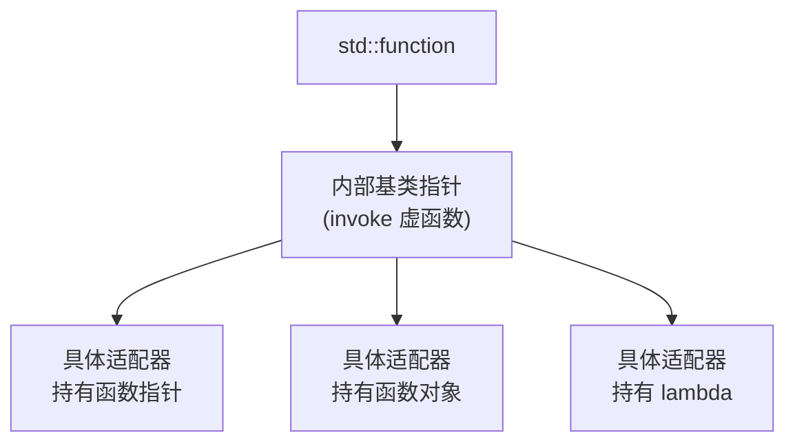

# 函数对象库

## 1 `std::function`

`std::function`（定义于 `<functional>`）是 C++11 引入的 **通用可调用对象包装器**。它能统一存储和调用各种"可调用物"：普通函数、函数对象（仿函数）、lambda 表达式、成员函数指针等，是 C++ 中 **运行期多态** 的典型实现

C++ 里有好几种"可调用对象"，类型各不相同：

```cpp linenums="1"
int add(int a, int b) { return a + b; }          // ① 普通函数

struct Multiplier {
    int operator()(int a, int b) const { return a * b; }  // ② 函数对象
};

auto lambda = [](int a, int b) { return a - b; };  // ③ lambda
```

如果想让一个容器同时存这三者，或让一个函数接受任意一种，它们的类型互不兼容。`std::function` 提供一个 **统一类型** 把它们都装起来：

```cpp linenums="1"
#include <functional>

std::function<int(int, int)> f;

f = add;              // 存函数
f = Multiplier();     // 存函数对象
f = lambda;           // 存 lambda

std::cout << f(3, 4); // 调用当前存储的可调用对象
```

### 1.1 基本用法

`std::function` 的模板参数是 **函数签名**：`std::function<返回类型(参数类型...)>`

```cpp linenums="1"
std::function<void()>            f0;   // 无参无返回值
std::function<int(int)>          f1;   // 一参返回 int
std::function<int(int, int)>     f2;   // 两参返回 int
std::function<double(const std::string&)> f3;  // 参数带 const 引用
```

#### 1.1.1 存储各种可调用对象

```cpp linenums="1"
#include <functional>
#include <iostream>

int add(int a, int b) { return a + b; }

struct Functor {
    int n = 100;
    int operator()(int x) const { return x + n; }
};

int main() {
    // ① 普通函数
    std::function<int(int, int)> f = add;
    std::cout << f(1, 2) << '\n';   // 3

    // ② 函数对象（仿函数）
    std::function<int(int)> g = Functor{};
    std::cout << g(5) << '\n';      // 105

    // ③ lambda（无捕获和有捕获都可以）
    std::function<int(int, int)> h = [](int a, int b) { return a * b; };
    std::cout << h(3, 4) << '\n';   // 12

    int offset = 10;
    std::function<int(int)> k = [offset](int x) { return x + offset; };
    std::cout << k(5) << '\n';      // 15
}
```

#### 1.1.2 存储成员函数

成员函数需要一个对象才能调用，有两种包装方式：

```cpp linenums="1"
struct Calculator {
    int base;
    int add(int x) { return base + x; }
};

// 方式 1：把对象作为第一个参数（显式传递）
Calculator c{10};
std::function<int(Calculator&, int)> f = &Calculator::add;
std::cout << f(c, 5) << '\n';       // 15

// 方式 2：用 std::bind 绑定对象
using namespace std::placeholders;
std::function<int(int)> g = std::bind(&Calculator::add, &c, _1);
std::cout << g(5) << '\n';          // 15

// 方式 3：用 lambda 捕获对象（最直观，推荐）
std::function<int(int)> h = [&c](int x) { return c.add(x); };
std::cout << h(5) << '\n';          // 15
```

### 1.2 空检查与异常

未赋值的 `std::function` 是 **空的**，调用它会抛 `std::bad_function_call`：

```cpp linenums="1"
std::function<int(int)> f;   // 空

// 用 operator bool 检查是否为空
if (f) {
    f(10);
} else {
    std::cout << "f 为空\n";
}

// 直接调用空 function 会抛异常
try {
    f(10);
} catch (const std::bad_function_call& e) {
    std::cout << "异常：" << e.what() << '\n';
}
```

### 1.3 底层原理：类型擦除（Type Erasure）

`std::function` 能统一各种类型，靠的是 **类型擦除**：它不关心具体存的是什么，只要求"能被调用"



实现要点（简化模型）：

1. 定义内部抽象基类，含纯虚的 `invoke` 方法
2. 对每种可调用对象生成一个模板适配器子类，重写 `invoke`
3. `std::function` 持有基类指针，调用时走虚函数间接调用
4. **小对象优化（SBO）**：小对象直接存进内部缓冲区，避免堆分配；大对象才在堆上分配

```cpp linenums="1"
// 类型擦除的简化示意
class function_base {
    struct callable_base { virtual int invoke(int) = 0; };

    template <typename F>
    struct callable : callable_base {
        F f;
        callable(F f_) : f(std::move(f_)) {}
        int invoke(int x) override { return f(x); }
    };

    callable_base* ptr;   // 实际指向某个 callable<F>
};
```

!!! tip "性能开销"

    `std::function` 虽然方便，但有代价：
    
    | 维度 | 说明 |
    |---|---|
    | 间接调用 | 虚函数调用，无法内联 |
    | 堆分配 | 大对象（超过 SBO 缓冲区）需 `new` |
    | 拷贝 | 拷贝 `std::function` 需深拷贝底层对象 |
    
    因此 **不适合高性能热路径**。需要极致性能时优先用模板或 lambda：
    
    ```cpp linenums="1"
    // 慢：std::function 间接调用
    void apply(const std::function<int(int)>& f, int x) { f(x); }
    
    // 快：模板，编译期确定类型，可内联
    template <typename F>
    void apply(const F& f, int x) { f(x); }
    ```

### 1.4 与其他机制的对比

| 机制 | 类型确定时机 | 能存哪些 | 开销 | 场景 |
|---|---|---|---|---|
| 函数指针 `int(*)(int)` | 编译期 | 仅普通函数（无捕获 lambda 可转） | 低（一次间接跳转） | 简单回调 |
| 模板 `template<F>` | 编译期 | 任意可调用对象 | **最低（可内联）** | 性能关键、泛型算法 |
| `std::function` | **运行期** | 任意可调用对象 | 较高（虚调用 + 可能堆分配） | 需 **运行期更换** 可调用对象 |
| 函数对象 + 虚函数 | 运行期 | 自定义 | 中等 | 自己控制类型擦除 |

`std::function` 的独特价值在于 **运行期多态**：可以在运行时动态决定存什么、换什么，这是函数指针和模板都做不到的（模板在编译期固定，函数指针只能指函数）

```cpp linenums="1"
std::function<int(int, int)> op;

// 根据运行期输入决定行为
if (userInput == "add")       op = [](int a, int b){ return a + b; };
else if (userInput == "sub")  op = [](int a, int b){ return a - b; };

op(10, 5);   // 运行期才知道执行的是哪个
```

### 1.5 其他常用成员

```cpp linenums="1"
std::function<int(int)> f = [](int x) { return x * 2; };

// target_type()：获取存储对象的类型信息
std::cout << f.target_type().name() << '\n';

// target<T>()：取出底层的具体类型指针（类型必须完全匹配）
auto* ptr = f.target<decltype(f)::result_type(*)(int)>();  // 少用，易错

// swap
std::function<int(int)> g;
f.swap(g);

// operator= 支持 nullptr 置空
f = nullptr;   // 现在 f 为空
```

!!! tip "典型应用"
    
    1. **回调注册**：事件处理、信号槽机制
    2. **命令模式**：把操作封装成对象存进容器
    3. **策略模式**：运行时切换算法
    4. **异步任务**：配合 `std::async` 存储任务（实际多用 `std::packaged_task`）
    5. **替代虚函数**：不用继承也能实现多态
 
    ```cpp linenums="1"
    // 命令模式示例：把不同操作装进 vector
    std::vector<std::function<void()>> commands;
    commands.push_back([] { std::cout << "打开文件\n"; });
    commands.push_back([] { std::cout << "保存文件\n"; });
    commands.push_back([] { std::cout << "退出\n"; });
 
    for (auto& cmd : commands)
        cmd();
    ```

!!! tip "注意事项"

    ```cpp linenums="1"
    // ① 空 function 调用抛异常，调用前先判空
    std::function<void()> f;
    if (f) f();   // 安全
    
    // ② 捕获引用的 lambda 要保证被捕获对象生命周期足够长
    std::function<int()> make() {
        int x = 10;
        return [&x] { return x; };   // ✗ 悬垂引用！x 已销毁
    }
    
    // ③ 拷贝 function 会深拷贝底层对象（带状态的对象会被复制）
    // ④ 不要在性能关键路径频繁创建/拷贝 std::function
    ```
