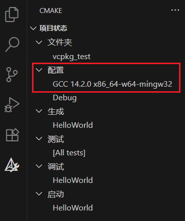
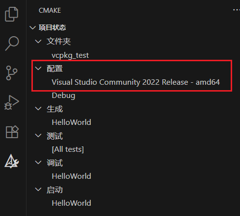

# vcpkg

!!! info "AI 解释"

    **vcpkg** 是微软推出的 **跨平台 C/C++ 库管理工具**，用于简化第三方开源库的下载、编译和依赖管理。它类似于 Python 的 `pip` 或 JavaScript 的 `npm`，但专注于 C/C++ 生态
    
    **核心特点**
    
    1. **跨平台支持**  
       
        - 支持 Windows、Linux、macOS，并能自动适配不同编译器（MSVC、GCC、Clang）
        - 库的编译选项针对各平台优化
    
    2. **庞大的库生态**  
       
        - 提供 **2500+** 个开源库（如 OpenCV、Boost、SFML、fmt 等），支持一键安装
        - 库版本可精确控制（如 `zlib@1.2.11`）
    
    3. **与构建工具无缝集成**  
       
        - 直接兼容 **CMake**（通过 `find_package`）、Visual Studio、Meson 等
        - 自动生成头文件路径和链接库配置，无需手动配置依赖
    
    4. **去中心化设计**  
       
        - 支持自定义私有库仓库（通过 `ports` 目录或覆盖机制）
        - 允许本地修改库的编译选项（如静态/动态链接）
    
    **vcpkg vs 其他包管理工具**
    
    | 工具         | 跨平台性 | 库数量 | 集成难度 | 适用场景               |
    |--------------|----------|--------|----------|------------------------|
    | **vcpkg**    | ✅        | 2500+  | 低       | 通用 C/C++ 项目        |
    | **Conan**    | ✅        | 1500+  | 中       | 复杂依赖、自定义构建   |
    | **APT/Yum**  | ❌（Linux）| 系统库 | 低       | Linux 系统级依赖       |
    | **手动编译** | ❌        | 任意   | 高       | 需要高度定制化时       |
    
    **优势**
    
    - **开箱即用**：无需手动处理库的依赖关系
    - **版本控制**：支持指定库版本（如 `vcpkg install openssl@1.1.1`）
    - **与 IDE 集成**：Visual Studio 可直接识别 vcpkg 安装的库
    
    **局限性**
    
    - **编译耗时**：首次安装库时需要从源码编译（但支持二进制缓存加速）
    - **体积较大**：库会安装在 `vcpkg/installed` 目录下，可能占用较多磁盘空间
    
    **适用场景**
    
    - **快速原型开发**：一键安装常用库（如 JSON 解析、图形库）
    - **团队协作**：统一团队的依赖版本，避免“在我机器上能运行”问题
    - **跨平台项目**：避免为不同操作系统手动配置库路径

## 1 安装

利用 git 从 github 克隆

```bash linenums="1"
git clone https://github.com/microsoft/vcpkg
```

运行脚本文件

```powershell linenums="1" title="Windows"
.\bootstrap-vcpkg.bat
```

将可执行文件所在的目录添加到系统环境变量 `PATH`

## 2 命令

1. `vcpkg list`：列出已安装包
2. `vcpkg search package_name`：搜索包
3. `vcpkg install package_name`：安装包

    1. `vcpkg install zlib`：安装 zlib
    2. 安装特定架构的库

        1. `vcpkg install zlib:x64-windows`：Windows
        2. `vcpkg install zlib:x64-mingw-dynamic`：MinGW

4. `vcpkg remove package_name`：删除包

## 3 配置文件

### 3.1 vcpkg.json

作用：

1. 声明项目的依赖库（类似 `package.json` 或 `requirements.txt`）
2. 支持版本控制，可以指定库的版本或 Git 提交哈希
3. 支持特性（features），允许按需启用库的额外功能

文件位置：通常放在项目的根目录（与 `CMakeLists.txt` 同级）

```json linenums="1"
{
  "name": "my-project",  // 项目名称（可选，但推荐填写）
  "version": "1.0.0",  // 项目版本（可选）
  "dependencies": [  // 依赖的库列表，可以是字符串或对象
    "fmt",
    "boost",
    {
      "name": "opencv",
      "version>=": "4.5.0",
      "features": ["contrib", "nonfree"]  // 启用库的额外功能（如 OpenCV 的 contrib 模块）
    }
  ]
}
```

使用场景：

1. 运行 `vcpkg install` 时，vcpkg 会自动读取 `vcpkg.json` 并安装所有依赖
2. 适合团队协作，确保所有人使用相同的库版本

### 3.2 vcpkg-configuration.json

作用：

1. 配置 vcpkg 的行为（如注册表、二进制缓存、默认 triplet 等）
2. 支持自定义库来源（如私有注册表或 Git 仓库）
3. 支持二进制缓存（加速后续安装）

文件位置：通常放在以下位置之一：

1. 项目根目录（与 `vcpkg.json` 同级）
2. vcpkg 的全局配置目录（如 `%VCPKG_ROOT%/vcpkg-configuration.json`）

```json linenums="1"
{
  "default-registry": {  // 默认库来源（通常是官方 vcpkg 仓库）
    "kind": "git",
    "repository": "https://github.com/microsoft/vcpkg",
    "baseline": "a1b2c3d4"
  },
  "registries": [  // 自定义库来源（如私有注册表）
    {
      "kind": "git",
      "repository": "https://github.com/my-org/vcpkg-registry",
      "baseline": "x1y2z3",
      "packages": ["my-custom-lib"]
    }
  ],
  "binary-caching": true,  // 启用二进制缓存（避免重复编译）
  "default-triplet": "x64-windows"  // 默认目标平台（如 x64-windows）
}
```

使用场景：

1. 从私有 Git 仓库拉取自定义库
2. 加速 CI/CD 构建（通过二进制缓存）
3. 统一团队的 vcpkg 配置

## 4 与 CMake 集成

[CMake 文档](./cmake.md){:target="_blank"}

通过在 CMake 命令中指定工具链文件实现。为了方便起见，可以进行相应的设置

以 VS Code 为例

### 4.1 MinGW

打开 VS Code 配置文件，输入：

```json linenums="1"
{
    "cmake.configureSettings": {
        // 指定工具链文件
        "CMAKE_TOOLCHAIN_FILE": "path/to/vcpkg/scripts/buildsystems/vcpkg.cmake",
        // 指定目标平台和编译方式
        "VCPKG_TARGET_TRIPLET": "x64-mingw-dynamic"
    },
}
```

并在配置中选择 MinGW

<figure markdown="span">
    { width="600" }
</figure>

#### 4.1.1 示例

```text linenums="1"
test/
├── CMakeLists.txt
├── vcpkg.json
├── vcpkg-configuration.json
└── code/
    ├── CMakeLists.txt
    └── main.cpp
```

```json linenums="1" title="vcpkg.json"
{
  "dependencies": [
    "fmt"
  ]
}
```

```json linenums="1" title="vcpkg-configuration.json"
{
  "registries": [
    {
      "kind": "artifact",
      "location": "https://github.com/microsoft/vcpkg-ce-catalog/archive/refs/heads/main.zip",
      "name": "microsoft"
    }
  ]
}
```

```text linenums="1" title="CMakeLists.txt"
cmake_minimum_required(VERSION 3.10)
project(HelloWorld)

find_package(fmt CONFIG REQUIRED)

add_subdirectory(code code)
```

```text linenums="1" title="code/CMakeLists.txt"
add_executable(HelloWorld main.cpp)

target_link_libraries(HelloWorld PRIVATE fmt::fmt)
```

```cpp linenums="1" title="code/main.cpp"
#include <fmt/core.h>

int main()
{
	fmt::print("Hello World\n");
	return 0;
}
```

### 4.2 Visual Studio

打开 VS Code 配置文件，输入：

```json linenums="1"
{
    "cmake.configureSettings": {
        // 指定工具链文件
        "CMAKE_TOOLCHAIN_FILE": "path/to/vcpkg/scripts/buildsystems/vcpkg.cmake",
        // 指定目标平台和编译方式
        "VCPKG_TARGET_TRIPLET": "x64-windows"
    },
}
```

并在配置中选择 Visual Studio - amd64

<figure markdown="span">
    { width="600" }
</figure>
