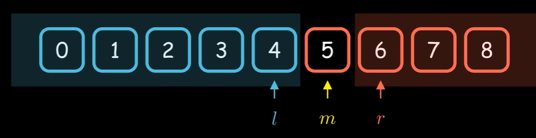

# 二分查找

[二分查找为什么总是写错？](https://www.bilibili.com/video/BV1d54y1q7k7/){:target="_blank"}

<figure markdown="span">
  { width="600" }
</figure>

```cpp linenums="1"
int left = -1, right = n;
while (left + 1 != right) {
    int middle = (left + right) / 2;
    if (isBlue(middle)) {
        left = middle;
    } else {
        right = middle;
    }
}
return left or right;
```

[C++ `std::binary_search`](../../C_Cpp/stl/algorithm.md#3-stdbinary_search){:target="_blank"}
