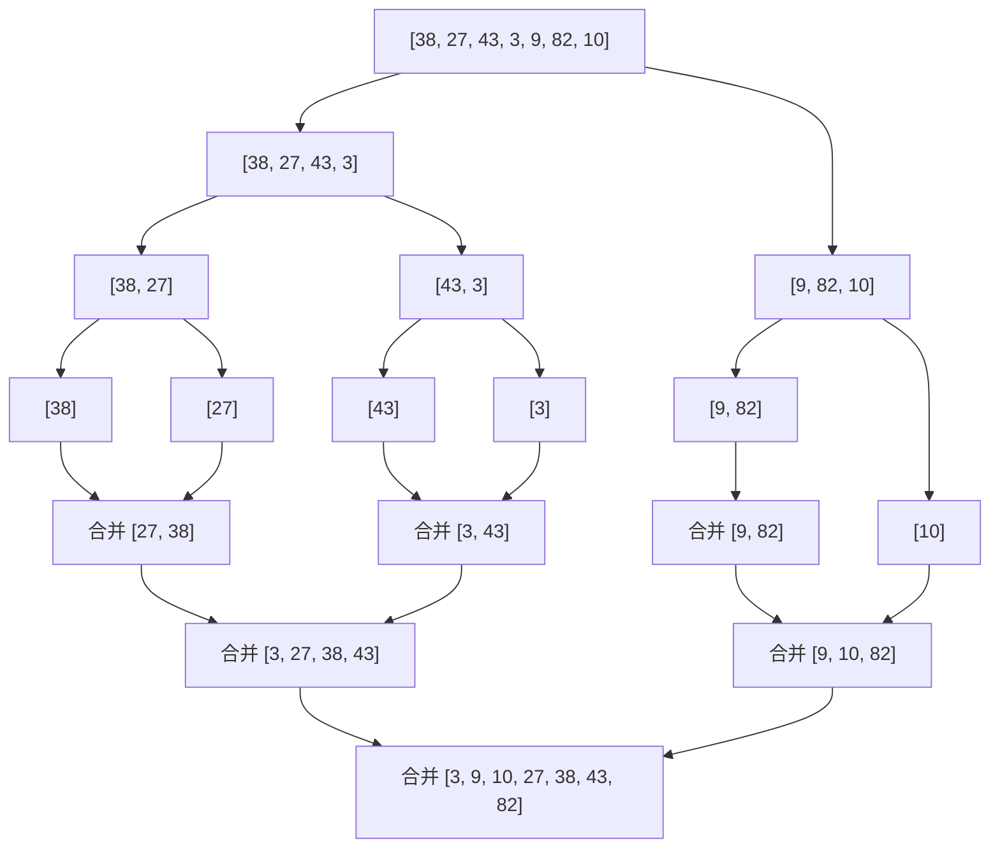

# 排序

## 1 堆排序

### 1.1 堆

堆是一种完全二叉树，且满足堆序性质：

1. 大顶堆（Max-Heap）：每个节点的值都 ≥ 其子节点的值。根节点是最大值
2. 小顶堆（Min-Heap）：每个节点的值都 ≤ 其子节点的值。根节点是最小值

由于是完全二叉树，可以用数组紧凑存储（索引从 0 开始）：

1. 父节点：`(i - 1) / 2`
2. 左子节点：`2 * i + 1`
3. 右子节点：`2 * i + 2`

#### 1.1.1 Heapify 下沉

给定一个节点，假设它的左右子树都已经是合法的堆，将该节点向下沉到正确位置，使整棵子树满足堆序

```cpp linenums="1"
// 对下标 i 的节点执行下沉（大顶堆）
void heapify(std::vector<int>& arr, int n, int i) {
    int largest = i;           // 假设当前节点最大
    int left   = 2 * i + 1;    // 左子
    int right  = 2 * i + 2;    // 右子

    // 找三者中最大的
    if (left  < n && arr[left]  > arr[largest])
        largest = left;
    if (right < n && arr[right] > arr[largest])
        largest = right;

    // 如果最大的不是当前节点，交换后继续下沉
    if (largest != i) {
        std::swap(arr[i], arr[largest]);
        heapify(arr, n, largest);  // 递归下沉
    }
}
```

时间复杂度：$O(\log N)$

#### 1.1.2 建堆

从最后一个非叶子节点开始，自底向上对每个节点执行 `heapify`

```cpp linenums="1"
void buildHeap(std::vector<int>& arr) {
    int n = arr.size();
    // 从最后一个非叶子节点开始，自底向上
    for (int i = n / 2 - 1; i >= 0; --i)
        heapify(arr, n, i);
}
```

时间复杂度：$O(N)$

### 1.2 堆排序算法

堆排序 = 建堆 + 反复取堆顶。升序用大顶堆，降序用小顶堆

1. 建堆：将数组构建为大顶堆，此时最大值在 `arr[0]`
2. 交换 + 重建：将 `arr[0]`（最大值）与数组末尾元素交换，最大值归位。将堆的大小减 1，对新的堆顶执行 `heapify` 恢复堆序
3. 重复：直到堆大小为 1

时间复杂度：$O(N\log N)$

```cpp linenums="1"
void heapSort(std::vector<int>& arr) {
    int n = arr.size();

    // 第一步：建堆 O(N)
    for (int i = n / 2 - 1; i >= 0; --i)
        heapify(arr, n, i);

    // 第二步：逐个将堆顶（最大值）放到尾部 O(N log N)
    for (int i = n - 1; i > 0; --i) {
        std::swap(arr[0], arr[i]);  // 最大值归位
        heapify(arr, i, 0);         // 对剩余部分重建堆
    }
}
```

## 2 快速排序

快速排序的核心是 **分区（Partition）** 操作：

1. **选取基准（Pivot）**：从数组中挑一个元素作为基准
2. **分区**：重新排列数组，使得所有 **小于** 基准的元素都放到基准左边，所有 **大于等于** 基准的元素都放到基准右边。分区结束后，基准就位于它最终的正确位置
3. **递归**：对基准左右两个子数组分别重复上述过程

递归终止条件是子数组长度为 0 或 1，此时天然有序

**Lomuto 分区**（更直观）：

用最后一个元素作基准，维护一个指针 `i` 表示"小于基准区域"的边界：

```cpp linenums="1"
// Lomuto 分区：返回基准最终位置
int partition(std::vector<int>& arr, int low, int high) {
    int pivot = arr[high];     // 选最后一个元素作基准
    int i = low;               // i 指向小于基准区域的末尾

    for (int j = low; j < high; ++j) {
        if (arr[j] < pivot) {
            std::swap(arr[i], arr[j]);
            ++i;               // 小于基准区域扩大
        }
    }
    std::swap(arr[i], arr[high]);  // 把基准放到正确位置
    return i;
}
```

**Hoare 分区**（效率更高）：

用双指针从两端向中间扫描，交换逆序元素：

```cpp linenums="1"
// Hoare 分区：双指针相遇
int partition(std::vector<int>& arr, int low, int high) {
    int pivot = arr[low];      // 选第一个元素作基准
    int i = low - 1;
    int j = high + 1;

    while (true) {
        do { ++i; } while (arr[i] < pivot);   // 从左找 ≥ pivot 的
        do { --j; } while (arr[j] > pivot);   // 从右找 ≤ pivot 的
        if (i >= j) return j;                 // 指针相遇
        std::swap(arr[i], arr[j]);            // 交换逆序对
    }
}
```

> Hoare 分区平均交换次数约为 Lomuto 的 1/3，但边界处理更复杂、递归区间划分方式不同，初学者建议先掌握 Lomuto

### 2.1 Lomuto

递归：

```cpp linenums="1"
#include <vector>
#include <algorithm>

int partition(std::vector<int>& arr, int low, int high) {
    int pivot = arr[high];
    int i = low;
    for (int j = low; j < high; ++j) {
        if (arr[j] < pivot) {
            std::swap(arr[i], arr[j]);
            ++i;
        }
    }
    std::swap(arr[i], arr[high]);
    return i;
}

void quickSort(std::vector<int>& arr, int low, int high) {
    if (low >= high) return;          // 递归终止

    int p = partition(arr, low, high); // 分区，基准归位
    quickSort(arr, low, p - 1);        // 排左边
    quickSort(arr, p + 1, high);       // 排右边
}
```

迭代：

```cpp linenums="1"
#include <stack>

void quickSortIterative(std::vector<int>& arr, int low, int high) {
    std::stack<std::pair<int, int>> st;
    st.push({low, high});

    while (!st.empty()) {
        auto [l, r] = st.top();
        st.pop();
        if (l >= r) continue;

        int p = partition(arr, l, r);
        st.push({l, p - 1});   // 左区间
        st.push({p + 1, r});   // 右区间
    }
}
```

### 2.2 Hoare

递归：

```cpp linenums="1"
// Hoare 分区：双指针从两端向中间扫描
// 返回值 j 不是基准的最终位置，而是左右区间的分界点
// 分区后：arr[low..j] 中的元素都 <= arr[j+1..high] 中的元素
int partition(std::vector<int>& arr, int low, int high) {
    int pivot = arr[low];      // 选第一个元素作基准
    int i = low - 1;           // 左指针（先自增再比较）
    int j = high + 1;          // 右指针（先自减再比较）

    while (true) {
        // 从左向右找第一个 >= pivot 的元素
        do { ++i; } while (arr[i] < pivot);
        // 从右向左找第一个 <= pivot 的元素
        do { --j; } while (arr[j] > pivot);
        if (i >= j) return j;          // 指针相遇或交错，分区完成
        std::swap(arr[i], arr[j]);     // 交换逆序对
    }
}

void quickSort(std::vector<int>& arr, int low, int high) {
    if (low >= high) return;           // 区间长度 0 或 1，递归终止

    int p = partition(arr, low, high); // 分区，返回分界点 j
    quickSort(arr, low, p);            // 注意：左区间包含 p！
    quickSort(arr, p + 1, high);       // 右区间
}
```

迭代：

```cpp linenums="1"
#include <stack>

void quickSortIterative(std::vector<int>& arr, int low, int high) {
    std::stack<std::pair<int, int>> st;
    st.push({low, high});

    while (!st.empty()) {
        auto [l, r] = st.top();
        st.pop();
        if (l >= r) continue;

        int p = partition(arr, l, r);
        st.push({l, p});        // 左区间（包含 p）
        st.push({p + 1, r});    // 右区间
    }
}
```

### 2.3 复杂度分析

| 情况 | 时间复杂度 | 说明 |
|---|---|---|
| 最好情况 | $O(N\log N)$ | 每次分区都均匀分成两半 |
| 平均情况 | $O(N\log N)$ | 随机输入下期望性能 |
| 最坏情况 | $O(N^2)$ | 每次基准都是最大/最小元素（已排序/逆序数组） |

**最坏情况**：如果数组已经有序，Lomuto 分区每次选末尾元素作基准都是当前最大值，导致每次只把数组分成 `N-1` 和 `1` 两部分，递归深度退化为 $N$，总复杂度 $O(N^2)$

**空间复杂度**：主要来自递归调用栈的深度

- 平均 $O(\log N)$（每次对半分，递归深度 $\log N$）
- 最坏 $O(N)$（退化成链表状递归树）

**稳定性**：快速排序是 **不稳定** 排序。分区过程中相同元素的相对位置可能改变

### 2.4 三路快排

当数组含有大量重复元素时，普通快排仍会把它们反复比较。三路快排把数组分为 `<`、`=`、`>` 三部分，等于基准的部分直接跳过：

```cpp linenums="1"
void quickSort3Way(std::vector<int>& arr, int low, int high) {
    if (low >= high) return;

    int pivot = arr[low];
    int lt = low;       // arr[low..lt-1]  < pivot
    int gt = high;      // arr[gt+1..high] > pivot
    int i = low + 1;    // 当前扫描位置

    while (i <= gt) {
        if (arr[i] < pivot)
            std::swap(arr[lt++], arr[i++]);
        else if (arr[i] > pivot)
            std::swap(arr[i], arr[gt--]);
        else
            ++i;
    }

    quickSort3Way(arr, low, lt - 1);
    quickSort3Way(arr, gt + 1, high);
}
```

三路快排对含大量重复键的数据可达到 $O(N)$（接近线性）

## 3 归并排序

归并排序是一种基于 **分治（Divide and Conquer）** 思想的稳定排序算法，由冯·诺依曼于 1945 年提出。它是少数 **时间复杂度始终为 $O(N\log N)$** 的排序算法之一（最好、最坏、平均都一样），也是 **链表排序** 和 **求逆序对** 的首选

归并排序分为三个阶段：

1. **分（Divide）**：把数组从中间分成两半
2. **治（Conquer）**：递归地对左右两半分别排序
3. **合（Combine）**：把两个 **有序** 子数组合并成一个有序数组

核心在于"合"——利用"两个有序序列合并后仍有序"这一事实，每次只需 $O(N)$ 时间



### 3.1 合并函数（核心）

合并两个已排序的区间 `[left, mid]` 和 `[mid+1, right]`：

```cpp linenums="1"
// 合并两个有序子数组
void merge(std::vector<int>& arr, int left, int mid, int right) {
    std::vector<int> tmp(right - left + 1);   // 临时数组
    int i = left;          // 左半部分的指针
    int j = mid + 1;       // 右半部分的指针
    int k = 0;             // 临时数组的指针

    // 双指针归并：每次取较小者放入临时数组
    while (i <= mid && j <= right) {
        if (arr[i] <= arr[j])      // 注意 <= 保证稳定性
            tmp[k++] = arr[i++];
        else
            tmp[k++] = arr[j++];
    }

    // 把剩余的元素拷入
    while (i <= mid)  tmp[k++] = arr[i++];
    while (j <= right) tmp[k++] = arr[j++];

    // 写回原数组
    for (int p = 0; p < (int)tmp.size(); ++p)
        arr[left + p] = tmp[p];
}
```

!!! tip "为什么用 `<=` 而不是 `<`"

    `if (arr[i] <= arr[j])` 中必须用 `<=`：当左右元素相等时，优先取 **左边** 的元素，这样才能保证相同元素的相对顺序不变，即保证 **稳定性**。若写成 `<`，相等时会先取右边的元素，排序就变成不稳定的了

### 3.2 递归实现（自顶向下）

```cpp linenums="1"
void mergeSort(std::vector<int>& arr, int left, int right) {
    if (left >= right) return;          // 区间长度 0 或 1，天然有序

    int mid = left + (right - left) / 2;   // 防溢出的写法
    mergeSort(arr, left, mid);         // 递归排序左半
    mergeSort(arr, mid + 1, right);    // 递归排序右半
    merge(arr, left, mid, right);      // 合并两个有序半区
}

// 调用：mergeSort(arr, 0, arr.size() - 1);
```

### 3.3 迭代实现（自底向上）

递归版依赖函数调用栈，迭代版从最小规模的子数组开始两两合并，空间更可控、无递归开销：

```cpp linenums="1"
void mergeSortIterative(std::vector<int>& arr) {
    int n = arr.size();
    // size 是当前每次合并的子数组长度：1, 2, 4, 8, ...
    for (int size = 1; size < n; size *= 2) {
        for (int left = 0; left < n - size; left += 2 * size) {
            int mid   = left + size - 1;
            int right = std::min(left + 2 * size - 1, n - 1);  // 防越界
            merge(arr, left, mid, right);
        }
    }
}
```

### 3.4 复杂度分析

| 项目 | 复杂度 | 说明 |
|---|---|---|
| 最好情况 | $O(N\log N)$ | 无论输入如何都固定 |
| 平均情况 | $O(N\log N)$ | 每层合并 $O(N)$，共 $\log N$ 层 |
| 最坏情况 | $O(N\log N)$ | **不受输入分布影响** |
| 空间复杂度 | $O(N)$ | 需要临时数组（迭代版同样 $O(N)$） |
| 稳定性 | **稳定** | 合并时相等元素保留左半优先 |

递归深度 $\log N$，每层都要遍历全部 $N$ 个元素做合并，因此总时间 $O(N\log N)$。归并排序**不受输入影响**，没有快排那种"最坏 $O(N^2)$"的风险，代价是需要 $O(N)$ 额外空间。

### 3.5 经典应用：求逆序对

归并排序是求 **逆序对**（$i < j$ 但 $arr[i] > arr[j]$）的标准解法，在合并时顺带统计：

```cpp linenums="1"
long long cnt = 0;   // 逆序对个数（可能很大，用 long long）

void mergeCount(std::vector<int>& arr, int left, int mid, int right) {
    std::vector<int> tmp(right - left + 1);
    int i = left, j = mid + 1, k = 0;

    while (i <= mid && j <= right) {
        if (arr[i] <= arr[j]) {
            tmp[k++] = arr[i++];
        } else {
            // arr[j] 比左半剩余的所有元素都小
            // 左半剩余元素个数 = mid - i + 1，每个都与 arr[j] 构成逆序对
            cnt += mid - i + 1;
            tmp[k++] = arr[j++];
        }
    }
    while (i <= mid)  tmp[k++] = arr[i++];
    while (j <= right) tmp[k++] = arr[j++];
    for (int p = 0; p < (int)tmp.size(); ++p) arr[left + p] = tmp[p];
}

void mergeSortCount(std::vector<int>& arr, int left, int right) {
    if (left >= right) return;
    int mid = left + (right - left) / 2;
    mergeSortCount(arr, left, mid);
    mergeSortCount(arr, mid + 1, right);
    mergeCount(arr, left, mid, right);
}
```

### 3.6 与快排、堆排的对比

| 维度 | 归并排序 | 快速排序 | 堆排序 |
|---|---|---|---|
| 平均时间 | $O(N\log N)$ | $O(N\log N)$ | $O(N\log N)$ |
| 最坏时间 | $O(N\log N)$ **稳定** | $O(N^2)$（可优化） | $O(N\log N)$ |
| 空间 | $O(N)$ | 平均 $O(\log N)$ | $O(1)$ |
| 稳定性 | **稳定** | 不稳定 | 不稳定 |
| 缓存友好 | 较差（跳跃访问临时数组） | 好（顺序访问） | 较差（跳跃访问） |
| 适用场景 | 链表排序、外部排序、求逆序对 | 通用（`std::sort` 主体） | 内存受限、求 Top-K |

!!! tip "归并排序 vs 快速排序"

    - **快排**：空间少、缓存友好、实际更快，但不稳定、最坏 $O(N^2)$
    - **归并**：稳定、最坏也是 $O(N\log N)$，但需要 $O(N)$ 额外空间
    - **链表排序**：归并排序是 **唯一** 能在链表上高效工作的 $O(N\log N)$ 排序（快排需要随机访问，不适合链表）
    - **外部排序**（数据大到无法装入内存）：归并排序的分治 + 合并思想是外部排序的基础
