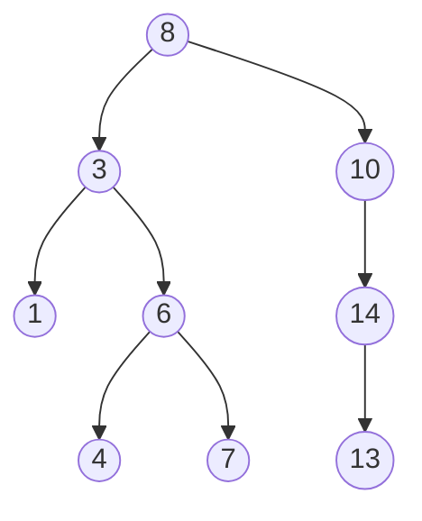

# 二叉搜索树

二叉搜索树（Binary Search Tree，BST），也叫二叉排序树，是一种特殊的二叉树，它在 **查找、插入、删除** 操作上都能保持较高的效率，是众多高级数据结构（AVL、红黑树）的基础

二叉搜索树满足以下 **递归性质**：

> 对于任意节点：
> 
> - 其 **左子树** 中所有节点的值都 **小于** 该节点的值
> - 其 **右子树** 中所有节点的值都 **大于** 该节点的值
> - 左右子树本身也都是二叉搜索树



由定义可直接推出一个重要性质：**中序遍历一棵 BST 得到的是升序序列**。上图的中序遍历结果是 `1 3 4 6 7 8 10 13 14`。

## 1 查找（Search）

利用"左小右大"的性质，每次比较后可以 **排除一半** 的节点，类似二分查找：

```cpp linenums="1"
// 递归版
TreeNode* search(TreeNode* root, int key) {
    if (!root || root->val == key) return root;
    return key < root->val ? search(root->left, key)
                           : search(root->right, key);
}

// 迭代版（推荐，省递归栈空间）
TreeNode* search(TreeNode* root, int key) {
    while (root && root->val != key) {
        root = key < root->val ? root->left : root->right;
    }
    return root;   // 找到返回节点指针，找不到返回 nullptr
}
```

## 2 插入（Insert）

插入的核心思路和查找一样：**先按大小关系走到空位，再把新节点挂上去**：

```cpp linenums="1"
TreeNode* insert(TreeNode* root, int val) {
    if (!root) return new TreeNode(val);   // 到达空位，新建节点

    if (val < root->val)
        root->left = insert(root->left, val);
    else if (val > root->val)
        root->right = insert(root->right, val);
    // val == root->val 时，按需求决定：这里选择不插入重复值

    return root;
}
```

!!! note "重复值处理"

    不同实现可以约定不同策略：
    
    - 不允许重复：`val == root->val` 时直接返回（如上）
    - 允许重复：可以约定"等于的放左子树"或"放右子树"，或者给节点加 `count` 计数

## 3 删除（Delete）—— 最复杂的操作

删除节点需要分 **三种情况** 处理，同时保持 BST 性质：

```cpp linenums="1"
// 找以 root 为根的子树中的最小值节点（最左边的节点）
TreeNode* findMin(TreeNode* root) {
    while (root && root->left) root = root->left;
    return root;
}

TreeNode* remove(TreeNode* root, int key) {
    if (!root) return nullptr;

    // 先递归找到要删除的节点
    if (key < root->val)
        root->left = remove(root->left, key);
    else if (key > root->val)
        root->right = remove(root->right, key);
    else {
        // 情况 1：叶子节点 —— 直接删除
        if (!root->left && !root->right) {
            delete root;
            return nullptr;
        }

        // 情况 2：只有一个子节点 —— 用子节点顶替自己
        if (!root->left) {
            TreeNode* tmp = root->right;
            delete root;
            return tmp;
        }
        if (!root->right) {
            TreeNode* tmp = root->left;
            delete root;
            return tmp;
        }

        // 情况 3：有两个子节点 —— 用"后继"顶替
        // 后继 = 右子树中最小的节点（保证大于左子树全部、小于右子树其余节点）
        TreeNode* succ = findMin(root->right);
        root->val = succ->val;                    // 拷贝后继的值
        root->right = remove(root->right, succ->val);  // 递归删除后继节点
    }
    return root;
}
```

- **情况 1**：叶子节点，直接 `delete` 并返回 `nullptr`
- **情况 2**：只有一个孩子，用孩子"接管"位置
- **情况 3**：有两个孩子，不能直接删，改用 **后继**（右子树最小值）或 **前驱**（左子树最大值）的值覆盖自己，再递归删除那个后继/前驱节点（它必然落入情况 1 或 2）

!!! question "为什么情况 3 要用后继/前驱替换？"

    因为删除有两个孩子的节点后，需要一个新的值填补空缺，且必须满足"大于左子树所有值、小于右子树所有值"。右子树的最小值（后继）恰好满足：它大于左子树全部节点（因为在右子树里），又小于右子树其余节点（因为它是右子树最小的）。左子树的最大值（前驱）同理

## 4 遍历

**中序遍历** 是 BST 最核心的遍历方式，输出天然有序：

```cpp linenums="1"
void inorder(TreeNode* root) {
    if (!root) return;
    inorder(root->left);          // 左
    std::cout << root->val << ' '; // 根
    inorder(root->right);         // 右
}
```

- 前序遍历（根左右）：可用于 **序列化/重建** BST
- 后序遍历（左右根）：常用于"先处理子节点"的场景（如释放内存）

## 5 复杂度分析

| 操作 | 平均复杂度 | 最坏复杂度 |
|---|---|---|
| 查找 | $O(\log N)$ | $O(N)$ |
| 插入 | $O(\log N)$ | $O(N)$ |
| 删除 | $O(\log N)$ | $O(N)$ |
| 中序遍历 | $O(N)$ | $O(N)$ |

其中 $O(\log N)$ 成立的前提是树 **接近平衡**。如果插入的序列本身有序，BST 会退化成一条链

此时查找退化为 $O(N)$，失去了二分查找的优势。为解决退化问题，人们发明了 **平衡二叉搜索树**：

| 结构 | 平衡策略 |
|---|---|
| AVL 树 | 严格平衡（左右子树高度差 ≤ 1），旋转调整 |
| 红黑树 | 近似平衡（最长路径 ≤ 2× 最短路径），`std::map`/`std::set` 底层 |
| Treap | 随机优先级 + 堆性质 |
| Splay 树 | 访问后旋转到根 |

!!! tip "和 STL 的联系"

    C++ 标准库的 `std::set`、`std::map` 底层就是**红黑树**（一种自平衡的 BST），因此它们才有 $O(\log N)$ 的查找/插入/删除保证和 **有序遍历** 能力。

## 6 其他常用操作

### 6.1 找最小值 / 最大值

```cpp linenums="1"
TreeNode* findMin(TreeNode* root) {
    while (root && root->left) root = root->left;   // 一直往左
    return root;
}
TreeNode* findMax(TreeNode* root) {
    while (root && root->right) root = root->right; // 一直往右
    return root;
}
```

### 6.2 验证一棵树是否为 BST

利用"中序遍历必须严格递增"或"每个节点值在合法区间内"：

```cpp linenums="1"
bool isValid(TreeNode* root, long long low, long long high) {
    if (!root) return true;
    if (root->val <= low || root->val >= high) return false;
    return isValid(root->left, low, root->val)
        && isValid(root->right, root->val, high);
}
// 调用：isValid(root, LLONG_MIN, LLONG_MAX)
```

## 7 典型应用

1. **有序集合/字典**：`std::set`、`std::map`（红黑树）
2. **范围查询**：查找某个区间内的所有元素（BST 中序遍历一段即可）
3. **前驱/后继查询**：比某值小的最大值 / 比某值大的最小值
4. **排名查询**：给节点加 `size` 字段可查"第 k 小"（LeetCode 230）
5. **数据库索引**：B 树/B+ 树是 BST 的磁盘友好版推广
