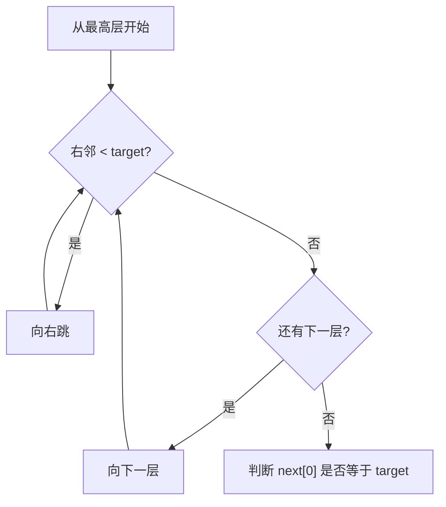

# 跳表

跳表是一种 **基于有序链表 + 多层索引** 的概率性数据结构，它实现了与平衡树相当的性能——查找、插入、删除都是期望 $O(\log N)$，但 **实现远比红黑树简单**。它是 Redis 有序集合（ZSet）的底层实现之一

有序链表支持快速插入删除，但 **查找只能 $O(N)$** 顺序扫描：

```text
1 -> 3 -> 4 -> 5 -> 7 -> 12 -> 21 -> 35    （查找 21 要扫 7 次）
```

跳表的思路：**给链表加"索引"**，让查找能"跳跃"前进：

```text
Level 2:  1 --------------------> 7 --------------------> 21
Level 1:  1 ----------> 4 ------> 7 ----------> 12 ----> 21 ----> 35
Level 0:  1 -> 3 -> 4 -> 5 -> 7 -> 12 -> 21 -> 35
```

查找 `21`：从最高层出发，`1 → 7`（跨过 3,4,5），`7 → 21`（跨过 12），只需几步就找到

跳表由多层链表组成：

- **第 0 层**：完整的有序链表（包含所有元素）
- **第 k 层**：第 k-1 层的"抽样"——每个节点以概率 $p$（通常 1/2）出现在上一层
- 最顶层只有一个（或少数）节点
- 每个节点持有一个 **指针数组** `next[]`，`next[i]` 指向第 i 层的下一个节点

```cpp linenums="1"
struct SkipNode {
    int val;
    std::vector<SkipNode*> next;   // next[i]：第 i 层的后继指针

    SkipNode(int v, int level) : val(v), next(level, nullptr) {}
};
```

## 1 查找操作

**从最高层开始，能向右走就向右，不能走就向下一层**，直到第 0 层：

```cpp linenums="1"
bool search(int target) {
    SkipNode* cur = head;
    for (int i = maxLevel - 1; i >= 0; --i) {          // 从高层往下
        while (cur->next[i] && cur->next[i]->val < target)
            cur = cur->next[i];                        // 向右跳
    }
    // 此时 cur 是第 0 层中 < target 的最大节点
    return cur->next[0] && cur->next[0]->val == target;
}
```



## 2 插入操作

插入分两步：

1. **确定层数**：用抛硬币决定——每抛一次正面层数 +1，直到抛到反面（Redis 用 $p=1/4$）
2. **从高层到低层**：查找插入位置，记录每层的"前驱"，然后逐层插入

```cpp linenums="1"
// 随机层数：期望值为 1/(1-p)，p=1/2 时约 2 层
int randomLevel() {
    int level = 1;
    while (rand() % 2 == 0 && level < MAX_LEVEL)   // 抛硬币
        ++level;
    return level;
}

void insert(int val) {
    int level = randomLevel();
    SkipNode* newNode = new SkipNode(val, level);

    // 从最高层往下，记录每层的前驱节点
    SkipNode* cur = head;
    std::vector<SkipNode*> update(maxLevel, nullptr);
    for (int i = maxLevel - 1; i >= 0; --i) {
        while (cur->next[i] && cur->next[i]->val < val)
            cur = cur->next[i];
        update[i] = cur;           // 第 i 层中 < val 的最大节点
    }

    // 逐层插入
    for (int i = 0; i < level; ++i) {
        newNode->next[i] = update[i]->next[i];
        update[i]->next[i] = newNode;
    }
}
```

## 3 删除操作

先找到目标节点（记录各层前驱），再把每层指向它的指针"跨过去"：

```cpp linenums="1"
bool remove(int val) {
    SkipNode* cur = head;
    std::vector<SkipNode*> update(maxLevel, nullptr);

    for (int i = maxLevel - 1; i >= 0; --i) {
        while (cur->next[i] && cur->next[i]->val < val)
            cur = cur->next[i];
        update[i] = cur;
    }

    SkipNode* target = cur->next[0];
    if (!target || target->val != val) return false;

    // 从所有包含该节点的层中删除
    for (int i = 0; i < target->next.size(); ++i) {
        if (update[i]->next[i] == target)
            update[i]->next[i] = target->next[i];
    }
    delete target;
    return true;
}
```

## 4 复杂度分析

### 4.1 期望层数与节点分布

若每层以概率 $p=1/2$ 抽样，则：

- 第 0 层：$N$ 个节点
- 第 1 层：约 $N/2$ 个节点
- 第 k 层：约 $N/2^k$ 个节点
- **期望层数**：约 $\log_2 N$ 层

### 4.2 各操作复杂度

| 操作 | 期望复杂度 | 说明 |
|---|---|---|
| 查找 | $O(\log N)$ | 每层最多走有限步，共 $\log N$ 层 |
| 插入 | $O(\log N)$ | 查找位置 + 逐层挂接 |
| 删除 | $O(\log N)$ | 查找位置 + 逐层摘除 |
| 空间 | $O(N)$ | 指针总数约 $N(1 + p + p^2 + \cdots) = \frac{N}{1-p} = 2N$ |

!!! tip "空间复杂度推导"

    每个节点的期望指针数 = $1 + p + p^2 + \cdots = \dfrac{1}{1-p}$。当 $p=1/2$ 时约为 2 个指针/节点，总空间 $O(N)$，常数很小

## 5 完整实现（可运行）

```cpp linenums="1"
#include <vector>
#include <cstdlib>
#include <ctime>
#include <iostream>

class SkipList {
    static const int MAX_LEVEL = 16;    // 最大层数（支持 ~2^16 个元素）

    struct Node {
        int val;
        std::vector<Node*> next;
        Node(int v, int level) : val(v), next(level, nullptr) {}
    };

    Node* head;
    int maxLevel;

    int randomLevel() {
        int level = 1;
        while (rand() % 2 == 0 && level < MAX_LEVEL)
            ++level;
        return level;
    }

public:
    SkipList() : head(new Node(-1, MAX_LEVEL)), maxLevel(1) {
        srand(time(nullptr));
    }

    bool search(int target) {
        Node* cur = head;
        for (int i = maxLevel - 1; i >= 0; --i)
            while (cur->next[i] && cur->next[i]->val < target)
                cur = cur->next[i];
        return cur->next[0] && cur->next[0]->val == target;
    }

    void insert(int val) {
        int level = randomLevel();
        maxLevel = std::max(maxLevel, level);

        Node* cur = head;
        std::vector<Node*> update(MAX_LEVEL, nullptr);
        for (int i = maxLevel - 1; i >= 0; --i) {
            while (cur->next[i] && cur->next[i]->val < val)
                cur = cur->next[i];
            update[i] = cur;
        }

        Node* node = new Node(val, level);
        for (int i = 0; i < level; ++i) {
            node->next[i] = update[i]->next[i];
            update[i]->next[i] = node;
        }
    }

    bool remove(int val) {
        Node* cur = head;
        std::vector<Node*> update(MAX_LEVEL, nullptr);
        for (int i = maxLevel - 1; i >= 0; --i) {
            while (cur->next[i] && cur->next[i]->val < val)
                cur = cur->next[i];
            update[i] = cur;
        }

        Node* target = cur->next[0];
        if (!target || target->val != val) return false;

        for (int i = 0; i < (int)target->next.size(); ++i)
            if (update[i]->next[i] == target)
                update[i]->next[i] = target->next[i];
        delete target;
        return true;
    }

    void print() {
        Node* cur = head->next[0];
        while (cur) {
            std::cout << cur->val << ' ';
            cur = cur->next[0];
        }
        std::cout << '\n';
    }
};
```

## 6 跳表 vs 红黑树

| 维度 | 跳表 | 红黑树 |
|---|---|---|
| 实现难度 | **简单**（链表 + 随机化） | 复杂（旋转、染色、多种情况） |
| 查找/插入/删除 | 期望 $O(\log N)$（概率性） | 最坏 $O(\log N)$（确定性） |
| 范围查询 | **天然支持**（第 0 层遍历即可） | 需要中序遍历 |
| 排名查询 | 易扩展（节点存跨度） | 需要额外维护 |
| 平衡方式 | 随机化，概率平衡 | 严格平衡 |
| 实现者 | Redis ZSet | C++ `std::map`/`std::set` |

**Redis 为什么选跳表而不是红黑树**：

1. 实现简单，不易出 bug
2. 范围查询（`ZRANGE`）天然高效
3. 可以方便地维护"跨度"字段实现 **按排名查询**（`ZRANK`）

## 7 典型应用

1. **Redis 有序集合（ZSet）**：跳表 + 哈希表组合
2. **LevelDB / RocksDB**：内存中的 MemTable 用跳表
3. **HBase**：某些版本的内存索引
4. **需要高效范围查询 + 动态插入删除** 的场景
