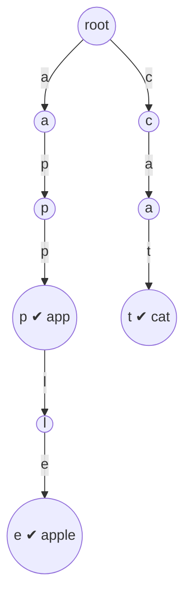

# 前缀树

前缀树（Trie），又称 **字典树**、**单词查找树**，是一种用于高效存储和检索字符串集合的树形数据结构。"Trie"来自单词 **re*trie*val**（检索），读作 "try"

它的核心思想是：**利用字符串之间的公共前缀来合并存储，从而节省空间并加速前缀相关的查询**

## 1 基本概念

- 每个 **节点** 代表一个字符（边上的标签是字符）
- 从 **根节点到某个节点** 的路径，构成一个字符串的前缀
- 根节点不包含字符（空串）
- 一个节点可能同时是多个字符串的前缀，用 `isEnd` 标记判断是否构成完整单词

例如插入 `"app"`、`"apple"`、`"cat"` 三个单词后的 Trie：



- 路径 `root → a → p → p` 对应 `"app"`，该节点有 ✔ 标记（是完整单词）
- 路径 `root → a → p` 对应 `"ap"`，只是前缀，没有 ✔ 标记

## 2 节点结构设计

每个节点通常包含两部分：

```cpp linenums="1"
struct TrieNode {
    int child[26];    // 指向 26 个小写字母的子节点（0 表示不存在）
    bool isEnd;       // 是否是一个完整单词的结尾

    TrieNode() {
        memset(child, 0, sizeof(child));
        isEnd = false;
    }
};
```

- 如果字符集不是小写字母（如包含大写、数字），可以把 `child[26]` 换成 `unordered_map<char, int>` 或增大数组容量
- 也可以加 `cnt` 记录"以该节点结尾的单词数"或 `pass` 记录"经过该节点的单词数"（用于统计前缀出现次数、支持删除）

## 3 基本操作

Trie 支持三个核心操作，每个操作的时间复杂度都是 $O(L)$，其中 $L$ 是字符串长度：

| 操作 | 含义 | 复杂度 |
|---|---|---|
| `insert(word)` | 插入一个单词 | $O(L)$ |
| `search(word)` | 精确查找单词是否存在 | $O(L)$ |
| `startsWith(prefix)` | 判断是否存在以 prefix 开头的单词 | $O(L)$ |
| `remove(word)` | 删除单词（可选） | $O(L)$ |

### 3.1 完整实现

```cpp linenums="1"
#include <vector>
#include <cstring>
#include <string>

struct TrieNode {
    int child[26];
    bool isEnd;
    TrieNode() {
        memset(child, 0, sizeof(child));
        isEnd = false;
    }
};

class Trie {
public:
    Trie() { nodes.emplace_back(); }   // 节点 0 是根节点

    void insert(const std::string& word) {
        int u = 0;
        for (char ch : word) {
            int c = ch - 'a';
            if (!nodes[u].child[c]) {           // 子节点不存在则新建
                nodes[u].child[c] = nodes.size();
                nodes.emplace_back();
            }
            u = nodes[u].child[c];              // 向下走
        }
        nodes[u].isEnd = true;                  // 标记单词结尾
    }

    bool search(const std::string& word) {
        int u = 0;
        for (char ch : word) {
            int c = ch - 'a';
            if (!nodes[u].child[c]) return false;  // 路径中断
            u = nodes[u].child[c];
        }
        return nodes[u].isEnd;                  // 必须恰好是完整单词
    }

    bool startsWith(const std::string& prefix) {
        int u = 0;
        for (char ch : prefix) {
            int c = ch - 'a';
            if (!nodes[u].child[c]) return false;
            u = nodes[u].child[c];
        }
        return true;                            // 前缀存在即可，无需 isEnd
    }

private:
    std::vector<TrieNode> nodes;                // 动态开点，节点 0 为根
};
```

!!! tip "`search` 和 `startsWith` 的唯一区别"

    两者遍历过程完全相同，区别只在**返回值**：
    
    - `search`：走到最后一个字符后，必须检查 `isEnd`（判断"恰好是这个单词"）
    - `startsWith`：只要路径能走通就返回 `true`（判断"存在这个前缀"）

### 3.2 指针版（递归删除）

```cpp linenums="1"
struct TrieNode {
    TrieNode* child[26] = {};
    bool isEnd = false;
    ~TrieNode() { for (auto* p : child) delete p; }
};

void insert(TrieNode* root, const std::string& word) {
    TrieNode* p = root;
    for (char ch : word) {
        int c = ch - 'a';
        if (!p->child[c]) p->child[c] = new TrieNode();
        p = p->child[c];
    }
    p->isEnd = true;
}

bool search(TrieNode* root, const std::string& word) {
    TrieNode* p = root;
    for (char ch : word) {
        int c = ch - 'a';
        if (!p->child[c]) return false;
        p = p->child[c];
    }
    return p->isEnd;
}
```

数组版（`std::vector` 动态开点）比指针版更快、更容易管理内存

## 4 复杂度分析

| 项目 | 复杂度 | 说明 |
|---|---|---|
| 插入 | $O(L)$ | $L$ 为单词长度 |
| 查找 | $O(L)$ | 与单词长度成正比，**与树中单词总数无关** |
| 前缀查询 | $O(L)$ | 同上 |
| 空间 | $O(\sum L_i \times \Sigma)$ | 最坏情况每个字符一个节点，$\Sigma$ 是字符集大小 |

对比哈希表：哈希表查找也是 $O(L)$（计算哈希 + 比较），但 **Trie 独有的是前缀相关操作**——`startsWith`、按字典序遍历、找最长公共前缀等，哈希表做不了或很慢

## 5 常见变体与扩展

### 5.1 记录前缀出现次数（`pass` 计数）

给节点加一个 `pass` 计数器，每插入一个单词，路径上所有节点的 `pass++`，即可 $O(L)$ 查询"以某前缀开头的单词有多少个"：

```cpp linenums="1"
struct TrieNode {
    int child[26];
    int pass;    // 经过该节点的单词数
    int end;     // 以该节点结尾的单词数
};
```

### 5.2 01 Trie（二进制字典树）

把整数的 **二进制位** 当作字符插入，常用于求 **最大异或值**

```cpp linenums="1"
// 求数组中和 x 异或值最大的元素
int query(int x) {
    int u = 0, res = 0;
    for (int i = 30; i >= 0; --i) {          // 从高位到低位
        int bit = (x >> i) & 1;
        if (nodes[u].child[bit ^ 1]) {       // 尽量走相反的位
            res |= (1 << i);
            u = nodes[u].child[bit ^ 1];
        } else {
            u = nodes[u].child[bit];
        }
    }
    return res;
}
```

### 5.3 其他变体

| 变体 | 特点 |
|---|---|
| 压缩 Trie（Radix Tree） | 把单分支路径合并成一个节点，节省空间 |
| 可持久化 Trie | 保留历史版本，支持区间查询 |
| AC 自动机 | 在 Trie 上增加失配指针，用于多模式串匹配 |
| 双数组 Trie | 压缩存储，适合词典等空间敏感场景 |

## 6 典型应用

1. **自动补全 / 搜索建议**：输入前缀，返回所有以它开头的单词（遍历子树）
2. **拼写检查**：快速判断单词是否在词典中
3. **IP 路由最长前缀匹配**：路由表用 Trie 存储，找最长匹配前缀
4. **词频统计**：搜索引擎中统计前缀热度
5. **最大异或**：01 Trie
6. **单词搜索**：LeetCode 212「单词搜索 II」（Trie + DFS 回溯）

## 7 与哈希表 / 平衡树的对比

| 维度 | Trie | 哈希表 | 平衡树（set/map） |
|---|---|---|---|
| 精确查找 | $O(L)$ | $O(L)$ | $O(L\log N)$ |
| 前缀查询 | $O(L)$ | ✗ 不支持 | $O(L\log N)$（用 lower_bound） |
| 按字典序遍历 | 天然支持 | ✗ | 支持 |
| 空间 | 较大 | 较小 | 较小 |
| 最长公共前缀 | $O(L)$ | ✗ | 较麻烦 |

**结论**：只要题目涉及"前缀"（前缀匹配、前缀计数、字典序、最长公共前缀、自动补全），优先考虑 Trie；只是单纯判重或精确查找，哈希表更省空间
