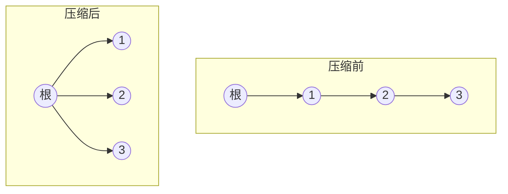

# 并查集

并查集是一种用于管理 **若干不相交集合** 的数据结构，支持两种核心操作：

| 操作 | 含义 |
|---|---|
| `find(x)` | 查询元素 `x` 属于哪个集合（返回该集合的"代表元"） |
| `union(x, y)` | 把 `x` 和 `y` 所在的两个集合 **合并** 成一个 |
| `isConnected(x, y)` | 判断 `x` 和 `y` 是否属于同一集合 |

它通常用来高效地维护 **动态连通性** 问题：不断有新的"连接/合并"关系加入，随时查询两个元素是否连通

并查集用 **森林** 表示集合：

- 每个集合用一棵 **树** 表示，树的根节点是集合的 **代表元**
- 用数组 `parent[i]` 记录元素 `i` 的父节点
- 根节点的 `parent` 指向它自己（`parent[root] == root`）

两个集合合并，就是把 **一棵树的根挂到另一棵树的根上**

## 1 未优化的基本实现

```cpp linenums="1"
// find：沿 parent 一直向上走，直到根
int find(int x) {
    while (parent[x] != x)
        x = parent[x];
    return x;
}

// union：把 x 的根挂到 y 的根上
void unite(int x, int y) {
    int rx = find(x);
    int ry = find(y);
    if (rx != ry)
        parent[rx] = ry;
}
```

**问题**：如果每次都把新集合挂成一条链（比如 `unite(1,2), unite(2,3), unite(3,4)...`），树会退化成链表，`find` 变成 $O(N)$

## 2 两个关键优化

### 2.1 路径压缩（Path Compression）

在 `find` 的过程中，把 **路径上的所有节点都直接挂到根上**，让树变得扁平：

```cpp linenums="1"
int find(int x) {
    if (parent[x] != x)
        parent[x] = find(parent[x]);   // 递归找到根，沿途全部挂到根
    return parent[x];
}
```



### 2.2 按秩合并（Union by Rank）

合并时总是把 **矮的树挂到高的树** 上，避免树高无谓增加。`rank[i]` 记录以 `i` 为根的树的"高度上界"：

```cpp linenums="1"
void unite(int x, int y) {
    int rx = find(x);
    int ry = find(y);
    if (rx == ry) return;

    // 总是把 rank 小的挂到 rank 大的下面
    if (rank[rx] < rank[ry]) std::swap(rx, ry);
    parent[ry] = rx;
    if (rank[rx] == rank[ry]) ++rank[rx];   // 高度相同，合并后高度 +1
}
```

!!! tip "两个优化都加，复杂度几乎为常数"

    只用一个优化：$O(\log N)$。两个都用：单次操作均摊接近 $O(\alpha(N))$，其中 $\alpha$ 是 **反阿克曼函数**，增长极慢（对任何实际输入 $< 5$），可以视为 $O(1)$

## 3 完整实现

```cpp linenums="1"
#include <vector>
#include <algorithm>

class UnionFind {
public:
    UnionFind(int n) : parent(n), rank(n, 1) {
        for (int i = 0; i < n; ++i)
            parent[i] = i;          // 初始每个元素自成一个集合
    }

    // 查找根 + 路径压缩
    int find(int x) {
        if (parent[x] != x)
            parent[x] = find(parent[x]);
        return parent[x];
    }

    // 合并两个集合（按秩合并）
    void unite(int x, int y) {
        int rx = find(x);
        int ry = find(y);
        if (rx == ry) return;       // 已经在同一集合

        if (rank[rx] < rank[ry])
            std::swap(rx, ry);
        parent[ry] = rx;
        if (rank[rx] == rank[ry])
            ++rank[rx];
    }

    // 判断是否连通
    bool isConnected(int x, int y) {
        return find(x) == find(y);
    }

private:
    std::vector<int> parent;   // 父节点数组
    std::vector<int> rank;     // 秩（树高上界）
};
```

## 4 复杂度分析

| 场景 | 单次操作复杂度 |
|---|---|
| 无优化 | $O(N)$（最坏） |
| 仅路径压缩 或 仅按秩合并 | $O(\log N)$ |
| 两者都加 | $O(\alpha(N)) \approx O(1)$ |

空间复杂度 $O(N)$（`parent` 和 `rank` 数组）

## 5 经典应用

### 5.1 图的连通性 / 冗余连接

给一棵树多加了一条边，找出这条多余的边。思路：依次合并每条边的两端，若两端 **已经在同一集合**，说明这条边是多余的（形成环）

```cpp linenums="1"
vector<int> findRedundantConnection(vector<vector<int>>& edges) {
    int n = edges.size();
    UnionFind uf(n + 1);
    for (auto& e : edges) {
        if (uf.isConnected(e[0], e[1]))
            return e;              // 两端已连通 → 这条边多余
        uf.unite(e[0], e[1]);
    }
    return {};
}
```

### 5.2 Kruskal 最小生成树

对边按权重排序，用并查集判断"加入这条边是否会形成环"：

```cpp linenums="1"
// 伪代码
sort(edges.begin(), edges.end());   // 按边权升序
UnionFind uf(n);
int total = 0, cnt = 0;
for (auto& [w, u, v] : edges) {
    if (!uf.isConnected(u, v)) {    // 不连通才加入，避免成环
        uf.unite(u, v);
        total += w;
        ++cnt;
    }
}
```

## 6 常见变体

| 变体 | 特点 |
|---|---|
| **带权并查集** | 边带权值（如距离、倍数），维护 `parent` 的同时维护到根的距离 |
| **带 size 的并查集** | 维护每个集合的元素个数（`size[根]`） |
| **可撤销并查集** | 记录每次合并，支持回退（配合栈） |
| **可持久化并查集** | 保留历史版本 |

按秩合并常可用"按集合大小合并"（size 优化）替代，效果相同：

```cpp linenums="1"
// 按大小合并：小集合挂到大集合下
if (size[rx] < size[ry]) std::swap(rx, ry);
parent[ry] = rx;
size[rx] += size[ry];
```
