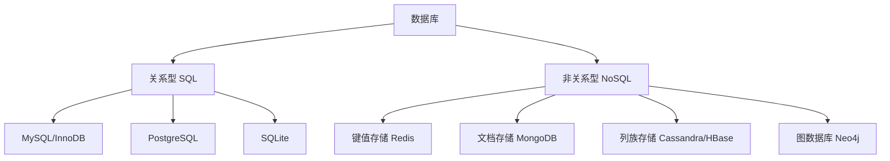
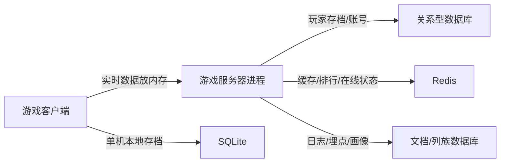

# 数据库分类

数据库大致分为两大类：**关系型数据库（SQL）** 和 **非关系型数据库（NoSQL）**



如何选择：

1. **需要强事务 + 复杂关联查询** → MySQL（InnoDB）、PostgreSQL
2. **本地小应用 / 移动端 / 单机工具** → SQLite
3. **高并发缓存 / 实时计数** → Redis（键值）
4. **结构多变、快速迭代 / 海量文档** → MongoDB（文档）
5. **大规模分布式写入 / 大数据** → Cassandra（列族）
6. **关系网络分析 / 知识图谱** → Neo4j（图）

## 1 关系型数据库 SQL

### 1.1 InnoDB

InnoDB 是 MySQL 的一种存储引擎

| 特性 | 说明 |
|------|------|
| **事务（ACID）** | 完整支持事务，保证原子性、一致性、隔离性、持久性 |
| **行级锁** | 并发写入性能好，不同行可同时修改 |
| **外键约束** | 支持外键，保证参照完整性 |
| **MVCC** | 多版本并发控制，读不阻塞写 |
| **崩溃恢复** | 通过 redo log / undo log 保证数据不丢失 |
| **聚簇索引** | 主键索引和数据存储在一起（B+ 树） |

适用场景：

- 需要 **事务、强一致性** 的业务（电商订单、金融系统）
- 高并发读写、数据量大的应用

### 1.2 SQLite

| 特性 | 说明 |
|------|------|
| **零配置** | 无需服务器进程，直接嵌入应用 |
| **单文件存储** | 整个数据库就是一个 `.db` 文件 |
| **无服务器架构** | 读写直接通过函数库完成，无需网络 |
| **事务支持** | 支持 ACID 事务 |
| **轻量** | 核心库仅几百 KB |
| **并发限制** | 写入时锁整个库（写锁），适合低并发写场景 |

适用场景：

- 移动端 App（iOS/Android 本地存储）
- 桌面软件（浏览器、聊天记录等）
- 嵌入式设备、IoT
- 原型开发、小工具、测试环境

## 2 非关系型数据库 NoSQL

NoSQL = **Not Only SQL**，泛指不使用传统表格关系的数据库，按数据模型分为四类：

1. 键值存储（Key-Value）

    - 代表：**Redis**、Memcached
    - 数据模型：`key → value`
    - 特点：极快、简单
    - 用途：缓存、会话存储、排行榜、计数器

2. 文档存储（Document）

    - 代表：**MongoDB**、CouchDB
    - 数据模型：JSON/BSON 文档
    - 特点：结构灵活、无固定 schema、易扩展
    - 用途：内容管理、日志、用户画像、快速迭代的业务

3. 列族存储（Wide-Column）

    - 代表：**Cassandra**、HBase
    - 数据模型：按列族组织，适合海量数据按列读写
    - 特点：水平扩展强、适合分布式
    - 用途：大数据分析、时序数据、推荐系统

4. 图数据库（Graph）

    - 代表：**Neo4j**、JanusGraph
    - 数据模型：节点 + 边（关系）
    - 特点：擅长深层次关系查询
    - 用途：社交网络、知识图谱、欺诈检测、推荐

## 3 游戏开发中的数据库选型

游戏开发中数据库的用法和 Web 完全不同—— **大部分游戏逻辑在内存里跑，数据库通常只承担"持久化"和"缓存/排行"两类职责**

整体视角：游戏的数据都在哪



| 游戏需求 | 推荐方案 |
|----------|----------|
| 单机存档 / 移动端本地 | **SQLite** |
| 账号、角色、装备持久化 | **MySQL (InnoDB)** |
| 充值、交易、拍卖行 | **MySQL (InnoDB)**（强事务） |
| 排行榜、在线状态、匹配 | **Redis** |
| 玩家画像、日志、灵活配置 | **MongoDB** |
| 海量埋点、遥测分析 | **Cassandra / HBase** |
| 好友推荐、反作弊关联 | **Neo4j** |

### 3.1 SQLite —— 单机、客户端本地存档

游戏场景：

- **单机游戏存档**：RPG 的装备、背包、剧情进度存本地
- **移动游戏本地数据**：玩家设置、离线任务进度
- **桌面/主机游戏**：配置文件、缓存、成就数据
- **游戏编辑器工具**：关卡数据、资源索引

| 优势 | 对应游戏需求 |
|------|--------------|
| 零配置、单文件 | 玩家机器无需装数据库服务 |
| 轻量、跨平台 | iOS / Android / PC 通用 |
| ACID 事务 | 存档写入不丢失、防损坏 |
| 嵌入进程内 | 不需要网络，读存档快 |

典型用法：

```python
# 单机游戏本地存档
import sqlite3
conn = sqlite3.connect("savegame.db")
conn.execute("UPDATE inventory SET count = count - 1 WHERE item = 'potion'")
```

> 局限：**写入时锁整库**。多人同时在线的游戏服务端不适合用 SQLite 做核心存储

### 3.2 InnoDB / MySQL —— 网游账号与交易核心

游戏场景：

- **MMORPG / 大型网游服务端**：玩家账号、角色、背包、装备持久化
- **账号系统**：注册、登录、角色数据
- **交易系统**：商城购买、拍卖行、道具交易（需要 **事务**）
- **公会/好友**等强关联数据

| 特性 | 对应游戏需求 |
|------|--------------|
| 事务（ACID） | 交易、充值、道具转移不能出错 |
| 行级锁 + 高并发 | 大量玩家同时操作不阻塞 |
| 复杂关联查询（JOIN） | 角色-装备-技能等多表关联 |
| 成熟稳定、运维生态好 | 团队熟悉、工具多 |

典型用法：

```sql
-- 拍卖行交易：扣钱 + 转移道具，必须原子执行
START TRANSACTION;
UPDATE player SET gold = gold - 100 WHERE id = 1;
UPDATE item   SET owner_id = 1 WHERE id = 999;
COMMIT;
```

> 高频热点数据（如排行榜、实时血量）不要直接写 MySQL，应该先放内存/Redis，定期落库

### 3.3 Redis（键值 NoSQL）—— 实时、高频、排行榜

这是游戏开发中 **用得最多的 NoSQL**

游戏场景：

- **排行榜**：用 Sorted Set 实现实时排行
- **玩家在线状态 / 会话**：`player_id → session` 缓存
- **匹配系统**：等待队列、房间状态
- **实时计数**：击杀数、连击、活动积分
- **防刷限流**：单位时间操作次数

| 特性 | 对应游戏需求 |
|------|--------------|
| 内存级速度（微秒级） | 实时战斗/排行不能等磁盘 |
| Sorted Set 等数据结构 | 排行榜天然支持 |
| TTL 过期 | 临时会话、验证码自动失效 |

典型用法：

```python
import redis
r = redis.Redis()
# 排行榜：击杀数排名
r.zincrby("leaderboard", 1, "player_1024")
top10 = r.zrevrange("leaderboard", 0, 9)
```

### 3.4 MongoDB（文档 NoSQL）—— 灵活配置与日志

游戏场景：

- **玩家档案/画像**：字段经常变化，不同玩家结构不同
- **游戏日志、埋点数据**：战斗日志、行为日志
- **活动配置、公告、邮件**：结构不固定的内容
- **快速迭代的玩法数据**

| 特性 | 对应游戏需求 |
|------|--------------|
| 无固定 schema | 玩法更新不用改表结构 |
| 文档即 JSON | 直接存序列化后的游戏对象 |
| 水平扩展 | 海量日志好分片 |

典型用法：

```javascript
// 玩家档案：不同玩家可有不同字段
db.players.insertOne({
  uid: "p_1024",
  level: 50,
  skins: ["dragon", "shadow"],
  lastBattle: { mode: "ranked", result: "win" }
})
```

### 3.5 Cassandra / HBase（列族）—— 海量埋点分析

游戏场景：

- **Telemetry 遥测数据**：每局比赛、每次操作的细粒度埋点
- **大规模时序数据**：服务器监控、玩家行为轨迹
- 需要 **高吞吐写入 + 水平扩展** 的分析型场景

> 一般小团队用不到，大型游戏公司做数据中台时才考虑

### 3.6 Neo4j（图）—— 社交与关系网络

游戏场景：

- **好友推荐**：共同好友、二度关系
- **公会/阵营关系图谱**
- **反作弊关联分析**：识别同一人的小号网络
- **匹配算法**：按社交关系撮合
