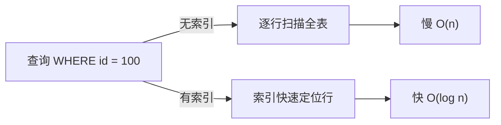
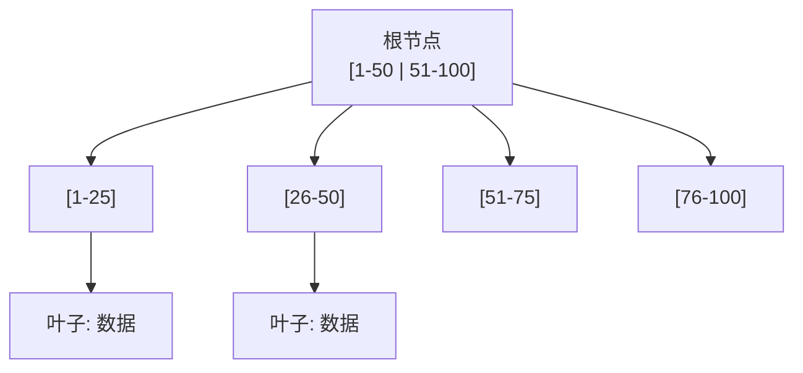
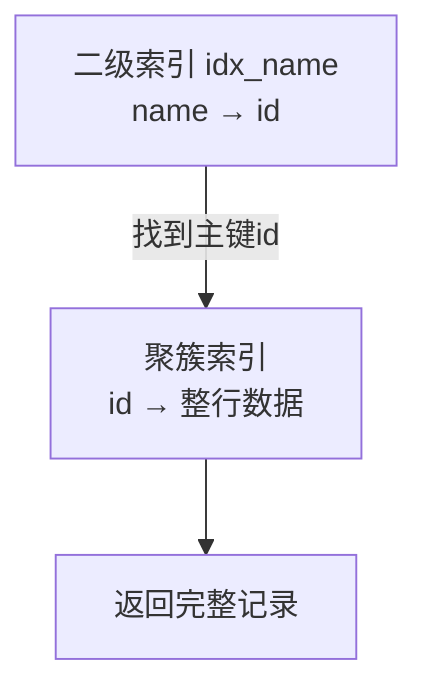

# 索引

索引是数据库表中的一种 **数据结构**，用来加速数据的查找。可以把它类比成书的目录：不翻全书就能快速定位到某章



## 1 底层数据结构：B+ 树

大多数关系型数据库（InnoDB、SQLite、PostgreSQL）的索引基于 **B+ 树**



**B+ 树特点**：

- 矮胖多叉 → 树的高度很低（千万级数据也就 3~4 层）
- 所有数据都存在 **叶子节点**，叶子之间用 **链表相连**（便于范围查询）
- 查找复杂度 $O(\log n)$，而全表扫描是 $O(n)$

某些场景（如 Memory 引擎、Redis）用 **哈希索引**：

| 索引类型 | 结构 | 优点 | 缺点 |
|----------|------|------|------|
| B+ 树 | 多叉平衡树 | 支持范围查询、排序 | 略慢于哈希 |
| 哈希 | 哈希表 | 等值查询极快 $O(1)$ | 不支持范围查询、排序 |

## 2 索引的类型

按功能分：

| 类型 | 说明 | 示例 |
|------|------|------|
| **主键索引** | 唯一标识每行，非空 | `PRIMARY KEY (id)` |
| **唯一索引** | 值不允许重复（可多个 NULL） | `UNIQUE INDEX (email)` |
| **普通索引** | 仅加速查询，无约束 | `INDEX (name)` |
| **联合索引** | 多个列组成一个索引 | `INDEX (a, b, c)` |
| **全文索引** | 文本搜索 | `FULLTEXT (content)` |

按存储方式分（InnoDB）：

| 类型 | 说明 |
|------|------|
| **聚簇索引** | 主键索引，叶子节点存 **整行数据**；一张表只有一个 |
| **二级索引** | 非主键索引，叶子节点存 **主键值**，查数据要"回表" |



## 3 索引如何工作

```sql
-- 假设有联合索引 INDEX (last_name, first_name)
SELECT * FROM users WHERE last_name = 'Zhang' AND first_name = 'San';
```

1. 数据库在 `(last_name, first_name)` 索引里按字典序查找
2. 找到 `('Zhang', 'San')` 对应的主键 id
3. 用主键 id 回表，取出完整行

## 4 最左前缀原则

联合索引 `INDEX (a, b, c)` 相当于建了三个索引：

- `(a)`
- `(a, b)`
- `(a, b, c)`

```sql
-- ✅ 能用到索引
WHERE a = 1
WHERE a = 1 AND b = 2
WHERE a = 1 AND b = 2 AND c = 3

-- ❌ 用不到（跳过了 a）
WHERE b = 2
WHERE c = 3
WHERE b = 2 AND c = 3
```

> **核心**：联合索引的列必须从最左边开始连续使用。所以设计联合索引时，把 **区分度高、常用作等值条件的列放最前面**

## 5 索引的优缺点

优点：

- 大幅提升查询速度
- 加速排序（ORDER BY）和分组（GROUP BY）
- 唯一索引保证数据唯一性

缺点（代价）：

- 占用磁盘空间
- **写入变慢**：每次 INSERT/UPDATE/DELETE 都要维护索引
- 索引过多会影响优化器选择，反而拖慢查询

!!! tip "什么情况不该建索引"

    | 场景 | 原因 |
    |------|------|
    | 表很小（几百行） | 全表扫描更快 |
    | 频繁更新、很少查询的列 | 维护成本高于收益 |
    | 区分度很低的列（如"性别"） | 索引无法有效过滤，命中率低 |
    | 大字段（长文本） | 索引体积巨大，通常用前缀索引代替 |
