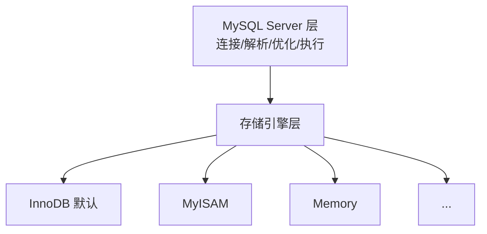
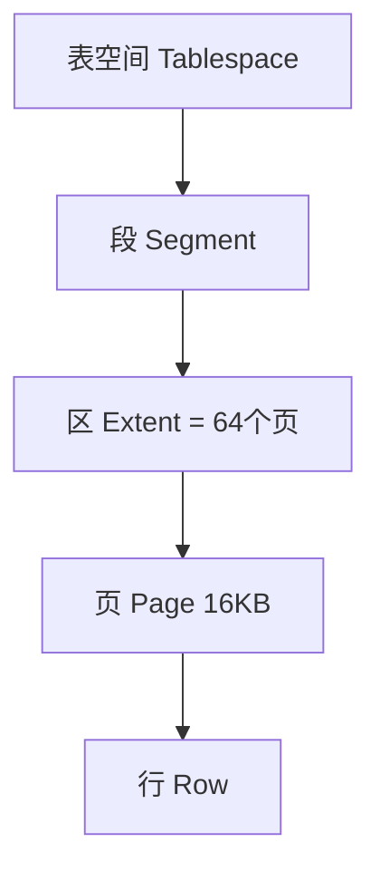
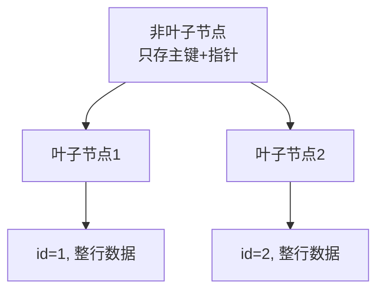
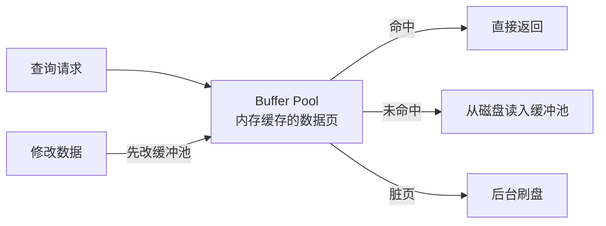
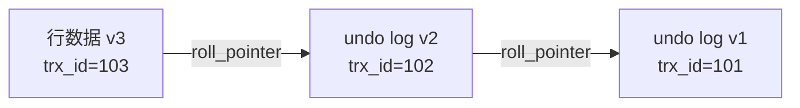

# InnoDB

**InnoDB 不是独立的数据库，而是 MySQL 的一种存储引擎**。MySQL 采用插件式存储引擎架构，同一张表可以用不同引擎存储数据，InnoDB 是自 MySQL 5.5 起的默认引擎



| 特性 | 说明 |
|------|------|
| **事务（ACID）** | 完整支持事务，保证原子性、一致性、隔离性、持久性 |
| **行级锁** | 锁粒度细，高并发写入不互相阻塞 |
| **MVCC** | 多版本并发控制，读不阻塞写 |
| **外键约束** | 支持外键，保证参照完整性 |
| **崩溃恢复** | 通过 redo log 保证数据不丢失 |
| **聚簇索引** | 主键索引和数据存储在一起 |

## 1 数据存储结构

### 1.1 页（Page）

InnoDB 以 **页（默认 16KB）** 为单位读写磁盘，是内存和磁盘交互的最小单位



### 1.2 聚簇索引（B+ 树）

InnoDB 的表数据本身就是一个 **B+ 树**，按主键组织：

- **叶子节点存整行数据**（不是指针）
- 没有显式主键时，InnoDB 会找唯一非空索引，否则生成隐藏的 `row_id`



### 1.3 二级索引与回表

非主键索引的叶子节点存的是 **主键值**，查到主键后还要去聚簇索引找整行，称为 **回表**

## 2 内存结构

InnoDB 最重要的内存区是 **Buffer Pool（缓冲池）**：



| 内存组件 | 作用 |
|----------|------|
| **Buffer Pool** | 缓存数据页和索引页，减少磁盘 IO（核心） |
| **Change Buffer** | 缓存二级索引的写操作，合并后批量更新 |
| **Log Buffer** | 暂存 redo log，刷到磁盘 |
| **Adaptive Hash Index** | 对热点数据自动建哈希索引加速 |

## 3 日志与崩溃恢复

InnoDB 通过 **redo log + undo log + binlog** 保证持久性和一致性：

| 日志 | 作用 | 类比 |
|------|------|------|
| **redo log** | 物理日志，记录"对哪个页做了什么修改"，用于 **崩溃恢复** | 记"草稿"，保证已提交不丢 |
| **undo log** | 逻辑日志，记录"修改前的值"，用于 **回滚 + MVCC** | 记"撤销"，保证能反悔 |
| **binlog** | Server 层日志，记录 SQL 语句，用于 **主从复制/数据恢复** | 记"流水账" |

!!! question "为什么需要 redo log（WAL 机制）"

    先写日志再写数据页（**Write-Ahead Logging**）：

    1. 事务提交时，先写 redo log
    2. 数据页之后由后台线程慢慢刷盘
    3. 若中途崩溃，重启后用 redo log **重放** 未刷盘的修改
    
    ```mermaid
    graph LR
        A[事务修改] --> B[写 redo log<br/>顺序写, 快]
        B --> C[返回提交成功]
        A --> D[改 Buffer Pool 中的脏页]
        D --> E[后台异步刷盘]
    ```

## 4 事务与隔离级别

InnoDB 支持四种隔离级别：

| 隔离级别 | 脏读 | 不可重复读 | 幻读 | 实现 |
|----------|------|-----------|------|------|
| READ UNCOMMITTED | ✅ | ✅ | ✅ | 无锁 |
| READ COMMITTED | ❌ | ✅ | ✅ | 每次读生成新 ReadView |
| **REPEATABLE READ（默认）** | ❌ | ❌ | ❌ | 事务级 ReadView + 间隙锁 |
| SERIALIZABLE | ❌ | ❌ | ❌ | 全加锁 |

> *InnoDB 在 RR 级别通过 **间隙锁（Gap Lock）** 基本解决了幻读

## 5 MVCC（多版本并发控制）

InnoDB 通过 **undo log + ReadView** 实现快照读，让读操作不加锁：

- 每行记录有隐藏字段：`trx_id`（事务ID）、`roll_pointer`（指向 undo log）
- 读时生成 ReadView，判断哪些版本对当前事务可见
- 不同事务看到不同版本，**互不阻塞**



## 6 锁机制

InnoDB 的锁：

| 锁类型 | 粒度 | 说明 |
|--------|------|------|
| **共享锁（S）** | 行 | 读锁，多个事务可同时持有 |
| **排他锁（X）** | 行 | 写锁，独占 |
| **意向锁（IS/IX）** | 表 | 表级，用于协调行锁和表锁 |
| **间隙锁（Gap Lock）** | 范围 | 锁住索引记录之间的间隙，防幻读 |
| **临键锁（Next-Key Lock）** | 行+间隙 | 默认的行锁形式 |

!!! tip "InnoDB vs MyISAM"

    | 维度 | InnoDB | MyISAM |
    |------|--------|--------|
    | 事务 | ✅ 支持 | ❌ 不支持 |
    | 锁粒度 | 行级锁 | 表级锁 |
    | 外键 | ✅ 支持 | ❌ 不支持 |
    | 崩溃恢复 | ✅ redo log | ❌ 易损坏 |
    | 全文索引 | 5.6+ 支持 | 支持（早期更强） |
    | 数据存储 | 聚簇索引（表数据+索引同文件） | 数据和索引分开（.MYD/.MYI） |
    | 适用 | 事务型、高并发业务 | 只读、日志、数据仓库（已边缘化） |
