# Anaconda

<!-- !!! tip "说明"

    本文档正在更新中…… -->

!!! info "AI 介绍"

    Anaconda 是一个广泛使用的 Python 和 R 语言的发行版本，主要用于数据科学、机器学习、深度学习等领域。它简化了包管理和部署的过程，使得用户能够更方便地安装、更新、组织各种用于数据分析和科学计算的库与工具

    Anaconda 发行版包括了 conda 这个开源的软件包管理系统和环境管理系统，通过它你可以轻松管理不同的软件包和版本，并且可以创建独立的运行环境来避免不同项目之间的依赖冲突。此外，Anaconda 还预装了许多流行的 Python 库，如 NumPy、Pandas、Matplotlib、Scikit-learn 等，这些库对于进行数据处理、分析以及可视化非常有用
    
    Anaconda 有 Anaconda Individual Edition（个人版）、Anaconda Distribution（分布版）等多个版本，支持 Windows、macOS 和 Linux 操作系统。无论是初学者还是专业人员，都可以利用 Anaconda 加速自己的数据分析或机器学习项目的进展

## 1 下载和安装

!!! info "说明"

    1. 本文档使用 Windows 系统进行演示
    2. 本文档使用 Anaconda3 2024.10-1 版本进行演示

### 1.1 下载

访问官网：[Download Now | Anaconda](https://www.anaconda.com/download/success){:target="_blank"}

<figure markdown="span">
  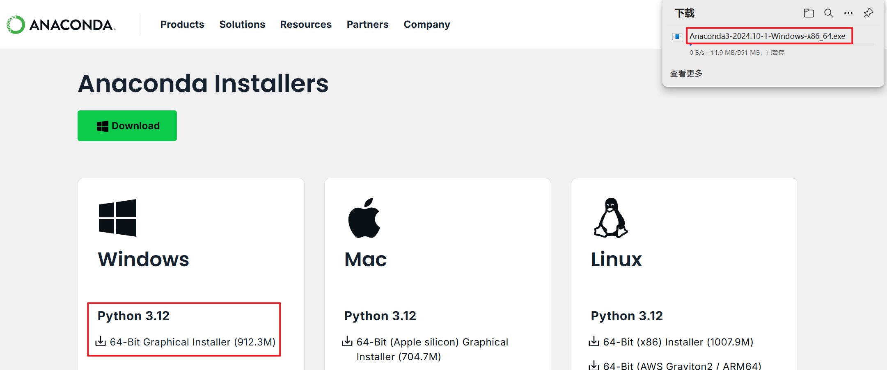{ width="600" }
</figure>

点击下载链接按钮，浏览器开始下载文件，接下来直接取消下载任务，只需要记住这个 `.exe` 的名字。因为从官网下载文件速度很慢很慢~

我们从国内清华大学开源软件镜像站进行下载：[清华大学开源软件镜像站](https://mirrors.tuna.tsinghua.edu.cn/anaconda/archive/){:target="_blank"}

使用浏览器搜索功能找到同名文件，进行下载

<figure markdown="span">
  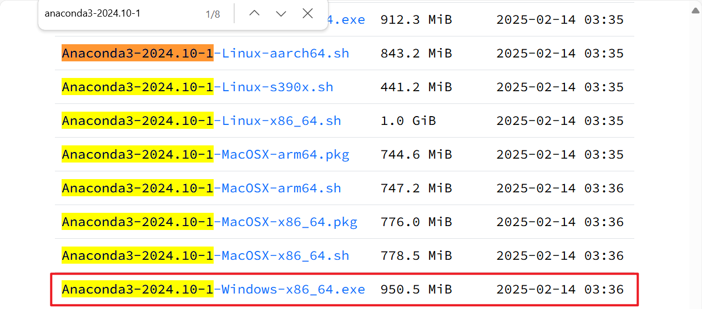{ width="600" }
</figure>

### 1.2 安装

双击运行下载的文件

<figure markdown="span">
  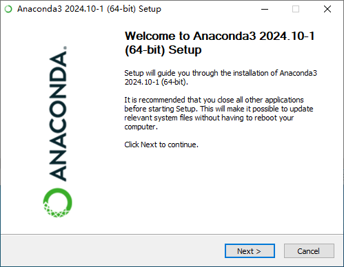{ width="600" }
</figure>

点击 Next

<figure markdown="span">
  { width="600" }
</figure>

点击 I Agree

<figure markdown="span">
  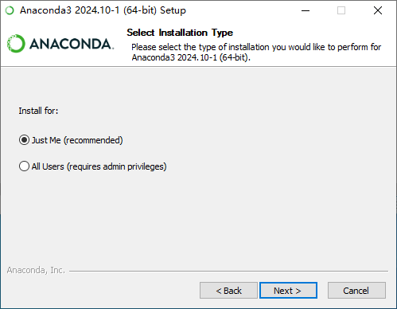{ width="600" }
</figure>

保持默认的 Just Me，点击 Next

<figure markdown="span">
  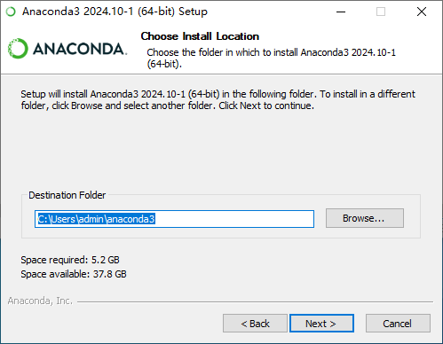{ width="600" }
</figure>

选择安装位置，==建议安装在非 C 盘目录下==，因为后续学习 Python 可能会安装一大堆的库，放 C 盘小心 C 盘爆炸

选择完成后，点击 Next

!!! info "说明"

    本节使用 Windows 虚拟机进行演示，就不更改安装位置了

<figure markdown="span">
  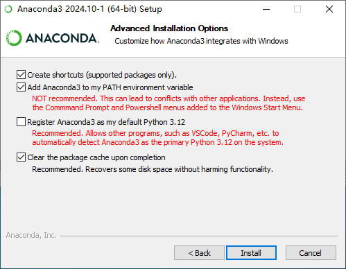{ width="600" }
</figure>

- [x] Create shortcuts：创建桌面快捷方式
- [x] Add Anaconda3 to my PATH environment variable：将 Anaconda 添加到环境变量当中。虽然官方不推荐，但是我觉得这样子用起来很方便
- [ ] Register Anaconda3 as my default Python 3.12：将 Anaconda 作为默认的 Python 3.12 环境。这个选不选问题都不大，我就不选了
- [x] Clear the package cache upon completion：安装完成后，清理缓存

点击 Install，安装完成后点击 Next

<figure markdown="span">
  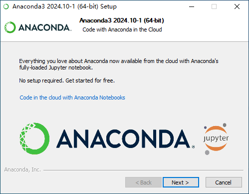{ width="600" }
</figure>

Anaconda 集成了 Jupyter，点击 Next

<figure markdown="span">
  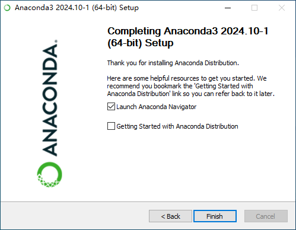{ width="600" }
</figure>

点击 Finish

验证 Anaconda 能够正常运行：

1. 快捷键 ++win+r++ 打开运行窗口
2. 输入 `cmd`，按回车 ++enter++，打开命令行窗口
3. 分别输入 `python` `conda`，按回车 ++enter++
4. 应该能够显示如下图所示的信息（没有正常显示的话，那就是 ^^Add Anaconda3 to my PATH environment variable^^ 选项没有勾选，当然问题不大，详见下文）

<figure markdown="span">
  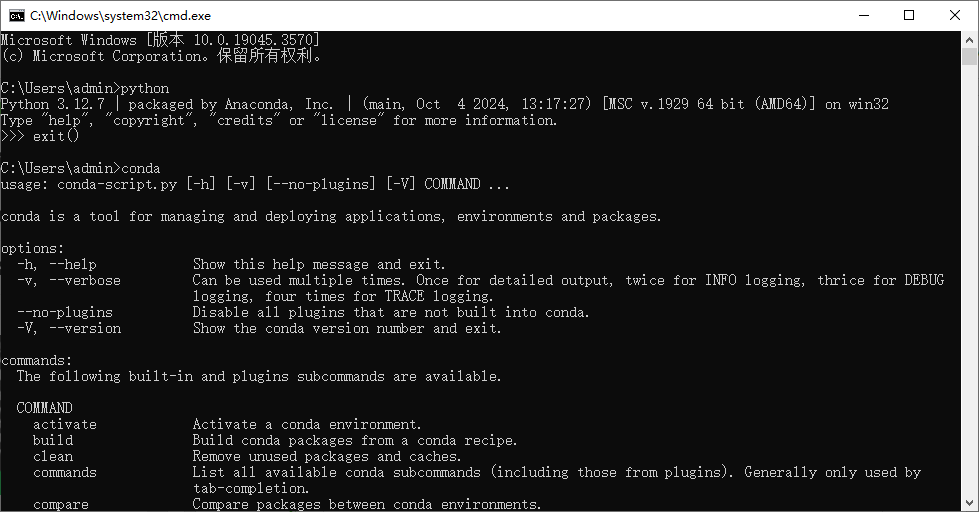{ width="600" }
</figure>

## 2 环境

<figure markdown="span">
  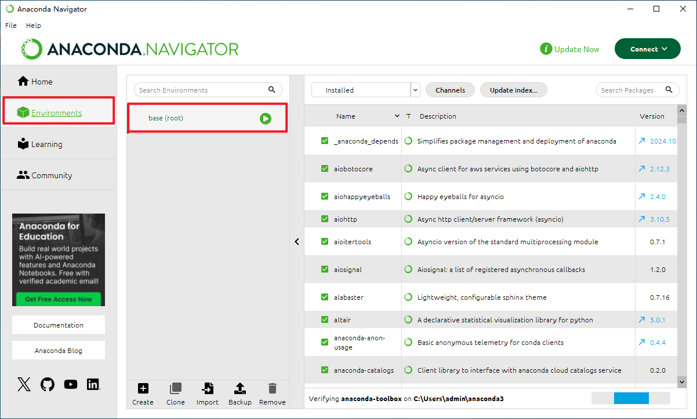{ width="800" }
</figure>

我们打开 Anaconda Navigator 软件，切换到 Environments 面板，可以看到有一个 base 环境

在 Anaconda 中，base 环境（也称为 root 环境） 是 Anaconda 安装时自动创建的默认环境，类似于操作系统中的“主目录”或“根目录”。它是所有其他 Conda 环境的起点，包含 Anaconda 自带的 Python 解释器、核心工具（如 conda、pip）和基础科学计算库（如 NumPy、Pandas）

==避免在 base 环境中直接工作==，也就是说，不要去动这个 base 环境

### 2.1 创建环境

<figure markdown="span">
  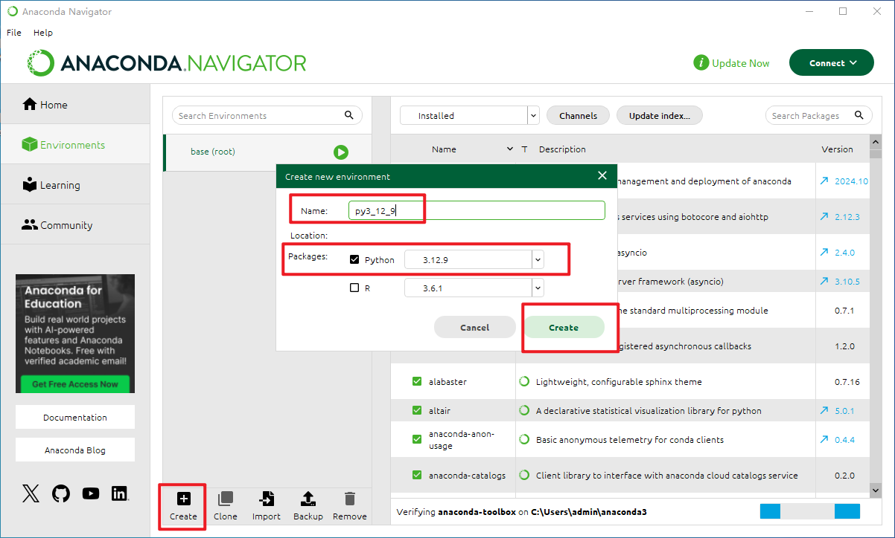{ width="800" }
</figure>

在 Anaconda Navigator 中，可以直接使用 UI 来进行相应的操作，点击下方的 Create 按钮来创建一个环境，比如命名为 `py3_12_9`，选择 Python 版本为 3.12.9，点击 Create

或者在 `cmd` 中，输入指令：`conda create -n py3_12_9 python=3.12.9`（前提是勾选了 ^^Add Anaconda3 to my PATH environment variable^^ 选项）

> 也就是说，如果没有勾选 ^^Add Anaconda3 to my PATH environment variable^^ 选项，你只能在 Anaconda Navigator 当中进行操作

??? question "如何添加 Anaconda 到环境变量"

    <figure markdown="span">
      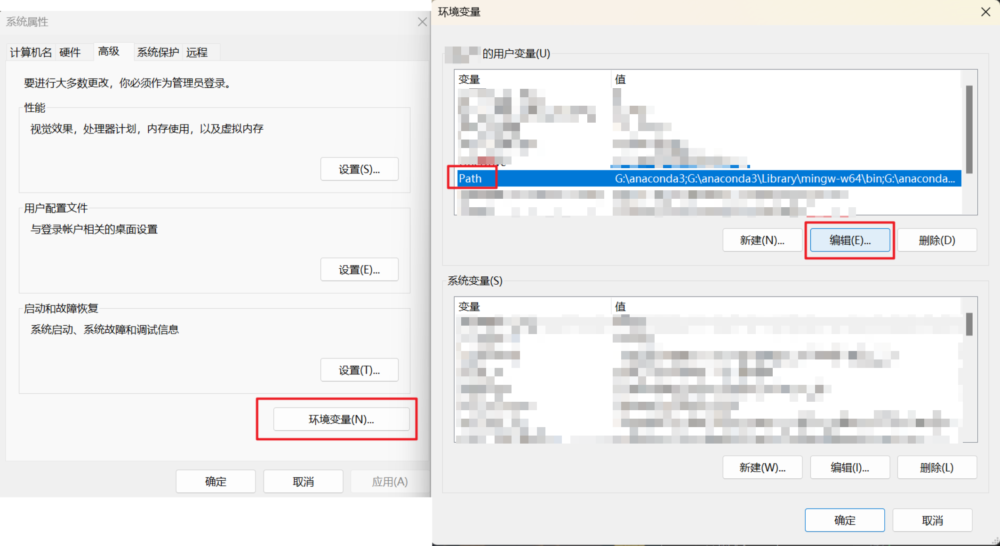{ width="800" }
    </figure>

    在设置中搜索环境变量，打开电脑的环境变量设置，点击用户变量下的 Path，点击编辑，添加以下路径（具体路径根据安装时设置的路径来填）

    > 这里我回到我的本地电脑做演示了，我安装的时候安装到了 G 盘

    ```text linenums="1"
    G:\anaconda3
    G:\anaconda3\Library\mingw-w64\bin
    G:\anaconda3\Library\usr\bin
    G:\anaconda3\Library\bin
    G:\anaconda3\Scripts
    ```

    <figure markdown="span">
      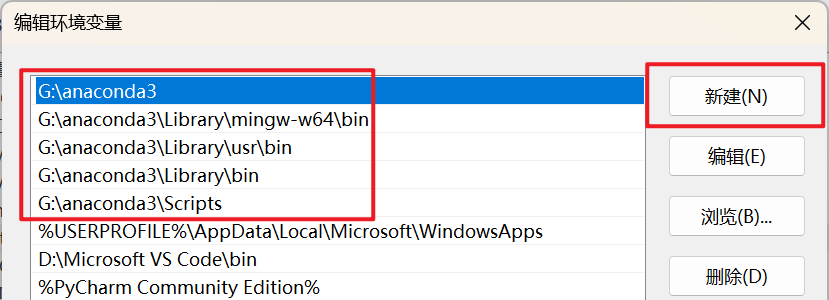{ width="600" }
    </figure>

    完成后，一路点击确定按钮

### 2.2 环境使用

==避免在 base 环境中直接工作==

干什么事情，就创建什么专用的环境，比如：

- 你在使用 pytorch，就创建一个环境用于 pytorch
- 你在使用 MkDocs，就创建一个环境用于 MkDocs
- 你在使用 PaddlePaddle，就创建一个环境用于 PaddlePaddle

不要嫌麻烦，这样的好处是

1. 不同的项目使用不同的环境，不同的 python 版本
2. 不同环境之间不会相互干扰
3. 不同环境中安装的库不会相互干扰

## 3 安装库

可以在 Anaconda Navigator 中，==选择对应的环境==，在右侧搜索安装需要的库。这个库只会安装到选择的环境当中，不会干扰其他环境

> 有些库在 Anaconda Navigator 中搜索不到，就只能在 `cmd` 中安装

或者在 `cmd` 中：

1. `conda activate my_env`：先启动对应的环境
2. `pip install ...` 或 `conda install ...`：在这个环境中安装对应的库，使用 `pip` 或 `conda` 都是可以的

!!! tip "pip 安装很慢"

    我们可以增加国内源到 pip 的包源（pip 默认从 PyPI 下载包，但也可以配置使用其他的包源），在 `cmd` 中运行以下命令

    ```powershell linenums="1" title="升级 pip 到最新的版本"
    python -m pip install --upgrade pip
    ```

    如果升级的时候安装也很慢

    ```powershell linenums="1" title="临时使用国内镜像站来升级 pip"
    python -m pip install -i https://mirrors.tuna.tsinghua.edu.cn/pypi/web/simple --upgrade pip
    ```

    配置国内镜像站为默认

    ```powershell linenums="1"
    pip config set global.index-url https://mirrors.tuna.tsinghua.edu.cn/pypi/web/simple
    ```

!!! tip "conda 安装很慢"

    我们可以增加国内源到 conda 的通道（通道是 conda 用来查找和安装软件包的仓库），在 `cmd` 中运行这两行命令

    ```powershell linenums="1"
    conda config --add channels https://mirrors.tuna.tsinghua.edu.cn/anaconda/pkgs/free/
    conda config --set show_channel_urls yes
    ```

    此后，conda 优先使用 `https://mirrors.tuna.tsinghua.edu.cn/anaconda/pkgs/free/` 来下载库

    ```powershell linenums="1" title="显示当前 conda 配置中设置的所有通道"
    C:\Users\admin> conda config --show channels
    channels:
      - https://mirrors.tuna.tsinghua.edu.cn/anaconda/pkgs/free/
      - defaults
      - ...
    ```

    conda 会从上到下逐一尝试这些通道来下载库
