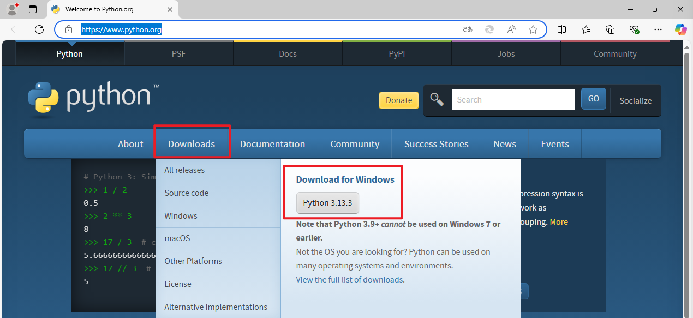
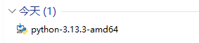
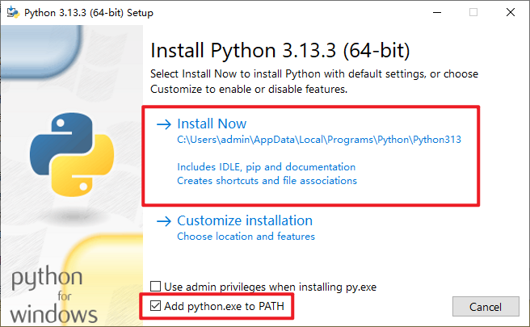
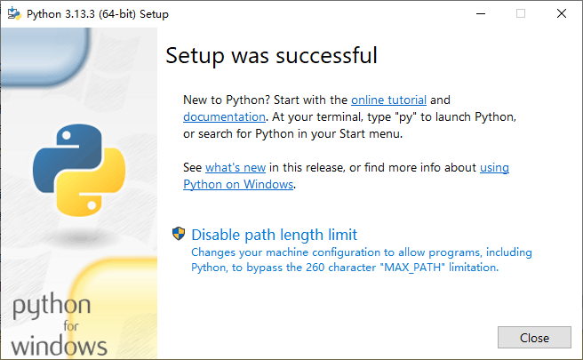
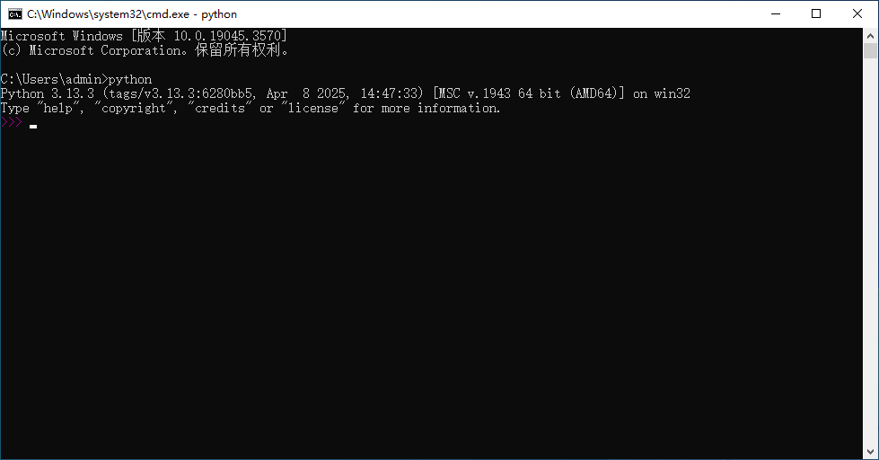

# 0 Python 环境及编辑器

<!-- !!! tip "说明"

    本文档正在更新中…… -->

## 0.1 Python 环境

想要学习 Python 的同学，建议去了解并使用 Anaconda

[Anaconda 教程](../anaconda.md){:target="_blank"}

!!! tip "下载 Python 还是 Anaconda"

    有选择困难症？==只要你想学习 Python，那就安装 Anaconda，否则安装 Python==

    1. 直接下载 Python
          1. 适合场景
              1. 你只需要 Python 解释器和基础功能
              2. 你希望手动管理包（用 pip 安装库）
              3. 你从事小型项目、脚本开发或学习基础 Python
          2. 缺点
              1. 需要手动安装和管理第三方库（如 NumPy、Pandas 等）
              2. 不同项目可能需要不同版本的库，容易造成冲突（需配合 venv 或 virtualenv 使用）
    2. 下载 Anaconda
          1. 适合场景
              1. 你从事数据分析、机器学习、科学计算（Anaconda 预装了 1500+ 常用库，如 NumPy、Pandas、SciPy、Matplotlib、Jupyter 等）
              2. 你需要方便的环境管理（用 conda 创建隔离环境，避免库冲突）
              3. 你使用 Jupyter Notebook、Spyder 等工具（Anaconda 已集成）
              4. 你希望一键安装，省去手动配置的麻烦
    3. 折中方案：Miniconda
          1. 如果你想要 Anaconda 的环境管理功能，但不想安装庞大的预装库，可以选择 Miniconda：仅包含 Python + Conda（环境管理工具），其他库按需安装

!!! info "说明"

    1. 本文档使用 Windows 系统进行演示
    2. 本文档使用 Python 3.13.3 版本进行演示

下载 Python：[Welcome to Python](https://www.python.org/){:target="_blank"}

<figure markdown="span">
  { width="600" }
</figure>

点击 ^^Python 3.13.3^^ 按钮下载 Python

<figure markdown="span">
  { width="300" }
</figure>

双击运行下载的文件

<figure markdown="span">
  { width="600" }
</figure>

1. 勾选下方 ^^Add python.exe to PATH^^ 选项
2. 选择上方 ^^Install Now^^ 按钮，进行默认安装
3. 等待安装完成

<figure markdown="span">
  { width="600" }
</figure>

1. 接下来可能会在下方出现 ^^Disable path length limit^^ 的选项，鼠标左键点一下，将其点消失
2. 之后点击 Close 按钮，安装完成

验证 Python 能够正常运行：

1. 快捷键 ++win+r++ 打开运行窗口
2. 输入 `cmd`，按回车 ++enter++，打开命令行窗口
3. 输入 `python`，按回车 ++enter++
4. 应该能够显示如下图所示的信息

<figure markdown="span">
  { width="600" }
</figure>

## 0.2 编辑器

1. PyCharm：专门用于编辑 Python 的 IDE（集成开发环境）
2. VS Code：支持多种语言的文本编辑器

### PyCharm

参考文档：[（超详细）Python+PyCharm的安装步骤及PyCharm的使用（含快捷键）](https://blog.csdn.net/junleon/article/details/120698578){:target="_blank"}

配置解释器：[在PyCharm中给项目配置python解释器](https://blog.csdn.net/qq_42432673/article/details/108440370){:target="_blank"} 或配置 conda 解释器：[【写给小白】Anaconda+Pycharm保姆级环境搭建教程（2024年最新）](https://blog.csdn.net/weixin_45242930/article/details/135356097){:target="_blank"}

### VS Code

[VS Code 教程](../../../application/vscode/index.md){:target="_blank"}

在 vscode 中编辑并运行 Python 文件：[使用vscode编写、运行Python程序](https://blog.csdn.net/zhangkai950121/article/details/117395333){:target="_blank"}

## 0.3 安装库

1. pip 安装
2. conda 安装（需安装 Anaconda）

最好是根据你要安装的那个库来搜索教程，例如要安装 matplotlib 库，就搜索“matplotlib 安装”等关键词即可
