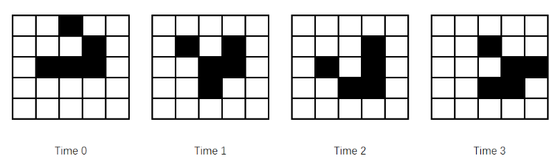

# 4 列表

<!-- !!! tip "说明"

    本文档正在更新中…… -->

## 4.1 列表数据类型

**列表** 是一个值，包含由多个值构成的序列。**列表值** 指的是列表本身。列表以左方括号开始，以右方括号结束，即 `[]`。列表中的值也称为 **表项**，表项用逗号分隔

```python
>>> [1, 2, 3]
[1, 2, 3]
>>> ['cat', 'dog']
['cat', 'dog']
>>> ['hello', 3.14, True, None]
['hello', 3.14, True, None]
>>> spam = ['hello', 3.14, True, None]  # 将列表值赋给变量
>>> spam
['hello', 3.14, True, None]
```

空列表：`[]`，不包含任何值

### 4.1.1 索引

假定列表 `['cat', 'bat', 'rat', 'elephant']` 保存在名为 `spam` 的变量中

1. `spam[0] = 'cat'`
2. `spam[1] = 'bat'`
3. `spam[2] = 'rat'`
4. `spam[3] = 'elephant'`

```python
>>> spam = ['cat', 'bat', 'rat', 'elephant']
>>> spam[0]
'cat'
>>> ['cat', 'bat', 'rat', 'elephant'][3]
'elephant'
>>> 'Hello' + spam[0]
'Hello, cat'
```

索引只能是整数，不能是浮点数

列表也可以包含其他列表值，这些列表值中的值可以通过多重索引来访问

```python
>>> spam = [['cat', 'rat'], [10, 20, 30]]
>>> spam[0]
['cat', 'rat']
>>> spam[0][1]
'rat'
>>> spam[1][1]
20
```

### 4.1.2 负数索引

整数值 `-1` 表示列表中最后一个索引，`-2` 表示列表中倒数第二个索引

```python
>>> spam = ['cat', 'bat', 'rat', 'elephant']
>>> spam[-1]
'elephant'
>>> spam[-3]
'bat'
```

### 4.1.3 切片

**切片** 可以从列表中取得多个值，结果是一个新列表。切片用一对方括号来表示它的起止，有两个由冒号分隔的整数

在一个切片中，第一个整数是切片开始处的索引，第二个整数是切片结束处的索引。切片向上增长，直至第二个索引的值，但不包括它，==即左闭右开==

```python
>>> spam = ['cat', 'bat', 'rat', 'elephant']
>>> spam[0:4]
['cat', 'bat', 'rat', 'elephant']
>>> spam[1:3]
['bat', 'rat']
>>> spam[0:-1]
['cat', 'bat', 'rat']
```

可以省略冒号两边的一个索引或两个索引

1. 省略第一个索引相当于切片从头开始
2. 省略第二个索引相当于切片直至末尾结束（包括最后一个值）
3. 两个都省略相当于取列表的全部

```python
>>> spam = ['cat', 'bat', 'rat', 'elephant']
>>> spam[:2]
['cat', 'bat']
>>> spam[1:]
['bat', 'rat', 'elephant']
>>> spam[:]
['cat', 'bat', 'rat', 'elephant']
```

### 4.1.4 用 `len()` 函数取得列表的长度

`len()` 函数返回传递给它的列表中值的个数

```python
>>> spam = ['cat', 'bat', 'rat', 'elephant']
>>> len(spam)
4
```

### 4.1.5 用索引改变列表中的值

```python
>>> spam = ['cat', 'bat', 'rat', 'elephant']
>>> spam[1] = 'aardvark'
>>> spam
['cat', 'aardvark', 'rat', 'elephant']
>>> spam[2] = spam[1]
>>> spam
['cat', 'aardvark', 'aardvark', 'elephant']
>>> spam[-1] = 10086
['cat', 'aardvark', 'aardvark', 10086]
```

### 4.1.6 列表连接和列表复制

`+` 操作符可以连接两个列表，得到一个新列表。`*` 操作符可以用于一个列表和一个整数，实现列表的复制

```python
>>> [1, 2, 3] + ['a', 'b']
[1, 2, 3, 'a', 'b']
>>> [1, 2] * 3
[1, 2, 1, 2, 1, 2]
```

### 4.1.7 用 `del` 语句从列表中删除值

`del` 语句将删除列表中索引处的值，列表中被删除后面的所有值，都将向前移动一个索引

```python
>>> spam = ['cat', 'bat', 'rat', 'elephant']
>>> del spam[2]
>>> spam
['cat', 'bat', 'elephant']
>>> del spam[2]
>>> spam
['cat', 'bat']
```

`del` 语句也可用于一个简单变量，删除它，起“取消赋值”语句的作用。如果在删除之后试图使用该变量，就会遇到 NameError 错误，因为该变量已不存在

## 4.2 使用列表

```python linenums="1" title="allMyCats2.py"
cat_name= []
while True:
    print(f'Enter the name of cat {len(cat_name) + 1} (Or enter nothing to stop.):')
    name = input()
    if name == '':
        break
    cat_name = cat_name + [name]  # 向列表中添加值
print('The cat names are:')
for name in cat_name:  # 遍历列表中的值
    print(f'  {name}')
```

### 4.2.1 列表用于循环

一个常见的 Python 技巧是，在 `for` 循环中使用 `range(len(some_list))`，迭代列表的每一个索引

```python
>>> supplies = ['pens', 'staplers', 'flame-throwers', 'binder']
>>> for i in range(len(supplies)):
...    print(f'Index {i} in supplies is {supplies[i]}')
Index 0 in supplies is pens
Index 1 in supplies is staplers
Index 2 in supplies is flame-throwers
Index 3 in supplies is binder
```

### 4.2.2 `in` 和 `not in` 操作符

利用 `in` 和 `not in` 操作符，可以确定一个值是否在列表中。这两个操作符用于连接两个值：一个是要在列表中查找的值，另一个是待查找的列表。这些表达式求值为布尔值

```python
>>> 'howdy' in ['hello', 'hi', 'howdy']
True
>>> spam = ['hello', 'hi', 'howdy']
>>> 'cat' in spam
False
>>> 'howdy' not in spam
False
>>> 'cat' not in spam
True
```

### 4.2.3 多重赋值技巧

变量的数目和列表的长度必须严格相等

```python
>>> cat = ['fat', 'black', 'loud']
>>> size, color, disposition = cat
```

### 4.2.4 `enumerate()` 函数与列表一起使用

`enumerate()` 函数将返回两个值：列表中表项的索引和列表中的表项本身

```python
>>> supplies = ['pens', 'staplers', 'flame-throwers', 'binder']
>>> for index, item in enumerate(supplies):
...    print(f'Index {index} in supplies is {item}')
Index 0 in supplies is pens
Index 1 in supplies is staplers
Index 2 in supplies is flame-throwers
Index 3 in supplies is binder
```

### 4.2.5 `random.choice()` 和 `random.shuffle()` 函数与列表一起使用

`random.choice()` 将从 列表中返回一个随机选择的表项

`random.shuffle()` 将对列表中的表项重新排序。该函数就地修改列表，而不是返回新列表

```python
>>> import random
>>> people = ['Alice', 'Bob', 'Carol', 'David']
>>> random.shuffle(people)
>>> people
['Carol', 'David', 'Bob', 'Alice']
>>> random.shuffle(people)
>>> people
['Carol', 'Bob', 'David', 'Alice']
```

## 4.3 增强的赋值操作

```python
>>> spam = 42
>>> spam = spam + 1
>>> spam
43
```

可以用增强的赋值操作符 `+=` 来完成同样的事：

```python
>>> spam = 42
>>> spam += 1
>>> spam
43
```

| 增强的赋值语句 | 等价的赋值语句 |
| :--: | :--: |
| `spam += 1` | `spam = spam + 1` |
| `spam -= 1` | `spam = spam - 1` |
| `spam *= 1` | `spam = spam * 1` |
| `spam /= 1` | `spam = spam / 1` |
| `spam %= 1` | `spam = spam % 1` |

`+=` 操作符可以完成字符串和列表的连接，`*=` 操作符可以完成字符串和列表的复制

## 4.4 方法

**方法** 和函数是一回事，只是它在一个值上进行调用。方法跟在要调用的值后面，以一个圆点分隔

### 4.4.1 用 `index()` 方法在列表中查找值

`index()` 方法可以传入一个值：如果该值存在于列表中，就返回它的索引；如果该值不在列表中，Python 就报 ValueError 错误

```python
>>> spam = ['hello', 'hi', 'howdy', 'heyas']
>>> spam.index('hello')
0
>>> spam.index('heyas')
3
>>> spam.index('howdy howdy')
# ValueError: 'howdy howdy' is not in list
```

如果列表中存在重复的值，就返回它第一次出现的索引

```python
>>> spam = ['hello', 'hi', 'howdy', 'heyas', 'hello']
>>> spam.index('hello')
0  # 返回 1，而不是 3
```

### 4.4.2 用 `append()` 和 `insert()` 方法在列表中添加值

`append()` 可将参数添加到列表末尾

`insert()` 可以在列表任意索引处插入一个值。第一个参数是新值的索引，第二个参数是要插入的新值

```python
>>> spam = ['cat', 'dog', 'bat']
>>> spam.insert(1, 'chicken')
>>> spam
['cat', 'chicken', 'dog', 'bat']
```

实际上，`spam.append()` 和 `spam.insert()` 的返回值是 `None`

方法属于单个数据类型。`append()` 和 `insert()` 方法是列表方法，只能在列表上调用，不能在其他值上调用

### 4.4.3 用 `remove()` 方法从列表中删除值

给 `remove()` 方法传入一个值，它将从被调用的列表中删除

```python
>>> spam = ['cat', 'bat', 'rat', 'elephant']
>>> spam.remove('bat')
>>> spam
['cat', 'rat', 'elephant']
```

如果该值在列表中出现多次，只有第一次出现的值会被删除

!!! tip "从列表中删除值"

    1. `del`：得知删除的值的索引
    2. `remove()`：得知删除的值

### 4.4.4 用 `sort()` 方法将列表中的值排序

```python
>>> spam = [2, 5, 3.14, -7]
>>> spam.sort()
>>> spam
[-7, 2, 3.14, 5]
>>> spam = ['ants', 'cats', 'dogs']
>>> spam.sort()
>>> spam
['ants', 'cats', 'dogs']
```

也可以指定 `reverse` 关键字参数为 `True`，让 `sort()` 方法按逆序排序

```python
>>> spam = ['ants', 'cats', 'dogs']
>>> spam.sort(reverse=True)
>>> spam
['dogs', 'cats', 'ants']
```

1. `sort()` 方法就地对列表排序
2. 不能对既有数字又有字符串值的列表排序
3. `sort()` 方法对字符串排序时，使用“ASCII 字符顺序”，而不是实际的字典顺序。这意味着大写字母排在小写字母之前
      1. 如果需要按照普通的字典顺序来排序，就在调用 `sort()` 方法时，将关键字参数 `key` 设置为 `str.lower`。这将导致 `sort()` 方法将列表中所有的表项当成小写，但实际上并不会改变它们在列表中的值

```python
>>> spam = ['Alice', 'ants', 'Bob', 'badgers', 'Carol', 'cats']
>>> spam.sort()
>>> spam
['Alice', 'Bob', 'Carol', 'ants', 'badgers', 'cats']

>>> spam = ['a', 'Z', 'A', 'z']
>>> spam.sort(key=str.lower)
>>> spam
['a', 'A', 'Z', 'z']
```

### 4.4.5 用 `reverse()` 方法反转列表中的值

该方法反转列表中项目的顺序

```python
>>> spam = ['cat', 'dog', 'moose']
>>> spam.reverse()
>>> spam
['moose', 'dog', 'cat']
```

!!! tip "Python 中缩进规则的例外"

    在大多数情况下，代码行的缩进告诉 Python 它属于哪一个代码块。但是，这个规则有几个例外。例如在源代码文件中，列表实际上可以跨越几行。这些行的缩进不重要，Python 知道，没有看到结束方括号，列表就没有结束

    ```python linenums="1"
    spam = ['apples',
        'oranges',
                    'bananas',
    'cats']
    print(spam)
    ```

    从实践的角度来说，可以利用这一 Python 行为让列表看起来更美观且可读

    也可以在行末使用续行字符 `\` 将一条指令写成多行，对于 `\` 续行字符之后的一行，缩进并不重要

    ```python linenums="1"
    print('Four score and seven ' + \
        'years age...')
    ```

## 4.6 序列数据类型

Python 序列数据类型包括：

1. 列表
2. 字符串
3. 由 `range()` 返回的范围对象
4. 元组

对列表的许多操作，也可以用于其他序列数据类型当中

```python
>>> name = 'Zophie'
>>> name[0]
'Z'
>>> name[-2]
'i'
>>> name[:4]
'Zoph'
>>> 'Zo' in name
True
>>> 'z' in name
False
>>> 'p' not in name
False
>>> for i in name:
...    print(f'* * * {i} * * *')
* * * Z * * *
* * * o * * *
* * * p * * *
* * * h * * *
* * * i * * *
* * * e * * *
```

### 4.6.1 可变和不可变数据类型

列表是 **可变的** 数据类型，它的值可以添加、删除或改变

字符串是 **不可变的** 数据类型，它不能被更改

```python
>>> name = 'Zophie a cat'
>>> name[7] = 'the'
# TypeError: 'str' object does not support item assignment
```

“改变”一个字符串的正确方式：

```python
>>> name = 'Zophie a cat'
>>> name = f'{name[:7]}the{name[8:]}'  # 实际上，这称为变量的覆写
>>> name
'Zophie the cat'
```

```python
>>> eggs = [1, 2, 3]
>>> eggs = [4, 5, 6]  # 实际上，这称为变量的覆写，并不能说明列表是可变
>>> eggs
[4, 5, 6]
>>> eggs = [1, 2, 3]
>>> del eggs[2]
>>> del eggs[1]
>>> del eggs[0]
>>> eggs.append(4)
>>> eggs.append(5)
>>> eggs.append(6)  # 这才能说明列表是可变的
>>> eggs
[4, 5, 6]
```

### 4.6.2 元组数据类型

元组和列表相似，除了两个方面：

1. 元组使用 `()`
2. 元组是不可变的

```python
>>> eggs = ('hello', 42, 0.5)
>>> eggs[0]
'hello'
>>> eggs[1:3]
(42, 0.5)
>>> len(eggs)
3
```

==如果元组只有一个值，必须在括号内该值的后面跟上一个括号==，否则，Python 认为你只是在一个普通括号内输入了一个值。逗号告诉 Python，这是一个元组

使用 `type()` 函数可以查看值或变量的类型

```python
>>> type(('hello', ))
<class 'tuple'>
>>> type(('hello'))
<class 'str'>
```

如果需要一个永远不会改变值的序列，就使用元组

使用元组的优点之一是，因为它们是不可变的，所以 Python 可以实现一些优化，让使用元组的代码的运行速度比使用列表的代码更快

### 4.6.3 用 `list()` 和 `tuple()` 函数来转换类型

```python
>>> tuple(['cat', 'dog', 5])
('cat', 'dog', 5)
>>> list(('cat', 'dog', 5))
['cat', 'dog', 5]
>>> list('hello')
['h', 'e', 'l', 'l', 'o']
```

如果需要元组值得有一个可变版本，将元组转换成列表就很方便

## 4.7 引用

变量“保存”字符串和整数值，但是，实际上，变量存储的是对计算机内存位置得引用，这些位置存储了这些值

```python
>>> spam = 42
>>> cheese = spam
>>> spam = 100
>>> spam
100
>>> cheese
42
```

将 `42` 赋给 `spam` 变量时，实际上是在计算机内存中创建值 `42`，并将对它得“引用”存储在 `spam` 变量中。当复制 `spam` 变量中的值，并将它赋给 `cheese` 变量时，实际上是在复制引用。`spam` 和 `cheese` 变量均指向计算机内存中的值 `42`。接着，将 `spam` 变量中的值更改为 `100` 时，实际上是创建了一个新的值 `100`，并将它的引用存储在 `spam` 变量中。这不会影响 `cheese` 变量的值

整数是“不变的”值，它们不会改变；更改 `spam` 变量实际上是让它引用内存中完全不同的值

但列表是可变的，因此

```python
>>> spam = [0, 1, 2, 3]
>>> cheese = spam
# 将 spam 中的引用复制到 cheese
# cheese 和 spam 现在同时指向同一个列表
>>> cheese[1] = 'Hello'
# 改变 cheese 就改变了列表值
# 而这个列表值也是 spam 所指的
>>> spam
[0, 'Hello', 2, 3]
>>> cheese
[0, 'Hello', 2, 3]
```

### 4.7.1 标识和 `id()` 函数

Python 中的所有值都有一个唯一的标识，通过 `id()` 函数可以获得该标识

```python
>>> id('Howdy')
2143988223792
```

当运行 `id('Howdy')` 时，Python 会在计算机的内存中创建 `'Howdy'` 字符串，`id()` 函数返回存储字符串的数字内存地址

<div class="grid" markdown>

```python
>>> bacon = 'Hello'
>>> id(bacon)
2143988473728
>>> bacon += ' world'
# 更改字符串值，相当于在内存中的其他位置创建新的字符串对象，并将引用赋给 bacon 变量
>>> id(bacon)
2143987780272  # id 值改变
```

```python
>>> eggs = ['cat', 'dog']
>>> id(eggs)
2143985652224
>>> eggs.append('moose')
>>> id(eggs)
2143985652224  # id 值没有改变
>>> eggs = ['bat']
>>> id(eggs)  # 这个上文提到过，相当于变量的覆写
2143985652032  # id 值改变
```

</div>

Python 的“自动垃圾收集器”会删除任何变量未引用的值，以释放内存

### 4.7.2 传递引用

当函数被调用时，参数的值也就是引用被复制给变元。要注意以下情况：

<div class="grid" markdown>

```python linenums="1"
def eggs(list):
    list.append('Hello')


spam = [1, 2, 3]
eggs(spam)
print(spam)
```

```python title="output"
[1, 2, 3, 'Hello']
```

```python linenums="1"
def eggs(list):
    list = ['Hello']


spam = [1, 2, 3]
eggs(spam)
print(spam)
```

```python title="output"
[1, 2, 3]
```

</div>

### 4.7.3 copy 模块的 `copy()` 和 `deepcopy()` 函数

像上面的情况一样，函数可能会修改传入的列表或字典（字典也是可变数据类型）。`copy.copy()` 函数可以用来复制列表或字典，而不只是复制引用

```python
>>> import copy
>>> spam = [1, 2, 3]
>>> id(spam)
2143987780608
>>> cheese = copy.copy(spam)
>>> id(cheese)
2143989703232  # id 值不同
>>> cheese[1] = 42
>>> cheese
[1, 42, 3]
>>> spam
[1, 2, 3]
```

如果要复制的列表中包含了列表，那就使用 `copy.deepcopy()`，它会同时复制内部的列表

## 4.8 小程序：Conway 的生命游戏

该游戏在一个二维网格上进行，每个格子代表一个细胞，可以处于两种状态之一：存活或死亡。细胞的状态根据以下简单规则逐代演化：

1. 孤独死亡：如果一个存活的细胞周围少于两个存活的邻居细胞，则该细胞在下一代会变成死亡状态
2. 生存：如果一个存活的细胞周围有两到三个存活的邻居细胞，则该细胞保持存活状态
3. 过度拥挤死亡：如果一个存活的细胞周围有超过三个存活的邻居细胞，则该细胞在下一代会变成死亡状态
4. 繁殖：如果一个死亡的细胞周围恰好有三个存活的邻居细胞，则该细胞在下一代会变成存活状态

<figure markdown="span">
  { width="600" }
</figure>

我们可以用列表的列表来表示二维的空间。内部列表表示方块的每一列，对于活的方块，存储一个 `'#'` 字符串，对于死的方块，存储一个 `' '` 空格字符串

```python title="conway.py" linenums="1"
import copy
import random
import time

# 定义网络的宽度和高度，可以修改这些值以改变网格的大小
WIDTH = 6
HEIGHT = 6

next_cells = []  # 二维列表
# 随机初始化细胞状态
for x in range(WIDTH):
    column = []  # 创建一个新列
    for y in range(HEIGHT):
        if random.randint(0, 1) == 0:  # 50% 的概率
            column.append('#')  # 添加一个活细胞
        else:
            column.append(' ')  # 添加一个死细胞
    next_cells.append(column)  # next_cells 是一个包含 WIDTH 个列表的列表

while True:  # 主程序循环
    print('\n\n\n\n\n')  # 分隔每一代
    current_cells = copy.deepcopy(next_cells)  # 复制 next_cells 列表到 current_cells
    # 打印 current_cells 列表
    for y in range(HEIGHT):
        for x in range(WIDTH):
            print(current_cells[x][y], end='')
        print()  # 在一行的末尾打印一个换行符

    # 计算下一代的细胞
    for x in range(WIDTH):
        for y in range(HEIGHT):
            # 获取周围细胞的坐标
            left_coord = (x - 1) % WIDTH  # % WIDTH 保证坐标在网格内，即 0 到 WIDTH - 1 之间
            right_coord = (x + 1) % WIDTH
            above_coord = (y - 1) % HEIGHT
            below_coord = (y + 1) % HEIGHT

            # 计算周围细胞的数量
            num_neighbors = 0
            if current_cells[left_coord][above_coord] == '#':  # 左上角的细胞
                num_neighbors += 1
            if current_cells[x][above_coord] == '#':  # 上方的细胞
                num_neighbors += 1
            if current_cells[right_coord][above_coord] == '#':  # 右上角的细胞
                num_neighbors += 1
            if current_cells[left_coord][y] == '#':  # 左边的细胞
                num_neighbors += 1
            if current_cells[right_coord][y] == '#':  # 右边的细胞
                num_neighbors += 1
            if current_cells[left_coord][below_coord] == '#':  # 左下角的细胞
                num_neighbors += 1
            if current_cells[x][below_coord] == '#':  # 下方的细胞
                num_neighbors += 1
            if current_cells[right_coord][below_coord] == '#':  # 右下角的细胞
                num_neighbors += 1

            # 根据细胞的数量设置细胞的状态
            if current_cells[x][y] == '#' and (num_neighbors == 2 or num_neighbors == 3):
                next_cells[x][y] = '#'  # 生存
            elif current_cells[x][y] == ' ' and num_neighbors == 3:
                next_cells[x][y] = '#'  # 繁殖
            else:
                next_cells[x][y] = ' '  # 死亡

    time.sleep(1)  # 添加延迟，以便观察
```

## 4.10 习题

1.假定 `spam = ['a', 'b', 'c', 'd']`，那么 `spam[int('3' * 2) // 1]` 求值是多少

??? success "答案"

    IndexError: list index out of range
    
    ---

    `spam[int('3' * 2) // 1]` = `spam[int('33') // 1]` = `spam[33 // 1]` = `spam[33]`

    因此会报错

## 4.11 实践项目

### 4.11.1 逗号代码

假定有列表 `spam = ['apples', 'bananas', 'tofu', 'cats']`

编写一个函数，它以一个列表值作为参数，返回一个字符串。该字符串包含所有表项，表项之间以逗号和空格分隔，并在最后一个表项之前插入 `and`。例如，将前面的 `spam` 列表传递给函数，将返回 `apples, bananas, tofu, and cats`

??? success "答案"

    ```python linenums="1"
    def print_list(list_param):
        for i in range(len(list_param) - 1):
            print(list_param[i], end=', ')
        print(f'and {list_param[-1]}')
    ```

### 4.11.2 掷硬币的连胜

如果掷硬币 100 次，并在每次正面时写下“H”，在每次反面时写下“T”，就会创建一个看起来像“TTTTTHHHHTT”这样的列表。有趣的是，我们 **人类** 几乎永远不会写下连续的 6 个正面或 6 个反面

编写一个程序，查找随机生成的正面和反面列表中出现连续 6 个正面或 6 个反面的频率。你的程序将实验分为两部分：第一部分生成随机选择的“正面”和“反面”值的列表，第二部分检查其中是否有连胜。将所有这些代码放入一个循环中，重复该实验 10000 次，这样我们就可以找出掷硬币中包含连续 6 个正面或反面的百分比

??? success "答案"

    ```python linenums="1"
    import random

    num_streaks = 0
    
    for exp_num in range(10000):
        coin_flips = ''
        for _ in range(100):
            if random.randint(0, 1) == 0:
                coin_flips += 'H'  # 正面
            else:
                coin_flips += 'T'  # 反面
    
        if 'H' * 6 in coin_flips or 'T' * 6 in coin_flips:
            num_streaks += 1
    
    print(f'Chance of streak: {num_streaks / 100}%')
    ```

    ---

    虽然题目让我创建列表，但我觉得用字符串应该更简单

### 4.11.3 字符图网格

假定有一个列表的列表，内层列表的每个值都是包含一个字符的字符串，类似：

```python linenums="1"
grid = [['.', '.', '.', '.', '.', '.'],
        ['.', '0', '0', '.', '.', '.'],
        ['0', '0', '0', '0', '.', '.'],
        ['0', '0', '0', '0', '0', '.'],
        ['.', '0', '0', '0', '0', '0'],
        ['0', '0', '0', '0', '0', '.'],
        ['0', '0', '0', '0', '.', '.'],
        ['.', '0', '0', '.', '.', '.'],
        ['.', '.', '.', '.', '.', '.']]
```

复制前面的网络值，编写代码用它输出图像：

```python linenums="1"
..00.00..
.0000000.
.0000000.
..00000..
...000...
....0....
```

??? success "答案"

    ```python linenums="1"
    grid = [['.', '.', '.', '.', '.', '.'],
            ['.', '0', '0', '.', '.', '.'],
            ['0', '0', '0', '0', '.', '.'],
            ['0', '0', '0', '0', '0', '.'],
            ['.', '0', '0', '0', '0', '0'],
            ['0', '0', '0', '0', '0', '.'],
            ['0', '0', '0', '0', '.', '.'],
            ['.', '0', '0', '.', '.', '.'],
            ['.', '.', '.', '.', '.', '.']]
    
    width = len(grid)
    height = len(grid[0])
    
    for y in range(height):
        for x in range(width):
            print(grid[x][y], end='')
        print()
    ```