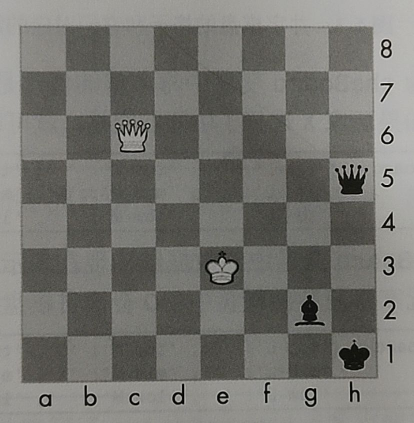

# 5 字典和结构化数据

!!! tip "说明"

    本文档正在更新中……

## 5.1 字典数据类型

像列表一样，**字典** 是许多值的集合。但不像列表的索引，字典的索引可以使用许多不同的数据类型，不只是整数。字典的索引被称为 **键**，键及其关联的值被称为 **键-值对**

在代码中，字典输入时带花括号 `{}`

```python
>>> my_cat = {'size': 'fat', 'color': 'gray', 'disposition': 'loud'}
```

这将一个字典赋给 `my_cat` 变量，这个字典的键是 `'size'` `'color'` `'disposition'`。这些键相应的值是 `'fat'` `'gray'` `'load'` 。可以通过它们的键访问这些值：

```python
>>> my_cat['size']
'fat'
>>> 'My cat has ' + my_cat['color'] + ' fur.'
'My cat has gray fur.'
```

字典可以用整数值作为键，它们不必从 0 开始，可以是任何数字

### 5.1.1 字典与列表

不像列表，字典中的项是不排序的。在字典中，键-值对输入的顺序并不重要

```python
>>> eggs = {'name': 'Zophie', 'species': 'cat'}
>>> ham = {'species': 'cat', 'name': 'Zophie'}
>>> eggs == ham
True
```

因为字典是不排序的，所以不能像列表那样切片

尝试访问字典中不存在的键，将出现 `KetError` 错误信息

字典可以用任意值作为键，这一点让你能够用强大的方式来组织数据。假定你希望程序保存朋友生日的数据，就可以使用一个字典，用名字作为键，用生日作为值

```python linenums="1"
birthdays = {'Alice': 'Apr 1', 'Bob': 'Dec 12'}

while True:
    print('Enter a name: (blank to quit)')
    name = input()
    if name == '':
        break
    
    if name in birthdays:
        print(birthdays[name] + ' is the birthday of ' + name)
    else:
        print(f'I do not have birthday information for {name}')
        bday = input('What is their birthday?')
        birthdays[name] = bday
        print('Birthday database updated.')
```

用 `in` 关键字，可以查看输入的名字是否作为键存在于字典中。如果在，可以用方括号访问关联的值；如果不在，可以用同样的方括号语法和赋值操作符添加它

!!! tip "Python 3.7 中排序的字典"

    在 Python 3.7 及更高的版本中，尽管字典仍然没有排序，但是如果你在它们中创建序列值，字典将记住其键-值对的插入顺序

    ```python
    >>> eggs = {'name': 'Zophie', 'species': 'cat'}
    >>> list(eggs)
    ['name', 'species']
    >>> ham = {'species': 'cat', 'name': 'Zophie'}
    >>> list(ham)
    ['species', 'name']
    ```

    请注意，字典仍然是无序的

### 5.1.2 `keys()`、`values()` 和 `items()` 方法

这 3 个字典方法，将返回类似列表的值，分别对应于字典的键、值和键-值对：`keys()`、`values()` 和 `items()` 方法。这些方法返回的值不是真正的列表，它们不能被修改，没有 `append()` 方法。但这些数据类型（分别是 `dict_keys` `dict_values` `dict_items`）可以用于 `for` 循环

```python
>>> eggs = {'name': 'Zophie', 'species': 'cat'}
>>> for v in eggs.values():
...    print(v)

red
42
>>> for i in eggs.items():
...    print(i)
('color': 'red')
('age': 42)
```

`items()` 方法返回的 `dict_items` 值包含的是键和值的元组

如果希望通过这些方法得到一个真正的列表，就把类似列表的返回值传递给 `list()` 函数

```python
>>> eggs = {'name': 'Zophie', 'species': 'cat'}
>>> eggs.keys()
dict_keys(['color', 'age'])
>>> list(eggs.keys())
['color', 'age']
```

也可以利用多重赋值的技巧，在 `for` 循环中将键和值赋给不同的变量

```python
>>> eggs = {'name': 'Zophie', 'species': 'cat'}
>>> for k, v in eggs.items():
...    print(f'keys: {k} value: {v}')

keys: name value: Zophie
keys: species value: cat
```

### 5.1.3 检查字典中是否存在键或值

利用 `in` `not in` 操作符

```python
>>> spam = {'name': 'Zophie', 'age': 7}
>>> 'name' in spam.keys()
True
>>> 'color' in spam
False
```

`'color' in spam` 本质上是一个简写版本，相当于 `'color' in spam.keys()`

### 5.1.4 `get()` 方法

`get()` 方法，有两个参数，分别为要取得其值的键，以及当该键不存在时返回的备用值

```python
>>> picnicItems = {'apples': 5, 'cups': 2}
>>> f'I am bringing {picnicItems.get('cups', 0)} cups.'
'I am bringing 2 cups.'
>>> f'I am bringing {picnicItems.get('eggs', 0)} eggs.'
'I am bringing 0 eggs.'
```

因为 `picnicItems` 字典中没有 `eggs` 键，所以 `get()` 方法返回的默认值是 0

### 5.1.5 `setdefault()` 方法

`setdefault()` 方法可以为字典中的某个键设置一个默认值，当该键没有任何值时使用它。该方法的第一个参数是要检查的键，第二个参数是当该键不存在时要设置的值。如果该键确实存在，那么 `setdefault()` 方法就会返回键的值

```python
>>> spam = {'name': 'Zophie', 'age': 7}
>>> spam.setdefault('color', 'black')
'black'
>>> spam
{'name': 'Zophie', 'age': 7, 'color': 'black'}
>>> spam.setdefault('color', 'white')
'black'
{'name': 'Zophie', 'age': 7, 'color': 'black'}
```

下面有一个小程序，可以计算一个字符串中每个字符出现的次数

```python linenums="1"
message = 'It was a bright cold day in April'
count = {}

for character in message:
    count.setdefault(character, 0)
    count[character] = count[character] + 1

print(count)
```

```python linenums="1" title="output"
{'I': 1, 't': 2, ' ': 7, 'w': 1, 'a': 3, 's': 1, 'b': 1, 'r': 2, 'i': 3, 'g': 1, 'h': 1, 'c': 1, 'o': 1, 'l': 2, 'd': 2, 'y': 1, 'n': 1, 'A': 1, 'p': 1}
```

## 5.2 美观地输出

如果程序导入了 `pprint` 模块，就可以使用 `pprint()` `pformat()` 函数，它们将“美观地输出”一个字典的字

```python linenums="1"
import pprint


message = 'It was a bright cold day in April'
count = {}

for character in message:
    count.setdefault(character, 0)
    count[character] = count[character] + 1

pprint.pprint(count)
```

```python linenums="1" title="output"
{' ': 7,
 'A': 1,
 'I': 1,
 'a': 3,
 'b': 1,
 'c': 1,
 'd': 2,
 'g': 1,
 'h': 1,
 'i': 3,
 'l': 2,
 'n': 1,
 'o': 1,
 'p': 1,
 'r': 2,
 's': 1,
 't': 2,
 'w': 1,
 'y': 1}
```

输出结果看起来更优雅，键是排过序的

如果字典本身包含嵌套的列表或字典，那么 `pprint()` 函数就特别有用

如果希望将美观的文字作为字符串输出，而不显示在屏幕上，那就调用 `pformat()` 函数。下面两行代码是等价的

```python linenums="1"
pprint.pprint(messages)
print(pprint.pformat(messages))
```

## 5.3 使用数据结构对真实世界建模

### 5.3.1 井字棋盘

要用字典表示井字棋盘，可以为每个格子分配一个字符串键

带有键 `'top_R'` 的字符串表示右上角

这个字典就是井字棋盘的数据结构

```python linenums="1"
board = {'top-L': ' ', 'top-M': ' ', 'top-R': ' ',
         'mid-L': ' ', 'mid-M': ' ', 'mid-R': ' ',
         'low-L': ' ', 'low-M': ' ', 'low-R': ' '}
```

如果玩家 X 选择了中间的空格，就可以用下面的字典来表示棋盘

```python linenums="1"
board = {'top-L': ' ', 'top-M': ' ', 'top-R': ' ',
         'mid-L': ' ', 'mid-M': 'X', 'mid-R': ' ',
         'low-L': ' ', 'low-M': ' ', 'low-R': ' '}
```

创建一个函数，将棋盘字典输出到屏幕上

```python linenums="1"
def print_board(board):
    print(board['top-L'] + '|' + board['top-M'] + '|' + board['top-R'])
    print('-+-+-')
    print(board['mid-L'] + '|' + board['mid-M'] + '|' + board['mid-R'])
    print('-+-+-')
    print(board['low-L'] + '|' + board['low-M'] + '|' + board['low-R'])


print_board(board)
```

```python linenums="1" title="output"
 | | 
-+-+-
 | | 
-+-+-
 | | 
```

现在添加代码，允许玩家输入它们的着法

```python linenums="1"
def print_board(board):
    print(board['top-L'] + '|' + board['top-M'] + '|' + board['top-R'])
    print('-+-+-')
    print(board['mid-L'] + '|' + board['mid-M'] + '|' + board['mid-R'])
    print('-+-+-')
    print(board['low-L'] + '|' + board['low-M'] + '|' + board['low-R'])


board = {'top-L': ' ', 'top-M': ' ', 'top-R': ' ',
         'mid-L': ' ', 'mid-M': ' ', 'mid-R': ' ',
         'low-L': ' ', 'low-M': ' ', 'low-R': ' '}

turn = 'X'
for i in range(9):
    print_board(board)
    print('Turn for ' + turn + '. Move on which space?')
    move = input()
    board[move] = turn
    if turn == 'X':
        turn = 'O'
    else:
        turn = 'X'

print_board(board)
```

但这并不是一个完整的井字棋游戏，它并不检查玩家是否获胜，但这已足够展示如何在程序中使用数据结构

### 5.3.2 嵌套的字典和列表

当你对复杂的事物建模时，可能发现字典和列表中需要包含其他字典和列表。列表适用于包含一组有序的值，字典适用于包含关联的键与值。下面的程序使用字典包含其他字典，用于记录谁为野餐带来的什么事物

```python linenums="1"
def total_brought(guests, item):
    num_brought = 0
    for k, v in guests.items():
        num_brought += v.get(item, 0)
    return num_brought


all_guests = {'Alice': {'apples': 5, 'pretzels': 12},
              'Bob': {'ham sandwiches': 3, 'apples': 2},
              'Carol': {'cups': 3, 'apple pies': 1}}

print('Number of things being brought:')
print(' - Apples        ' + str(total_brought(all_guests, 'apples')))
print(' - Cups         ' + str(total_brought(all_guests, 'cups')))
print(' - Cakes        ' + str(total_brought(all_guests, 'cakes')))
print(' - Ham sandwiches ' + str(total_brought(all_guests, 'ham sandwiches')))
print(' - Apple pies   ' + str(total_brought(all_guests, 'apple pies')))
```

```python linenums="1" title="output"
Number of things being brought:
 - Apples        7
 - Cups         3
 - Cakes        0
 - Ham sandwiches 3
 - Apple pies   1
```

## 5.5 习题

1.空字典的代码是什么样的？

??? success "答案"

    只有一个 `{}`

    `empty_dict = {}`

## 5.6 实践项目

### 5.6.1 国际象棋字典验证器

我们用字典 `{'1h': 'bking', '6c': 'wqueen', '2g': 'bbishop', '5h', 'bqueen', '3e', 'wking'}` 代表棋盘

<figure markdown="span">
  { width="400" }
</figure>

编写一个名为 `is_valid_chess_board()` 的函数，该函数接收一个字典作为参数，根据棋盘是否有效，返回 `True` 或 `False`

一个有效的棋盘只有一个黑王和一个白王。每个玩家最多只能有 16 个棋子，最多 8 个兵，并且所有棋子必须位于从 `'1a'` 到 `'8h'` 的有效位置内。棋子名称以 `'w'` 或 `'b'` 开头，代表白色或黑色；然后是 `'pawn', 'knight', 'bishop', 'rook', 'queen', 'king'`

### 5.6.2 好玩游戏的物品清单

创建一个好玩的视频游戏。用于对玩家物品清单建模的数据结构是一个字典。其中键是字符串，用于描述清单中的物品；值是一个整型值，用于说明玩家有多少该物品。例如，字典值 `{rope': 1, 'torch': 6, 'gold coin': 42, 'dagger': 1, 'arrow': 12}` 意味着玩家有 1 条绳索、6 个火把、42 枚金币等

编写一个名为 `displayInventory()` 的函数，它接收任何可能的物品清单，显示如下:

```python
Inventory:
12 arrow
42 gold coin
1 rope
6 torch
1 daggei
Total number of items: 62
```

提示：你可以使用 `for` 循环遍历字典中所有的键

```python linenums="1"
stuff = {'rope': 1, 'torch': 6, 'gold coin': 42, 'dagger': 1, 'arrow': 12}


def displayInventory(inventory):
    print("Inventory:")
    item_total = 0
    for k,vin inventory.items():
        # TODO: fill this part in   
    print("Total number of items: "+ str(item_total))


displayInventory(stuff)
```

### 5.6.3 列表到字典的函数，针对好玩游戏的物品清单

假设征服一条龙的战利品表示为下列的字符串列表：`dragonLoot = ['gold coin', 'dagger', 'gold coin', 'gold coin', 'ruby']`

编写一个名为 `addToInventory(inventory, addedItems)` 的函数，其中 `inventory` 参数是一个字典，表示玩家的物品清单（像前面项目一样）；`addedItems` 参数是一个列表，就
像 `dragonLoot`

`addToInventory()` 函数应该返回一个字典，表示更新过的物品清单。请注意，列表可以包含多个同样的项。你的代码看起来可能像这样:

```python linenums="1"
def addToInventory(inventory, addedItems):
    # TODO: your code goes here


inv = {'gold coin': 42, 'rope': 1}
dragonLoot = ['gold coin', 'dagger', 'gold coin', 'gold coin', 'ruby']
inv = addToInventory(inv, dragonLoot)
displayInventory(inv)
```

```python linenums="1" title="output"
Inventory:
45 gold coin
1 rope
1 ruby
1 dagger

Total number of items: 48
```