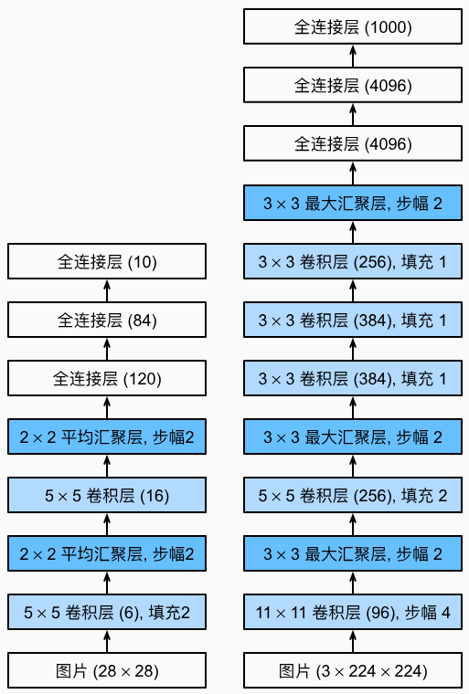

# 7.1 AlexNet 深度卷积神经网络

<!-- !!! tip "说明"

    此文档正在更新中…… -->

## 1 AlexNet 架构

AlexNet 和 LeNet 的架构非常相似

<figure markdown="span">
  { width="400" }
  <figcaption>左 LeNet 右 AlexNet</figcaption>
</figure>

AlexNet 和 LeNet 的设计理念非常相似，但也存在显著差异

1. AlexNet 比相对较小的 LeNet 要深得多。AlexNet 由八层组成：五个卷积层、两个全连接隐藏层和一个全连接输出层
2. AlexNet 使用 ReLU 而不是 sigmoid 作为其激活函数

```python linenums="1"
import torch
from torch import nn
from d2l import torch as d2l

net = nn.Sequential(
    nn.Conv2d(1, 96, kernel_size=11, stride=4),
    nn.ReLU(),
    nn.MaxPool2d(kernel_size=3, stride=2),
    nn.Conv2d(96, 256, kernel_size=5, padding=2),
    nn.ReLU(),
    nn.MaxPool2d(kernel_size=3, stride=2),
    nn.Conv2d(256, 384, kernel_size=3, padding=1),
    nn.ReLU(),
    nn.Conv2d(384, 384, kernel_size=3, padding=1),
    nn.ReLU(),
    nn.Conv2d(384, 256, kernel_size=3, padding=1),
    nn.ReLU(),
    nn.MaxPool2d(kernel_size=3, stride=2),
    nn.Flatten(),
    nn.Linear(6400, 4096),
    nn.ReLU(),
    # 使用 dropout 层来减轻过拟合
    nn.Dropout(p=0.5),
    nn.Linear(4096, 4096),
    nn.ReLU(),
    nn.Dropout(p=0.5),
    # 最后是输出层。由于这里使用 Fashion-MNIST，所以用类别数为 10，而非论文中的 1000
    nn.Linear(4096, 10)
)

X = torch.randn(1, 1, 224, 224)
for layer in net:
    X = layer(X)
    print(layer.__class__.__name__, 'output shape:\t', X.shape)
```

```python title="每层输出的形状" linenums="1"
Conv2d output shape:         torch.Size([1, 96, 54, 54])
ReLU output shape:           torch.Size([1, 96, 54, 54])
MaxPool2d output shape:      torch.Size([1, 96, 26, 26])
Conv2d output shape:         torch.Size([1, 256, 26, 26])
ReLU output shape:           torch.Size([1, 256, 26, 26])
MaxPool2d output shape:      torch.Size([1, 256, 12, 12])
Conv2d output shape:         torch.Size([1, 384, 12, 12])
ReLU output shape:           torch.Size([1, 384, 12, 12])
Conv2d output shape:         torch.Size([1, 384, 12, 12])
ReLU output shape:           torch.Size([1, 384, 12, 12])
Conv2d output shape:         torch.Size([1, 256, 12, 12])
ReLU output shape:           torch.Size([1, 256, 12, 12])
MaxPool2d output shape:      torch.Size([1, 256, 5, 5])
Flatten output shape:        torch.Size([1, 6400])
Linear output shape:         torch.Size([1, 4096])
ReLU output shape:           torch.Size([1, 4096])
Dropout output shape:        torch.Size([1, 4096])
Linear output shape:         torch.Size([1, 4096])
ReLU output shape:           torch.Size([1, 4096])
Dropout output shape:        torch.Size([1, 4096])
Linear output shape:         torch.Size([1, 10])
```

## 2 读取数据集

AlexNet 是在 ImageNet 上进行训练的，但在这里使用的是 Fashion-MNIST 数据集。因为即使在现代 GPU 上训练 ImageNet 模型，同时使其收敛可能需要数小时或数天的时间。将 AlexNet 直接应用于 Fashion-MNIST 的一个问题是，Fashion-MNIST 图像的分辨率低于 ImageNet 图像。为了解决这个问题，将它们增加到 224 x 224（通常来讲这不是一个明智的做法，但在这里这样做是为了有效使用 AlexNet 架构）。这里需要使用d2l.load_data_fashion_mnist 函数中的 resize 参数执行此调整

```python linenums="1"
batch_size = 128
train_iter, test_iter = d2l.load_data_fashion_mnist(batch_size, resize=224)
```

## 3 训练 AlexNet

```python linenums="1"
lr, num_epochs = 0.01, 10
d2l.train_ch6(net, train_iter, test_iter, num_epochs, lr, d2l.try_gpu())
```
