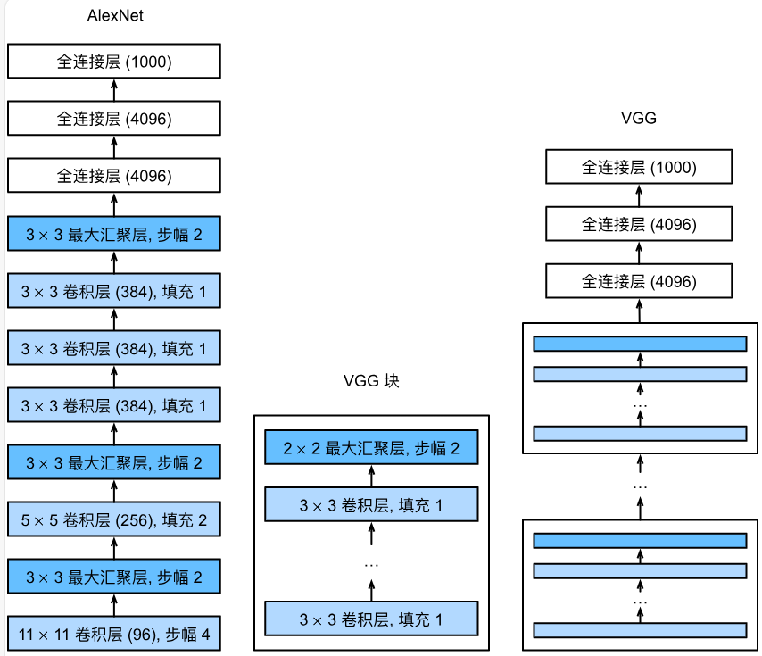

# 7.2 VGG 使用块的网络

<!-- !!! tip "说明"

    此文档正在更新中…… -->

## 1 VGG 块

VGG 由一系列卷积层组成，后面再加上用于空间下采样的最大汇聚层。在最初的VGG论文中，作者使用了带有卷积核、填充为 1（保持高度和宽度）的卷积层，和带有汇聚窗口、步幅为 2（每个块后的分辨率减半）的最大汇聚层

```python linenums="1"
import torch
from torch import nn
from d2l import torch as d2l


def vgg_block(num_convs, in_channels, out_channels):
    """
    实现一个 VGG 块，
    使用 3x3，填充为 1 的卷积层，
    使用 2x2，步幅为 2 的最大池化层
    :param num_convs: 卷积层的数量
    :param in_channels: 输入通道数量
    :param out_channels: 输出通道数量
    :return: 一个 VGG 块
    """
    layers = []
    for _ in range(num_convs):
        layers.append(nn.Conv2d(in_channels, out_channels,
                                kernel_size=3, padding=1))
        layers.append(nn.ReLU())
        in_channels = out_channels
    layers.append(nn.MaxPool2d(kernel_size=2, stride=2))
    return nn.Sequential(*layers)
```

## 2 VGG 网络

与 AlexNet、LeNet 一样，VGG 网络可以分为两部分：第一部分主要由卷积层和汇聚层组成，第二部分由全连接层组成

<figure markdown="span">
  { width="500" }
</figure>

超参数变量 `conv_arch`，该变量指定了每个 VGG 块里卷积层个数和输出通道数

### 2.1 VGG-11

VGG-11：该网络使用 8 个卷积层和 3 个全连接层

```python linenums="1"
conv_arch = ((1, 64), (1, 128), (2, 256), (2, 512), (2, 512))


def vgg(conv_arch):
    """
    实现 VGG-11 模型
    :param conv_arch: 超参数
    :return: VGG-11 模型
    """
    conv_blks = []
    in_channels = 1
    # 卷积层部分
    for (num_convs, out_channels) in conv_arch:
        conv_blks.append(vgg_block(num_convs, in_channels, out_channels))
        in_channels = out_channels
    return nn.Sequential(
        *conv_blks,
        nn.Flatten(),
        # 全连接层部分
        nn.Linear(out_channels * 7 * 7, 4096),
        nn.ReLU(),
        nn.Dropout(0.5),
        nn.Linear(4096, 4096),
        nn.ReLU(),
        nn.Dropout(0.5),
        nn.Linear(4096, 10))


net = vgg(conv_arch)
X = torch.randn(size=(1, 1, 224, 224))
for blk in net:
    X = blk(X)
    print(blk.__class__.__name__,'output shape:\t',X.shape)
```

```python title="每层输出的形状" linenums="1"
Sequential output shape:     torch.Size([1, 64, 112, 112])
Sequential output shape:     torch.Size([1, 128, 56, 56])
Sequential output shape:     torch.Size([1, 256, 28, 28])
Sequential output shape:     torch.Size([1, 512, 14, 14])
Sequential output shape:     torch.Size([1, 512, 7, 7])
Flatten output shape:        torch.Size([1, 25088])
Linear output shape:         torch.Size([1, 4096])
ReLU output shape:           torch.Size([1, 4096])
Dropout output shape:        torch.Size([1, 4096])
Linear output shape:         torch.Size([1, 4096])
ReLU output shape:           torch.Size([1, 4096])
Dropout output shape:        torch.Size([1, 4096])
Linear output shape:         torch.Size([1, 10])
```

由于 VGG-11 比 AlexNet 计算量更大，因此构建一个通道数较少的网络，足够用于训练 Fashion-MNIST 数据集

```python linenums="1"
ratio = 4
small_conv_arch = [(pair[0], pair[1] // ratio) for pair in conv_arch]
net = vgg(small_conv_arch)

lr, num_epochs, batch_size = 0.05, 10, 128
train_iter, test_iter = d2l.load_data_fashion_mnist(batch_size, resize=224)
d2l.train_ch6(net, train_iter, test_iter, num_epochs, lr, d2l.try_gpu())
```