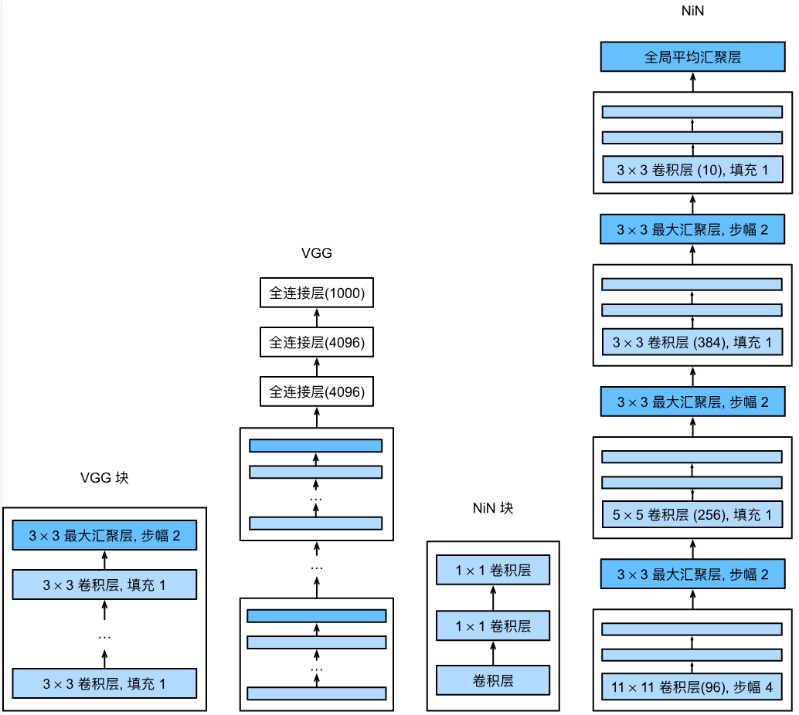

# 7.3 NiN 网络中的网络

<!-- !!! tip "说明"

    本文档正在更新中…… -->

## 1 NiN 块

NiN块以一个普通卷积层开始，后面是两个 1 x 1 的卷积层。这两个 1 x 1 卷积层充当带有 ReLU 激活函数的逐像素全连接层。第一层的卷积窗口形状通常由用户设置。随后的卷积窗口形状固定为 1 x 1

<figure markdown="span">
  { width="600" }
</figure>

```python linenums="1"
import torch
from torch import nn
from d2l import torch as d2l


def nin_block(in_channels, out_channels, kernel_size, strides, padding):
    return nn.Sequential(
        nn.Conv2d(in_channels, out_channels, kernel_size, strides, padding),
        nn.ReLU(),
        nn.Conv2d(out_channels, out_channels, kernel_size=1), 
        nn.ReLU(),
        nn.Conv2d(out_channels, out_channels, kernel_size=1), 
        nn.ReLU()
    )
```

## 2 NiN 模型

NiN 和 AlexNet 之间的一个显著区别是 NiN 完全取消了全连接层。相反，NiN 使用一个 NiN 块，其输出通道数等于标签类别的数量。最后放一个 **全局平均汇聚层**

NiN 去除了容易造成过拟合的全连接层，将它们替换为全局平均汇聚层。移除全连接层可减少过拟合，同时显著减少 NiN 的参数

```python linenums="1"
net = nn.Sequential(
    nin_block(1, 96, kernel_size=11, strides=4, padding=0),
    nn.MaxPool2d(3, stride=2),
    nin_block(96, 256, kernel_size=5, strides=1, padding=2),
    nn.MaxPool2d(3, stride=2),
    nin_block(256, 384, kernel_size=3, strides=1, padding=1),
    nn.MaxPool2d(3, stride=2),
    nn.Dropout(0.5),
    nin_block(384, 10, kernel_size=3, strides=1, padding=1),
    # 全局平均汇聚层通过对每个特征图的所有元素取平均值，
    # 将每个特征图缩减为一个单一值，从而将特征图的空间维度降为 1
    nn.AdaptiveAvgPool2d((1, 1)),
    nn.Flatten())

X = torch.rand(size=(1, 1, 224, 224))
for layer in net:
    X = layer(X)
    print(layer.__class__.__name__,'output shape:\t', X.shape)
```

```python title="每层输出的形状" linenums="1"
Sequential output shape:         torch.Size([1, 96, 54, 54])
MaxPool2d output shape:          torch.Size([1, 96, 26, 26])
Sequential output shape:         torch.Size([1, 256, 26, 26])
MaxPool2d output shape:          torch.Size([1, 256, 12, 12])
Sequential output shape:         torch.Size([1, 384, 12, 12])
MaxPool2d output shape:          torch.Size([1, 384, 5, 5])
Dropout output shape:            torch.Size([1, 384, 5, 5])
Sequential output shape:         torch.Size([1, 10, 5, 5])
AdaptiveAvgPool2d output shape:  torch.Size([1, 10, 1, 1])
Flatten output shape:            torch.Size([1, 10])
```

## 3 训练 NiN 模型

```python linenums="1"
lr, num_epochs, batch_size = 0.1, 10, 128
train_iter, test_iter = d2l.load_data_fashion_mnist(batch_size, resize=224)
d2l.train_ch6(net, train_iter, test_iter, num_epochs, lr, d2l.try_gpu())
```