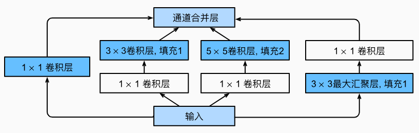
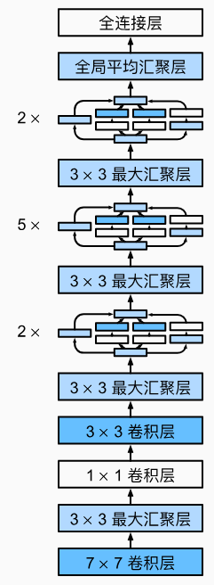

# 7.4 GoogLeNet 含并行连结的网络

<!-- !!! tip "说明"

    本文档正在更新中…… -->

## 1 Inception 块

在 GoogLeNet 中，基本的卷积块被称为 Inception 块

<figure markdown="span">
  { width="600" }
</figure>

Inception块由四条并行路径组成

1. 前三条路径使用窗口大小为 1 x 1、3 x 3 和 5 x 5 的卷积层，从不同空间大小中提取信息
2. 中间的两条路径在输入上执行 1 x 1 卷积，以减少通道数，从而降低模型的复杂性
3. 第四条路径使用最大汇聚层，然后使用 3 x 3 卷积层来改变通道数
4. 这四条路径都使用合适的填充来使输入与输出的高和宽一致，最后我们将每条线路的输出在通道维度上连结，并构成 Inception 块的输出

在 Inception 块中，通常调整的超参数是每层输出通道数

```python linenums="1"
import torch
from torch import nn
from torch.nn import functional as F
from d2l import torch as d2l


class Inception(nn.Module):
    # c1--c4 是每条路径的输出通道数
    def __init__(self, in_channels, c1, c2, c3, c4, **kwargs):
        super(Inception, self).__init__(**kwargs)
        # 线路 1，单 1x1 卷积层
        self.p1_1 = nn.Conv2d(in_channels, c1, kernel_size=1)
        # 线路 2，1x1 卷积层后接 3x3 卷积层
        self.p2_1 = nn.Conv2d(in_channels, c2[0], kernel_size=1)
        self.p2_2 = nn.Conv2d(c2[0], c2[1], kernel_size=3, padding=1)
        # 线路 3，1x1 卷积层后接 5x5 卷积层
        self.p3_1 = nn.Conv2d(in_channels, c3[0], kernel_size=1)
        self.p3_2 = nn.Conv2d(c3[0], c3[1], kernel_size=5, padding=2)
        # 线路 4，3x3 最大汇聚层后接 1x1 卷积层
        self.p4_1 = nn.MaxPool2d(kernel_size=3, stride=1, padding=1)
        self.p4_2 = nn.Conv2d(in_channels, c4, kernel_size=1)

    def forward(self, x):
        p1 = F.relu(self.p1_1(x))
        p2 = F.relu(self.p2_2(F.relu(self.p2_1(x))))
        p3 = F.relu(self.p3_2(F.relu(self.p3_1(x))))
        p4 = F.relu(self.p4_2(self.p4_1(x)))
        # 在通道维度上连结输出
        return torch.cat((p1, p2, p3, p4), dim=1)
```

## 2 GoogLeNet 模型

GoogLeNet 一共使用 9 个 Inception 块和全局平均汇聚层的堆叠来生成其估计值。Inception 块之间的最大汇聚层可降低维度。第一个模块类似于 AlexNet 和 LeNet，Inception 块的组合从 VGG 继承，全局平均汇聚层避免了在最后使用全连接层

<figure markdown="span">
  { width="200" }
</figure>

```python linenums="1"
b1 = nn.Sequential(nn.Conv2d(1, 64, kernel_size=7, stride=2, padding=3),
                   nn.ReLU(),
                   nn.MaxPool2d(kernel_size=3, stride=2, padding=1))

b2 = nn.Sequential(nn.Conv2d(64, 64, kernel_size=1),
                   nn.ReLU(),
                   nn.Conv2d(64, 192, kernel_size=3, padding=1),
                   nn.ReLU(),
                   nn.MaxPool2d(kernel_size=3, stride=2, padding=1))

b3 = nn.Sequential(Inception(192, 64, (96, 128), (16, 32), 32),
                   Inception(256, 128, (128, 192), (32, 96), 64),
                   nn.MaxPool2d(kernel_size=3, stride=2, padding=1))

b4 = nn.Sequential(Inception(480, 192, (96, 208), (16, 48), 64),
                   Inception(512, 160, (112, 224), (24, 64), 64),
                   Inception(512, 128, (128, 256), (24, 64), 64),
                   Inception(512, 112, (144, 288), (32, 64), 64),
                   Inception(528, 256, (160, 320), (32, 128), 128),
                   nn.MaxPool2d(kernel_size=3, stride=2, padding=1))

b5 = nn.Sequential(Inception(832, 256, (160, 320), (32, 128), 128),
                   Inception(832, 384, (192, 384), (48, 128), 128),
                   nn.AdaptiveAvgPool2d((1,1)),
                   nn.Flatten())

net = nn.Sequential(b1, b2, b3, b4, b5, nn.Linear(1024, 10))

X = torch.rand(size=(1, 1, 96, 96))
for layer in net:
    X = layer(X)
    print(layer.__class__.__name__,'output shape:\t', X.shape)
```

```python title="每层输出的形状" linenums="1"
Sequential output shape:     torch.Size([1, 64, 24, 24])
Sequential output shape:     torch.Size([1, 192, 12, 12])
Sequential output shape:     torch.Size([1, 480, 6, 6])
Sequential output shape:     torch.Size([1, 832, 3, 3])
Sequential output shape:     torch.Size([1, 1024])
Linear output shape:         torch.Size([1, 10])
```

## 3 训练 GoogLeNet 模型

```python linenums="1"
lr, num_epochs, batch_size = 0.1, 10, 128
train_iter, test_iter = d2l.load_data_fashion_mnist(batch_size, resize=96)
d2l.train_ch6(net, train_iter, test_iter, num_epochs, lr, d2l.try_gpu())
```