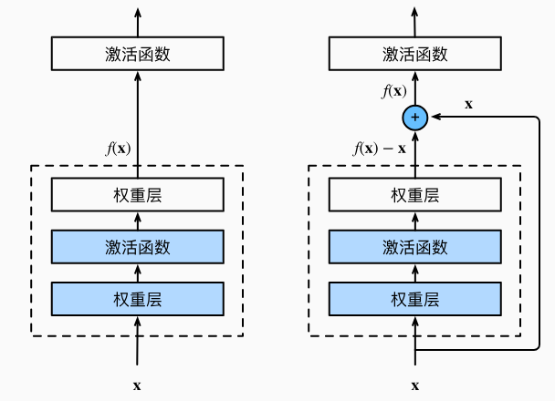
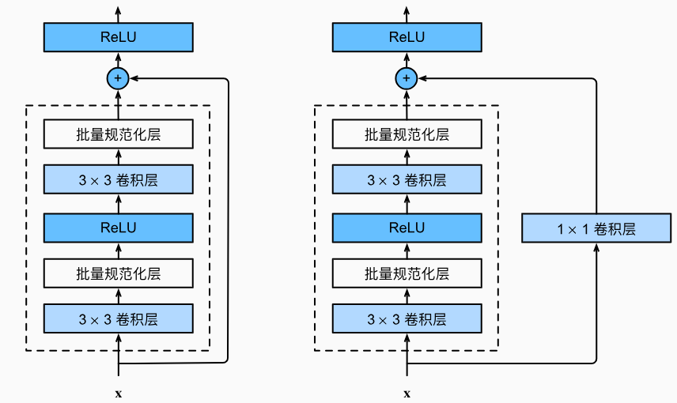
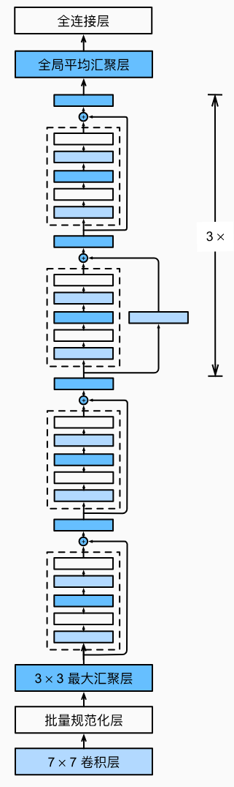

# 7.6 ResNet 残差网络

<!-- !!! tip "说明"

    本文档正在更新中…… -->

## 1 残差块

<figure markdown="span">
  { width="400" }
  <figcaption>左 正常块 右 残差块</figcaption>
</figure>

残差块里首先有 2 个有相同输出通道数的 3 x 3 卷积层。每个卷积层后接一个批量规范化层和 ReLU 激活函数。然后我们通过跨层数据通路，跳过这 2 个卷积运算，将输入直接加在最后的 ReLU 激活函数前。这样的设计要求 2 个卷积层的输出与输入形状一样，从而使它们可以相加。如果想改变通道数，就需要引入一个额外的 1 x 1 卷积层来将输入变换成需要的形状后再做相加运算。

```python linenums="1"
import torch
from torch import nn
from torch.nn import functional as F
from d2l import torch as d2l


class Residual(nn.Module):  #@save
    def __init__(self, input_channels, num_channels,
                 use_1x1conv=False, strides=1):
        super().__init__()
        self.conv1 = nn.Conv2d(input_channels, num_channels,
                               kernel_size=3, padding=1, stride=strides)
        self.conv2 = nn.Conv2d(num_channels, num_channels,
                               kernel_size=3, padding=1)
        if use_1x1conv:
            self.conv3 = nn.Conv2d(input_channels, num_channels,
                                   kernel_size=1, stride=strides)
        else:
            self.conv3 = None
        self.bn1 = nn.BatchNorm2d(num_channels)
        self.bn2 = nn.BatchNorm2d(num_channels)

    def forward(self, X):
        Y = F.relu(self.bn1(self.conv1(X)))
        Y = self.bn2(self.conv2(Y))
        if self.conv3:
            X = self.conv3(X)
        Y += X
        return F.relu(Y)
```

<figure markdown="span">
  { width="400" }
  <figcaption>左 <code>use_1x1conv=False</code> 右 <code>use_1x1conv=True</code></figcaption>
</figure>

```python linenums="1"
def resnet_block(input_channels, num_channels, num_residuals,
                 first_block=False):
    blk = []
    for i in range(num_residuals):
        if i == 0 and not first_block:
            blk.append(Residual(input_channels, num_channels,
                                use_1x1conv=True, strides=2))
        else:
            blk.append(Residual(num_channels, num_channels))
    return blk
```

## 2 ResNet 模型

### 2.1 ResNet-18

每个模块有 4 个卷积层（不包括恒等映射的 1 x 1 卷积层）。加上第一个 7 x 7 卷积层和最后一个全连接层，共有 18 层

<figure markdown="span">
  { width="200" }
</figure>

```python linenums="1"
b1 = nn.Sequential(nn.Conv2d(1, 64, kernel_size=7, stride=2, padding=3),
                   nn.BatchNorm2d(64),  # 增加了批量规范化层
                   nn.ReLU(),
                   nn.MaxPool2d(kernel_size=3, stride=2, padding=1)
                   )
b2 = nn.Sequential(*resnet_block(64, 64, 2, first_block=True))
b3 = nn.Sequential(*resnet_block(64, 128, 2))
b4 = nn.Sequential(*resnet_block(128, 256, 2))
b5 = nn.Sequential(*resnet_block(256, 512, 2))

net = nn.Sequential(b1, b2, b3, b4, b5,
                    nn.AdaptiveAvgPool2d((1,1)),
                    nn.Flatten(),
                    nn.Linear(512, 10)
                    )

X = torch.rand(size=(1, 1, 224, 224))
for layer in net:
    X = layer(X)
    print(layer.__class__.__name__,'output shape:\t', X.shape)
```

```python title="每层输出的形状" linenums="1"
Sequential output shape:         torch.Size([1, 64, 56, 56])
Sequential output shape:         torch.Size([1, 64, 56, 56])
Sequential output shape:         torch.Size([1, 128, 28, 28])
Sequential output shape:         torch.Size([1, 256, 14, 14])
Sequential output shape:         torch.Size([1, 512, 7, 7])
AdaptiveAvgPool2d output shape:  torch.Size([1, 512, 1, 1])
Flatten output shape:            torch.Size([1, 512])
Linear output shape:             torch.Size([1, 10])
```

```python linenums="1"
lr, num_epochs, batch_size = 0.05, 10, 256
train_iter, test_iter = d2l.load_data_fashion_mnist(batch_size, resize=96)
d2l.train_ch6(net, train_iter, test_iter, num_epochs, lr, d2l.try_gpu())
```