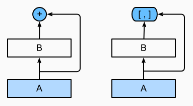

# 7.7 DenseNet 稠密连接网络

<!-- !!! tip "说明"

    本文档正在更新中…… -->

## 1 原理

ResNet 将函数展开为 $f(x) = x + g(x)$。而 DenseNet 输出是连接而不是相加

<figure markdown="span">
  { width="400" }
  <figcaption>左 ResNet 右 DenseNet</figcaption>
</figure>

稠密网络主要由 2 部分构成：

1. **稠密块**：定义如何连接输入和输出
2. **过渡层**：控制通道数量，使其不会太复杂

## 2 稠密块

```python linenums="1"
import torch
from torch import nn
from d2l import torch as d2l


def conv_block(input_channels, num_channels):
    return nn.Sequential(
        nn.BatchNorm2d(input_channels), 
        nn.ReLU(),
        nn.Conv2d(input_channels, num_channels, kernel_size=3, padding=1)
    )


class DenseBlock(nn.Module):
    def __init__(self, num_convs, input_channels, num_channels):
        super(DenseBlock, self).__init__()
        layer = []
        for i in range(num_convs):
            layer.append(conv_block(
                num_channels * i + input_channels, num_channels))
        self.net = nn.Sequential(*layer)

    def forward(self, X):
        for blk in self.net:
            Y = blk(X)
            # 连接通道维度上每个块的输入和输出
            X = torch.cat((X, Y), dim=1)
        return X
```

卷积块的通道数控制了输出通道数相对于输入通道数的增长，因此也被称为 **增长率**

```python linenums="1" title="example"
blk = DenseBlock(2, 3, 10)
X = torch.randn(4, 3, 8, 8)
Y = blk(X)
Y.shape  # torch.Size([4, 23, 8, 8]) 23 = 3 + 2 * 10
```

## 3 过渡层

由于每个稠密块都会带来通道数的增加，使用过多则会过于复杂化模型。而过渡层可以用来控制模型复杂度。它通过 1 x 1 卷积层来减小通道数，并使用步幅为 2 的平均汇聚层减半高和宽，从而进一步降低模型复杂度

```python linenums="1"
def transition_block(input_channels, num_channels):
    return nn.Sequential(
        nn.BatchNorm2d(input_channels), nn.ReLU(),
        nn.Conv2d(input_channels, num_channels, kernel_size=1),
        nn.AvgPool2d(kernel_size=2, stride=2))
```

```python linenums="1" title="example"
blk = transition_block(23, 10)
blk(Y).shape  # torch.Size([4, 10, 4, 4])
```

## 4 DenseNet 模型

```python linenums="1"
b1 = nn.Sequential(
    nn.Conv2d(1, 64, kernel_size=7, stride=2, padding=3),
    nn.BatchNorm2d(64), 
    nn.ReLU(),
    nn.MaxPool2d(kernel_size=3, stride=2, padding=1)
)

# 使用 4 个稠密块
# num_channels 为当前的通道数
num_channels, growth_rate = 64, 32
num_convs_in_dense_blocks = [4, 4, 4, 4]
blks = []
for i, num_convs in enumerate(num_convs_in_dense_blocks):
    blks.append(DenseBlock(num_convs, num_channels, growth_rate))
    # 上一个稠密块的输出通道数
    num_channels += num_convs * growth_rate
    # 在稠密块之间添加一个过渡层，使通道数量减半
    if i != len(num_convs_in_dense_blocks) - 1:
        blks.append(transition_block(num_channels, num_channels // 2))
        num_channels = num_channels // 2

net = nn.Sequential(
    b1, *blks,
    nn.BatchNorm2d(num_channels),
    nn.ReLU(),
    nn.AdaptiveAvgPool2d((1, 1)),
    nn.Flatten(),
    nn.Linear(num_channels, 10)
)
```

将输入高和宽从 224 降到 96 来简化计算

```python linenums="1"
lr, num_epochs, batch_size = 0.1, 10, 256
train_iter, test_iter = d2l.load_data_fashion_mnist(batch_size, resize=96)
d2l.train_ch6(net, train_iter, test_iter, num_epochs, lr, d2l.try_gpu())
```