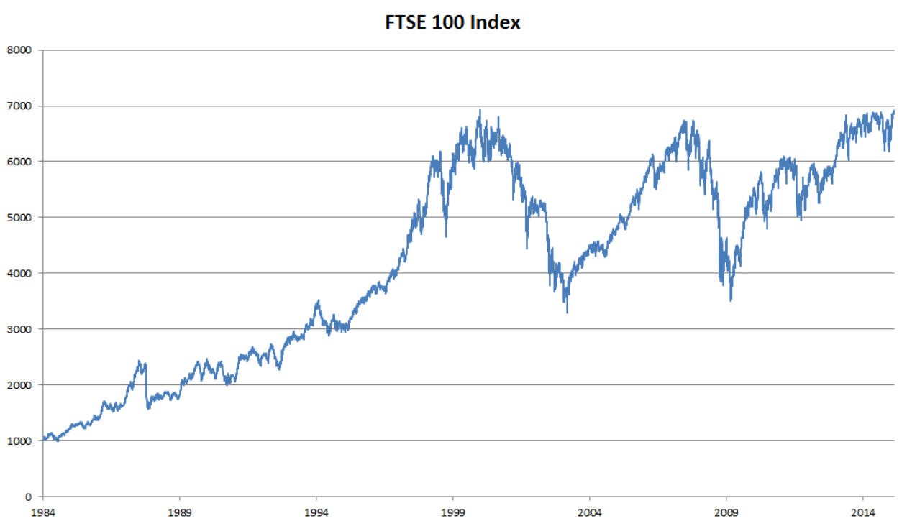
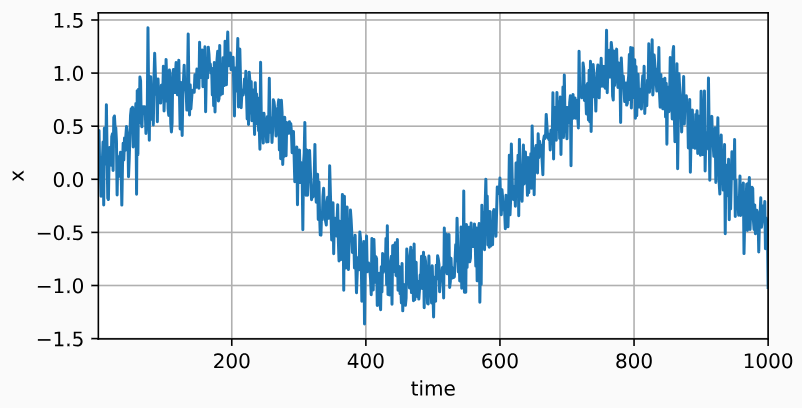
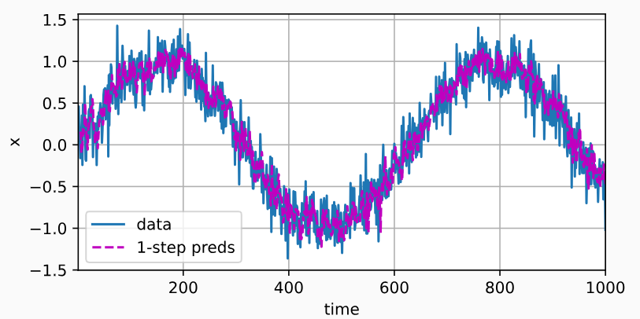
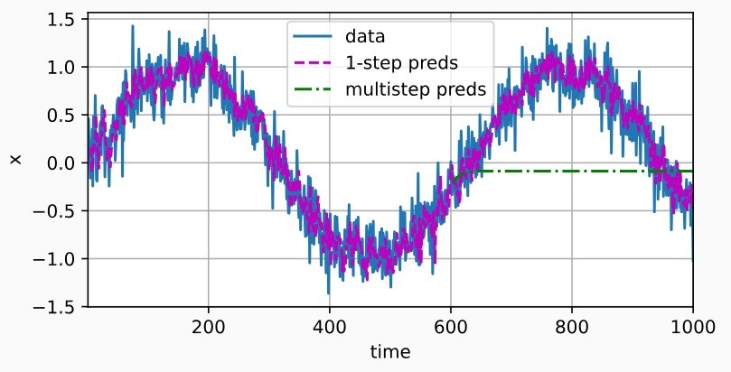
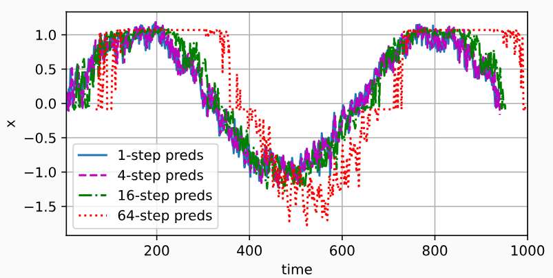

# 8.1 序列模型

<!-- !!! tip "说明"

    本文档正在更新中…… -->

## 1 统计工具

<figure markdown="span">
  { width="600" }
  <figcaption>近 30 年的富时 100 指数</figcaption>
</figure>

用 $x_t$ 表示价格，即在 **时间步**（time step）$t \in \mathbb{Z}^+$ 时，观察到的价格 $x_t$。假设一个交易员想在 $t$ 日的股市中表现良好，于是通过以下途径预测 $x_t$：

$x_t \sim P(x_t | x_{t-1}, \cdots, x_1)$

### 1.1 自回归模型

为了实现这个预测，交易员可以使用回归模型。但有一个主要问题：输入数据的数量

1. 在现实情况下相当长的序列 $x_{t-1}, \cdots, x_1$ 可能是不必要的，因此我们只需要满足某个长度为 $\tau$ 的时间跨度，即使用观测序列 $x_{t-1}, \cdots, x_{t - \tau}$。这种模型被称为 **自回归模型**
2. 保留一些对过去观测的总结 $h_t$，并且同时更新预测 $\hat{x_t}$ 和总结 $h_t$。这就产生了基于 $\hat{x_t} = P(x_t | h_t)$ 估计 $x_t$，以及公式 $h_t = g(h_{t-1}, x_{t-1})$ 更新的模型。由于 $h_t$ 从未被观测到，这类模型也被称为 **隐变量自回归模型**

这两种情况都有一个显而易见的问题：如何生成训练数据？一个经典方法是使用历史观测来预测下一个未来观测。显然，我们并不指望时间会停滞不前。然而，一个常见的假设是虽然特定值 $x_t$ 可能会改变，但是序列本身的动力学不会改变。这样的假设是合理的，因为新的动力学一定受新的数据影响，而我们不可能用目前所掌握的数据来预测新的动力学。统计学家称不变的动力学为 **静止的**（stationary）。因此，整个序列的估计值都将通过以下的方式获得：

$$
P(x_1, \cdots, x_T) = \prod\limits_{t=1}^T P(x_t | x_{t-1}, \cdots, x_1)
$$

注意，如果我们处理的是离散的对象（如单词），而不是连续的数字，则上述的考虑仍然有效。唯一的差别是，对于离散的对象，我们需要使用分类器而不是回归模型来估计 $P(x_t | x_{t-1}, \cdots, x_1)$

### 1.2 马尔可夫模型

在自回归模型的近似法中，我们使用 $x_{t-1}, \cdots, x_{t - \tau}$ 而不是 $x_{t-1}, \cdots, x_1$ 来估计。只要这种是近似精确的，我们就说序列满足 **马尔可夫条件**。特别是，如果 $\tau = 1$，得到一个 **一阶马尔可夫模型**，$P(x)$ 由下式给出：

$$
P(x_1, \cdots, x_T) = \prod\limits_{t=1}^T P(x_t | x_{t-1}),\ P(x_1 | x_0) = P(x_1)
$$

当假设 $x_t$ 仅是离散值时，这样的模型特别棒，因为在这种情况下，使用动态规划可以沿着马尔可夫链精确地计算结果。例如，我们可以高效地计算 $P(x_{t+1} | x_{t-1}) = \sum\limits_{x_t} P(x_{t+1} | x_t)P(x_t | x_{t-1})$

利用这一事实，我们只需要考虑过去观察中的一个非常短的历史：$P(x_{t+1} | x_t, x_{t-1}) = P(x_{t+1}, x_t)$

## 2 训练

首先，我们生成一些数据：使用正弦函数和一些可加性噪声来生成序列数据，时间步为 1，2，...，1000

```python linenums="1"
import torch
from torch import nn
from d2l import torch as d2l

T = 1000  # 总共产生1000个点
time = torch.arange(1, T + 1, dtype=torch.float32)
x = torch.sin(0.01 * time) + torch.normal(0, 0.2, (T,))
d2l.plot(time, [x], 'time', 'x', xlim=[1, 1000], figsize=(6, 3))
```

<figure markdown="span">
  { width="600" }
</figure>

接下来，我们将这个序列转换为模型的特征－标签（feature-label）对。假设 $\tau = 4$，这样我们提供的数据样本就少了 4 个，解决方法：

1. 如果拥有足够长的序列就丢弃这几项
2. 用零填充序列

```python linenums="1"
tau = 4
features = torch.zeros((T - tau, tau))
for i in range(tau):
    features[:, i] = x[i: T - tau + i]
labels = x[tau:].reshape((-1, 1))

batch_size, n_train = 16, 600
# 只有前n_train个样本用于训练
train_iter = d2l.load_array((features[:n_train], labels[:n_train]), 
    batch_size, is_train=True)
```

在这里，我们使用一个相当简单的架构训练模型： 一个拥有两个全连接层的多层感知机，ReLU 激活函数和平方损失

```python linenums="1"
# 初始化网络权重的函数
def init_weights(m):
    if type(m) == nn.Linear:
        nn.init.xavier_uniform_(m.weight)

# 一个简单的多层感知机
def get_net():
    net = nn.Sequential(nn.Linear(4, 10),
                        nn.ReLU(),
                        nn.Linear(10, 1))
    net.apply(init_weights)
    return net

# 平方损失。注意：MSELoss计算平方误差时不带系数1/2
loss = nn.MSELoss(reduction='none')
```

现在，准备训练模型了

```python linenums="1"
def train(net, train_iter, loss, epochs, lr):
    trainer = torch.optim.Adam(net.parameters(), lr)
    for epoch in range(epochs):
        for X, y in train_iter:
            trainer.zero_grad()
            l = loss(net(X), y)
            l.sum().backward()
            trainer.step()
        print(f'epoch {epoch + 1}, '
              f'loss: {d2l.evaluate_loss(net, train_iter, loss):f}')

net = get_net()
train(net, train_iter, loss, 5, 0.01)
```

## 3 预测

由于训练损失很小，因此我们期望模型能有很好的工作效果。让我们看看这在实践中意味着什么。首先是检查模型预测下一个时间步的能力，也就是单步预测

```python linenums="1"
onestep_preds = net(features)
d2l.plot([time, time[tau:]],
         [x.detach().numpy(), onestep_preds.detach().numpy()], 'time',
         'x', legend=['data', '1-step preds'], xlim=[1, 1000],
         figsize=(6, 3))
```

<figure markdown="span">
  { width="600" }
</figure>

通常，对于直到 $x_t$ 的观测序列，其在时间步 $t + k$ 处的预测输出 $\hat{x}_{t+k}$ 称为 k 步预测。由于我们的观察已经到了 $x_{604}$，因此之后的数据需要使用我们自己的预测（而不是原始数据）来进行多步预测了。它的 k 步预测是 $\hat{x}_{604+k}$

```python linenums="1"
multistep_preds = torch.zeros(T)
multistep_preds[: n_train + tau] = x[: n_train + tau]
for i in range(n_train + tau, T):
    multistep_preds[i] = net(
        multistep_preds[i - tau:i].reshape((1, -1)))

d2l.plot([time, time[tau:], time[n_train + tau:]],
         [x.detach().numpy(), onestep_preds.detach().numpy(),
          multistep_preds[n_train + tau:].detach().numpy()], 'time',
         'x', legend=['data', '1-step preds', 'multistep preds'],
         xlim=[1, 1000], figsize=(6, 3))
```

<figure markdown="span">
  { width="600" }
</figure>

绿线的预测显然并不理想。经过几个预测步骤之后，预测的结果很快就会衰减到一个常数。为什么这个算法效果这么差呢？事实是由于错误的累积：假设在步骤 1 之后，我们积累了一些错误 $\epsilon_1 = \bar{\epsilon}$。接着，步骤 2 的输入扰动了 $\epsilon_1$，结果积累的误差是按照次序的 $\epsilon_2 = \bar{\epsilon} + c\epsilon_1$，其中 c 为某个常数，后面的预测误差依此类推。因此误差可能会相当快地偏离真实的观测结果

基于 $k = 1, 4, 16, 64$，通过对整个序列预测的计算，让我们更仔细地看一下 k 步预测的困难

```python linenums="1"
max_steps = 64

features = torch.zeros((T - tau - max_steps + 1, tau + max_steps))
# 列i（i<tau）是来自x的观测，其时间步从（i）到（i+T-tau-max_steps+1）
for i in range(tau):
    features[:, i] = x[i: i + T - tau - max_steps + 1]

# 列i（i>=tau）是来自（i-tau+1）步的预测，其时间步从（i）到（i+T-tau-max_steps+1）
for i in range(tau, tau + max_steps):
    features[:, i] = net(features[:, i - tau:i]).reshape(-1)

steps = (1, 4, 16, 64)
d2l.plot([time[tau + i - 1: T - max_steps + i] for i in steps],
         [features[:, (tau + i - 1)].detach().numpy() for i in steps], 'time', 'x',
         legend=[f'{i}-step preds' for i in steps], xlim=[5, 1000],
         figsize=(6, 3))
```

<figure markdown="span">
  { width="600" }
</figure>