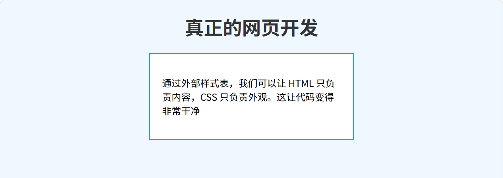

# css

<!-- !!! tip "说明"

    本文档正在更新中…… -->

!!! info "AI 介绍"
    
    CSS（**层叠样式表**，Cascading Style Sheets）是用于 **控制网页外观和布局** 的样式语言。它和 **HTML（结构）**、**JavaScript（交互）** 并称前端开发的三大核心技术
    
    **CSS 的核心作用**
    
    1. **美化页面**：设置颜色、字体、间距、背景等视觉效果
    2. **控制布局**：实现响应式设计（适应不同设备）、浮动、Flexbox、Grid 等排版方式
    3. **分离结构与样式**：HTML 只负责内容，CSS 负责样式，便于维护和复用
    
    **CSS 的优势**
    
    1. **样式与结构分离** → 更易维护  
    2. **复用性强** → 一个样式表控制多个页面  
    3. **响应式设计** → 适配手机、平板、PC  
    4. **动画效果** → 过渡（Transitions）、变形（Transforms）  
    
    **总结**
    
    - **HTML** 负责网页**结构**（骨架）
    - **CSS** 负责网页**样式**（外观）
    - **JavaScript** 负责网页**交互**（动态行为）

CSS 是一种用来给 HTML 元素添加样式的语言。HTML 负责搭建网页的骨架，也就是显示什么内容，而 CSS 负责网页的外观，也就是这些内容如何呈现，可以用来控制文字的颜色和大小、元素的排版布局、背景图片、间距、边框，甚至是动画效果

## 1 基本语法

CSS 的核心由 selector（选择器）和包含在花括号内的 declaration block（声明块）组成

```css
selector {
    property1: value1;
    property2: value2;
}
```

1. 选择器：告诉浏览器你想要改变哪个 HTML 元素的样式（例如 `h1` 代表所有一级标题，`p` 代表所有段落）
2. 属性：你想要改变的内容（如 `color`、`font-size`）
3. 值：你想把这个内容改成什么样（如 `red`、`16px`）

CSS 与 HTML 结合的三种方式：

1. 外部样式表：将 CSS 代码写在单独的 `.css` 文件中，然后在 HTML 的 `<head>` 里用 `<link>` 标签引入
2. 内部样式表：将 CSS 写在 HTML 的 `<head>` 区域的 `<style>` 标签内
3. 内联样式：直接写在 HTML 标签的 `style` 属性里，如 `<p style="color: red;">`

### 1.1 选择器

各种类型到的选择器可以组合起来使用

**基础选择器**

1. 标签选择器

    1. 语法：`标签名`
    2. 作用：选中页面中所有该名称的 HTML 标签
    3. 示例：`p { color: red; }` （将所有 `<p>` 段落的文字变成红色）

2. 类选择器

    1. 语法：`.类名`
    2. 作用：选中所有 `class` 属性包含该类名的元素。最常用的选择器，可以多处复用
    3. 示例：`.highlight { background: yellow; }` （选中所有 `<div class="highlight">` 等元素）

3. ID 选择器

    1. 语法：`#ID名`
    2. 作用：选中 `id` 属性为该名称的唯一元素。在一个 HTML 页面中，同一个 ID 只能出现一次
    3. 示例：`#nav-bar { width: 100%; }` （选中 `<nav id="nav-bar">`）

4. 通配符选择器

    1. 语法：`*`
    2. 作用：选中页面上的所有元素。常用于重置默认样式
    3. 示例：`* { margin: 0; padding: 0; }`

**组合选择器**

根据 DOM 树中元素之间的相对关系来选择元素

??? tip "DOM 树"

    DOM 树是浏览器用来表示和组织 HTML 网页内部结构的一种方式。非常好理解

    ```html linenums="1"
    <html>
      <head>
        <title>我的网页</title>
      </head>
      <body>
        <h1>大标题</h1>
        <p>一段文字</p>
      </body>
    </html>
    ```

    浏览器解析这段代码后，在内存中生成的 DOM 树骨架长这样：

    ```text linenums="1"
    Document (隐藏的绝对根节点)
     └── <html> (网页本身的根元素)
          │
          ├── <head> (html 的子节点)
          │    └── <title>
          │         └── "我的网页" (文本节点/树叶)
          │
          └── <body> (html 的子节点，与 head 是兄弟)
               ├── <h1> (body 的子节点)
               │    └── "大标题" (文本节点/树叶)
               │
               └── <p> (body 的子节点，与 h1 是兄弟)
                    └── "一段文字" (文本节点/树叶)
    ```

    可以这样理解：HTML 代码便于人类理解，而 DOM 树结构便于计算机理解

1. 后代选择器

    1. 语法：`A B`
    2. 作用：选中 `A` 元素内部的所有 `B` 元素（不论嵌套了多少层）
    3. 示例：`div p { color: blue; }` （选中 `<div>` 内部所有的 `<p>` 元素）

2. 子代选择器

    1. 语法：`A > B`
    2. 作用：选中 `A` 元素的直接子元素 `B`（只管儿子，不管孙子）
    3. 示例：`ul > li { list-style: none; }`

3. 相邻兄弟选择器

    1. 语法：`A + B`
    2. 作用：选中紧跟在 `A` 元素后面的那一个 `B` 元素（必须是兄弟节点，且相邻紧挨着）
    3. 示例：`h1 + p { font-weight: bold; }` （紧跟在 `<h1>` 后面的第一个 `<p>` 将加粗）

4. 通用兄弟选择器

    1. 语法：`A ~ B`
    2. 作用：选中 `A` 元素后面的所有同级 `B` 元素（不必紧挨着）
    3. 示例：`h1 ~ p { color: gray; }` （`<h1>` 之后所有的同级 `<p>` 变灰）

**属性选择器**

根据元素的 HTML 属性及属性值来选择元素

1. `[attr]`：选择带有指定属性的元素。示例：`[disabled] { opacity: 0.5; }` （选中所有带有 `disabled` 属性的元素）
2. `[attr="value"]`：选择属性值完全等于指定值的元素。示例：`input[type="text"] { border: 1px solid black; }`
3. `[attr^="value"]`：选择属性值以指定值开头的元素。示例：`a[href^="https"] { color: green; }` （选中所有的 HTTPS 链接）
4. `[attr$="value"]`：选择属性值以指定值结尾的元素。示例：`a[href$=".pdf"] { background-image: url('pdf-icon.png'); }`
5. `[attr*="value"]`：选择属性值包含指定值的元素。示例：`a[href*="github"] { font-weight: bold; }`

**伪类选择器**

用于选择处于特定状态的元素，通常使用一个冒号 `:`

1. 动态伪类：常用于链接和按钮

    1. `:hover`：鼠标悬停在元素上时
    2. `:active`：鼠标按下但没有松开时
    3. `:focus`：元素获得焦点时（如输入框被点击输入文字时）

2. 结构伪类：基于元素在 DOM 树中的位置

    1. `:first-child`：选中作为其父元素第一个子元素的元素
    2. `:last-child`：选中作为其父元素最后一个子元素的元素
    3. `:nth-child(n)`：选中作为其父元素第 n 个子元素的元素（n 可以是数字、`odd` 奇数、`even` 偶数，或者公式如 `2n+1`）
    4. `:not(selector)`：否定伪类，选中非指定选择器的其他元素（例如 `p:not(.intro)` 选中所有 `class` 不是 `intro` 的 `<p>`）

**伪元素选择器**

用于选择或创建元素的某个特定部分，属于页面上原本并不存在的逻辑元素，通常使用两个冒号 `::`

1. `::before`：在元素内容的最前面插入一段内容（必须配合 `content` 属性使用）
2. `::after`：在元素内容的最后面插入一段内容。示例：`.price::before { content: "¥"; }` （在价格前自动加上人民币符号）
3. `::first-letter`：选中一段文本的第一个字母或汉字（常用于首字下沉排版）
4. `::first-line`：选中一段文本的第一行
5. `::selection`：选中文本被用户鼠标高亮选中时的状态（常用来修改选中文本的背景色）

## 2 简单示例

=== "index.html"

    ```html linenums="1"
    <!DOCTYPE html>
    <html lang="zh-CN">
    <head>
        <meta charset="UTF-8">
        <title>外部样式表示例</title>
        <!-- 核心步骤：在这里引入外部的 CSS 文件 -->
        <!-- rel="stylesheet" 告诉浏览器引入的是样式表 -->
        <!-- href="style.css" 指向了 CSS 文件的路径 -->
        <link rel="stylesheet" href="style.css">
    </head>
    <body>
        <h1>真正的网页开发</h1>
        <div class="card">
            <p>通过外部样式表，我们可以让 HTML 只负责内容，CSS 只负责外观。这让代码变得非常干净</p>
        </div>
    </body>
    </html>
    ```

=== "style.css"

    ```css linenums="1"
    /* 给整个页面设置一个浅蓝色的背景 */
    body {
        background-color: #f0f8ff;
        font-family: sans-serif;
    }
    
    /* 让所有的一级标题居中，并设置颜色为深灰色 */
    h1 {
        color: #333333;
        text-align: center;
    }
    
    /* 给 class="card" 的元素添加边框、内边距和背景色 */
    .card {
        border: 2px solid #3498db;
        padding: 20px;
        background-color: white;
        width: 300px;
        margin: 0 auto; /* 让卡片在页面中居中 */
    }
    ```

在 VS Code 使用插件预览如下：

<figure markdown="span">
  { width="600" }
</figure>