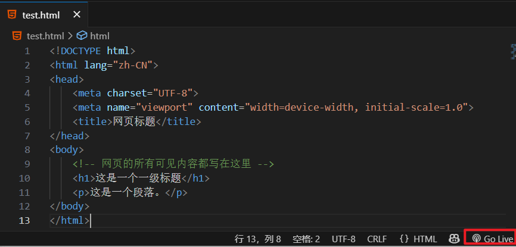
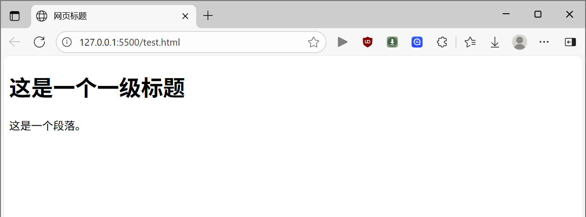

# HTML

<!-- !!! tip "说明"

    本文档正在更新中…… -->

!!! info "AI 介绍"

    HTML（**超文本标记语言**，HyperText Markup Language）是用于创建和设计网页的 **标准标记语言**。它通过一系列 **标签（Tags）** 定义网页的结构和内容，浏览器会解析这些标签并渲染成用户看到的页面
    
    **核心特点**：
    
    1. **标记语言**：使用 `<标签>` 语法（如 `<h1>`, `<p>`, ``）描述内容，不编程
    2. **结构清晰**：定义标题、段落、列表、链接等元素
    1. **超文本支持**：通过 `<a>` 标签实现页面跳转或资源链接
    2. **平台无关**：任何浏览器均可解析（如 Chrome、Firefox）
    
    **关键组成部分**：
    
    - **`<!DOCTYPE html>`**：声明文档类型为 HTML5
    - **`<html>`**：根元素，包裹所有内容
    - **`<head>`**：包含元信息（标题、字符集、CSS/JS 链接）
    - **`<body>`**：存放可见内容（文本、图片、视频等）
    
    **与 CSS/JS 的关系**：
    
    - **CSS**：控制样式（颜色、布局），通过 `<style>` 或外部文件引入
    - **JavaScript**：添加交互功能（如按钮点击），通过 `<script>` 引入
    
    **为什么重要？**
    
    - 所有网页的基础，与 CSS、JS 并称前端三大技术
    - 搜索引擎依赖 HTML 结构理解页面内容

## 1 基础结构

一个最基础的 HTML 文档结构如下，它包含了所有现代网页都需要的核心元素：

```html linenums="1"
<!DOCTYPE html>
<html lang="zh-CN">
<head>
  <meta charset="UTF-8">
  <meta name="viewport" content="width=device-width, initial-scale=1.0">
  <title>网页标题</title>
</head>
<body>
  <!-- 网页的所有可见内容都写在这里 -->
  <h1>这是一个一级标题</h1>
  <p>这是一个段落。</p>
</body>
</html>
```

1. `<!DOCTYPE html>`：声明文档类型。这不是一个 HTML 标签，而是一个指令，告诉浏览器“这是一个 HTML5 文档”。浏览器会根据这个声明来正确地渲染页面。必须放在文档的最前面
2. `<html>` 标签：根元素。这是整个 HTML 文档的容器，所有其他 HTML 元素（除了 `<!DOCTYPE>`）都必须嵌套在这个标签里面

    1. `<html>` 是开始标志，`</html>` 是结束标志，在这两个标志中间的东西就是 `<html>` 标签的内容。其他部分标签同理
    2. `lang="zh-CN"`：是一个属性，用来声明文档的主要语言（这里是中文-中国大陆），有助于搜索引擎和屏幕阅读器工作（例如，如果设置成别的语言，浏览器就可能会自动弹出是否翻译网页的按钮）

3. `<head>` 标签：头部区域。这个区域包含了不会显示在网页正文中的“元数据”（Metadata）。它就像是网页的“身份证”和“说明书”

    1. `<meta charset="UTF-8">`：定义文档使用的字符编码为 UTF-8，这可以确保各种语言（包括中文）都能正确显示，不会出现乱码
    2. `<meta name="viewport"...>`：针对移动端设备的显示设置，让网页在不同宽度的屏幕上都能良好布局（响应式设计的基础）
    3. `<title>`：定义网页的标题，它会显示在浏览器的标签页上，也是搜索引擎结果中显示的主要标题

4. `<body>` 标签：主体区域。这里包含了所有希望在浏览器中显示给用户看的内容，比如文本、图片、视频、链接、表格等。我们写的绝大部分代码都放在这里
5. `<!-- 文字文字 -->`：注释

!!! tip "属性"

    `<标签名 属性名="属性值">内容</标签名>`

    1. 有些属性可以被几乎所有 HTML 元素使用，这些被称为全局属性。例如 `id` `class` `style` `title` 等等
    2. 不同的标签有自己独特的属性，这些属性定义了该标签的核心功能

        1. `<a>` 的 `href` `target` 属性
        2. `` 的 `src` `alt` 属性

## 2 VS Code 预览

[VS Code 教程](../../application/vscode/index.md){:target="_blank"}

可下载插件：

<figure markdown="span">
  { width="600" }
</figure>

可以创建一个文件 `test.html`，将上面的例子复制粘贴进去，点击右下角的 ^^Go Live^^ 按钮，即可自动打开浏览器进行预览

<figure markdown="span">
  { width="600" }
</figure>

<figure markdown="span">
  { width="600" }
</figure>

每次修改完内容，保存文件以后，浏览器那里就会自动更新

## 3 常见标签

在 `<body>` 中，我们会使用各种标签来组织内容。这些标签定义了内容的语义，即“这块内容是什么”

```html linenums="1"
<body>
  <!-- 1. 标题 -->
  <h1>这是最重要的主标题</h1>
  <h2>这是二级标题</h2>
  <h3>这是三级标题（依此类推，直到h6）</h3>

  <!-- 2. 段落 -->
  <p>这是一个普通的段落。里面可以包含大量的文字，浏览器会自动换行。</p>

  <!-- 3. 链接 -->
  <a href="https://www.example.com">这是一个指向Example网站的链接</a>

  <!-- 4. 图片 -->
  
  <!-- src 指定图片路径，alt 是图片无法显示时的替代文本 -->

  <!-- 5. 列表 -->
  <!-- 无序列表 (带项目符号) -->
  <ul>
    <li>列表项一</li>
    <li>列表项二</li>
    <li>列表项三</li>
  </ul>

  <!-- 有序列表 (带数字编号) -->
  <ol>
    <li>第一步</li>
    <li>第二步</li>
    <li>第三步</li>
  </ol>

  <!-- 6. 分区容器 -->
  <div>
    <p>这是一个div区块，它是一个通用的块级容器，常用于布局和样式化。</p>
    <p>它本身没有特定含义，只是把内容分组。</p>
  </div>

  <!-- 7. 行内容器 -->
  <p>这是一段文字，<span style="color: red;">这里用span包裹了几个字并变成红色</span>，span是一个行内容器，用于对一小段文本单独设置样式。</p>

  <!-- 8. 表格 -->
  <table border="1"> <!-- border属性只是为了演示，实际样式用CSS控制 -->
    <tr> <!-- 表行 -->
      <th>姓名</th> <!-- 表头单元格 -->
      <th>年龄</th>
    </tr>
    <tr>
      <td>张三</td> <!-- 标准单元格 -->
      <td>25</td>
    </tr>
    <tr>
      <td>李四</td>
      <td>30</td>
    </tr>
  </table>
</body>
```

## 4 建议

不用刻意去记标签和属性，看多了写多了自然而然就记住了，最重要的是理解 HTML 的结构和作用