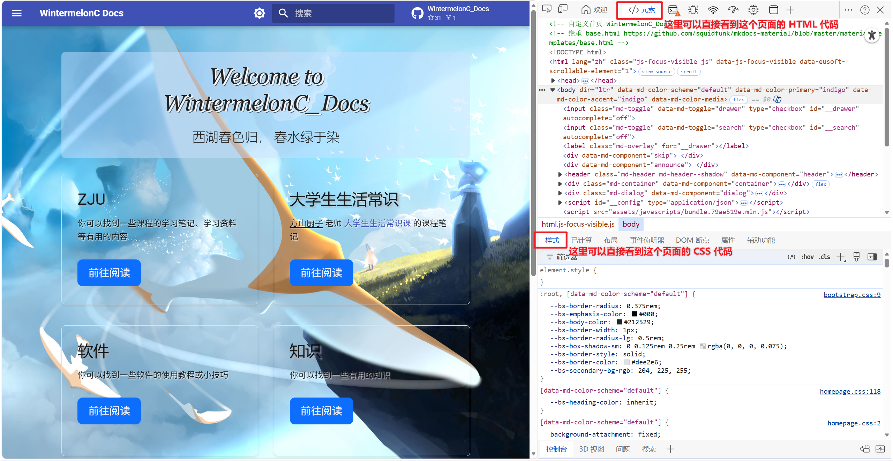
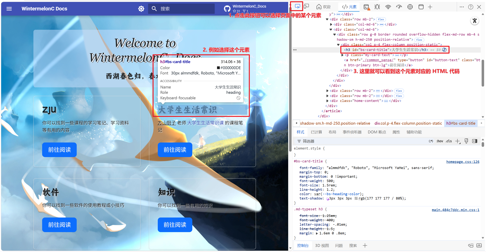

# Web

<!-- !!! tip "说明"

    本文档正在更新中…… -->

## 1 Web 三件套

HTML 告诉浏览器显示什么东西（骨架），css 告诉浏览器这些东西长什么样子（颜色、字体、大小等等）（皮肤和衣服），而 JavaScript 则是给网页添加动态功能和复杂交互的脚本语言（额外添彩的）（肌肉和神经）

[HTML](./html.md) 
[css](./css.md) 
[JavaScript](./javascript.md)

## 2 Web 框架

Web 框架是一套预先编写好的代码库和工具集。它提供了一套标准的开发模式、基础架构和内置功能，目的是让开发者能够更高效、更规范地构建复杂的 Web 应用程序

- 常见的前端框架：Vue.js, React, Angular
- 常见的后端框架：Spring Boot (Java), Django (Python), Express (Node.js)

Web 框架与 HTML、CSS、JavaScript 之间是高度依赖且互补的关系

核心本质：**所有的前端 Web 框架，底层最终都会转换（或编译）成原生的 HTML、CSS 和 JavaScript**。浏览器只认识这传统三件套。无论你在 React 中写了多么高级的 JSX 代码，或者在 Vue 中写了什么特殊指令，在项目打包发布并由浏览器执行时，都会被翻译成最基础的 HTML 标签、CSS 样式和原生 JS 代码

!!! tip "MkDocs"

    严格来说，MkDocs 不算前端 Web 框架。它是静态网站生成器（Static Site Generator, 简称 SSG）或文档构建工具

    使用 MkDocs，我们只需要写 Markdown 文件，MkDocs 的底层引擎和主题模板会自动帮我们生成对应的 HTML 骨架，并为我们注入写好的 CSS 样式和 JS 交互效果（和上面提到的核心本质一样）

## 3 浏览器调试工具

在浏览器页面上，按下 ++f12++ 快捷键可以打开浏览器调试工具

<figure markdown="span">
  { width="800" }
</figure>

<figure markdown="span">
  { width="800" }
</figure>