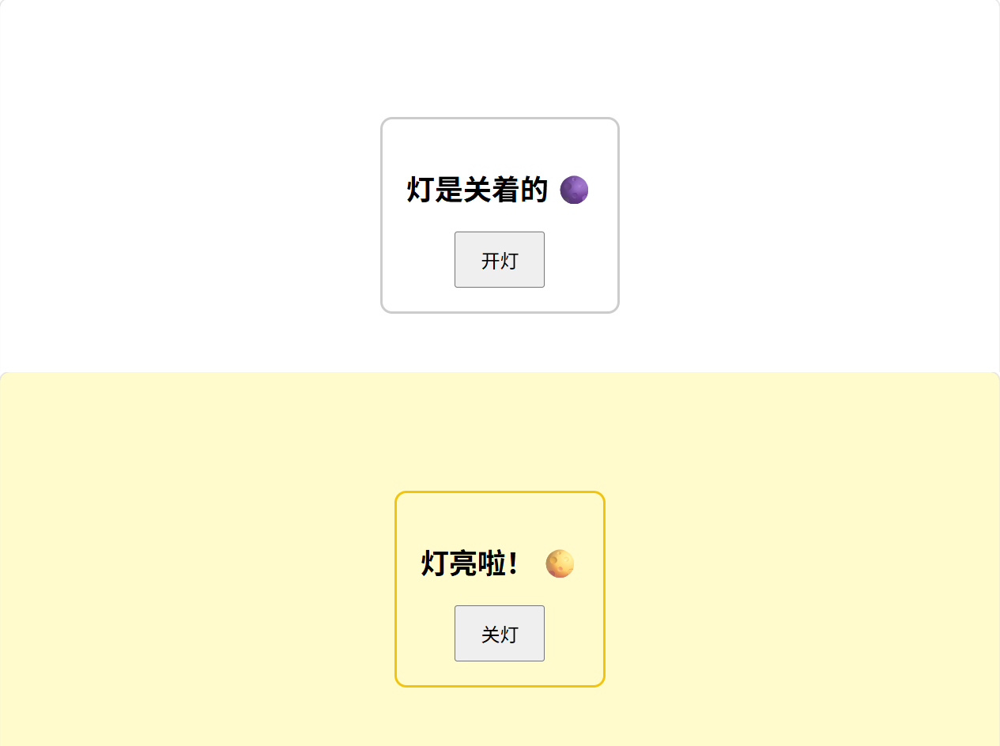

# JavaScript

<!-- !!! tip "说明"

    本文档正在更新中…… -->

!!! info "AI 介绍"

    JavaScript（简称 **JS**）是一种 **轻量级、解释型** 的编程语言，主要用于 **网页交互**，与 **HTML（结构）** 和 **CSS（样式）** 共同构成现代前端开发的三大核心技术。它可以让网页“动起来”，实现动态效果、数据交互和复杂功能
    
    **JavaScript 的核心特点**
    
    1. **脚本语言**：直接嵌入 HTML，由浏览器解释执行（无需编译）
    2. **事件驱动**：响应用户操作（点击、滚动、输入等）
    3. **跨平台**：所有现代浏览器均支持（Chrome、Firefox、Safari 等）
    4. **动态类型**：变量类型可随时改变（如 `let x = 10; x = "文本"`）
    
    **JavaScript 的作用**
    
    | 用途               | 示例                          |
    |--------------------|-----------------------------|
    | **操作 DOM**       | 动态修改 HTML/CSS            |
    | **处理用户事件**   | 点击按钮弹出提示框            |
    | **发送网络请求**   | 从服务器加载数据（AJAX/API）  |
    | **存储数据**       | 使用 `localStorage` 缓存信息 |
    | **动画与游戏**     | 实现 Canvas/WebGL 游戏       |
    
    **JavaScript 的现代应用**
    
    1. **前端框架**：React、Vue、Angular 等构建复杂单页应用（SPA）
    2. **后端开发**：Node.js 允许用 JavaScript 写服务器代码
    3. **移动应用**：React Native 开发跨平台 App
    4. **游戏开发**：使用 Phaser、Three.js 库
    
    **与 HTML/CSS 的关系**
    
    - **HTML** 提供结构，**CSS** 控制样式，**JS** 添加交互
    
    **为什么学习 JavaScript？**
    
    1. 所有浏览器的默认编程语言  
    2. 生态强大（npm 有数百万开源库）  
    3. 全栈开发（前端 + Node.js 后端）  
    4. 高薪资需求（前端/全栈工程师必备）

## 1 基本语法

```javascript linenums="1"
// 变量
let name = "张三";  // 声明一个变量叫 name，里面装着文本 "张三"
let count = 0;     // 声明一个变量叫 count，里面装着数字 0

// 函数
function sayHello() {
    alert("你好鸭"); // 浏览器的弹窗指令
}

// 操作 DOM
// 找到网页里 id 为 "title" 的元素，把它的文字改成 "新大标题"
document.getElementById("title").innerText = "新大标题";
```

JS 与 HTML 结合的三种方式：

1. 外部脚本：把 JS 代码写在独立的 `.js` 文件里，然后在 HTML 中用 `<script src="script.js"></script>` 引入（通常把这行代码放在 `<body>` 标签的最底部）
2. 内部脚本：直接把 JS 代码写在 HTML 文件内的 `<script>` 标签之中
3. 内联脚本：直接写在 HTML 标签的事件属性上，比如 `<button onclick="alert('点我干嘛')">`

## 2 简单示例

=== "index.html"

    ```html linenums="1"
    <!DOCTYPE html>
    <html lang="zh-CN">
    <head>
        <meta charset="UTF-8">
        <title>分离式前端代码示例</title>
        <!-- 引入外部 CSS 文件：通常写在 <head> 里面 -->
        <link rel="stylesheet" href="style.css">
    </head>
    <body>
        <!-- 网页的内容架构 -->
        <div id="myBox" class="box">
            <h2 id="statusText">灯是关着的 🌑</h2>
            <button id="switchBtn">开灯</button>
        </div>
        <!-- 
          引入外部 JS 文件：
          通常写在 <body> 标签的最底部
          原因：网页会从上往下加载。把 JS 放在最下面，能确保 HTML 元素（如上面的 div、按钮）
          已经先被浏览器加载渲染出来了，这样 JS 才能找得到它们并添加事件。
        -->
        <script src="script.js"></script>
    </body>
    </html>
    ```

=== "style.css"

    ```css linenums="1"
    body { 
        text-align: center; 
        margin-top: 100px; 
        font-family: sans-serif; 
        /* 用 CSS 控制网页默认的背景颜色 */
        background-color: white; 
        transition: 0.3s; /* 让背景色和边框颜色的切换具备平滑动画 */
    }
    
    .box {
        padding: 20px;
        border: 2px solid #ccc;
        border-radius: 10px;
        display: inline-block;
        transition: 0.3s; 
    }
    
    button { 
        padding: 10px 20px; 
        cursor: pointer; 
        font-size: 16px; 
    }
    ```

=== "script.js"

    ```javascript linenums="1"
    // 获取 HTML 中的元素
    let myBox = document.getElementById("myBox");
    let statusText = document.getElementById("statusText");
    let btn = document.getElementById("switchBtn");
    
    // 记住灯的状态变量
    let isLightOn = false;
    
    // 监听按钮的点击事件
    btn.addEventListener("click", function() {
        if (isLightOn === false) {
            // 开灯操作
            document.body.style.backgroundColor = "#fffbcc"; 
            myBox.style.borderColor = "#f1c40f"; 
            statusText.innerText = "灯亮啦！ 🌕";  
            btn.innerText = "关灯"; 
            isLightOn = true; 
        } else {
            // 关灯操作
            document.body.style.backgroundColor = "white"; 
            myBox.style.borderColor = "#ccc";
            statusText.innerText = "灯是关着的 🌑"; 
            btn.innerText = "开灯";
            isLightOn = false; 
        }
    });
    ```

在 VS Code 使用插件预览如下：

<figure markdown="span">
  { width="600" }
</figure>