# 1 安装与配置

!!! tip "说明"

    本文档正在更新中……

## 1 Git 安装

### 1.1 Git 下载

!!! info "说明"

    1. 本文档使用 Windows 系统进行演示
    2. 本文档使用 Git 2.49.0 版本进行演示

下载 git：访问[Git - Downloading Package](https://git-scm.com/downloads/win){:target="_blank"}

<figure markdown="span">
    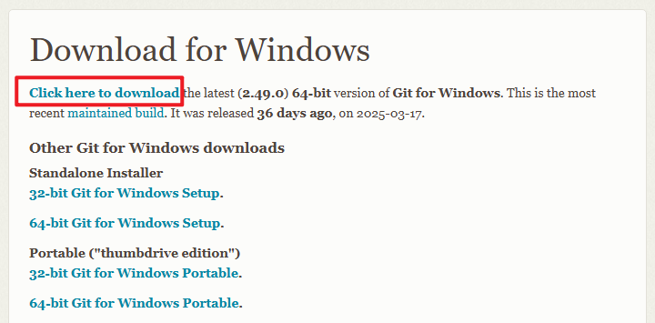{ width="600" }
</figure>

点击 ^^Click here to download^^ 按钮下载 git（Windows 64 位）

下载过程中浏览器可能会发出警告，选择 ^^保留^^ 即可

<figure markdown="span">
    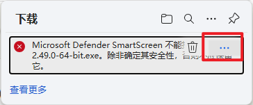{ width="400" }
</figure>

<figure markdown="span">
    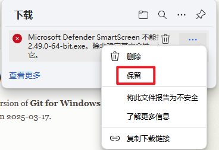{ width="400" }
</figure>

### 1.2 Git 安装

运行下载的文件

!!! info "说明"

    安装过程中，会有很多需要选择的配置选项，其中大多数的配置选项都是可以后面自行修改的，所以不要太过纠结啦。有不懂的配置选项可以直接问 AI

<figure markdown="span">
    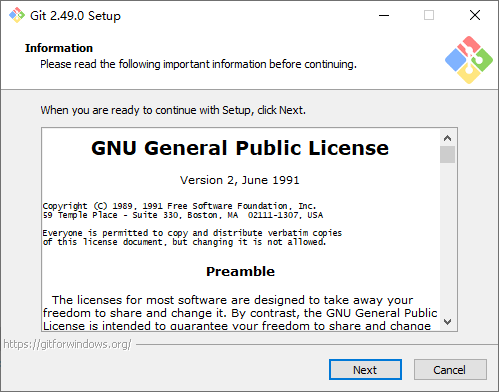{ width="600" }
</figure>

点击 Next

<figure markdown="span">
    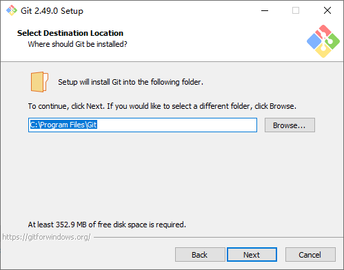{ width="600" }
</figure>

选择安装路径，==建议安装在非 C 盘目录下==。选择完成后，点击 Next

!!! info "说明"

    本节使用 Windows 虚拟机进行演示，就不更改安装位置了

<figure markdown="span">
    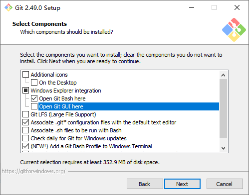{ width="600" }
</figure>

选择安装选项，推荐如下设置（可根据自身需求进行调整）：

- [ ] Additional icons
    - [ ] On the Desktop：在电脑桌面上创建快捷方式，没必要勾选
- [x] Windows Explorer integration：鼠标右键时出现的选项
    - [x] Open Git Bash here：在当前文件夹下打开 Git Bash
    - [ ] Open Git GUI here：在当前文件夹下打开 Git GUI。一般用不到
- [ ] Git LFS (Large File Support)：Git LFS 专门用于高效管理大文件。一般用不到。如果以后需要用的话，也可以单独下载安装
- [x] Associate .git* configuration files with the default text editor：将 Git 相关的配置文件与系统的默认文本编辑器关联。勾选后，双击这些文件，系统会自动用你设置的默认文本编辑器（如 VS Code 等）打开
- [ ] Associate .sh files to be run with Bash：勾选后，双击 `.sh` 文件时，系统会直接用 Git Bash 执行该脚本。取消勾选，`.sh` 文件会默认用文本编辑器打开
- [ ] Check daily for Git for Windows updates：自动检查 Git 是否存在可用更新
- [x] Add a Git Bash Profile to Windows Terminal：将 Git Bash 的启动项集成到 Windows Terminal（Windows 终端）中，方便你直接在 Windows Terminal 中使用 Git Bash
- [ ] Scalar：专门用于优化超大型 Git 仓库的性能。同样一般用不到。如果以后需要用的话，也可以单独下载安装

选择完成后，点击 Next

<figure markdown="span">
    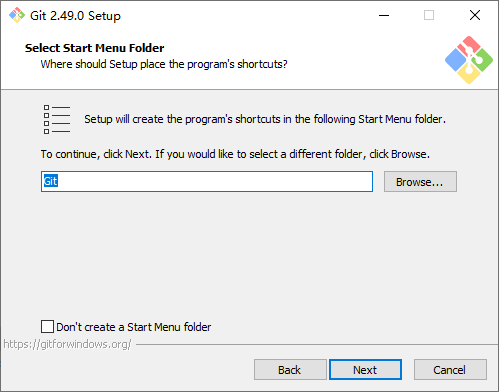{ width="600" }
</figure>

选择开始菜单位置，保持默认即可，点击 Next

<figure markdown="span">
    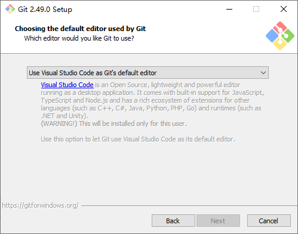{ width="600" }
</figure>

选择 Git 默认编辑器，我这里选择 VS Code。选择完成后，点击 Next

!!! info "说明"

    1. 演示用的虚拟机没有安装 VS Code，所以 Next 按钮是不可点击的
    2. 如果想使用 VS Code 但还没有安装的话，选择默认的 Vim 编辑器即可，后面我们可以自行更改 Git 的默认编辑器的
    3. VS Code 的使用，我们后文会介绍

<figure markdown="span">
    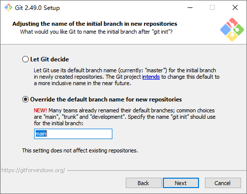{ width="600" }
</figure>

选择默认主分支名称，建议选择第 2 个选项并以 `main` 作为默认主分支名称。选择完成后，点击 Next

<figure markdown="span">
    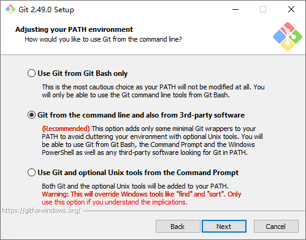{ width="600" }
</figure>

选择 PATH 环境路径，保持默认的第 2 个选项即可。点击 Next

<figure markdown="span">
    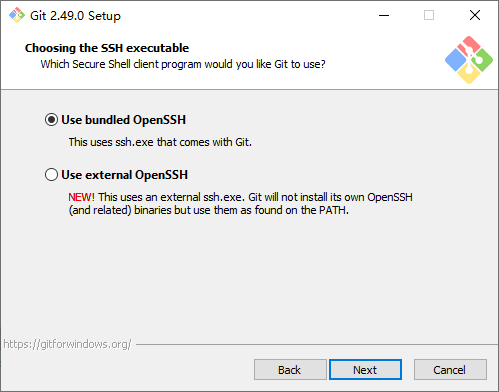{ width="600" }
</figure>

选择 SSH 执行程序，保持默认的第 1 个选项即可，点击 Next

<figure markdown="span">
    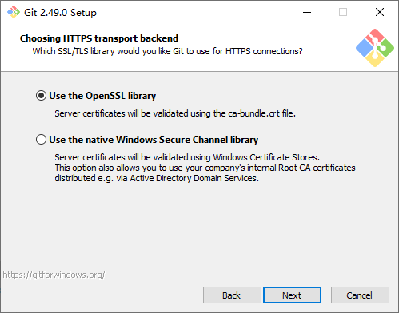{ width="600" }
</figure>

选择加密库处理 HTTPS 连接，建议选择第 1 个选项，点击 Next

<figure markdown="span">
    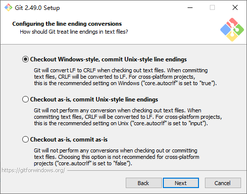{ width="600" }
</figure>

选择文件行尾序列格式，Windows 系统推荐选择第 1 个选项（因为 Windows 系统文件的行尾序列格式是 CRLF）。点击 Next

<figure markdown="span">
    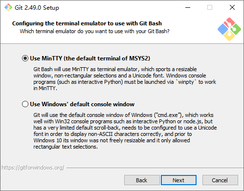{ width="600" }
</figure>

选择终端界面，保持默认的第 1 个选项即可，点击 Next

<figure markdown="span">
    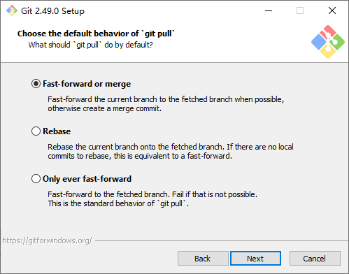{ width="600" }
</figure>

选择 `git pull` 的默认行为，保持默认的第 1 个选项即可，点击 Next

<figure markdown="span">
    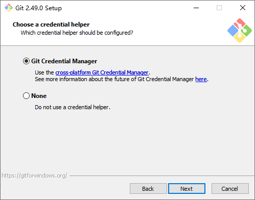{ width="600" }
</figure>

选择认证凭据的管理方式，保持默认的第 1 个选项即可，点击 Next

<figure markdown="span">
    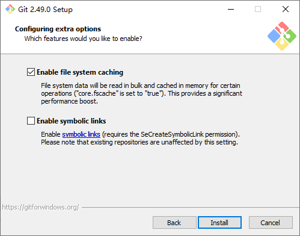{ width="600" }
</figure>

选择额外配置选项，保持默认的只勾选第 1 个选项即可，点击 Install

等待安装完成

<figure markdown="span">
    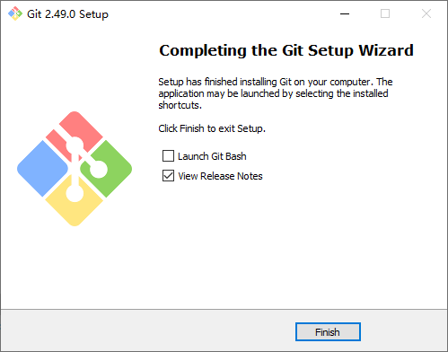{ width="600" }
</figure>

- [ ] Launch Git Bash：勾选后，点击 Finish 后会立即打开 Git Bash
- [ ] View Release Notes：勾选后，点击 Finish 后会立即在浏览器打开 Git 发行文件

点击 Finish 完成安装

## 2 Git 配置
