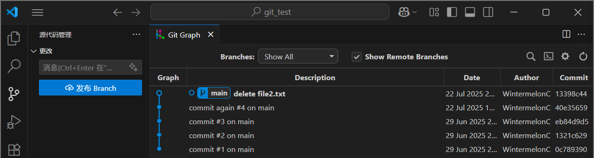

# 2 基本操作

<!-- !!! tip "说明"

    本文档正在更新中…… -->

!!! tip "建议"

    git 其实很简单，多多实操就会了。建议跟着本文档实操一遍

## 1 GUI 工具

Git 的 GUI 工具（图形用户界面工具）是为 Git 版本控制系统提供的可视化操作界面，可以通过图形化操作代替命令行。但是新手学习还是建议掌握一些基本的命令，再去使用 GUI 工具。不过，本文档为方便演示，使用 VS Code 内置的 Git 的工具以及对应的扩展进行演示。这样可以方便查看分支图形，便于理解。文档中也会指出图形化操作对应的等效命令

[VS Code 教程](../../application/vscode/index.md){:target="_blank"}

本文档使用的扩展：Git Graph

<figure markdown="span">
    { width="600" }
</figure>

!!! tip "配置 VS Code 为 git 默认编辑器"

    > 之前安装 git 时提到过的东西

    在终端中输入命令：

    ```bash linenums="1"
    $ git config --global core.editor "code --wait"
    ```

## 2 Git 仓库

!!! info "AI 解释"

    Git 仓库是一个特殊的目录（文件夹），它包含：

    1. 项目文件：代码、文档、资源等
    2. 版本历史：所有文件的修改记录（谁、何时、如何修改的）
    3. 配置信息：如分支、远程仓库地址等

    仓库通过隐藏的 `.git` 目录（位于项目根目录下）存储这些元数据

为了练习 git 的使用，可以找一个地方创建文件夹 `git_test`，（用 VS Code）打开这个文件夹

打开终端，使用以下命令来创建一个 git 仓库

```bash linenums="1"
$ git init
Initialized empty Git repository in G:/Project/git_test/.git/
```

<figure markdown="span">
    { width="600" }
    <figcaption markdown>git 创建了一个 `.git` 文件夹</figcaption>
</figure>

git 仓库的类型：

1. 本地仓库：存储在开发者自己的计算机上，独立工作
2. 远程仓库：托管在服务器（如 GitHub、GitLab、Gitee）上，用于团队协作和备份

远程仓库的相关操作在之后会介绍

## 3 Git 提交

!!! info "AI 解释"
    
    Git 的提交（`git commit`）是版本控制的核心操作，用于将代码的变更 **永久记录** 到本地仓库的历史中。可以将其理解为“保存项目的一个快照”

    > 相当于我们 **备份** 一大堆文件，不过是交给 git 来管理。后续如果我们想回到之前某个保存的备份（或者说版本），可以 ++ctrl+z++ 撤回（对应的是 `git reset` 操作）

在尝试使用 git 提交命令之前，我们先来了解 git 的 3 个区域和文件的 4 种状态

!!! info "AI 解释：Git 的三个核心区域"

    1. 工作区（Working Directory）

        1. 是什么：你直接看到的项目目录（即本地文件系统）
        2. 特点：所有文件的编辑、新增、删除都在这里进行
        3. 操作：直接修改文件（如用 IDE 或文本编辑器）

    2. 暂存区（Staging Area / Index）

        1. 是什么：一个“中间区域”，临时存放准备提交的变更
        2. 作用：选择性提交（例如只提交部分修改的文件）
        3. 操作：通过 `git add` 将工作区的变更添加到暂存区

    3. 本地仓库（Local Repository）

        1. 是什么：Git 的版本历史存储（位于 `.git` 目录中）
        2. 作用：永久保存提交（Commit）的快照
        3. 操作：通过 `git commit` 将暂存区的内容存入仓库

!!! info "AI 解释：文件的四种状态"

    1. 未跟踪（Untracked）

        1. 含义：文件是新创建的，Git 之前未记录过它
        2. 示例：新建的 `index.html` 文件
        3. 如何进入暂存区：`git add <file>`

    2. 已修改（Modified）

        1. 含义：已跟踪的文件被修改，但未暂存
        2. 示例：修改了已有的 `script.js` 文件但未 `git add`
        3. 如何进入暂存区：`git add <file>`

    3. 已暂存（Staged）

        1. 含义：文件的变更已添加到暂存区，等待提交
        2. 示例：执行 `git add README.md` 后的状态
        3. 如何提交到仓库：`git commit`

    4. 未修改（Unmodified）

        1. 含义：文件与仓库中最新提交的版本一致，无变更
        2. 示例：刚克隆仓库或刚提交后的文件状态
        3. 触发变化：编辑文件 → 变为 Modified；删除文件 → 变为 Untracked

> 暂时不理解没关系，本文档后续会解释并给出状态转移图

使用以下命令来查看 git 仓库的状态

```bash linenums="1"
$ git status
On branch main  # 处于 main 分支上

No commits yet  # 还没提交过

nothing to commit (create/copy files and use "git add" to track)  # 没东西需要提交
```

- `git status`：很有用的命令，可以查看当前 git 仓库的各种状态

### 3.1 第 1 次提交

我们先创建一个文件来尝试使用 git 提交命令，新建文件 `file1.txt`，并写入一些内容

```text linenums="1" title="file1.txt"
这是 file1 的第 1 行
```

!!! question ""

    尝试输入 `git status`，看看此时输出什么信息

这就是我们这个“项目”的第 1 个版本了，现在我们需要提交上去（也就是将此文件存储到本地仓库当中），永久记录这个版本

<figure markdown="span">
    { width="600" }
    <figcaption>工作区域转移图</figcaption>
</figure>

提交的流程：

1. 修改文件：在工作目录中编辑代码
2. 添加到暂存区：通过 `git add {文件}` 选择要提交的变更
3. 执行提交：`git commit -m "{提交说明}"`

依次执行：

```bash linenums="1"
$ git add .
$ git commit -m "commit #1 on main"
```

- 将文件添加到暂存区

    - `git add {filepath}`：将某个文件添加到暂存区
    - `git add .`：将所有文件添加到暂存区
    - `git add *.txt`：将所有 `.txt` 文件添加到暂存区

- 将文件添加到本地仓库

    - `git commit -m {message}`：将暂存区中的文件添加到本地仓库。`{message}` 是需要输入的提交信息

> 有关提交信息的规范格式，见 [Git 规则](./index.md#21-提交信息){:target="_blank"}

!!! tip "VS Code"

    也可以使用 VS Code 的 GUI 来进行操作，某些操作与特定的 git 命令等效

    <div class="grid" markdown>
    <div markdown>
    <figure markdown="span">
    { width="400" }
    </figure>
    </div>
    <div markdown>
    <figure markdown="span">
    { width="400" }
    </figure>
    </div>
    </div>

这样我们就得到了一个提交版本，记录了这个版本整个项目的状态

### 3.2 第 2 次提交

接下来，我们修改 `file1.txt`

```text linenums="1" title="file1.txt"
这是 file1 的第 1 行
这是 file1 的第 2 行
```

!!! question ""

    尝试输入 `git status`，看看此时输出什么信息

我们再次进行一次提交，不过这次我们使用这条指令

```bash linenums="1"
$ git commit -am "commit #2 on main"
```

- `git commit -am {message}`：将所有已经跟踪过的文件（即那些已经被纳入版本控制、在仓库中存在历史记录的文件）中的修改添加到暂存区，并执行一次提交，并允许你附带提交信息。某些情况下等效于依次执行 `git add` 和 `git commit`

### 3.3 第 3 次提交

修改 `file1.txt`，并新建文件 `file2.txt`

```text linenums="1" title="file1.txt"
这是 file1 的第 1 行
这是 file1 的第 2 行
这是 file1 的第 3 行
```

```text linenums="1" title="file2.txt"
这是 file2 的第 1 行
```

!!! question ""

    尝试输入 `git status`，看看此时输出什么信息

此时提交时，如果直接使用 `git commit -am`，并不会提交 `file2.txt`，因为它之前没有被 git 记录过

所以，我们输入以下指令来执行提交

```bash linenums="1"
$ git add .
$ git commit -m "commit #3 on main"
```

## 4 Git 提交记录

我们已经提交过 3 次了，那么如何查看提交记录呢

使用 `git log` 命令

```bash linenums="1"
$ git log
# 后面一串字符是提交 Hash 码，一个 Hash 码对应一个提交，因此，可以根据 Hash 码来找到某次提交记录
commit eb84d9d5893dc1179b02a05682458ce07923e5e4 (HEAD -> main)
# 这里显示了提交者的信息
Author: WintermelonC <145361960+WintermelonC@users.noreply.github.com>
# 提交日期
Date:   Sun Jun 29 22:43:00 2025 +0800

# 提交信息
    commit #3 on main

commit 1321c62993080f0806c073b73a3f6a92f1029da4
Author: WintermelonC <145361960+WintermelonC@users.noreply.github.com>
Date:   Sun Jun 29 22:38:36 2025 +0800

    commit #2 on main

commit 0c789390b5d43f387284fe12787ff3904d15f8cb
Author: WintermelonC <145361960+WintermelonC@users.noreply.github.com>
Date:   Sun Jun 29 22:29:50 2025 +0800

    commit #1 on main
```

简化输出：

- `git log --oneline`：提交信息一行显示
- `git log --graph --oneline --all`：图形化显示提交记录

```bash linenums="1"
$ git log --oneline
eb84d9d (HEAD -> main) commit #3 on main
1321c62 commit #2 on main
0c78939 commit #1 on main
$ git log --graph --oneline --all
# 这条指令的区别不是很明显，等后面涉及到分支指令后就有区分度了
* eb84d9d (HEAD -> main) commit #3 on main
* 1321c62 commit #2 on main
* 0c78939 commit #1 on main
```

> 但 `git log --graph --oneline --all` 完全可以使用 GUI 工具来替代

!!! tip "VS Code"

    可以在 VS Code 中查看提交记录

    <figure markdown="span">
        { width="600" }
    </figure>

    <figure markdown="span">
        { width="600" }
    </figure>

### 4.1 查看某个提交记录

现在，我们想查看当时第 1 次提交时，项目的状态是怎么样的，输入命令

```bash linenums="1"
# 0c78939 是第 1 次提交的 Hash 码的前 7 位
$ git checkout 0c78939
Previous HEAD position was eb84d9d commit #3 on main
HEAD is now at 0c78939 commit #1 on main
```

可以看到，此时我们的项目状态已经转变成第 1 次提交时的版本了

<figure markdown="span">
    { width="600" }
</figure>

> 此时，可以对项目进行修改。但以我们现在所学的东西，不建议这样做，因为这通常会涉及到分支操作

!!! tip "HEAD 指针"

    在 Git 中，HEAD 是一个特殊的指针，它指向当前所在的提交（commit），也就是你的工作目录所基于的版本。可以把它理解为你“正在查看的位置”或“当前的工作点”

    在 Git Graph 中，提交信息前面的蓝色圆圈就代表 HEAD 指针所在的位置

    所以，我们刚才 checkout 到第 1 次的提交，就是把 HEAD 指针移动到第 1 次提交的位置

    另外，我们把每次提交的那个位置称作一个 **提交节点**。那么，目前我们有 3 个提交节点，HEAD 正处于第 1 个提交节点上

想要回到最新的版本状态，输入

```bash linenums="1"
$ git checkout main
Previous HEAD position was 0c78939 commit #1 on main
Switched to branch 'main'
```

!!! question "为什么不是 `git checkout eb84d9d`"

    如果输入 `git checkout eb84d9d`，也能回到最新的版本状态，但此时 HEAD 指针处于悬空状态，即不在任何分支上。如果在这种状态下提交信息，会发现 main 分支并没有更新，而这个新的提交节点由于处于悬空状态，git 只是临时保存它，很容易丢失

!!! tip "VS Code"

    使用 Git Graph 可以在不输入 `git checkout` 的情况下，查看某个版本的文件内容

    <figure markdown="span">
        { width="600" }
    </figure>

## 5 Git 差异

假如我们对 `file1.txt` 和 `file2.txt` 做了如下修改：

```text linenums="1" title="file1.txt"
修改第 1 行，删除第 2 行
这是 file1 的第 3 行
新增第 4 行
```

```text linenums="1" title="file2.txt"
这是 file2 的第 1 行
新增第 2 行
```

现在这些修改还未暂存，也未提交。如果我们想知道这次修改了哪些内容，就可以使用 `git diff` 来查看

`git diff` 是 Git 的一个常用命令，用于显示工作目录、暂存区（索引）或不同提交之间的文件差异。它会对比文件内容的变化，并以文本形式展示具体的修改内容

### 5.1 工作区 vs 暂存区

现在我们查看工作区与暂存区之间的差异

```bash linenums="1"
$ git diff
diff --git a/file1.txt b/file1.txt
index aa4353d..e16d955 100644
--- a/file1.txt
+++ b/file1.txt
@@ -1,3 +1,3 @@
-这是 file1 的第 1 行
-这是 file1 的第 2 行
-这是 file1 的第 3 行
\ No newline at end of file
+修改第 1 行，删除第 2 行
+这是 file1 的第 3 行
+新增第 4 行
\ No newline at end of file
diff --git a/file2.txt b/file2.txt
index 3705395..c11ac0b 100644
--- a/file2.txt
+++ b/file2.txt
@@ -1 +1,2 @@
-这是 file2 的第 1 行
\ No newline at end of file
+这是 file2 的第 1 行
+新增第 2 行
\ No newline at end of file
```

从输出的信息可以查看现在我们修改了哪些文件和对应的内容

!!! question "输出信息怎么看"

    具体输出信息的解读本文档不介绍（因为我很少用命令行查看差异），可以自行搜索

也可以指定查看某个文件

```bash linenums="1"
$ git diff file1.txt
diff --git a/file1.txt b/file1.txt
index aa4353d..e16d955 100644
--- a/file1.txt
+++ b/file1.txt
@@ -1,3 +1,3 @@
-这是 file1 的第 1 行
-这是 file1 的第 2 行
-这是 file1 的第 3 行
\ No newline at end of file
+修改第 1 行，删除第 2 行
+这是 file1 的第 3 行
+新增第 4 行
\ No newline at end of file
```

!!! tip "VS Code"

    在 VS Code 当中，可以很方便地查看文件差异。直接点击某个文件的那一行

    <figure markdown="span">
        { width="600" }
    </figure>

    能够很直观的看到，git 将我们的修改理解为：删除原来的第 1、2 行，新增一行内容为“修改第 1 行，删除第 2 行” 的文字；新增一行内容为“新增第 4 行”的文字

    <figure markdown="span">
        { width="600" }
    </figure>

    同时可以通过点击按钮，很方便地暂存特定的修改，可以实现只暂存部分修改（之前介绍的命令是暂存全部的修改。当然，只暂存部分修改也有对应的 git 命令，但本文档不介绍）

    <figure markdown="span">
        { width="600" }
    </figure>

    也可以正常打开文件，点击被修改的行的左侧的带有颜色的竖杠，查看这一块区域的修改内容

### 5.2 比较两个提交

查看某两次提交的差异：

```bash linenums="1"
# eb84d9d5 是第 3 次提交的 Hash 码前 8 位
# 1321c629 是第 2 次提交的 Hash 码前 8 位
# 所以这个命令是比较第 2 次提交和第 3 次提交之前的差异
$ git diff eb84d9d5 1321c629
diff --git a/file1.txt b/file1.txt
index aa4353d..0e81b66 100644
--- a/file1.txt
+++ b/file1.txt
@@ -1,3 +1,2 @@
 这是 file1 的第 1 行
-这是 file1 的第 2 行
-这是 file1 的第 3 行
\ No newline at end of file
+这是 file1 的第 2 行
\ No newline at end of file
diff --git a/file2.txt b/file2.txt
deleted file mode 100644
index 3705395..0000000
--- a/file2.txt
+++ /dev/null
@@ -1 +0,0 @@
-这是 file2 的第 1 行
\ No newline at end of file
```

!!! tip "VS Code"

    <figure markdown="span">
        { width="600" }
    </figure>

    可以使用 Git Graph 来查看提交之间的差异。展开第 3 次提交，点击某个文件。会打开如下内容

    <figure markdown="span">
        { width="600" }
    </figure>

    可以看到这一标签页的标题包含“eb84d9d5^ ↔ eb84d9d5”，其中“eb84d9d5^”中的 `^` 符号，表示此提交的上一个提交。所以这和 `git diff eb84d9d5 1321c629` 的效果是一样的

### 5.3 比较两个分支

此外，`git diff` 还可以比较分支之间的差异，格式为：

```bash linenums="1"
$ git diff {branch_1} {branch_2}
```

## 6 Git 恢复

续接第 5 节的修改，即

```text linenums="1" title="file1.txt"
修改第 1 行，删除第 2 行
这是 file1 的第 3 行
新增第 4 行
```

```text linenums="1" title="file2.txt"
这是 file2 的第 1 行
新增第 2 行
```

我们现在只暂存 `file1.txt`

### 6.1 放弃已暂存的修改

将 `file1.txt` 从暂存区中移除，但保留我们之前修改的内容

```bash linenums="1"
$ git restore --staged file1.txt
# 移除所有文件
$ git restore --staged *
```

### 6.2 放弃工作区的修改

也就是将我们之前对 `file1.txt` 文件所做的修改全部撤销

```bash linenums="1"
$ git restore file1.txt
# 还原所有文件
$ git restore *
```

执行后，`file1.txt` 和 `file2.txt` 恢复成了原来的样子

!!! tip "VS Code"

    可以在 VS Code 中很方便地执行恢复操作

    <figure markdown="span">
        { width="600" }
    </figure>

    在查看文件差异时，左侧也有还原按钮，可以实现还原部分的修改

    <figure markdown="span">
        { width="600" }
    </figure>

## 7 Git 回退

续接第 5 节的修改，即

```text linenums="1" title="file1.txt"
修改第 1 行，删除第 2 行
这是 file1 的第 3 行
新增第 4 行
```

```text linenums="1" title="file2.txt"
这是 file2 的第 1 行
新增第 2 行
```

现在我们把这些修改都提交一下

<figure markdown="span">
    { width="600" }
</figure>

`git reset` 有三种模式：

1. `--soft`：仅移动 HEAD 指针，不修改暂存区和工作目录
2. `--mixed`（默认）：移动 HEAD 指针并重置暂存区，但不影响工作目录
3. `--hard`：彻底回退，移动 HEAD、重置暂存区和工作目录（会丢失未提交的修改）

### 7.1 `--soft`

`git reset --soft` 仅移动 HEAD 指针，保留暂存区和工作目录

我们输入以下命令

```bash linenums="1"
$ git reset --soft eb84d9d5
```

项目状态变为

<figure markdown="span">
    { width="600" }
</figure>

`file1.txt` `file2.txt` 的修改全部保留了，并且处在暂存区中；第 4 次提交被撤销了

因此，该模式其中一个适用场景是：撤销最近的提交，但保留修改（可用于重新提交）

我们可以重新提交一次，这次换一个提交信息

<figure markdown="span">
    { width="600" }
</figure>

### 7.2 `--mixed`

`git reset --mixed` 移动 HEAD 指针并重置暂存区，但不影响工作目录

如果不指定模式，则默认 `--mixed` 模式

我们输入以下命令

```bash linenums="1"
$ git reset eb84d9d5
```

项目状态变为

<figure markdown="span">
    { width="600" }
</figure>

`file1.txt` `file2.txt` 的修改全部保留了，并且不在暂存区当中；第 4 次提交被撤销了

适用场景：撤销提交和暂存，但保留工作目录的修改（可重新 `git add`）

### 7.3 `--hard`

> 续接第 7.1 节的项目状态

`git reset --hard` 彻底回退，移动 HEAD、重置暂存区和工作目录（会丢失未提交的修改）

我们输入以下命令

```bash linenums="1"
$ git reset --hard eb84d9d5
```

项目状态变为

<figure markdown="span">
    { width="600" }
</figure>

可以看到，`file1.txt` `file2.txt` 的修改被撤销了，第 4 次提交也被撤销了。这意味着我们无法找回之前第 4 次提交所做的修改了……吗？

!!! tip "git 的历史记录"

    如果误用 `git reset --hard` 删除了提交，可以通过 `git reflog` 找回，恢复误删的提交

    ```bash linenums="1" hl_lines="5"
    $ git reflog
    eb84d9d (HEAD -> main) HEAD@{0}: reset: moving to eb84d9d5
    40e3565 HEAD@{1}: reset: moving to 40e3565
    eb84d9d (HEAD -> main) HEAD@{2}: reset: moving to eb84d9d5
    40e3565 HEAD@{3}: commit: commit again #4 on main
    -- snip --
    ```

    > 由于我写文档时用到了这个操作来回退项目状态，因此输出信息会和大家的不太一样，不过具体情况具体分析就可以了

    根据输出信息，我们需要回退到 `40e3565` 这一版本。因此，输入

    ```bash linenums="1" hl_lines="5"
    $ git reset --hard 40e3565
    HEAD is now at 40e3565 commit again #4 on main
    ```

    此时，项目的状态就恢复了

    <figure markdown="span">
        { width="600" }
    </figure>

    !!! tip ""

        仔细看一看 `git reflog` 的输出，会发现 git 也有自己的历史记录，记录着每次执行 git 命令后项目的状态
        
        通过 `git reflog` 中的 Hash 码回退项目时，是回退到指定 Hash 码对应的指令执行后的状态

## 8 Git 删除

如果我们现在要删除某个文件，比如 `file2.txt`。正常就是直接在文件资源管理器中删掉它，也就是删除工作区中的文件。但别忘了，git 会跟踪这个文件的，因此这个文件的删除操作也会被 git 记录下来。所以，我们还需要暂存更改，然后提交，提交信息可以是“delete file2.txt”

那么“从工作区中删除文件” + “暂存更改”就相当于 `git rm`

我们现在使用这个指令来删除 `file2.txt` 这个文件

```bash linenums="1"
$ git rm file2.txt
rm 'file2.txt'
```

此时项目的状态变为

<figure markdown="span">
    { width="400" }
</figure>

然后执行一次提交就可以了

<figure markdown="span">
    { width="600" }
</figure>

## 9 `.gitignore` 文件

有时，项目当中的某些文件没必要让 git 跟踪，或者不能让 git 跟踪。那么，这就需要一个 `.gitignore` 文件来记录那些不需要 git 来跟踪的文件

!!! tip "`.gitignore` 应该忽略哪些文件"

    1. 操作系统/IDE 生成的临时文件
    2. 语言/框架相关的忽略项
    3. 构建工具和包管理器
    4. 本地开发配置文件
    5. 日志和缓存文件
    6. 测试和覆盖率报告
    7. 系统/用户特定文件
    8. 其他常见忽略项

`.gitignore` 文件编写规则：[2.3 `.gitignore` 文件](./index.md#23-gitignore-文件){:target="_blank"}

---

我们创建一个 `.gitignore` 文件

```text linenums="1" title=".gitignore"
# 也可以忽略 .gitignore 自己
.gitignore

# 忽略所有 .exe 文件
*.exe
```

现在写一个简单的 C 代码

```c linenums="1" title="hello.c"
#include <stdio.h>

int main() {
    printf("Hello, World!\n");
    return 0;
}
```

编译出 `.exe` 文件

现在项目的状态：

<figure markdown="span">
    { width="600" }
</figure>

`.gitignore` 和 `a.exe` 在左侧都是灰色的，这意味着它们被 git 忽略了。但是 `hello.c` 文件仍可以被 git 跟踪

现在我们做一次提交

<figure markdown="span">
    { width="600" }
</figure>

---

这时候我们修改 `.gitignore` 文件，将 `.c` 文件忽略掉

```text linenums="1" title=".gitignore"
# 也可以忽略 .gitignore 自己
.gitignore

# 忽略所有 .exe 文件
*.exe
*.c
```

但是，此时能够发现，`hello.c` 文件并没有忽略掉。这是因为 `hello.c` 已经在暂存区当中了，如果需要忽略，就需要将其从暂存区当中删除

```bash linenums="1"
$ git rm --cached hello.c
rm 'hello.c'
```

然后记得执行一次提交。因为将某个文件从暂存区当中删除，也视为一种更改

<figure markdown="span">
    { width="600" }
</figure>

之后，`hello.c` 文件的修改就会正常被 git 忽略掉了

## 10 总结

<figure markdown="span">
    { width="600" }
</figure>

相信在实操的过程当中，你会发现 VS Code 当中也会标注出文件的状态

| 状态 | 颜色 | 标记 | 说明 |
| :--: | :--: | :--: | :--: |
| 未修改 | 白色 | 无 | 文件与最新提交一致，无更改 |
| 已修改 | 黄色 | M | 文件内容被修改（Modified）|
| 未跟踪 | 绿色 | U | 新文件未纳入 Git 版本控制（Untracked） |
| 已删除 | 红色 | D | 文件从工作目录或暂存区中删除 |
| 冲突 | 红色 | ! | 合并或变基时发生冲突（Conflict），需手动解决 |
| 已忽略 | 灰色 | 无 | 文件被 `.gitignore` 忽略，不显示标记（除非开启 `git.showUntracked` 配置） |