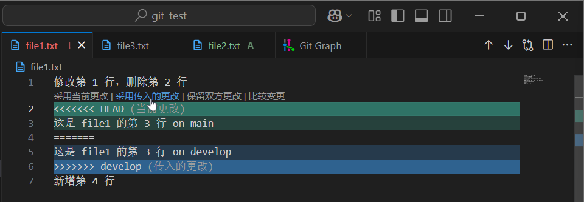

# 3 分支操作

<!-- !!! tip "说明"

    本文档正在更新中…… -->

!!! tip "建议"

    git 其实很简单，多多实操就会了。建议跟着本文档实操一遍

    有关 git 分支的使用，等到需要小组代码协作的时候，用着用着就会了。不过通常会涉及到 [4 远程操作](./ch4.md){:target="_blank"} 和 [5 多人协作](./ch5.md){:target="_blank"}

## 1 Git 分支

!!! tip "AI 解释"

    Git 分支是 Git 版本控制系统中的一个核心概念，它允许开发者在同一个代码库中并行开发不同的功能或修复不同的问题

    1. 分支是指向提交对象（commit）的可变指针，它代表了一条独立的开发线
    2. 默认分支：通常命名为 `main` 或 `master`（在较新版本中默认使用 `main`）
    3. 分支特性：

        1. 创建和切换分支非常快速且轻量
        2. 不同分支可以完全隔离开发
        3. 最终可以合并到主分支或其他分支

大致可以这样理解：

例如，你在开发一个游戏程序，可以有一个主分支作为 release 版本（就是最后呈现给玩家的），有一个 debug 分支（内部人员调试用的分支，可能显示碰撞箱等等的信息），还有一个 develop 分支，用于增加新的功能，完成后再 merge（合并）到主分支或 debug 分支上（就是将增加的内容同步到主分支上）

## 2 新建分支

续接 ^^2 基本操作 - 第 9 节^^ 的项目状态，现在 main 分支上只有一个 `file1.txt` 文件（其他文件被 `.gitignore` 忽略了哦）

我们从 main 分支的最新提交节点这里新建一个名为 `develop` 的分支

```bash linenums="1"
$ git branch develop
```

<figure markdown="span">
  { width="600" }
</figure>

接下来我们将 HEAD 指针切换到 `develop` 分支上

```bash linenums="1"
$ git switch develop
Switched to branch 'develop'
```

<figure markdown="span">
  { width="600" }
</figure>

之后就可以在这个 `develop` 分支上操作了，比如提交之类的

我们对项目做如下修改，并做一次提交

```text linenums="1" title="file1.txt"
修改第 1 行，删除第 2 行
这是 file1 的第 3 行 on develop
新增第 4 行
```

```text linenums="1" title="file2.txt"
这是 file2 的第 1 行 on develop
```

<figure markdown="span">
  { width="600" }
</figure>

接下来我们切换到 main 分支

```bash linenums="1"
$ git switch main   
Switched to branch 'main'
```

可以看到工作区自动切换到了 main 分支上的状态（`file1.txt` 是 main 分支上最后一次提交的状态，同时 `file2.txt` 也不存在）

接下来在 main 分支上新建一个 `file3.txt` 文件

```text linenums="1" title="file3.txt"
这是 file3 的第 1 行
```

修改 `file1.txt` 文件

```text linenums="1" title="file1.txt"
修改第 1 行，删除第 2 行
这是 file1 的第 3 行 on main
新增第 4 行
```

并做一次提交

<figure markdown="span">
  { width="600" }
</figure>

这下可以清楚地看到分支的样子了，`develop` 分支就是从 main 分支上的某个节点分出来的

## 3 合并分支

接下来我们可以把 develop 分支上的修改合并到 main 分支上。相关 git 命令是 `git merge`

`git merge {other_branch}` 是将名为 `other_branch` 的分支合并到当前所在的分支上的

因此，如果要把 develop 分支上的修改合并到 main 分支上，就要现处于 main 分支上，然后输入 `git merge develop`

```bash linenums="1"
$ git merge develop
Auto-merging file1.txt
CONFLICT (content): Merge conflict in file1.txt
Automatic merge failed; fix conflicts and then commit the result.
```

<figure markdown="span">
  { width="600" }
</figure>

可以看到，develop 分支上的 `file2.txt` 文件已经合并到了 main 分支上了，但是输出信息提示说 `file1.txt` 发生了合并冲突，这是因为 main 分支和 develop 分支对 `file1.txt` 的某个地方的修改产生了歧义（冲突），git 不知道应该保留哪个版本。这个时候我们就需要手动处理冲突

### 3.1 合并冲突

点击左侧的 `file1.txt`，可以在 VS Code 当中处理冲突

<figure markdown="span">
  { width="600" }
</figure>

可以看到 `<<<<<<<` 和 `=======` 之间的内容是当前 main 分支上的修改，`=======` 和 `>>>>>>>` 之间的内容是传入的 develop 分支上的修改。冲突点就发生在这里，我们可以选择保留哪一方的更改或者保留双方的更改

这里我们保留 develop 分支的更改

<figure markdown="span">
  { width="600" }
</figure>

然后保存并提交到暂存区

<figure markdown="span">
  { width="600" }
</figure>

然后做一次提交即可

<figure markdown="span">
  { width="600" }
</figure>

可以看到 git graph 上对 merge 操作的图形化绘制，是比较清楚的

## 4 其他分支操作

- `git branch -a`：查看所有分支
- `git switch -c {branch_name}`：创建分支并切换到此新分支上
- `git branch -d {branch_name}`：安全删除（已合并）
- `git branch -D {branch_name}`：强制删除（未合并）

> 有关分支 rebase（变基）等其他比较进阶的操作，本文档不介绍，因为我自己也没用过 😂

## 5 分支流

!!! tip "AI 解释"

    1. 功能分支工作流：

        1. 每个新功能在独立分支开发
        2. 完成后合并回主分支

    2. Git Flow：

        1. main - 稳定版本
        2. develop - 开发主线
        3. feature/xxx - 功能开发
        4. release/xxx - 发布准备
        5. hotfix/xxx - 紧急修复

    3. GitHub Flow：

        1. 更简单，只有 main 和功能分支
        2. 通过 Pull Request 进行代码审查和合并

    4. Trunk-Based Development：

        1. 更激进，开发者直接向 main 提交小改动
        2. 通过功能开关控制未完成功能的可见性

在 [5 多人协作](./ch5.md){:target="_blank"} 会简单介绍一下 GitHub Flow