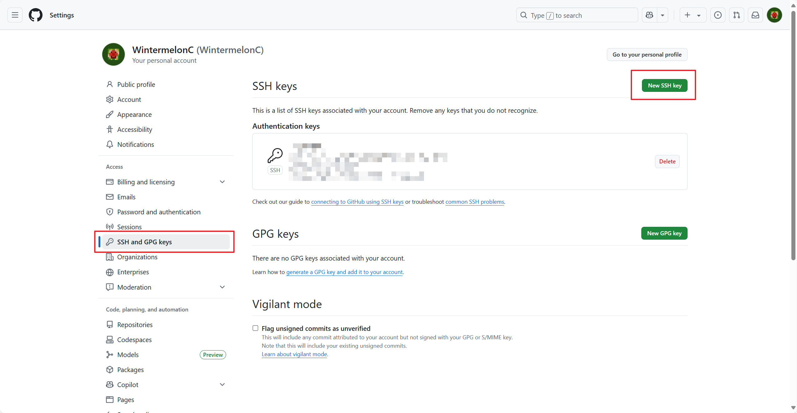
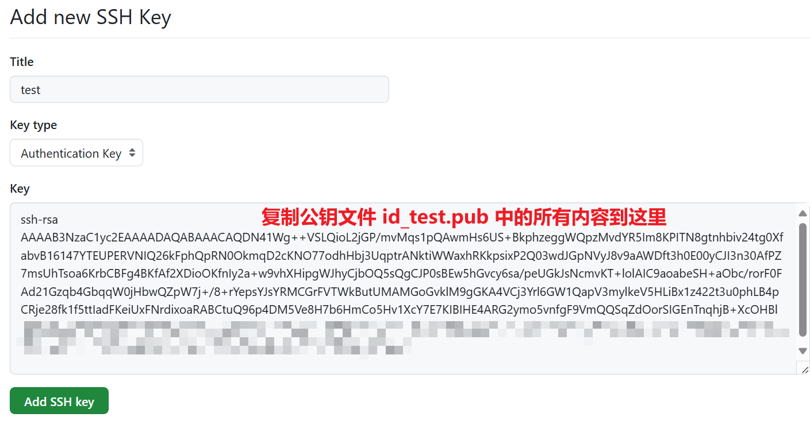

# 4 远程操作

!!! tip "说明"

    本文档正在更新中……

!!! tip "建议"

    git 其实很简单，多多实操就会了。建议跟着本文档实操一遍

    在实操过程中，可能会遇到各种各样奇奇怪怪的网络问题，本文档提供的解决方法肯定是不全的，需要自行善用搜索解决

## 1 Github

详见 [Github](../github/index.md){:target="_blank"}

## 2 SSH 配置

!!! info "AI 解释"

    SSH（Secure Shell）是一种加密的网络协议，用于安全地访问和管理远程计算机或服务器。它通过加密通信通道，防止数据在传输过程中被窃听或篡改，是替代传统不安全的Telnet、FTP等协议的主流方案

推荐使用 SSH 与 github 远程仓库建立连接并通信

### 2.1 本地电脑配置

!!! tip "提示"

    本文档使用 Windows 系统进行演示

打开用户目录 `%USERPROFILE%`（例如 `C:\Users\example\`），找到名为 `.ssh` 的文件夹并打开（若没有自行新建文件夹即可）

在此目录下打开终端，输入命令创建 SSH 密钥

```bash linenums="1"
C:\Users\example\.ssh>ssh-keygen -t rsa -b 4096
Generating public/private rsa key pair.
Enter file in which to save the key (C:\Users\example/.ssh/id_rsa): id_test
Enter passphrase (empty for no passphrase):
Enter same passphrase again:
Your identification has been saved in id_test
Your public key has been saved in id_test.pub
-- snip --
```

- `ssh-keygen -t rsa -b 4096`：

    - `-t`：指定密钥类型（type）
    - `rsa`：rsa 是一种加密算法，用于生成密钥
    - `-b`：指定密钥长度（bits）
    - `4096`：密钥长度为 4096 位

- `Enter file in which to save the key (C:\Users\example/.ssh/id_rsa):`：输入存储密钥的文件名称，若不输入，默认名称为 id_rsa（如果需要多个 SSH 密钥的话，必须自定义名称，不然新的会覆盖掉旧的）
- `Enter passphrase (empty for no passphrase):`：设置密码，可不设置。即使不设置密码，rsa 算法每次生成的密钥内容也不相同

之后，生成一个公钥文件 `id_test.pub` 和私钥文件 `id_test`，其中公钥文件可以公开，而 ==私钥文件万万不可公开==

---

新建一个名为 `config` 的文件，打开编辑

```text linenums="1"
# github
Host github.com
HostName github.com
PreferredAuthentications publickey
IdentityFile ~/.ssh/id_test

```

- `# github`：注释行
- `Host github.com`：定义主机的别名
- `HostName github.com`：指定实际连接的主机名（这里是 GitHub 的真实域名）
- `PreferredAuthentications publickey`：优先使用 publickey 方式认证（即 SSH 密钥登录）
- `IdentityFile ~/.ssh/id_test`：指定用于认证的私钥文件路径，`id_test` 根据实际私钥文件的名称进行修改

这个文件的作用简单来说就是，当我们访问 github 时，会使用 `id_test` 这个私钥文件进行验证

### 2.2 Github 配置

打开 github 设置 ^^SSH and GPG keys^^，新建一个 SSH key

<figure markdown="span">
  { width="800" }
</figure>

复制公钥文件 `id_test.pub` 中的所有内容到 Key 栏中，Title 栏相当于起个名字

<figure markdown="span">
  { width="800" }
</figure>

之后点击 ^^Add SSH key^^ 按钮即可

### 2.3 验证连接

设置完成后，打开终端，输入命令验证连接

```bash linenums="1"
$ ssh -T git@github.com
The authenticity of host 'github.com (20.205.243.166)' can't be established.
-- snip --
This key is not known by any other names.
Are you sure you want to continue connecting (yes/no/[fingerprint])? yes
Warning: Permanently added 'github.com' (ED25519) to the list of known hosts.
Hi WintermelonC! You've successfully authenticated, but GitHub does not provide shell access.
```

- `ssh -T git@github.com`：此命令中的 `github.com` 字段实际上就是我们在 `config` 文件中配置的主机别名
- `Are you sure you want to continue connecting (yes/no/[fingerprint])?`：输入 `yes` 确认
- `Hi WintermelonC! You've successfully authenticated, but GitHub does not provide shell access.`：出现此行，说明 SSH 连接成功

之后 `.ssh` 文件夹中会多出 `known_hosts` 和 `known_hosts.old` 两个文件，不用去管

!!! tip "多账户配置"

    如果想在同一台电脑上使用两个 github 账号，但这两个账号使用不同的 SSH 密钥，该如何配置呢。这就需要修改 `config` 文件当中的主机别名了，以及需要修改 git 本地仓库的本地配置等等。具体方法本文档不涉及，感兴趣或有需要请自行搜索

!!! tip "网络问题"

    关于 SSH 的各种奇奇怪怪的网络问题，分享一个我的经验

    我平常用 github 的时候，会开启加速器，如果需要使用 SSH 连接的话（如使用 git 的远程操作命令），我会关闭加速器。我这样用起来没有什么问题

    但有时候使用 git 的远程操作命令时，会报错（具体报错信息忘了，后面遇到再补充）。这时候换一个 WIFI 就好了

    之前我遇到其他报错信息时，我尝试过上网搜索，但是网上的方法我都试过，在我这里都不适用，很奇怪

## 3 Git 远程操作