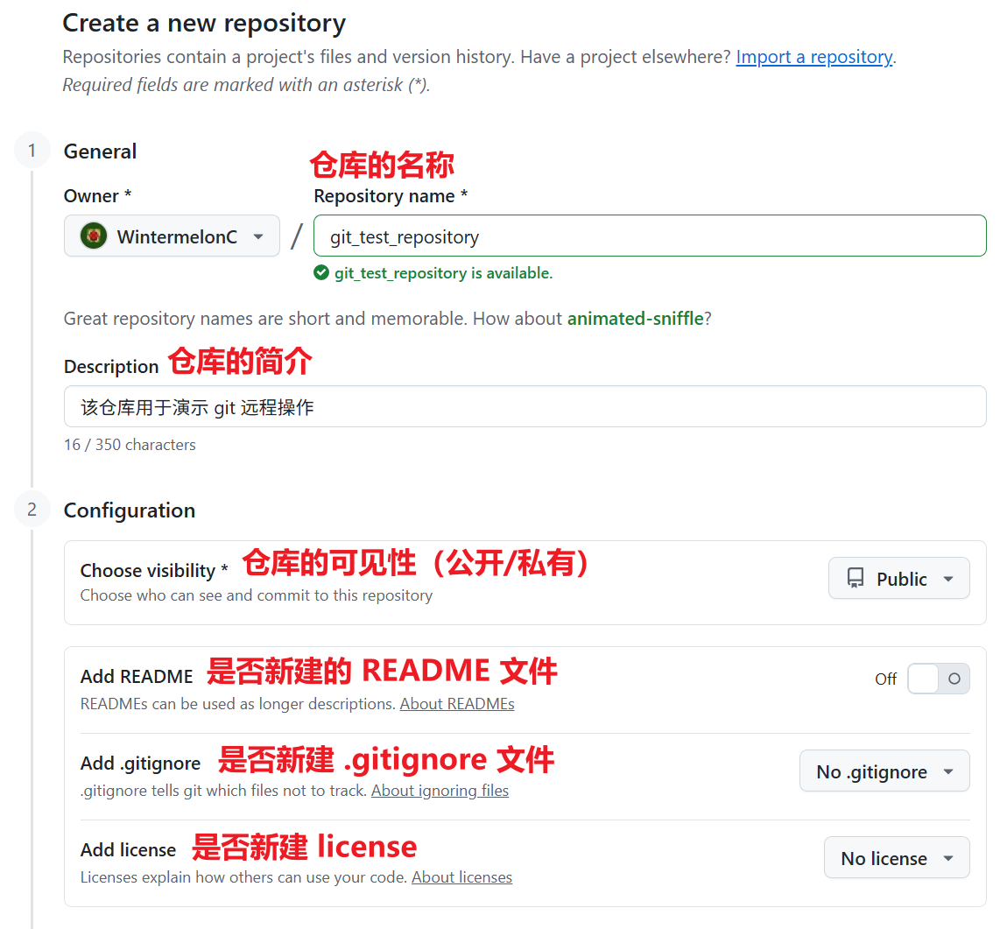

# 4 远程操作

!!! tip "说明"

    本文档正在更新中……

!!! tip "建议"

    git 其实很简单，多多实操就会了。建议跟着本文档实操一遍

    在实操过程中，可能会遇到各种各样奇奇怪怪的网络问题，本文档提供的解决方法肯定是不全的，需要自行善用搜索解决

## 1 Github

详见 [Github](../github/index.md){:target="_blank"}

## 2 SSH 配置

!!! info "AI 解释"

    SSH（Secure Shell）是一种加密的网络协议，用于安全地访问和管理远程计算机或服务器。它通过加密通信通道，防止数据在传输过程中被窃听或篡改，是替代传统不安全的Telnet、FTP等协议的主流方案

推荐使用 SSH 与 github 远程仓库建立连接并通信

### 2.1 本地电脑配置

!!! tip "提示"

    本文档使用 Windows 系统进行演示

打开用户目录 `%USERPROFILE%`（例如 `C:\Users\example\`），找到名为 `.ssh` 的文件夹并打开（若没有自行新建文件夹即可）

在此目录下打开终端，输入命令创建 SSH 密钥

```bash linenums="1"
C:\Users\example\.ssh>ssh-keygen -t rsa -b 4096
Generating public/private rsa key pair.
Enter file in which to save the key (C:\Users\example/.ssh/id_rsa): id_test
Enter passphrase (empty for no passphrase):
Enter same passphrase again:
Your identification has been saved in id_test
Your public key has been saved in id_test.pub
-- snip --
```

- `ssh-keygen -t rsa -b 4096`：

    - `-t`：指定密钥类型（type）
    - `rsa`：rsa 是一种加密算法，用于生成密钥
    - `-b`：指定密钥长度（bits）
    - `4096`：密钥长度为 4096 位

- `Enter file in which to save the key (C:\Users\example/.ssh/id_rsa):`：输入存储密钥的文件名称，若不输入，默认名称为 id_rsa（如果需要多个 SSH 密钥的话，必须自定义名称，不然新的会覆盖掉旧的）
- `Enter passphrase (empty for no passphrase):`：设置密码，可不设置。即使不设置密码，rsa 算法每次生成的密钥内容也不相同

之后，生成一个公钥文件 `id_test.pub` 和私钥文件 `id_test`，其中公钥文件可以公开，而 ==私钥文件万万不可公开==

---

新建一个名为 `config` 的文件，打开编辑

```text linenums="1"
# github
Host github.com
HostName github.com
PreferredAuthentications publickey
IdentityFile ~/.ssh/id_test

```

- `# github`：注释行
- `Host github.com`：定义主机的别名
- `HostName github.com`：指定实际连接的主机名（这里是 GitHub 的真实域名）
- `PreferredAuthentications publickey`：优先使用 publickey 方式认证（即 SSH 密钥登录）
- `IdentityFile ~/.ssh/id_test`：指定用于认证的私钥文件路径，`id_test` 根据实际私钥文件的名称进行修改

这个文件的作用简单来说就是，当我们访问 github 时，会使用 `id_test` 这个私钥文件进行验证

### 2.2 Github 配置

打开 github 设置 ^^SSH and GPG keys^^，新建一个 SSH key

<figure markdown="span">
  { width="800" }
</figure>

复制公钥文件 `id_test.pub` 中的所有内容到 Key 栏中，Title 栏相当于起个名字

<figure markdown="span">
  { width="800" }
</figure>

之后点击 ^^Add SSH key^^ 按钮即可

### 2.3 验证连接

设置完成后，打开终端，输入命令验证连接

```bash linenums="1"
$ ssh -T git@github.com
The authenticity of host 'github.com (20.205.243.166)' can't be established.
-- snip --
This key is not known by any other names.
Are you sure you want to continue connecting (yes/no/[fingerprint])? yes
Warning: Permanently added 'github.com' (ED25519) to the list of known hosts.
Hi WintermelonC! You've successfully authenticated, but GitHub does not provide shell access.
```

- `ssh -T git@github.com`：此命令中的 `github.com` 字段实际上就是我们在 `config` 文件中配置的主机别名
- `Are you sure you want to continue connecting (yes/no/[fingerprint])?`：输入 `yes` 确认
- `Hi WintermelonC! You've successfully authenticated, but GitHub does not provide shell access.`：出现此行，说明 SSH 连接成功

之后 `.ssh` 文件夹中会多出 `known_hosts` 和 `known_hosts.old` 两个文件，不用去管

!!! tip "多账户配置"

    如果想在同一台电脑上使用两个 github 账号，但这两个账号使用不同的 SSH 密钥，该如何配置呢。这就需要修改 `config` 文件当中的主机别名了，以及需要修改 git 本地仓库的本地配置等等。具体方法本文档不涉及，感兴趣或有需要请自行搜索

!!! tip "网络问题"

    关于 SSH 的各种奇奇怪怪的网络问题，分享一个我的经验

    我平常用 github 的时候，会开启加速器，如果需要使用 SSH 连接的话（如使用 git 的远程操作命令），我会关闭加速器。我这样用起来没有什么问题

    但有时候使用 git 的远程操作命令时，会报错（具体报错信息忘了，后面遇到再补充）。这时候换一个 WIFI 就好了

    之前我遇到其他报错信息时，我尝试过上网搜索，但是网上的方法我都试过，在我这里都不适用，很奇怪

## 3 Git 远程操作

### 3.1 Github 仓库

我们首先创建一个 github 仓库（repository），点击左侧的 New 按钮

<figure markdown="span">
  { width="400" }
</figure>

编辑仓库的信息

<figure markdown="span">
  { width="600" }
</figure>

> 关于 `README` 文件是什么，详见下文

之后会出现该页面，可以看到 github 已经给出了不同情况的具体做法

<figure markdown="span">
  { width="800" }
</figure>

我们在第 3 章已经有了一个本地仓库，所以选择下面这种方法即可

### 3.2 关联仓库

打开我们的本地仓库，目前 git 长这样

<figure markdown="span">
  { width="600" }
</figure>

在终端中输入

```bash linenums="1"
# 直接复制 github 给的提示即可
$ git remote add origin git@github.com:WintermelonC/git_test_repository.git
```

- `git remote add {origin_repository_name} {SSH link}`：添加远程仓库，远程仓库的名称（远程别名）自定，但一般都用 `origin`，后面的 SSH 填 github 仓库对应的

```bash linenums="1"
$ git remote -v
origin  git@github.com:WintermelonC/git_test_repository.git (fetch)
origin  git@github.com:WintermelonC/git_test_repository.git (push)
```

- `git remote -v`：查看远程仓库信息

之后 github 提示输入 `git branch -M main`，意思是将该仓库的主分支名称修改为 `main`，但由于我们之前已经全局修改过了，所以这里可以不输入

### 3.3 Git 推送分支

接下来按照提示，输入

```bash linenums="1"
$ git push -u origin main
Enumerating objects: 30, done.
Counting objects: 100% (30/30), done.
Delta compression using up to 20 threads
Compressing objects: 100% (22/22), done.
Writing objects: 100% (30/30), 2.70 KiB | 461.00 KiB/s, done.
Total 30 (delta 5), reused 0 (delta 0), pack-reused 0 (from 0)
remote: Resolving deltas: 100% (5/5), done.
To github.com:WintermelonC/git_test_repository.git
 * [new branch]      main -> main
branch 'main' set up to track 'origin/main'.
```

`git push`：将本地仓库的提交上传到远程仓库

- `git push {远程别名} {local_branch}`：将本地的 local_branch 分支推送到远程别名所指向的仓库的 local_branch 分支
- `git push {远程别名} {local_branch}:{remote_branch}`：如果希望远程分支的名字和本地不一样，可以使用这个格式。将本地的 local_branch 分支推送到远程，并命名为 remote_branch
- `git push -u {远程别名} {local_branch}`：`-u` 表示在推送的同时，建立本地分支与远程分支的跟踪关系（tracking）。设置之后，下次在这个分支上直接使用 `git push` 或 `git pull` 即可，无需再指定远程和分支名

现在，我们刷新一下 github 页面，可以看到本地仓库的内容同步到了 github 远程仓库上了

<figure markdown="span">
  { width="800" }
</figure>

??? question "思考"

    为什么本地仓库的 `.gitignore` `a.exe` `hello.c` 没有出现在 github 上呢

接下来我们修改一下本地仓库，然后推送新的提交到远程仓库

新建一个文件

```text linenums="1" title="success.txt"
成功关联远程仓库
```

然后提交修改

<figure markdown="span">
  { width="600" }
</figure>

之后终端输入 `git push`

```bash linenums="1"
$ git push
Enumerating objects: 4, done.
Counting objects: 100% (4/4), done.
Delta compression using up to 20 threads
Compressing objects: 100% (2/2), done.
Writing objects: 100% (3/3), 321 bytes | 321.00 KiB/s, done.
Total 3 (delta 1), reused 0 (delta 0), pack-reused 0 (from 0)
remote: Resolving deltas: 100% (1/1), completed with 1 local object.
To github.com:WintermelonC/git_test_repository.git
   d3a9e04..4275c62  main -> main
```

刷新一下 github 页面，可以看到新的文件也同步过来了

<figure markdown="span">
  { width="600" }
</figure>

!!! tip "VS Code"

    <figure markdown="span">
      { width="400" }
    </figure>

### 3.4 Git 拉取分支

推送是指将本地仓库的（新）提交同步到远程仓库，拉取则是指将远程仓库的（新）提交同步到本地仓库

这里远程仓库的（新）提交来源，一般都是其他协作者的（比如其他协作者做了一个新功能，将新代码同步到了远程仓库上，之后我们进行工作的时候，就需要先把这些新代码从远程仓库同步到我们的本地仓库中）

这里我们演示一下直接在 github 上改文件，然后如何同步到我们的本地仓库中

点击页面下方的 ^^Add a README^^ 按钮，新建一个 README 文件

!!! info "AI 解释"

    简单来说，README 是一个项目的“门户”和“说明书”

    **1.项目介绍** (Introduction)

    它是什么？用一两句话清晰明了地告诉访客这个项目是做什么的。这是最重要的部分，需要在开头就抓住读者的注意力

    项目目标/愿景：这个项目旨在解决什么问题？它的最终目标是什么？

    **2.快速开始** (Getting Started)

    这是技术项目 README 的灵魂。它需要让一个新用户能够以最少的步骤在本地安装、配置和运行你的项目

    **3.使用说明** (Usage)

    项目运行起来后，如何使用它？

    **4.参与贡献** (Contributing)

    对于开源项目，这部分至关重要。它告诉其他开发者如何为你的项目做贡献

    **5.许可证** (License)

    明确项目的法律授权方式。告诉别人他们可以使用、修改和分发你的代码的规则。一个简单的 `This project is licensed under the MIT License.` 和指向 `LICENSE` 文件的链接就足够了

    **6.常见问题** (FAQ)

    将开发和使用过程中可能遇到的常见问题及其解决方案列出来，可以为他人节省大量工期

编辑一下内容，为 markdown 格式

```md linenums="1" title="README.md"
本 `README.md` 文件用于演示 git 拉取操作
```

提交修改

<figure markdown="span">
  { width="600" }
</figure>

编辑提交信息，我们这里可以直接提交到 main 分支上

<figure markdown="span">
  { width="400" }
</figure>

> pull request 等操作，[5 多人协作](./ch5.md){:target="_blank"} 会涉及

添加了 `README` 文件后，可以看到其内容就可以直接显示到仓库页面了

<figure markdown="span">
  { width="600" }
</figure>

现在打开本地仓库，在终端中输入 `git pull` 即可拉取远程仓库的内容

```bash linenums="1"
$ git pull
remote: Enumerating objects: 4, done.
remote: Counting objects: 100% (4/4), done.
remote: Compressing objects: 100% (3/3), done.
remote: Total 3 (delta 1), reused 0 (delta 0), pack-reused 0 (from 0)
Unpacking objects: 100% (3/3), 995 bytes | 62.00 KiB/s, done.
From github.com:WintermelonC/git_test_repository
   4275c62..f6cb9d3  main       -> origin/main
Updating 4275c62..f6cb9d3
Fast-forward
 README.md | 1 +
 1 file changed, 1 insertion(+)
 create mode 100644 README.md
```

<figure markdown="span">
  { width="600" }
</figure>

### 3.5 合并冲突

同样的，推送和拉取操作可能会遇到合并冲突的问题（常见于多人协作），处理方法和 [3 分支操作](./ch3.md#31-合并冲突){:target="_blank"} 大差不差，本文档就不详细说明了

## 4 Git 克隆

`git clone` 用于将远程仓库复制到本地

```bash linenums="1" title="克隆 HTTPS 协议的仓库"
# 克隆到当前目录（使用默认文件夹名）
git clone https://github.com/username/repository.git

# 克隆到指定目录
git clone https://github.com/username/repository.git my-project
```

```bash linenums="1" title="克隆 SSH 协议的仓库"
git clone git@github.com:username/repository.git
```

具体示例见 [5 多人协作 - 2.2 Clone 仓库](./ch5.md#22-clone-仓库){:target="_blank"}