# 5 多人协作

<!-- !!! tip "说明"

    本文档正在更新中…… -->

!!! tip "建议"

    git 其实很简单，多多实操就会了。建议跟着本文档实操一遍

    在一些课程的大作业当中，不可避免地会用到这些东西，到时候用着用着就会了

## 1 我是仓库拥有者

续接 ^^4 远程操作^^ 的项目状态，我们将本地的 main 分支 push 到了 github 上的 main 分支，而本地的 develop 分支并没有 push 到 github 上去

### 1.1 Pull Request

接下来我们

1. 在本地创建一个分支 `remote_test`，并提交一些内容
2. 将 `remote_test` 分支 push 到 github 上去
3. 通过 pull request 在 github 远程仓库上将 `remote_test` 分支 merge 到 main 分支上
4. 最后在本地通过 pull 命令同步远程仓库的状态

**1.在本地创建一个分支 `remote_test`，并提交一些内容**

```bash linenums="1"
$ git branch remote_test
$ git switch remote_test
Switched to branch 'remote_test'
```

新建文件 `remote.txt`

```text linenums="1" title="remote.txt"
创建一个文件
```

提交

<figure markdown="span">
  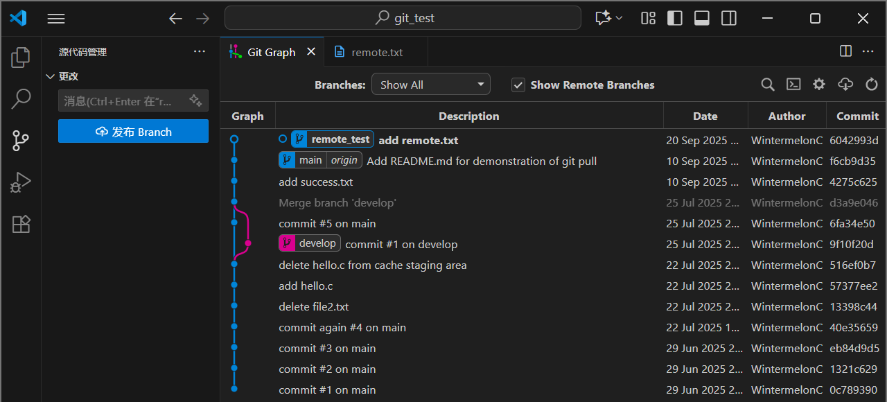{ width="600" }
</figure>

**2.将 `remote_test` 分支 push 到 github 上去**

```bash linenums="1"
$ git push -u origin remote_test
Delta compression using up to 20 threads
Compressing objects: 100% (2/2), done.
Writing objects: 100% (3/3), 310 bytes | 310.00 KiB/s, done.
Total 3 (delta 1), reused 0 (delta 0), pack-reused 0 (from 0)
remote: Resolving deltas: 100% (1/1), completed with 1 local object.
remote: 
remote: Create a pull request for 'remote_test' on GitHub by visiting:
remote:      https://github.com/WintermelonC/git_test_repository/pull/new/remote_test
remote:
To github.com:WintermelonC/git_test_repository.git
 * [new branch]      remote_test -> remote_test
branch 'remote_test' set up to track 'origin/remote_test'.
```

**3.通过 pull request 在 github 远程仓库上将 `remote_test` 分支 merge 到 main 分支上**

刷新 github 页面后，会出现一个 ^^Compare & pull request^^ 的提示，点击

<figure markdown="span">
  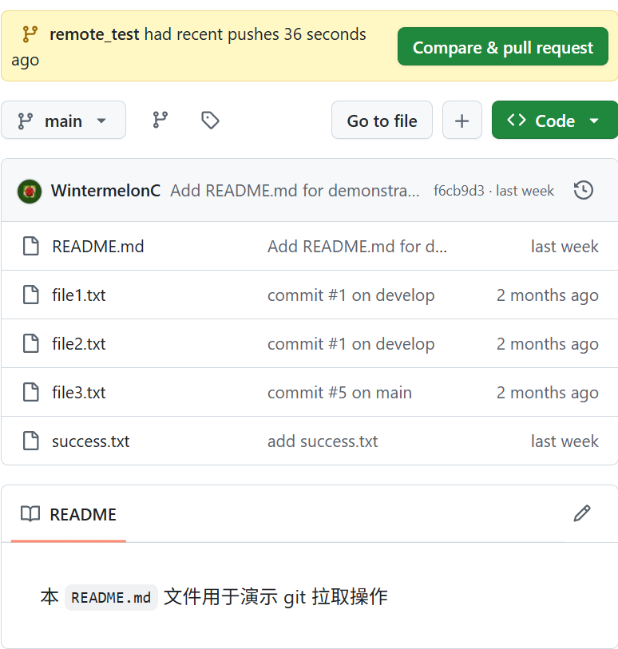{ width="600" }
</figure>

??? tip "创建 pull request 的其他方式"

    在 ^^Pull requests^^ 页面下，点击 ^^New pull request^^ 按钮

    <figure markdown="span">
      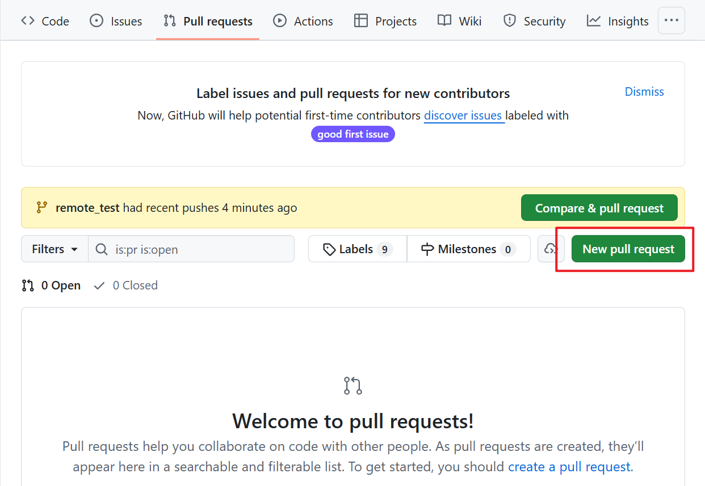{ width="600" }
    </figure>

    设置合并分支，并点击 ^^Create pull request^^ 即可

    <figure markdown="span">
      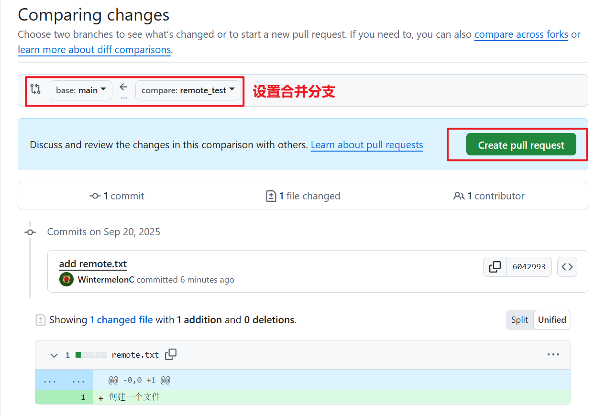{ width="600" }
    </figure>

编辑 pull request 的信息

<figure markdown="span">
  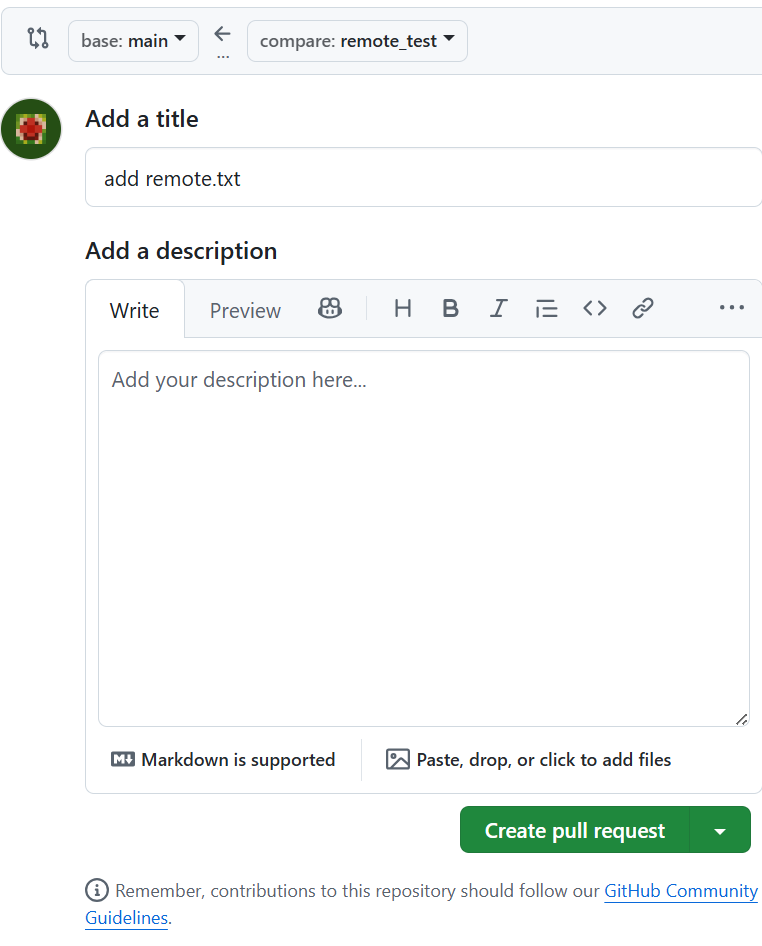{ width="600" }
</figure>

这样便创建了一个 pull request。接下来点击 ^^merge pull request^^ 按钮即可

!!! tip "一般情况"

    一般仓库的拥有者都会设置一些限制，需要有专人来审核你的代码，审核通过以后才能 merge 成功，下文会介绍

<figure markdown="span">
  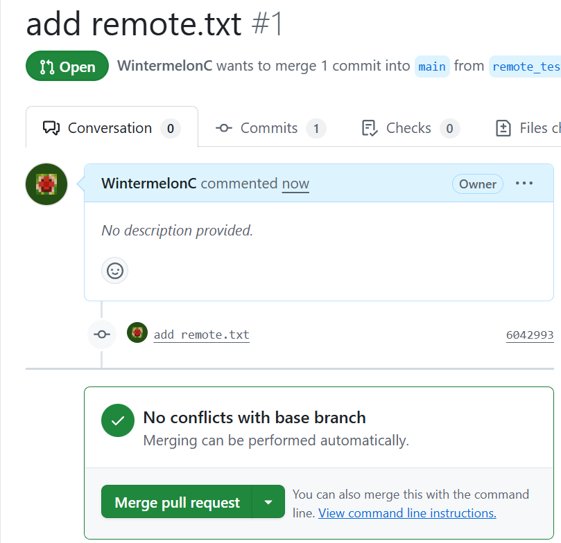{ width="600" }
</figure>

编辑 merge 分支时的提交信息

<figure markdown="span">
  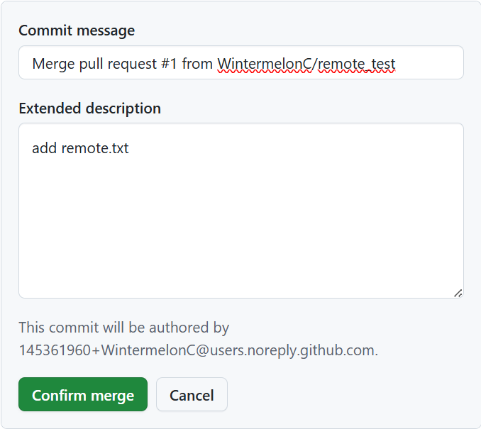{ width="600" }
</figure>

返回 ^^Code^^ 页面，可以看到 main 分支下，`remote.txt` 文件已经合并过来了

<figure markdown="span">
  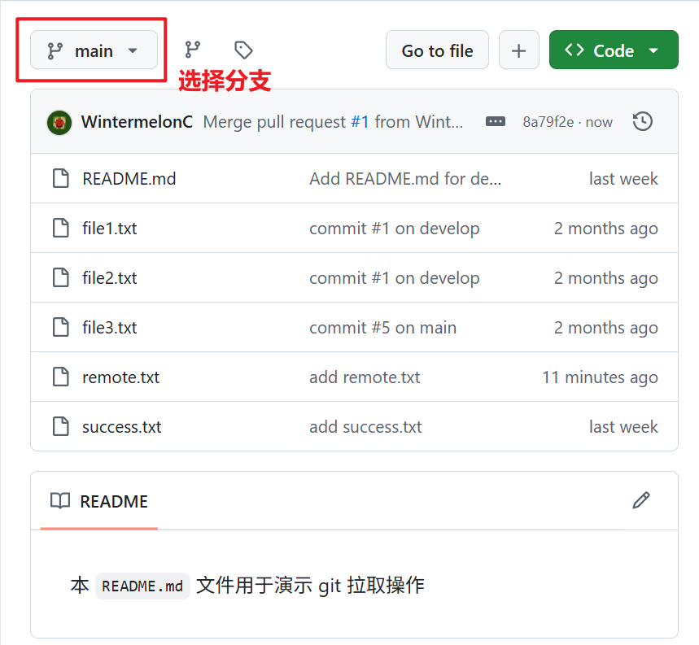{ width="600" }
</figure>

**4.最后在本地通过 pull 命令同步远程仓库的状态**

回到本地仓库

```bash linenums="1"
$ git switch main
Switched to branch 'main'
Your branch is up to date with 'origin/main'.
$ git pull
remote: Enumerating objects: 1, done.
remote: Counting objects: 100% (1/1), done.
remote: Total 1 (delta 0), reused 0 (delta 0), pack-reused 0 (from 0)
Unpacking objects: 100% (1/1), 904 bytes | 180.00 KiB/s, done.
From github.com:WintermelonC/git_test_repository
   f6cb9d3..8a79f2e  main       -> origin/main
Updating f6cb9d3..8a79f2e
Fast-forward
 remote.txt | 1 +
 1 file changed, 1 insertion(+)
 create mode 100644 remote.txt
```

git graph 这里也可以看到 remote_test 分支合并到了 main 分支

<figure markdown="span">
  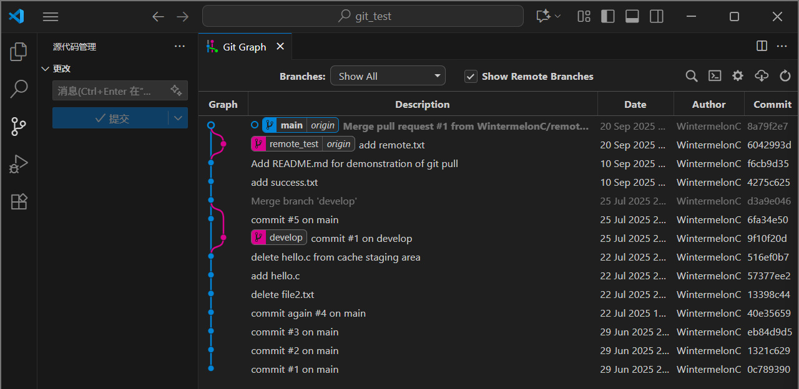{ width="600" }
</figure>

### 1.2 分支保护

通常为了保护 main 分支不被意外破坏，仓库的拥有者都会设置一套分支保护规则

<figure markdown="span">
  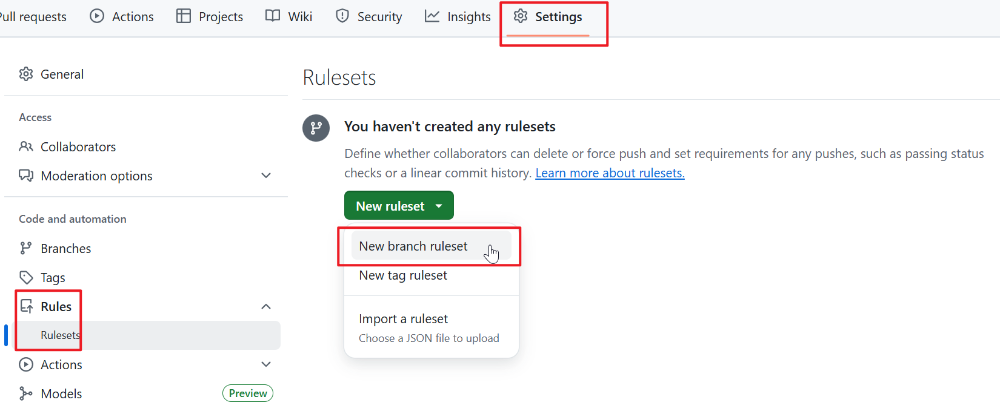{ width="600" }
</figure>

编辑 Rule 的基本信息

<figure markdown="span">
  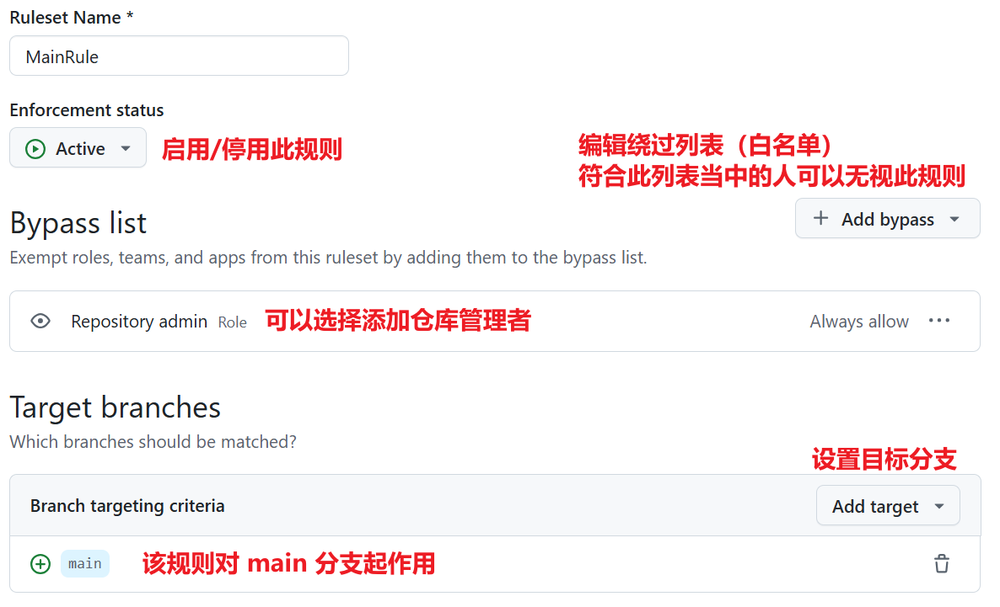{ width="600" }
</figure>

设置分支规则：

<figure markdown="span">
  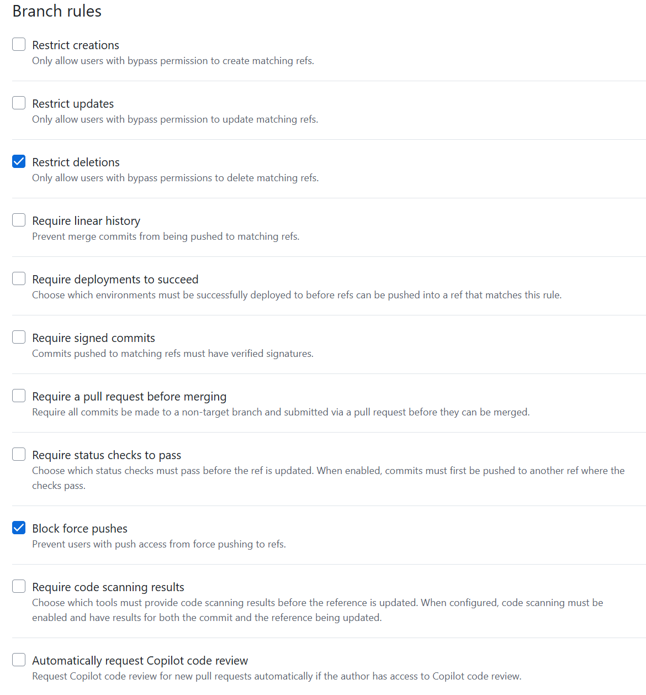{ width="600" }
</figure>

!!! tip "AI 解释"

    1. Restrict creations（限制创建）：

        1. 勾选后，只有拥有“绕过权限”（通常是仓库管理员或特定特权用户）的人才能在受保护的分支上直接创建这个分支或标签
        2. 目的：防止任何人随意在关键分支上创建新的引用

    2. Restrict updates（限制更新）：

        1. 勾选后，只有拥有“绕过权限”的人才能直接推送代码到受保护的分支（例如使用 git push origin main）
        2. 目的：强制所有更改都必须通过 Pull Request 等受控流程进行，而不是直接推送

    3. Restrict deletions（限制删除）：

        1. 只有拥有“绕过权限”的人才能删除这个分支
        2. 防止有人误操作或恶意删除关键分支，导致灾难性后果

    4. Require linear history（要求线性历史）：

        1. 禁止向该分支推送合并提交（merge commits）。所有合并都必须使用“变基（rebase）”或“压缩合并（squash merge）”，从而保持提交历史是一条直线
        2. 让提交历史更清晰、易于追踪和回滚

    5. Require deployments to succeed（要求部署成功）：

        1. 你可以选择一些环境（如 production, staging）。在代码被合并到该分支之前，必须成功部署到这些选定的环境
        2. 确保新代码在进入主分支前，已经在测试或预发布环境中通过了部署验证

    6. Require signed commits（要求签名的提交）：

        1. 推送至该分支的所有提交都必须使用 GPG、SSH 或 S/MIME 进行签名验证
        2. 验证提交者的身份，确保代码来源可信，防止代码被篡改

    7. **Require a pull request before merging**（合并前需要拉取请求）：

        1. 强制所有代码都必须通过 Pull Request (PR) 才能合并到该分支。不允许直接推送。通常还会配套设置“必须经过指定数量的审核批准”和“所有代码对话必须已解决”等选项
        2. 实现代码审查（Code Review），确保至少有另外一个人检查过代码才能合并

    8. Require status checks to pass（要求状态检查通过）：

        1. 选择必须通过的 CI/CD（持续集成/持续部署）检查（例如 GitHub Actions 的构建、测试任务）。只有在这些检查都成功完成后，PR 才能被合并
        2. 自动化保障代码质量，确保新代码不会破坏构建、不会导致测试失败

    9. **Block force pushes**（阻止强制推送）：

        1. 禁止任何人（绕过列表除外）向该分支执行强制推送（**git push --force**）
        2. 防止有人用强制推送覆盖分支历史，从而丢失之前的提交记录，这是非常重要的安全措施

    10. Require code scanning results（要求代码扫描结果）：

        1. 选择必须提供的代码扫描工具（如 GitHub Advanced Security 的 CodeQL、第三方工具）。这些工具必须对代码进行分析并提供结果（如没有发现新的安全漏洞）后，才能合并
        2. 将安全扫描集成到开发流程中，提前发现漏洞和安全问题

    11. Automatically request Copilot code review（自动请求 Copilot 代码审查）

        1. 如果 PR 作者有 GitHub Copilot 代码审查的访问权限，系统会自动请求 Copilot 对新的 PR 进行 AI 辅助的代码审查
        2. 利用 AI 提供初步的代码审查意见，提高审查效率和代码质量

其中最重要的是 **Require a pull request before merging** 和 **Block force pushes**

<figure markdown="span">
  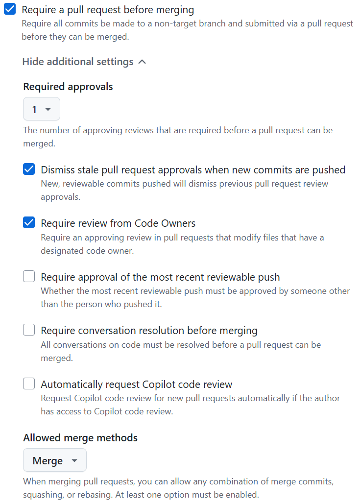{ width="600" }
</figure>

!!! tip "Require a pull request before merging 的子选项"

    **AI 解释：**

    1. Required approvals（必需的批准数）：需要多少位审核人批准（Approve）后，PR 才能被合并
    2. Dismiss stale pull request approvals when new commits are pushed（当有新的提交时，驳回过时的批准）：

        1. 如果启用，当作者向已获得批准的 PR 中又推送了新的提交时，之前所有的“批准（Approve）”状态会被自动驳回（Dismiss）。审核人需要重新审查新的代码变更后再次批准
        2. 确保所有的批准都是基于最新的代码状态，防止旧批准对新引入的、未审查的代码“放行”

    3. Require review from Code Owners（需要代码所有者的审查）：

        1. 如果 PR 修改了代码库中由特定“代码所有者（Code Owners）”负责的文件，则必须至少有一位指定的代码所有者批准该 PR
        2. 让最熟悉相关代码模块的专家（代码所有者）来把关其负责区域的变更，确保更改的质量和合理性
    
    4. Require approval of the most recent reviewable push（需要最近一次可审查推送的批准）
    
        1. 最后一次提交必须由提交者以外的其他人批准。这有效地防止了 PR 作者自己批准自己的最后一次提交然后快速合并
        2. 确保每一次代码更新，尤其是最后的更改，都经过了至少另一个人的审视，强化了代码审查的严肃性

    5. Require conversation resolution before merging（合并前需要解决所有对话）

        1. 在 PR 中，审阅者可以在代码的特定行留下评论或提出问题（开启一个“对话”）。启用此选项后，所有这类对话都必须被标记为“已解决（Resolved）”后，PR 才能被合并
        2. 确保 PR 中提出的所有问题、讨论和建议都得到了妥善的处理和回复，避免未解决的问题被忽略并合并到主分支

    6. Automatically request Copilot code review（自动请求 Copilot 代码审查）

        1. 如果 PR 的作者拥有 GitHub Copilot 代码审查功能的访问权限，系统会自动请求 Copilot 对这个新 PR 进行 AI 辅助的审查
        2. 利用 AI 提供初步的、快速的代码质量检查和安全漏洞扫描，作为人类审查的补充，提高效率和代码质量

    7. Allowed merge methods（允许的合并方法）：包括 merge、squash、rebase

仓库拥有者需要根据自己仓库的情况以及自己的需求来设置合理的分支保护规则

!!! tip "一般情况"

    一般情况下，对于 main 分支，**至少** 这样设置：

    - [x] Restrict deletions
    - [x] Require a pull request before merging

        - Required approvals: 1
        - [x] Dismiss stale pull request approvals when new commits are pushed
        - [x] Require review from Code Owners

    - [x] Block force pushes

    不过在学校课程的小规模大作业仓库中，上面的选项可以酌情更改，==根据具体情况灵活设置==

!!! question "代码审查是怎样的"

    下文会介绍

## 2 我是仓库协作者

!!! info "提示"

    本节内容会使用两个 github 账号进行演示

### 2.1 fork 仓库

!!! tip "fork 是什么"

    **AI 解释**：

    Fork（分叉）就是把你感兴趣的一个别人的仓库，复制一份到你自己的 GitHub 账户下。Fork 操作会在你的 GitHub 账户下创建一个与原仓库完全相同的副本。这个副本是完全独立于原仓库的，你可以对它进行任何操作，而不会影响到原项目

    贡献代码的流程：

    1. Fork 你感兴趣的项目
    2. Clone 到你的本地电脑
    3. 创建一个新的分支（Branch）来开发你的功能
    4. 在本地完成代码修改、测试和提交（Commit）
    5. 将修改推送（Push）回你 GitHub 账户下的 Fork 副本
    6. 在 GitHub 上向原项目的作者发起一个 拉取请求（Pull Request, PR）
    7. 原项目的维护者会审查你的代码。如果他们认为你的修改很好，就会将你的代码合并（Merge）到原始项目中

首先找到需要合作的仓库，fork 一下

<figure markdown="span">
  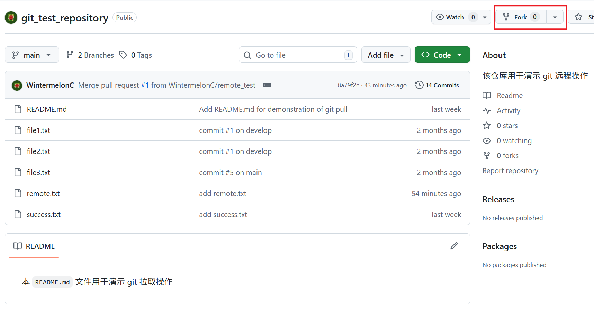{ width="600" }
</figure>

设置基础信息

<figure markdown="span">
  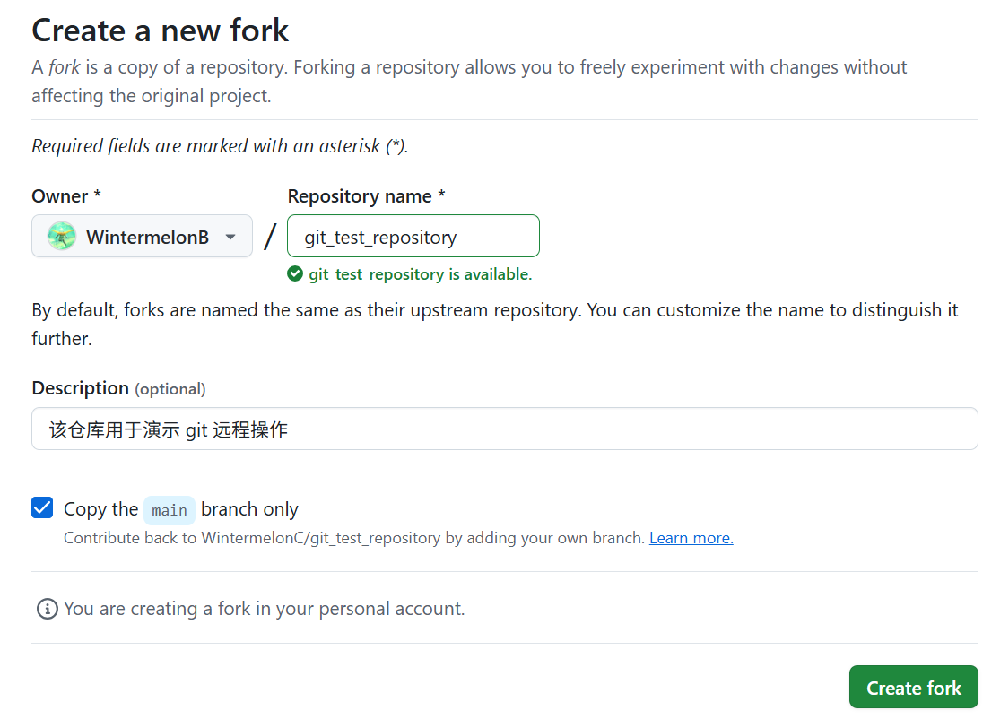{ width="600" }
</figure>

### 2.2 Clone 仓库

clone 你 fork 出来的仓库到本地

找一个文件夹打开终端

!!! tip "HTTPS 和 SSH 字段如何查看"

    <figure markdown="span">
      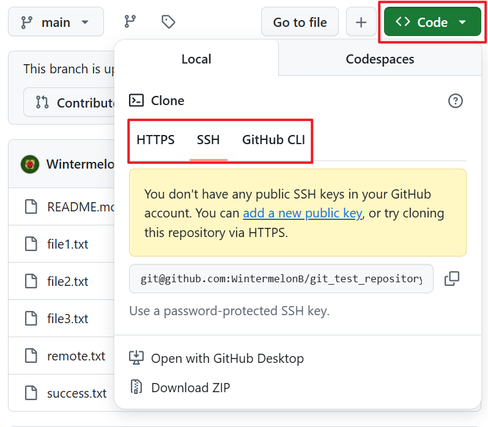{ width="400" }
    </figure>

```bash linenums="1"
# 我这里输入 github2.com 是因为我在 config 中配置的第二个账号的 SSH 的主机别名是 github2.com
# 有关多账户配置在“4 远程操作 - 2.3 验证连接”中已说明
$ git clone git@github2.com:WintermelonB/git_test_repository.git
Cloning into 'git_test_repository'...
remote: Enumerating objects: 40, done.
remote: Counting objects: 100% (40/40), done.
remote: Compressing objects: 100% (23/23), done.
remote: Total 40 (delta 9), reused 35 (delta 7), pack-reused 0 (from 0)
Receiving objects: 100% (40/40), 4.95 KiB | 845.00 KiB/s, done.
Resolving deltas: 100% (9/9), done.
```

### 2.3 修改并提交

比如我们可以新建一个文件

```text linenums="1" title="fork_new_file.txt"
这是 WintermelonB 贡献的一个文件
```

<figure markdown="span">
  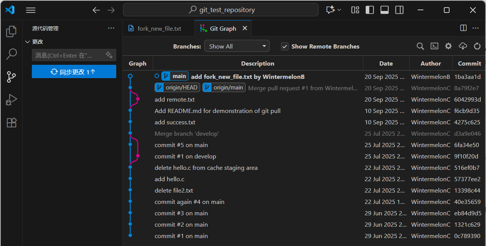{ width="600" }
</figure>

### 2.4 push 提交

```bash linenums="1"
$ git push -u origin main 
Enumerating objects: 4, done.
Counting objects: 100% (4/4), done.
Delta compression using up to 20 threads
Compressing objects: 100% (2/2), done.
Writing objects: 100% (3/3), 351 bytes | 351.00 KiB/s, done.
Total 3 (delta 1), reused 0 (delta 0), pack-reused 0 (from 0)
remote: Resolving deltas: 100% (1/1), completed with 1 local object.
To github2.com:WintermelonB/git_test_repository.git
   8a79f2e..1ba3aa1  main -> main
branch 'main' set up to track 'origin/main'.
```

### 2.5 发起 pull request

<figure markdown="span">
  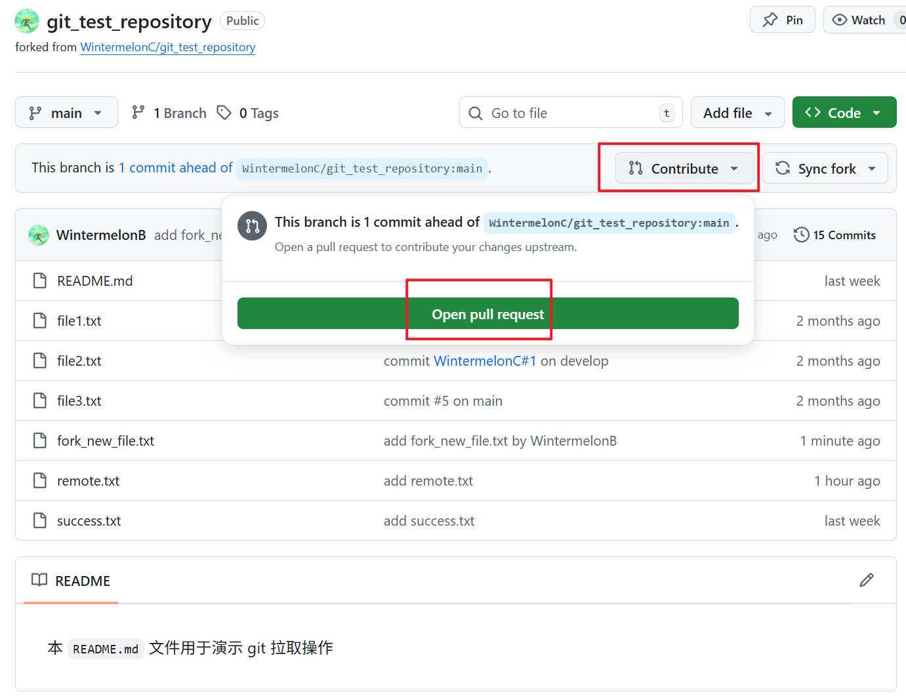{ width="600" }
</figure>

<figure markdown="span">
  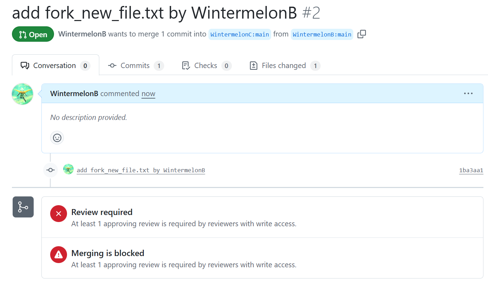{ width="600" }
</figure>

可以看到我们刚才设置的分支保护规则的生效情况：需要有其他有相关权限的人的审查

### 2.6 审查 pull request

回到仓库拥有者的视角

<figure markdown="span">
  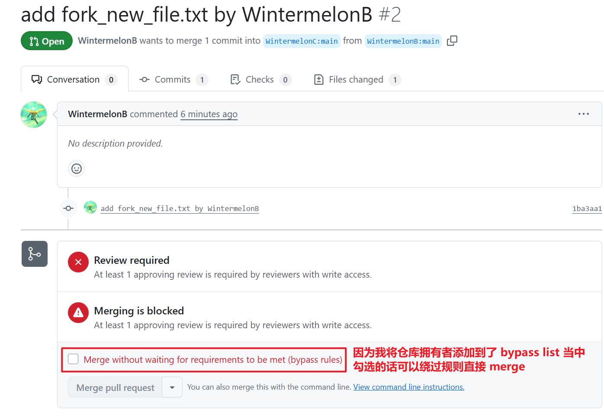{ width="600" }
</figure>

点击上面的 ^^Files changed^^ 按钮审查代码

<figure markdown="span">
  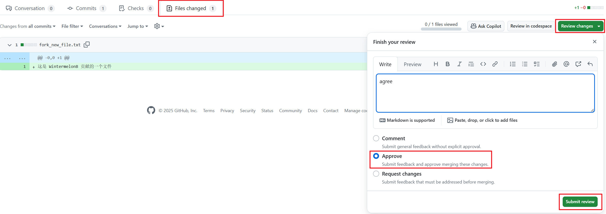{ width="800" }
</figure>

同意之后，返回此界面，可以看到安心的绿色。这时候仓库拥有者可以点击 ^^merge pull request^^ 按钮进行合并了

<figure markdown="span">
  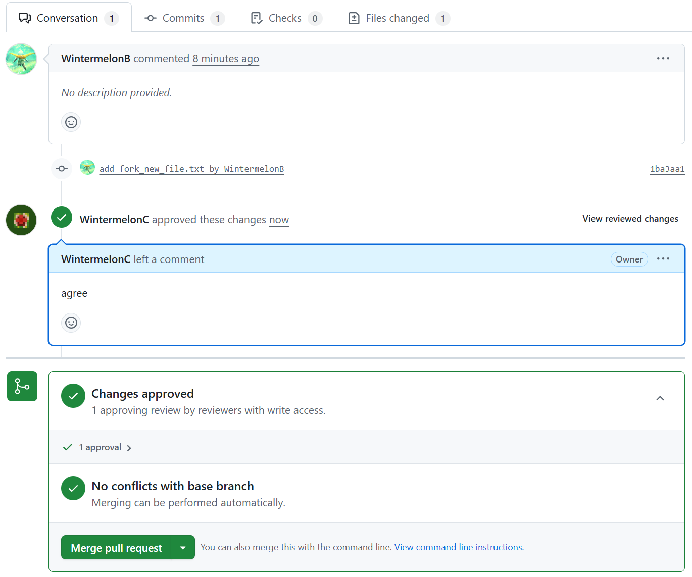{ width="600" }
</figure>

### 2.7 同步 fork 仓库状态

回到仓库协作者的视角

这时候需要我们从主仓库那里 pull 一下最新的状态，因为 main 分支有了一次合并提交

<figure markdown="span">
  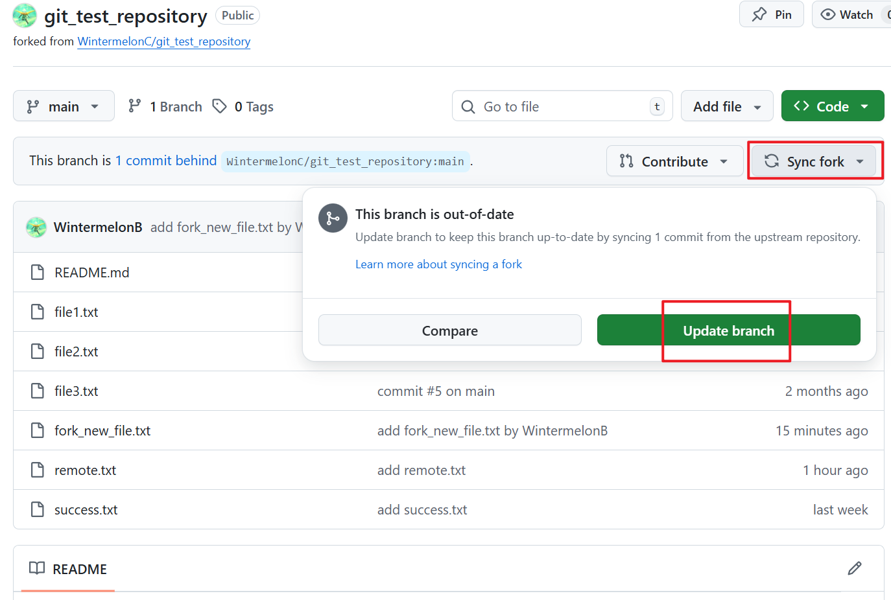{ width="600" }
</figure>

同步完之后，就可以继续补充代码做贡献了

## 3 建议

1. 各个协作者（包括仓库拥有者）应避免直接在 main 分支上修改，正确的做法是创建各自的 develop 分支并在此分支上更新代码，并通过 pull request 的方式将修改的内容 merge 的 main 分支上
2. 各个协作者在编写自己的代码时，应首先 pull 一下远程仓库，保证自己的本地仓库的状态和远程仓库那边的最新状态是一致的，这样可以减少代码合并冲突
3. 负责 pull request 的人员可以在 main 分支有更新后，及时提醒各个协作者，让他们知道需要 `git pull` 了