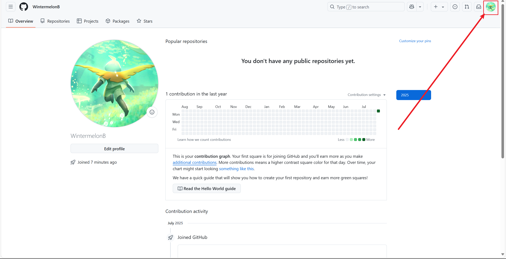
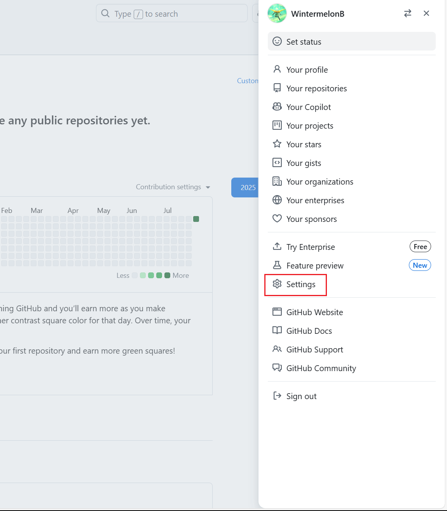
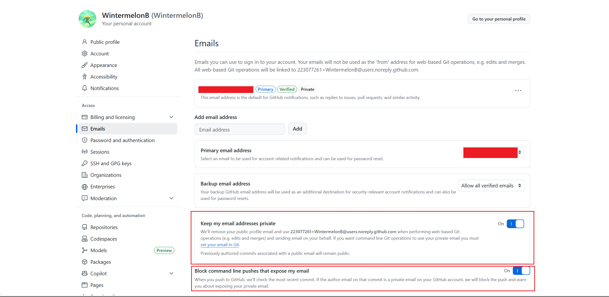
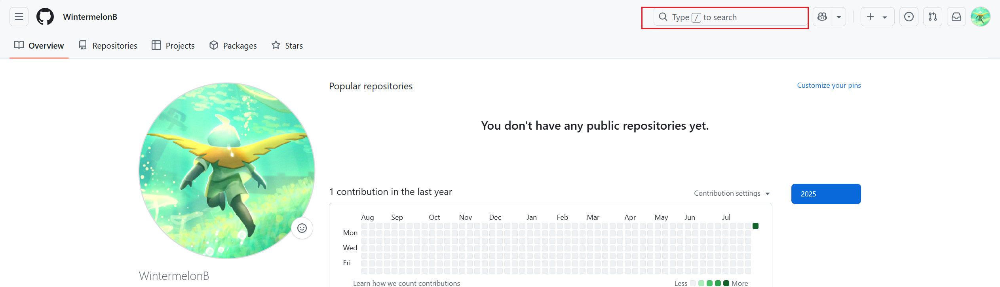

# Github

<!-- !!! tip "说明"

    本文档正在更新中…… -->

!!! info "AI 介绍"

    **GitHub** 是全球最大的 **代码托管平台** 和 **开发者社区**，基于 `Git` 版本控制系统，主要用于存储、管理和协作开发软件项目。它不仅是程序员的核心工具，也逐渐成为开源生态的中心
    
    **核心功能**：
    
    1. **代码托管**  
       
       - 免费存储 Git 仓库（公开项目免费，私有项目有限制）
       - 支持代码的版本控制、分支管理（`git clone`/`push`/`pull` 等操作）
    
    2. **协作开发**  
    
       - **Pull Request（PR）**：多人协作审阅和合并代码
       - **Issues**：任务跟踪、Bug 反馈和讨论
       - **Projects**：看板管理（类似 Trello）
    
    3. **自动化与集成**  
    
       - **GitHub Actions**：自动化测试、部署（CI/CD）
       - **GitHub Pages**：免费托管静态网站（如文档、博客）
    
    4. **开源生态**  
    
       - 数百万开源项目（如 Linux、Vue.js、React）
       - 支持 `Star`（收藏）、`Fork`（分叉）、`Watch`（关注）等互动
    
    **基础概念**：
    
    | 术语 | 说明 |
    |---|---|
    | **Repository** | 代码仓库，存储项目所有文件和历史记录（简称 `repo`）|
    | **Branch** | 分支，独立开发线（默认 `main` 或 `master`）|
    | **Commit** | 一次代码变更记录，包含作者、时间戳和变更说明 |
    | **Clone** | 将远程仓库下载到本地（`git clone`）|
    
    **适用场景**：
    
    - **个人开发者**：备份代码、管理私人项目
    - **团队协作**：多人共同开发企业或开源项目
    - **学习编程**：参与开源、阅读优秀代码（如算法、框架源码）
    - **搭建博客/简历**：通过 GitHub Pages 免费部署网站
    
    **与其他平台对比**：
    
    | 平台 | 特点 | 优势场景 |
    |---|---|---|
    | **GitHub** | 生态强大、开源主导 | 开源项目、企业协作 |
    | GitLab | 免费私有仓库、内置 DevOps 工具 | 自托管、私有化部署 |
    | Bitbucket | 免费支持小团队私有仓库 | Atlassian 生态集成 |

[Github Pages](./github_pages/index.md)

## 1 注册

国内用户访问 GitHub 较慢，解决方法是使用一些加速器或者科学上网工具

加速器推荐：[Watt Toolkit](../../application/watt_toolkit/index.md){:target="_blank"}

访问 GitHub 并注册账号：[GitHub](https://github.com/){:target="_blank"}

> 注册账号时，如果你使用的是 QQ 邮箱，建议去 QQ 邮箱那里设置 **英文别名**，避免直接用 `{QQ 号}@qq.com`，造成信息泄露

注册完毕后，点击右上角头像，可以先自行探索一下这些菜单

<figure markdown="span">
  { width="800" }
</figure>

## 2 设置

点击右上角头像，打开设置

<figure markdown="span">
  { width="800" }
</figure>

### 2.1 Public profile

公开展示的一些信息

### 2.2 Emails

这里可以对邮箱进行设置

<figure markdown="span">
  { width="800" }
</figure>

可以开启 ^^Keep my email addresses private^^ 功能，开启后

1. 个人邮箱会隐藏，转而使用格式类似于 `223077261+WintermelonB@users.noreply.github.com` 的邮箱
2. 同时，需要修改电脑上的 git 配置。比如我就需要修改 `user.email` 为 `223077261+WintermelonB@users.noreply.github.com` 即可
3. 可以开启 ^^Block command line pushes that expose my email^^：如果 git 提交信息里包含了个人邮箱，github 会拒绝掉这次提交，保护个人邮箱

### 2.3 Password and authentication

这里可以修改密码，添加 Passkeys，启用 Two-factor authentication

如果想要申请 Github 学生认证，就需要启用 Two-factor authentication，详见 [2FA](../../application/vscode/copilot.md#2fa){:target="_blank"}

## 3 仓库

可以访问一下大名鼎鼎的 linux 项目，可以在上方搜索框中搜索

<figure markdown="span">
  { width="800" }
</figure>

可以自行探索一下 Github 的仓库页面，具体详见 [git 远程操作](../git/ch4.md#31-github-仓库){:target="_blank"}