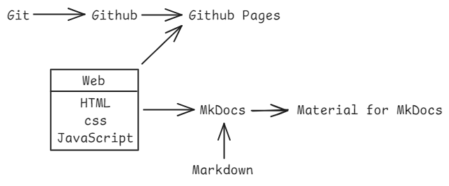

# 1 预备工作

<!-- !!! tip "说明"

    本文档正在更新中…… -->

知识图谱：

<figure markdown="span">
  { width="600" }
</figure>

## 1 简单了解 Git 的使用

[Git 教程](../../git/index.md){:target="_blank"}

至少学习以下内容，确保至少掌握以下技能：

1. [Git 安装与配置](../../git/ch1.md){:target="_blank"}
2. [Git 基本操作](../../git/ch2.md){:target="_blank"}

    1. 使用 `git init` 新建仓库
    2. 使用 `git commit` 提交文件
    3. 使用 `.gitignore` 文件忽略文件
    4. 在 VSCode 中使用 git

3. [Git 分支操作](../../git/ch3.md){:target="_blank"}

    1. 了解分支 branch 的概念

4. [Git 远程操作](../../git/ch4.md){:target="_blank"}

    1. 配置 SSH key，在 Github 上添加 SSH key
    2. 关联本地仓库与远程仓库
    3. 使用 `git push` 推送文件

## 2 简单了解 Github 的使用

[Github 教程](../../github/index.md){:target="_blank"}

确保至少掌握以下技能：

1. 在 Github 上添加 SSH key
2. 在 Github 上创建仓库
3. 关联本地仓库与远程仓库
4. 了解 Github 仓库页面
5. 查看 Github 仓库的文件

## 3 简单了解 Web 三件套

[Web 教程](../../../knowledge/web/index.md){:target="_blank"}

至少学习以下内容，确保至少掌握以下技能：

1. [HTML](../../../knowledge/web/html.md){:target="_blank"}

    1. 了解 HTML 的作用
    2. 了解 HTML 的结构
    3. 能够编写简单的 HTML 代码

2. [css](../../../knowledge/web/css.md){:target="_blank"}

    1. 了解 css 的作用
    2. 了解 css 的结构
    3. 能够编写简单的 css 代码

3. [JavaScript](../../../knowledge/web/javascript.md){:target="_blank"}

    1. 了解 JavaScript 的作用
    2. 了解 JavaScript 的结构

## 4 简单了解 Github Pages 的使用

[Github Pages 教程](../../github/github_pages/index.md){:target="_blank"}

确保至少掌握以下技能：

1. 了解 Github Pages 的使用方法
2. 能够使用基础的 Web 三件套发布网站 (1)

1. 直接使用上面教程中的示例实操一下即可，目的是认识到 Github Pages 支持使用 Web 三件套来发布网站

## 5 学习 Markdown

[Markdown 教程](../../../knowledge/markdown/index.md){:target="_blank"}

## 6 简单了解 MkDocs

[MkDocs 教程](../../mkdocs/index.md){:target="_blank"}