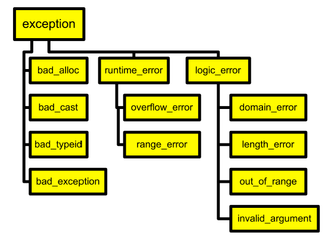

# 12 Exception

<!-- !!! tip "说明"

    本文档正在更新中…… -->

!!! info "说明"

    本文档仅涉及部分内容，仅可用于复习重点知识

## 1 概念

在 C++ 中，**异常**（Exception） 是一种处理程序运行时错误的机制。通过异常处理，可以将错误检测和错误处理分离，提高程序的健壮性和可维护性。C++ 的异常处理主要依赖于 `try`、`throw` 和 `catch` 关键字

C++ 的异常机制是运行时行为，**运行时错误**（如数组越界、空指针访问、除零错误等）可以通过异常机制捕获，而 **编译错误**（如语法错误、类型不匹配等）发生在编译阶段，不能通过异常机制捕获

1. 异常：程序运行过程中出现的错误或异常情况（如除零、内存分配失败等）
2. 抛出（`throw`）：当检测到异常时，使用 `throw` 抛出异常对象
3. 捕获（`catch`）：使用 `catch` 捕获并处理异常
4. 尝试（`try`）：用 `try` 块包裹可能发生异常的代码

```cpp linenums="1"
#include <iostream>
using namespace std;

int divide(int a, int b) {
    if (b == 0)
        throw "除数不能为0"; // 抛出字符串异常
    return a / b;
}

int main() {
    try {
        cout << divide(10, 0) << endl;
    } catch (const char* msg) {
        cout << "异常捕获: " << msg << endl;
    }
    return 0;
}
```

```cpp linenums="1" title="output"
异常捕获: 除数不能为0
```

注意事项：

1. 析构函数抛出异常会导致程序终止，建议用 `noexcept`
2. 不建议抛出基本类型（如 `int`、`char*`），推荐抛出异常类对象
3. `catch(...)` 可以捕获所有类型的异常，但无法获取具体信息
4. 异常处理会有一定的性能开销，建议只在必要时使用

> `catch(...)` 真的是三个点哦

---

单独使用 `throw;`（不带任何异常对象）只能在 `catch` 块内部使用，表示“重新抛出当前捕获到的异常”

这样可以将异常继续传递给上层调用者，常用于在捕获异常后进行部分处理，然后让异常继续向上传递

```cpp linenums="1"
#include <iostream>
using namespace std;

void func() {
    try {
        throw 123; // 抛出异常
    } catch (int e) {
        cout << "func 捕获到异常: " << e << endl;
        throw; // 重新抛出当前异常
    }
}

int main() {
    try {
        func();
    } catch (int e) {
        cout << "main 再次捕获到异常: " << e << endl;
    }
    return 0;
}
```

```cpp linenums="1" title="output"
func 捕获到异常: 123
main 再次捕获到异常: 123
```

1. 按值捕获：`catch (Exception e)`：会调用拷贝构造函数创建异常对象的副本
2. 按引用捕获：`catch (Exception& e)`：直接捕获原异常对象的引用，无拷贝操作

始终优先选择：`catch (const Exception& e)`，除非有特殊需求。这是 C++ 中高效、安全且支持多态的规范做法

## 2 `assert`

在 C++ 中，`assert` 是一个用于 **断言** 的宏，定义在头文件 `<cassert>`（或 C 语言的 `<assert.h>`）中

它的作用是在程序运行时检查某个条件是否为真。如果条件为假，`assert` 会输出错误信息并终止程序执行，帮助开发者在调试阶段发现程序中的逻辑错误

1. 断言的典型用法是：`assert(表达式)`
2. 如果表达式为假，程序会输出类似 `Assertion failed: 表达式, file 文件名, line 行号` 的信息，并终止执行
3. `assert` 主要用于调试阶段，在发布（Release）版本中可通过定义 `NDEBUG` 宏禁用所有断言

```cpp linenums="1"
#include <cassert>
#include <iostream>
using namespace std;

int main() {
    int x = 5;
    assert(x > 0); // 条件为真，程序继续执行

    int y = -1;
    assert(y >= 0); // 条件为假，程序终止并输出错误信息
    cout << "这行不会被执行" << endl;
    return 0;
}
```

## 3 异常类

C++ 标准库 `<exception>` 提供了一些常用的异常类，如：

1. `std::exception`：所有标准异常的基类
2. `std::runtime_error`、`std::logic_error` 等

<figure markdown="span">
  { width="600" }
</figure>

可以自定义异常类型（通常继承自 `std::exception`）

```cpp linenums="1"
#include <iostream>
#include <exception>
using namespace std;

class MyException : public exception {
public:
    const char* what() const noexcept override {
        return "自定义异常";
    }
};

int main() {
    try {
        throw MyException();
    } catch (const exception& e) {
        cout << "捕获异常: " << e.what() << endl;
    }
    return 0;
}
```

### 3.1 `bad_alloc`

在 C++ 中，当 `new` 分配内存失败时，默认不会返回空指针（如旧式 `malloc` 那样），而是直接抛出 `std::bad_alloc` 异常

```cpp linenums="1"
try {  
    while(1) {  
        char *p = new char[10000];  
    }  
} catch (bad_alloc& e) {  
    // do something
}  
```

## 4 异常规范

在 C++ 中，异常规范（Exception Specification）用于声明函数可能抛出的异常类型。它主要用于约束和说明函数的异常行为。C++ 异常规范经历了从早期的动态异常规范到现代的 `noexcept` 关键字的演变

### 4.1 早期的异常规范（已废弃）

```cpp linenums="1"
void func() throw(Type1, Type2); // 只允许抛出Type1和Type2类型的异常
void func() throw();             // 不允许抛出任何异常
```

1. 编译器通常不会强制检查，运行时抛出未声明异常会调用 `std::unexpected`，但实际应用中很少用
2. 这种写法在 C++11 后已被弃用，C++17 中已被移除

### 4.2 `noexcept` 关键字

`noexcept` 用于声明函数不会抛出异常，或根据条件决定是否抛出异常

```cpp linenums="1"
void func() noexcept;         // 承诺不会抛出异常
void func() noexcept(true);   // 等价于上面
void func() noexcept(false);  // 不承诺不抛出异常（等价于无noexcept）
```

```cpp linenums="1"
void safeFunc() noexcept {
    // 不会抛出异常
}

void riskyFunc() {
    throw 1; // 可能抛出异常
}
```

可以用 `noexcept(表达式)` 检查某个表达式是否为 `noexcept`：

```cpp linenums="1"
#include <iostream>
void f() noexcept {}
void g() {}

int main() {
    std::cout << std::boolalpha;
    std::cout << noexcept(f()) << std::endl; // true
    std::cout << noexcept(g()) << std::endl; // false
    return 0;
}
```

`noexcept` 的作用:

1. 优化：编译器可对 `noexcept` 函数做更多优化
2. 异常安全：在容器移动操作等场景，只有 `noexcept` 的移动构造/赋值才会被优先使用
3. 程序终止：如果 `noexcept` 函数抛出异常，程序会调用 `std::terminate()` 终止

## 5 Exceptions and Constructors

构造函数失败的处理方式：

1. 问题：构造函数无返回值，无法像普通函数那样通过返回值表示失败
2. 传统方案：

    1. 使用“未初始化标志”（如 `bool isInitialized`），需后续检查状态
    2. 两阶段构造（分离 `Init()` 函数），但违反 RAII 原则。

3. 最佳实践：直接抛出异常，强制调用者处理错误

抛出异常的注意事项：

1. 析构函数不被调用：若构造函数抛出异常，对象的析构函数不会执行（但已构造的成员子对象的析构函数会被调用）
2. 资源泄漏风险：必须在抛出前手动释放已申请的资源（如内存、文件句柄）

两阶段构造（Two-stage construction）：

1. 在构造函数中完成基础工作  

    1. 初始化所有成员对象
    2. 初始化所有基本类型成员
    3. 将指针初始化为 `nullptr`
    4. 绝不在构造函数中申请资源

2. 在 `Init()` 函数中完成额外初始化

RAII（资源获取即初始化）

1. 资源绑定对象：在构造函数中获取资源（如打开文件），在析构函数中释放
2. 异常安全：若构造函数失败，通过异常中断流程，避免无效对象被使用
3. 栈对象优先：强调使用栈对象（而非 `new`）确保内存自动管理

优先使用 RAII：

```cpp linenums="1"
class FileHandler {
public:
    FileHandler(const std::string& path) : file_(fopen(path.c_str(), "r")) {
        if (!file_) throw std::runtime_error("Failed to open file");
    }
    ~FileHandler() { if (file_) fclose(file_); }
private:
    FILE* file_;
};
```

## 6 Exceptions and Destructors

析构函数调用时机：

1. 正常情况：当对象离开其作用域时自动调用
2. 异常情况：当发生异常进行栈展开 (stack unwinding) 时，会依次调用各作用域内对象的析构函数

关键问题：如果在析构函数执行期间又抛出新的异常，且这个析构函数本身就是由于异常处理而被调用的，程序会直接调用 `std::terminate()` 终止运行

重要原则：析构函数中不应该抛出异常，或者说应该确保任何可能抛出的异常在析构函数内部被捕获处理，不让异常"逃逸"出析构函数