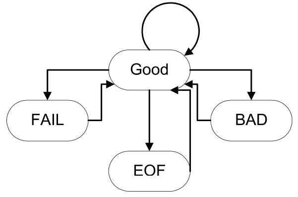

# 14 Stream

<!-- !!! tip "说明"

    本文档正在更新中…… -->

!!! info "说明"

    本文档仅涉及部分内容，仅可用于复习重点知识

流（stream）：数据的有序序列，C++ 用流来进行输入输出操作

头文件：

1. `<iostream>`：标准输入输出流（`cin`, `cout`, `cerr`, `clog`）
2. `<fstream>`：文件输入输出流（`ifstream`, `ofstream`, `fstream`）
3. `<sstream>`：字符串流（`istringstream`, `ostringstream`, `stringstream`）

优点：

1. 类型安全更好：流操作符（`<<`, `>>`）会根据变量类型自动选择合适的格式，避免了类型不匹配带来的错误，减少了运行时错误的可能性
2. 可扩展性强：可以为自定义类型重载流操作符，实现自定义类型的输入输出，方便扩展和维护
3. 更面向对象：流是类的实例，支持继承、多态等面向对象特性，便于与 C++ 其他特性结合使用

缺点：

1. 语法更繁琐：相比 C 语言的 `printf`/`scanf`，C++ 流的语法更长、更复杂，代码量可能增加
2. 效率较低：流的实现更复杂，通常运行速度比 C 的标准 I/O 函数慢，尤其是在大量数据处理时

## 1 流命名约定

### 1.1 标准输入输出流

1. `cin`：标准输入
2. `cout`：标准输出
3. `cerr`：标准错误（不缓冲 unbuffered）
4. `clog`：标准日志（缓冲 buffered）

!!! tip "缓冲"

    在 C++ 中，缓冲（buffered）和不缓冲（unbuffered）指的是输出数据时，数据是否会先暂存在内存的缓冲区中，还是直接输出到目标设备（如屏幕、文件等）

    1. 缓冲：输出的数据会先存放在内存的缓冲区里，等到缓冲区满了或者遇到换行、手动刷新（如 `flush`）时，才会一次性输出到目标设备。这样可以减少输出操作的次数，提高效率
    2. 不缓冲：输出的数据不会存放在缓冲区，而是每次输出操作都会立即发送到目标设备。这样可以保证信息及时显示，但效率较低

    流缓冲区：

    1. 每个 IO 流对象（如 `cin`、`cout`、`ifstream` 等）都有一个流缓冲区（stream buffer）
    2. 类 `streambuf` 定义了缓冲区的抽象和基本操作
    3. 流对象的成员函数 `rdbuf()` 可以返回指向其缓冲区的指针
    4. 对于 `streambuf` 对象，`<<` 操作符被重载，可以直接连接两个流的缓冲区，实现高效的数据传输

```cpp linenums="1"
#include <iostream>
using namespace std;

int main() {
    int a;
    cout << "请输入一个整数：";
    cin >> a;
    cout << "你输入的是：" << a << endl;
    cerr << "这是错误信息" << endl;  // 立即输出
    clog << "这是日志信息" << endl;  // 可能会延迟输出，直到缓冲区刷新
    return 0;
}
```

### 1.2 文件流

1. `ofstream`：输出文件流（写文件）
2. `ifstream`：输入文件流（读文件）
3. `fstream`：读写文件流

常用打开模式（可组合）：

1. `ios::in`：读
2. `ios::out`：写
3. `ios::app`：追加
4. `ios::trunc`：截断
5. `ios::binary`：二进制
6. `ios::ate`：打开文件后定位到文件末尾

```cpp linenums="1"
#include <fstream>
using namespace std;

int main() {
    // 写文件
    ofstream ofs("test.txt");
    ofs << "Hello, file!" << endl;
    ofs.close();

    // 读文件
    ifstream ifs("test.txt");
    string line;
    while (getline(ifs, line)) {
        cout << line << endl;
    }
    ifs.close();

    // 读写文件
    fstream fs("test.txt", ios::in | `ios::out);|
    // ...操作...
    fs.close();
    return 0;
}
```

`open(const char *, int flags, int)`：用于打开指定的文件，可以指定打开模式（如只读、只写、二进制等）

```cpp linenums="1"
ifstream inputS;
inputS.open("somefile", ios::in); // 以输入模式打开文件
if (!inputS) {
    cerr << "Unable to open somefile";
    // 处理错误
}
```

将一个文件的内容复制到标准输出（即屏幕）：

```cpp linenums="1"
#include <fstream>
#include <assert>

int main (int argc, char* argv[]) {
    assert(argc == 2);
    ifstream in(argv[1]);  // 打开命令行指定的文件进行读取
    assert(in);  // 确保文件成功打开
    cout << in.rdbuf();  // 将文件流的缓冲区直接输出到标准输出，实现文件内容的快速拷贝
}
```

### 1.3 字符串流

1. `istringstream`：从字符串读取
2. `ostringstream`：向字符串写入
3. `stringstream`：读写字符串

```cpp linenums="1"
#include <sstream>
using namespace std;

int main() {
    stringstream ss;
    ss << 123 << " " << 4.56;
    int a;
    double b;
    ss >> a >> b;
    cout << a << ", " << b << endl;

    // istringstream/ostringstream
    istringstream iss("789 0.12");
    int x;
    double y;
    iss >> x >> y;
    cout << x << ", " << y << endl;
    return 0;
}
```

## 2 流运算符

1. Extractor：`>>`
2. Inserters：`<<`
3. Manipulators：操纵符
4. 其他

### 2.1 其他输入操作

**1.`int get()`**

1. 作用：返回流中的下一个字符（作为 `int` 类型返回）
2. 返回值：如果没有字符可读（到达流末尾），返回 `EOF`（end of file，文件结束标志）

```cpp linenums="1"
int ch;
while ((ch = cin.get()) != EOF)
    cout.put(ch);  // 将单个字符输出到流
```

**2.`istream& get(char& ch)`**

1. 作用：将下一个字符读入到参数 `ch` 中
2. 说明：和 `int get()` 类似，但直接把字符存入变量，而不是返回
3. 返回值：返回流对象本身（可用于链式调用）

**3.`istream& getline(istream& is, string& str, char delim='\n')`**

1. 作用：从输入流中读取一行（或以指定分隔符结尾的字符串）到 `str` 中，默认以换行符 `\n` 为分隔符
2. 特点：是一个自由函数（非成员函数）

**4.`ignore(int limit = 1, int delim = EOF)`**

1. 作用：跳过输入流中的若干字符，直到跳过 `limit` 个字符或遇到分隔符 `delim` 为止
2. 特点：是 `istream` 的成员函数。遇到分隔符时也会跳过它

**5.`int gcount()`**

作用：返回上一次输入操作实际读取的字符数

```cpp linenums="1"
string buffer;
getline(cin, buffer);
cout << "read " << cin.gcount() << " characters";
```

**6.`void putback(char)`**

作用：将一个字符“放回”输入流，使其成为下一个要读取的字符

**7.`char peek()`**

作用：查看输入流中的下一个字符，但不提取（不移除）它

### 2.2 其他输出操作

**1.`put(char)`**

作用：向输出流中写入一个字符

```cpp linenums="1"
cout.put('a');   // 向标准输出写入字符 'a'
cerr.put('!');   // 向标准错误输出写入字符 '!'
```

**2.`flush()`**

作用：强制将缓冲区中的内容立即输出到目标设备（如屏幕），而不是等缓冲区满或遇到换行时才输出

```cpp linenums="1"
cout << "Enter a number";
cout.flush();    // 立即输出提示信息
```

### 2.3 格式设置操纵符

头文件：`<iomanip>`

| 操纵符 | 作用 | 类型 |
| :--: | :--: | :--: |
| `std::endl` | 输出换行并刷新缓冲区 | O |
| `std::setw(n)` | 设置字段宽度为 n，下一个输出项有效 | O |
| `std::setfill(c)` | 设置填充字符为 c（与 `setw` 配合使用） | O |
| `std::setprecision(n)` | 设置浮点数有效数字位数 | O |
| `std::fixed` | 以定点格式输出浮点数 | O |
| `std::scientific` | 以科学计数法格式输出浮点数 | O |
| `std::left` | 左对齐 | O |
| `std::right` | 右对齐 | O |
| `std::hex` | 以十六进制格式输入/输出整数 | I/O |
| `std::dec` | 以十进制格式输入/输出整数（默认） | I/O |
| `std::oct` | 以八进制格式输入/输出整数 | I/O |
| `std::showbase` | 显示进制前缀（如 0x, 0） | O |
| `std::showpoint` | 强制显示浮点数的小数点 | O |
| `std::uppercase` | 用大写字母输出十六进制和科学计数法 | O |
| `std::nouppercase` | 用小写字母输出十六进制和科学计数法 | O |
| `std::boolalpha` | 以 `true`/`false` 输入/输出 `bool` 类型 | I/O |
| `std::noboolalpha` | 以 1/0 输入/输出 `bool` 类型 | I/O |
| `std::ws` | 跳过输入流中的所有空白字符 | I |

```cpp linenums="1"
#include <iostream>
#include <iomanip>
using namespace std;

int main() {
    int n = 255;
    double d = 3.14159;

    cout << std::setw(10) << std::setfill('*') << n << endl; // 字段宽度10，填充*
    cout << std::hex << std::showbase << n << endl;          // 十六进制，显示0x
    cout << std::fixed << std::setprecision(2) << d << endl; // 固定小数点，2位小数
    cout << std::boolalpha << true << " " << false << endl;  // 输出true/false
    return 0;
}
```

```cpp linenums="1" title="output"
*******255
0xff
3.14
true false
```

#### 2.3.1 自定义操纵符

```cpp linenums="1"
#include <iostream>
using namespace std;

ostream& line(ostream& out) {
    return out << "--------------------";
}

int main() {
    cout << line << endl;
}
```

```cpp linenums="1"
#include <iostream>
using namespace std;

ostream& endl2(ostream& out) {
    out << '\n' << '\n';
    return out;
}

int main() {
    cout << "Hello" << endl2 << "World";
}
```

### 2.4 格式控制标志

| 标志（flag） | 作用|
| :--: | :--: |
| `ios::skipws` | 跳过前导空白字符（如空格、换行等）|
| `ios::left, ios::right` | 输出对齐方式（左对齐、右对齐）|
| `ios::internal` | 在符号和数值之间填充（如负号和数字之间）|
| `ios::dec, ios::hex, ios::oct` | 数字的进制格式（十进制、十六进制、八进制）|
| `ios::showbase` | 显示数字的进制前缀（如0x、0）|
| `ios::showpoint` | 总是显示小数点（即使是整数）|
| `ios::uppercase` | 用大写字母表示进制前缀和科学计数法中的E|
| `ios::showpos` | 正数前显示加号（+）|

#### 2.4.1 使用操纵符

1. `setiosflags(flags)`：设置指定的格式标志
2. `resetiosflags(flags)`：清除指定的格式标志

```cpp linenums="1"
#include <iostream>
#include <iomanip>
using namespace std;

cout << setiosflags(ios::hex | ios::showbase) << 255 << endl;      // 输出0xff
cout << resetiosflags(ios::showbase) << 255 << endl;               // 输出ff
```

#### 2.4.2 使用流的成员函数

1. `setf(flags)`：设置格式标志
2. `unsetf(flags)`：清除格式标志

```cpp linenums="1"
#include <iostream>
using namespace std;

cout.setf(ios::hex | ios::showbase);
cout << 255 << endl;      // 输出0xff
cout.unsetf(ios::showbase);
cout << 255 << endl;      // 输出ff
```

---

获取当前标志：

```cpp linenums="1"
auto flags = cout.flags(); // 获取当前所有格式标志
```

## 3 流状态

<figure markdown="span">
  { width="400" }
</figure>

| 状态标志 | 说明 |
| :--: | :--: |
| `goodbit` | 没有错误，流处于良好状态 |
| `eofbit` | 已到达输入流末尾（EOF） |
| `failbit` | 输入/输出操作失败（格式错误等） |
| `badbit` | 流发生严重错误（如物理读写错误） |

检查流状态的成员函数：

| 函数名 | 作用说明 |
| :--: | :--: |
| `good()` | 流处于良好状态（无错误） |
| `eof()` | 是否到达文件/流末尾 |
| `fail()` | 是否发生格式错误或其他错误 |
| `bad()` | 是否发生严重错误 |
| `clear()` | 清除所有错误状态，恢复流为良好状态 |

```cpp linenums="1"
#include <iostream>
#include <fstream>
using namespace std;

int main() {
    ifstream fin("test.txt");
    if (!fin) {
        cout << "文件打开失败" << endl;
        return 1;
    }

    int x;
    fin >> x;
    if (fin.eof()) {
        cout << "到达文件末尾" << endl;
    }
    if (fin.fail()) {
        cout << "读取失败（格式错误）" << endl;
        fin.clear(); // 清除错误状态
    }
    if (fin.bad()) {
        cout << "流发生严重错误" << endl;
    }
    if (fin.good()) {
        cout << "流状态良好" << endl;
    }
    fin.close();
    return 0;
}
```
