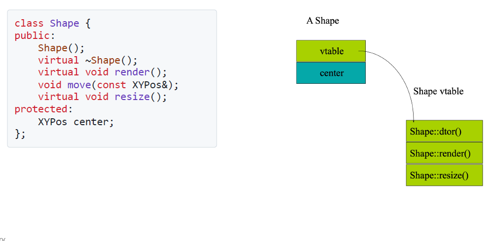
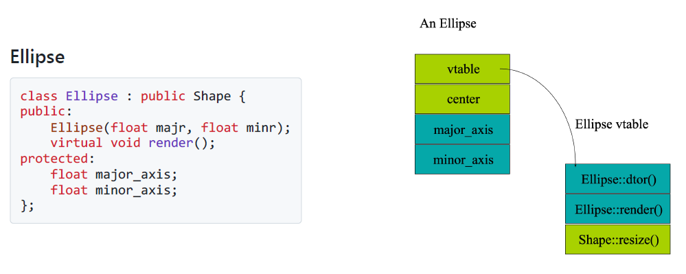
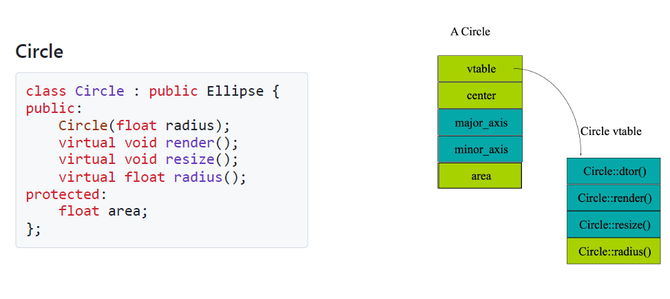

# 8 Polymorphism

!!! tip "说明"

    本文档正在更新中……

!!! info "说明"

    本文档仅涉及部分内容，仅可用于复习重点知识

多态是面向对象编程的核心特性之一，它允许同一个接口以不同的方式执行操作。C++ 中的多态分为两种主要类型：编译时多态（静态多态）和运行时多态（动态多态）

1. 静态多态：编译时多态通过函数重载和运算符重载实现，行为在编译时确定
      1. 函数重载：允许在同一个作用域中定义多个同名函数，但参数列表必须不同
      2. 运算符重载：允许为用户定义的类型赋予运算符新的行为
2. 动态多态：运行时多态通过继承和虚函数实现，行为在运行时确定
      1. 虚函数：允许子类重写父类的方法，并通过基类指针或引用调用子类的实现
      2. 纯虚函数与抽象类：纯虚函数是没有实现的虚函数，包含纯虚函数的类称为抽象类，不能直接实例化

!!! tip "纯虚函数与抽象类"

    ```cpp linenums="1"
    #include <iostream>
    using namespace std;
    
    class Shape {
    public:
        virtual void draw() = 0; // 纯虚函数
    };
    
    class Circle : public Shape {
    public:
        void draw() override {
            cout << "Drawing Circle" << endl;
        }
    };
    
    class Rectangle : public Shape {
    public:
        void draw() override {
            cout << "Drawing Rectangle" << endl;
        }
    };
    
    int main() {
        Shape* shape1 = new Circle();
        Shape* shape2 = new Rectangle();
    
        shape1->draw(); // 输出：Drawing Circle
        shape2->draw(); // 输出：Drawing Rectangle
    
        delete shape1;
        delete shape2;
        return 0;
    }
    ```

多态的实现原理：运行时多态的实现依赖于虚函数表（vtable） 和虚函数指针（vptr）：

- 每个包含虚函数的类都有一个虚函数表，存储虚函数的地址
- 每个对象都有一个虚函数指针，指向所属类的虚函数表

当通过基类指针调用虚函数时，程序会根据虚函数指针动态查找实际调用的函数

## 1 Up-casting

Upcasting（向上转型）是指将派生类指针或引用转换为基类指针或引用的过程。这是 C++ 中多态性的基础

```cpp linenums="1"
class Base { /*...*/ };
class Derived : public Base { /*...*/ };

Derived d;
Base* bp = &d;  // Upcasting - 将Derived*转换为Base*
Base& br = d;   // Upcasting - 将Derived&转换为Base&
```

特点：

1. 隐式转换：Upcasting 是自动进行的，不需要显式类型转换
2. 类型安全：编译器保证这种转换是安全的
3. 多态基础：通过 Upcasting 可以实现运行时多态

Object Slicing（对象切片）：当通过值传递进行 Upcasting 时，会发生对象切片

```cpp linenums="1"
void processAnimal(Animal animal) { /*...*/ }

Dog dog;
processAnimal(dog);  // 对象切片 - 只复制Animal部分
```

要避免对象切片，应使用指针或引用

```cpp linenums="1"
void processAnimal(Animal& animal) { /*...*/ }
// 或
void processAnimal(Animal* animal) { /*...*/ }
```

使用 `dynamic_cast` 可以实现向下转型

```cpp linenums="1"
Base* bp = new Derived();
Derived* dp = dynamic_cast<Derived*>(bp);  // 向下转型
if (dp) {
    // 转换成功
}
```

!!! tip "注意事项"

    只有公有继承时才能进行 Upcasting

## 2 Static Type and Dynamic Type

1. Static type：变量或表达式在编译时已知的类型
      1. 由变量声明或表达式决定
      2. 在编译时完全确定
      3. 不会随程序运行而改变
2. Dynamic type：指针或引用实际指向的对象的类型（运行时类型）
      1. 仅适用于指针和引用
      2. 在运行时才能确定
      3. 可能随程序运行而变化
      4. 需要基类有虚函数才能体现差异

```cpp linenums="1"
class Base {
public:
    virtual void print() { cout << "Base" << endl; }
};

class Derived : public Base {
public:
    void print() override { cout << "Derived" << endl; }
};

int main() {
    Derived d;
    Base* bp = &d;  // Static Type: Base*, Dynamic Type: Derived*
    
    bp->print();    // 输出"Derived" (动态类型决定)
    
    // typeid可以反映动态类型(当有虚函数时)
    cout << typeid(*bp).name();  // 输出Derived类型信息
}
```

!!! tip "typeid()"

    ```cpp linenums="1"
    Base* bp = new Derived();
    cout << typeid(bp).name();    // 输出Base* (static type)
    cout << typeid(*bp).name();   // 输出Derived (dynamic type，需有虚函数)
    ```

无虚函数时的行为：

```cpp linenums="1"
class Base { void foo() {} };
class Derived : public Base { void foo() {} };

Base* b = new Derived();
b->foo();  // 调用Base::foo (static type决定，无多态)
```

### 2.1 Cast Operators

#### 2.1.1 `static_cast`

#### 2.1.2 `dynamic_cast`

#### 2.1.3 `const_cast`

#### 2.1.4 `reinterpret_cast`

## 3 Virtual

1. non-virtual function
      1. static binding（静态绑定）：函数调用在编译时确定
      2. 效率高：无运行时查找开销
      3. 不可覆盖：派生类中的同名函数会隐藏而非覆盖基类函数
2. virtual function
      1. dynamic binding（动态绑定）：函数调用在运行时确定
      2. 多态基础：支持运行时多态
      3. 可覆盖：派生类可以使用 `override` 关键字明确覆盖

细节：

1. 静态成员函数不能被声明为虚函数
2. 构造函数不能被声明为虚函数
3. 构造函数中调用的虚函数是 static binding：在构造函数执行期间，对象的虚表（vtable）可能尚未完全初始化（尤其是基类构造函数运行时，派生类部分尚未构造），因此，构造函数中调用的虚函数会静态绑定（即直接调用当前类的版本，而非派生类的覆盖版本），这是 C++ 的明确规定，避免未定义行为

### 3.1 工作原理

C++ 通过虚函数表（vtable）和虚函数指针（vptr）实现运行时多态，这是虚函数工作的底层基础。当类包含虚函数时，编译器会为该类创建一个虚函数表，并在每个对象中嵌入一个指向该表的指针

虚函数表：

1. 每个多态类一个 vtable：编译器为包含虚函数的类生成一个虚函数表
2. 表内容：
      1. 按声明顺序存储类的虚函数地址
      2. 包含类型信息
3. 继承关系：
      1. 派生类的 vtable 包含基类 vtable 的内容
      2. 覆盖的函数替换为派生类的实现地址
      3. 新增虚函数追加到表末尾

虚函数指针：

1. 每个对象一个 vptr：==包含虚函数的类的每个实例都包含一个隐藏的 vptr 成员==
2. 初始化时机：
      1. 在构造函数中初始化，指向对应类的 vtable
      2. 在构造过程中，vptr 会随构造阶段变化（基类 → 派生类）
3. 内存布局：
      1. 通常位于对象起始位置（具体由编译器决定）
      2. 大小通常为一个指针大小（32 位系统 4 字节，64 位系统 8 字节）

虚函数调用过程：当通过基类指针/引用调用虚函数时

1. 通过 vptr 找到 vtable：访问对象的 vptr 成员，获取类的 vtable 地址
2. 查找函数地址：在 vtable 中找到对应偏移位置的函数地址
3. 间接调用：通过找到的地址调用实际函数

!!! tip "细节"

    1. 虚析构函数：虚析构函数也会进入 vtable，确保通过基类指针删除派生类对象时能正确调用整个析构链
    2. 纯虚函数：纯虚函数在 vtable 中通常用空指针或特殊函数地址表示，使抽象类无法实例化

=== "Shape"

    <figure markdown="span">
        { width="600" }
    </figure>

=== "Ellipse"

    <figure markdown="span">
        { width="600" }
    </figure>

=== "Circle"

    <figure markdown="span">
        { width="600" }
    </figure>

## 4 Override

1. 只有虚函数（virtual）才能被重写
2. 函数签名（名称、参数列表、返回类型）必须完全相同
3. 在 C++ 11 后建议使用 `override` 关键字明确表示重写

```cpp linenums="1"
class Base {
public:
    virtual void func() { 
        cout << "Base implementation" << endl; 
    }
};

class Derived : public Base {
public:
    // 重写基类的虚函数
    void func() override {  // C++11起推荐添加override关键字
        cout << "Derived implementation" << endl;
    }
};

int main() {
    Base* b = new Derived();
    b->func(); // 输出"Derived implementation"
    delete b;
}
```

!!! tip "final"

    使用 `final` 禁止重写

    ```cpp linenums="1"
    class Base {
    public:
        virtual void foo() final {  // 这个虚函数不能被子类重写
            // ...
        }
    };
    
    class Derived : public Base {
    public:
        void foo() override;  // 编译错误：foo 是 final 的，不能重写
    };
    ```

    `final` 还可以禁止继承

    ```cpp linenums="1"
    class Base final {  // 这个类不能被继承
        // ...
    };
    
    class Derived : public Base {  // 编译错误：Base 是 final 类
        // ...
    };
    ```

    结合 `override` 使用

    ```cpp linenums="1"
    class Base {
    public:
        virtual void foo() {}
        virtual void bar() {}
    };
    
    class Derived : public Base {
    public:
        void foo() final override {}  // 明确表示重写，并禁止进一步重写
        void bar() override {}        // 允许子类继续重写
    };
    
    class FurtherDerived : public Derived {
    public:
        // void foo() override {}  // 错误：foo 是 final 的
        void bar() override {}    // 可以重写 bar
    };
    ```

调用被覆盖的基类函数：在派生类中重写（override）基类函数时，可以使用 `Base::func()` 语法显式调用基类版本的函数

返回类型协变（Covariant return type）：

1. 当派生类重写基类虚函数时，C++ 允许派生类版本的函数返回基类函数返回类型的子类
2. 这只适用于返回类型为指针或引用的情况
3. 例如，如果基类函数返回 B*，派生类函数可以返回 D*（假设 D 继承自 B）

```cpp linenums="1"
class Expr {
public:
    virtual Expr* newExpr();
    virtual EXpr& clone();
    virtual Expr self();
};
class BinaryExpr : public Expr {
public:
    virtual BinaryExpr* newExpr();  // ok
    virtual BinaryExpr& clone();  // ok
    virtual BinaryExpr self();  // error!
}
```

重载（Overloading）可以为函数添加多个签名（signature），如果重写（override）一个重载的函数，必须重写所有的变体，不能只重写其中一个，如果没有全部重写，某些版本会被隐藏（hidden）

```cpp linenums="1"
class Base {  
public:  
    virtual void func();  
    virtual void func(int);  
};

class Derived : public Base {  
public:  
    virtual void func() {  
        Base::func();  // 调用基类版本  
    }  
    virtual void func(int) { ... };  // 必须重写所有重载版本  
};  
```

> 如果派生类只重写 `func()` 而不重写 `func(int)`，那么 `func(int)` 会被隐藏，导致派生类对象无法直接调用 `func(int)`

!!! tip "建议"

    1. 永远不要重新定义继承的非虚函数
    2. 永远不要重新定义继承的默认参数值
          - 默认参数也是静态绑定的

## 5 Abstract Class

抽象类是面向对象编程中的一个重要概念，用于定义一个通用的接口或基类，供派生类实现具体功能。抽象类的主要特征是包含至少一个纯虚函数

定义：

1. 抽象类是包含一个或多个纯虚函数的类
2. 纯虚函数是没有实现的虚函数，定义时使用 `= 0` 表示
3. 抽象类不能直接实例化，==但可以通过指针或引用指向派生类对象==
4. 抽象类可以作为函数返回值或参数类型（但实际返回或传入的必须是派生类对象）

```cpp linenums="1"
#include <iostream>
using namespace std;

class AbstractShape {
public:
    virtual void draw() = 0; // 纯虚函数
    virtual ~AbstractShape() {} // 虚析构函数，确保派生类正确析构
};

class Circle : public AbstractShape {
public:
    void draw() override {
        cout << "Drawing Circle" << endl;
    }
};

class Rectangle : public AbstractShape {
public:
    void draw() override {
        cout << "Drawing Rectangle" << endl;
    }
};

int main() {
    AbstractShape* shape1 = new Circle();
    AbstractShape* shape2 = new Rectangle();

    shape1->draw(); // 输出：Drawing Circle
    shape2->draw(); // 输出：Drawing Rectangle

    delete shape1;
    delete shape2;
    return 0;
}
```

特点：

1. 不能实例化：抽象类不能直接创建对象
2. 可以包含非纯虚函数：抽象类可以包含普通成员函数，供派生类复用
3. 可以包含成员变量：抽象类可以包含成员变量，供派生类使用
4. 派生类必须实现所有纯虚函数：如果派生类没有实现基类的所有纯虚函数，那么派生类也会成为抽象类
5. 虚析构函数：抽象类通常需要定义虚析构函数，以确保派生类对象被正确销毁

用途：

1. 定义接口：抽象类用于定义一组通用的接口，派生类实现具体功能。
2. 实现多态：抽象类通过虚函数支持运行时多态，允许通过基类指针或引用调用派生类的实现
3. 代码复用：抽象类可以包含通用的实现，供派生类复用

## 6 Multiple Inheritance

!!! tip "建议"

    不要使用多继承（MI）

多继承是指一个类可以同时继承多个基类，从而获得多个基类的成员和功能

```cpp linenums="1"
class Derived : public Base1, public Base2 {
    // Derived 类的定义
};
```

- 可以通过逗号分隔多个基类
- 每个基类可以有自己的访问控制符（`public`、`protected` 或 `private`）

**二义性问题**：当多个基类中有同名成员时，子类会遇到二义性问题，需要通过作用域解析符来解决

```cpp linenums="1"
class Base1 {
public:
    void func() { cout << "Base1::func" << endl; }
};

class Base2 {
public:
    void func() { cout << "Base2::func" << endl; }
};

class Derived : public Base1, public Base2 {
    // Derived 类继承了 Base1 和 Base2
};

int main() {
    Derived d;
    // d.func(); // 错误：二义性
    d.Base1::func(); // 正确：调用 Base1 的 func
    d.Base2::func(); // 正确：调用 Base2 的 func
    return 0;
}
```

### 6.1 菱形继承问题

当一个类通过多个路径继承同一个基类时，会导致基类的成员被多次继承，造成冗余和二义性

```cpp linenums="1"
class B1 { int m_i; };          // 基类
class D1 : public B1 {};        // D1 继承 B1
class D2 : public B1 {};        // D2 继承 B1
class M : public D1, public D2 {}; // M 多重继承 D1 和 D2

void main() {
    M m;           // OK：创建 M 对象，合法
    B1* p = new M; // ERROR：歧义，无法确定是 D1::B1 还是 D2::B1
    B1* p2 = dynamic_cast<D1*>(new M); // OK：明确指定 D1 路径的 B1

    m.m_i++; // 错误：是 D1::B1.m_i 还是 D2::B1.m_i？
}
```

通过虚继承可以避免菱形继承问题，使得基类的成员只保留一份

==虚基类的构造函数需要在派生类中显式调用==

```cpp linenums="1"
class A {
public:
    A(int x) { cout << "A Constructor: " << x << endl; }
};

class B : virtual public A {
public:
    B() : A(0) { cout << "B Constructor" << endl; }
};

class C : virtual public A {
public:
    C() : A(0) { cout << "C Constructor" << endl; }
};

class D : public B, public C {
public:
    D() : A(42) { cout << "D Constructor" << endl; }
};

int main() {
    D d;
    // 输出：
    // A Constructor: 42
    // B Constructor
    // C Constructor
    // D Constructor
    return 0;
}
```

对 C++ 而言，“virtual” 表示间接访问：

- 虚成员函数 → 通过虚函数表（vtable）动态绑定
- 虚基类 → 通过指针间接定位基类子对象（编译器插入隐藏指针）

### 6.2 Protocol / Interface Class

**协议类 / 接口类**

1. 抽象基类

    1. 纯虚函数：所有非静态成员函数必须声明为纯虚函数，强制派生类实现这些函数
    2. 虚析构函数：必须提供虚析构函数（确保通过基类指针删除派生类对象时能正确调用派生类的析构函数），但函数体为空（因接口类通常无资源需要释放）

2. 禁止非静态成员变量

    1. 接口类 **不应包含任何非静态成员变量**（包括继承的成员变量），因为它的职责是定义行为（方法），而非状态（数据）
    2. **允许静态成员**（如静态常量或静态函数），因为它们属于类级别而非对象级别

```cpp linenums="1"
class Interface1 {
public:
    virtual void func1() = 0;
};

class Interface2 {
public:
    virtual void func2() = 0;
};

class Derived : public Interface1, public Interface2 {
public:
    void func1() override { /* 实现 func1 */ }
    void func2() override { /* 实现 func2 */ }
};
```

