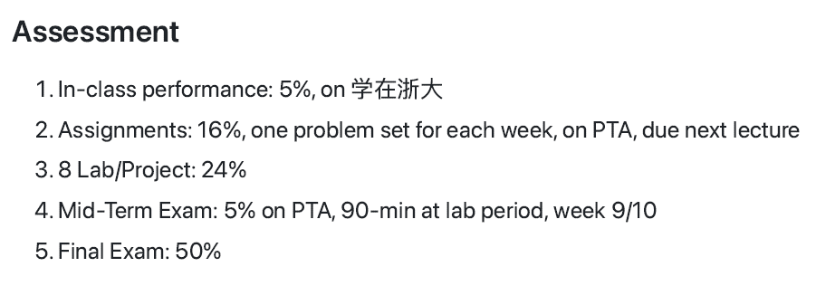

# 面向对象程序设计

!!! tip "说明"

    本文档正在更新中……

## 课程介绍

!!! info "注意"

    此为 2024-2025 春夏学期课程安排，仅供参考

wk老师

### 考核方式

<figure markdown="span">
  { width="600" }
</figure>

## 个人笔记

[0 Introduction](./ch0.md) 
[1 Using Objects](./ch1.md) 
[2 Grouping Objects](./ch2.md)