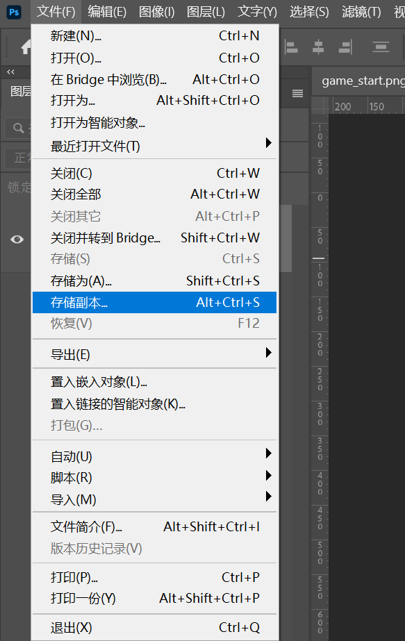
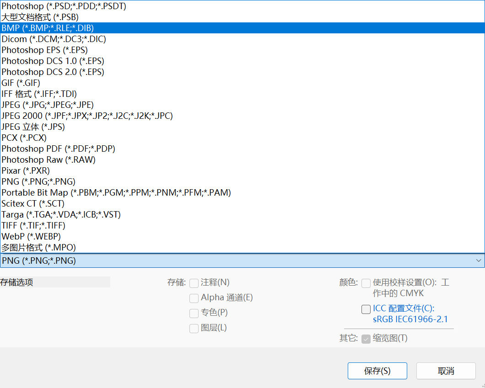
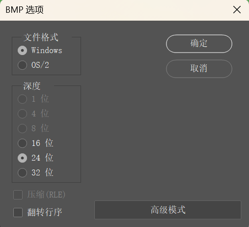
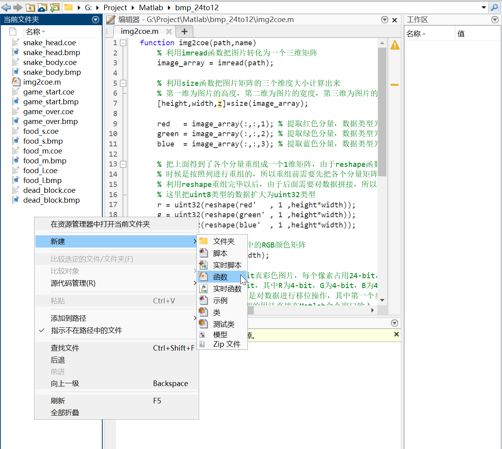

# final

!!! tip "说明"

    此文档正在更新中……

!!! warning "注意"

    同学们一定要先自行搜索资料完成项目，本文档仅作参考作用

我们组做的是“贪吃蛇”

## 1 VGA设计思路

### 1.1 clk_gen模块

此模块助教已提供，产生 $25MHz$ 的 $clk$ 信号，用于 $VGA$ 的运作

``` verilog
module clk_gen(
    input clk, // 100 MHz
    output vga_clk // 25 MHz
    );

    reg [1:0] clkdiv;
    initial clkdiv = 2'b0;
    always @(posedge clk) clkdiv = clkdiv + 2'b1;

    assign vga_clk = clkdiv[1];
endmodule
```

### 1.2 vga_ctrl模块

此模块助教已提供。接收像素点的色彩信息（$Din$），输出当前像素点的坐标（$row,col$）和 $VGA$ 有关的变量（$R,G,B,HS,VS$）

```verilog
module vga_ctrl(
	input clk,                   // vga clk = 25 MHz
	input rst,
	input [11:0]Din,			// bbbb_gggg_rrrr, pixel
	output reg [8:0]row,		// pixel ram row address, 480 (512) lines
	output reg [9:0]col,		// pixel ram col address, 640 (1024) pixels
	output reg rdn,			// read pixel RAM(active_low)
	output reg [3:0]R, G, B,// red, green, blue colors
	output reg HS, VS			// horizontal and vertical synchronization
   );
// h_count: VGA horizontal counter (0~799)
reg [9:0] h_count; // VGA horizontal counter (0~799): pixels
initial h_count = 10'h0;
	always @ (posedge clk) begin
		if (rst)  h_count <= 10'h0;
		else if  (h_count == 10'd799)
					 h_count <= 10'h0;
			  else h_count <= h_count + 10'h1;
	end

// v_count: VGA vertical counter (0~524)
reg [9:0] v_count; // VGA vertical counter (0~524): pixel
initial v_count = 10'h0;
	always @ (posedge clk or posedge rst) begin
		if (rst)  v_count <= 10'h0;
		else if  (h_count == 10'd799) begin
					if (v_count == 10'd524) v_count <= 10'h0;
					else v_count <= v_count + 10'h1;
		end
	end
	

// signals, will be latched for outputs
wire	[9:0] row_addr = v_count - 10'd35;		// pixel ram row addr
wire	[9:0] col_addr = h_count - 10'd143;		// pixel ram col addr
wire			h_sync = (h_count > 10'd95);		//   96 -> 799
wire			v_sync = (v_count > 10'd1);		//    2 -> 524
wire			read   = (h_count > 10'd142) &&	//  143 -> 782
							(h_count < 10'd783) &&	//         640 pixels
							(v_count > 10'd34)  &&	//   35 -> 514
							(v_count < 10'd525);		//         480 lines
// vga signals
always @ (posedge clk) begin
	row <= row_addr[8:0];	// pixel ram row address
	col <= col_addr;			// pixel ram col address
	rdn <= ~read;				// read pixel (active low)
	HS  <= h_sync;				// horizontal synchronization
	VS  <= v_sync;				// vertical   synchronization
	R   <= rdn ? 4'h0 : Din[3:0];		// 3-bit red
	G	 <= rdn ? 4'h0 : Din[7:4];		// 3-bit green
	B	 <= rdn ? 4'h0 : Din[11:8];	// 2-bit blue
end

endmodule
```

### 1.3 vga_screen_pic模块

核心模块，输出当前像素点的色彩信息并提供给 $vga\_ctrl$ 模块

#### 1.3.1 IP核的生成

##### 图片制作

部分图片是由 $AI$ 生成并使用 $PS$ 进行一定处理后产生。

###### 游戏开始画面

图像分辨率：$640 \times 480$

<figure markdown="span">
    
</figure>

###### 游戏结束画面

图像分辨率：$640 \times 480$

<figure markdown="span">
    
</figure>

###### 游戏中画面

**蛇的身体：**

图像分辨率：$16 \times 16$

<figure markdown="span">
    
</figure>

**蛇的头部：**

图像分辨率：$16 \times 16$

<figure markdown="span">
    
</figure>

**死亡格：**

图像分辨率：$16 \times 16$

<figure markdown="span">
    
</figure>

**小食物：**

图像分辨率：$16 \times 16$

<figure markdown="span">
    
</figure>

**中食物：**

图像分辨率：$16 \times 16$

<figure markdown="span">
    
</figure>

**大食物：**

图像分辨率：$16 \times 16$

<figure markdown="span">
    
</figure>

##### 图片处理

> 参考：<br/>
> 1. [VGA显示图像 详细总结](https://blog.csdn.net/weixin_44406200/article/details/103823607){:target="_blank"}，原文部分地方有误，本文档已修改<br/>
> 2. [基于rom的vga图像显示](https://doc.embedfire.com/fpga/altera/ep4ce10_pro/zh/latest/code/rom_vga.html){:target="_blank"}

所有图片导出为24位 $.bmp$ 文件，并使用 $Matlab$ 将其转换为符合格式的 $.coe$ 文件。

> Matlab 下载：[浙江大学校园正版化软件平台](http://ms.zju.edu.cn/matlab/download.html){:target="_blank"}


??? tip "PS 导出为 .bmp 文件" 

    > PS 下载：[浙江大学校园正版化软件平台](https://software.zju.edu.cn/index.html){:target="_blank"}

    PS打开目标图片，选择 ^^文件 -> 存储副本^^

    <figure markdown="span">
        {width="250"}
    </figure>

    选择 .bmp 类型，选择文件保存位置，点击 ^^保存^^

    <figure markdown="span">
        {width="400"}
    </figure>

    ^^文件格式^^ 选择 ^^Windows^^，^^深度^^ 选择 ^^24位^^，点击 ^^确定^^

    <figure markdown="span">
        {width="300"}
    </figure>

转换函数如下：

``` matlab
function img2coe(path,name)
    % 利用imread函数把图片转化为一个三维矩阵
    image_array = imread(path);
    
    % 利用size函数把图片矩阵的三个维度大小计算出来
    % 第一维为图片的高度，第二维为图片的宽度，第三维为图片的RGB分量
    [height,width,z]=size(image_array);   

    red   = image_array(:,:,1); % 提取红色分量，数据类型为uint8
    green = image_array(:,:,2); % 提取绿色分量，数据类型为uint8
    blue  = image_array(:,:,3); % 提取蓝色分量，数据类型为uint8

    % 把上面得到了各个分量重组成一个1维矩阵，由于reshape函数重组矩阵的
    % 时候是按照列进行重组的，所以重组前需要先把各个分量矩阵进行转置以后再重组
    % 利用reshape重组完毕以后，由于后面需要对数据拼接，所以为了避免溢出
    % 这里把uint8类型的数据扩大为uint32类型
    r = uint32(reshape(red'   , 1 ,height*width));
    g = uint32(reshape(green' , 1 ,height*width));
    b = uint32(reshape(blue'  , 1 ,height*width));

    % 初始化要写入.coe文件中的RGB颜色矩阵
    rgb=zeros(1,height*width);

    % 因为导入的图片是24-bit真彩色图片，每个像素占用24-bit，其中RGB分别占用8-bit
    % 而我这里需要的是12-bit，其中R为4-bit，G为4-bit，B为4-bit，所以需要在这里对24-bit的数据进行重组与拼接
    % bitshift()函数的作用是对数据进行移位操作，其中第一个参数是要进行移位的数据，第二个参数为负数表示向右移，为
    % 正数表示向左移，更详细的用法直接在Matlab命令窗口输入 doc bitshift 进行查看
    % 所以这里对红色分量先右移4位取出高4位，然后左移8位作为ROM中RGB数据的第11-bit到第8-bit
    % 对绿色分量先右移4位取出高4位，然后左移4位作为ROM中RGB数据的第7-bit到第4-bit
    % 对蓝色分量先右移4位取出高4位，然后左移0位作为ROM中RGB数据的第3-bit到第0-bit
    for i = 1:height*width
        rgb(i) = bitshift(bitshift(r(i),-4),8) + bitshift(bitshift(g(i),-4),4) + bitshift(bitshift(b(i),-4),0);
    end

    fid = fopen( name , 'w+' );

    % .coe文件的最前面一行必须为这个字符串，其中16表示16进制
    fprintf( fid, 'memory_initialization_radix=16;\n');

    % .coe文件的第二行必须为这个字符串
    fprintf( fid, 'memory_initialization_vector =\n');

    % 把rgb数据的前 height*width-1  个数据写入.coe文件中，每个数据之间用逗号隔开
    fprintf( fid, '%x,\n',rgb(1:end-1));

    % 把rgb数据的最后一个数据写入.coe文件中，并用分号结尾
    fprintf( fid, '%x;',rgb(end));

    fclose( fid ); % 关闭文件指针
end

```

??? tip "matlab 转换为 .coe 文件"

    打开某一文件夹，在左边工作区右键，新建 $img2coe.m$ 函数文件

    <figure markdown="span">
        {width="500"}
    </figure>

    将上述代码复制粘贴到 $img2coe.m$ 文件中

    将目标图片复制粘贴至与 $img2coe.m$ 文件同一目录下，在下方 ^^命令行窗口^^ 输入 `img2coe('{img}.bmp', '{img}.coe');` ，例如 `img2coe('game_start.bmp', 'game_start.coe');`，即可在同一目录下生成 .coe 文件

    <figure markdown="span">
        {width="600"}
    </figure>