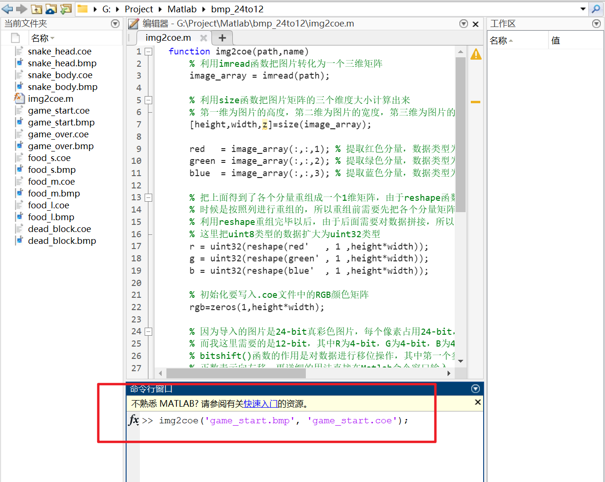

# final

!!! tip "说明"

    此文档正在更新中……

!!! warning "注意"

    具体的 verilog 代码同学们一定要先尝试自己完成，本文档仅作提示和参考作用
    > VGA 可能需要显示图片，图片的像素信息需要存储在 ROM 当中并生成 IP 核，具体如何操作？关于这种类型的问题，当然可以直接参考学习本文档的相关内容

我们组做的是“贪吃蛇”。我负责的是 VGA，蜂鸣器和部分运动模块，因此在这些内容方面会解释的详细一些

## 1 整体设计思路

<figure markdown="span">
    {width="400"}
</figure>

采用 Top-Down 设计思路，由 top 模块来组织连接其他子模块，其中主要的功能模块有 Ps2, Run（运动模块）, VGA, State（状态机）, DispNum（数码管显示）, beep（蜂鸣器）。使用 IP 核来存储图片等数据

将 $640 \times 480$ 的屏幕，以 $16 \times 16$ 为单元格，划分为 $40 \times 30$ 的区域

我们将每个单元格给予一个state状态值，分为 0: 背景格，1: 蛇头，2: 蛇身，3: Small_Food，4: Medium_Food，5: Large_Food，6: 死亡格

## 2 VGA设计思路

> 参考：<br/>
> 1. [基于rom的vga图像显示](https://doc.embedfire.com/fpga/altera/ep4ce10_pro/zh/latest/code/rom_vga.html){:target="_blank"}

整体结构图如下：

<figure markdown="span">
    {width="600"}
</figure>

### 2.1 clk_gen模块

此模块助教已提供，产生 $25MHz$ 的 $clk$ 信号，用于 $VGA$ 的运作

``` verilog linenums="1"
module clk_gen(
    input clk, // 100 MHz
    output vga_clk // 25 MHz
    );

    reg [1:0] clkdiv;
    initial clkdiv = 2'b0;
    always @(posedge clk) clkdiv = clkdiv + 2'b1;

    assign vga_clk = clkdiv[1];
endmodule
```

### 2.2 vga_ctrl模块

此模块助教已提供。接收像素点的色彩信息（$Din$），输出当前像素点的坐标（$row,col$）和 $VGA$ 有关的变量（$R,G,B,HS,VS$）

```verilog linenums="1" hl_lines="49-51"
module vga_ctrl(
	input clk,                   // vga clk = 25 MHz
	input rst,
	input [11:0]Din,			// bbbb_gggg_rrrr, pixel
	output reg [8:0]row,		// pixel ram row address, 480 (512) lines
	output reg [9:0]col,		// pixel ram col address, 640 (1024) pixels
	output reg rdn,			// read pixel RAM(active_low)
	output reg [3:0]R, G, B,// red, green, blue colors
	output reg HS, VS			// horizontal and vertical synchronization
   );
// h_count: VGA horizontal counter (0~799)
reg [9:0] h_count; // VGA horizontal counter (0~799): pixels
initial h_count = 10'h0;
	always @ (posedge clk) begin
		if (rst)  h_count <= 10'h0;
		else if  (h_count == 10'd799)
					 h_count <= 10'h0;
			  else h_count <= h_count + 10'h1;
	end

// v_count: VGA vertical counter (0~524)
reg [9:0] v_count; // VGA vertical counter (0~524): pixel
initial v_count = 10'h0;
	always @ (posedge clk or posedge rst) begin
		if (rst)  v_count <= 10'h0;
		else if  (h_count == 10'd799) begin
					if (v_count == 10'd524) v_count <= 10'h0;
					else v_count <= v_count + 10'h1;
		end
	end
	

// signals, will be latched for outputs
wire	[9:0] row_addr = v_count - 10'd35;		// pixel ram row addr
wire	[9:0] col_addr = h_count - 10'd143;		// pixel ram col addr
wire			h_sync = (h_count > 10'd95);		//   96 -> 799
wire			v_sync = (v_count > 10'd1);		//    2 -> 524
wire			read   = (h_count > 10'd142) &&	//  143 -> 782
							(h_count < 10'd783) &&	//         640 pixels
							(v_count > 10'd34)  &&	//   35 -> 514
							(v_count < 10'd525);		//         480 lines
// vga signals
always @ (posedge clk) begin
	row <= row_addr[8:0];	// pixel ram row address
	col <= col_addr;			// pixel ram col address
	rdn <= ~read;				// read pixel (active low)
	HS  <= h_sync;				// horizontal synchronization
	VS  <= v_sync;				// vertical   synchronization
	R   <= rdn ? 4'h0 : Din[3:0];		// 3-bit red
	G	 <= rdn ? 4'h0 : Din[7:4];		// 3-bit green
	B	 <= rdn ? 4'h0 : Din[11:8];	// 2-bit blue
end

endmodule
```

> 建议结合 VGA 显示原理看明白上述代码，有利于更好的理解下面 vga_screen_pic 模块

!!! tip "代码块49-51行注释解释"

    3 bit red，3 bit green，2 bit blue 意思是我们输入的数据 Din，经过接口到达 VGA 显示时，会取 R 通道 4 bit 数据的高 3 位，取 G 通道 4 bit 数据的高 3 位，取 B 通道 4 bit 数据的高 2 位，作为最终显示的颜色值
    
    更加详细严谨的内容，浏览器搜素 rgb332

### 2.3 vga_screen_pic模块

核心模块，输出当前像素点的色彩信息并提供给 $vga\_ctrl$ 模块

#### 2.3.1 IP核的生成

##### 图片制作

部分图片是由 $AI$ 生成并使用 $PS$ 进行一定处理后产生。

###### 游戏开始画面

图像分辨率：$640 \times 480$

<figure markdown="span">
    
</figure>

###### 游戏结束画面

图像分辨率：$640 \times 480$

<figure markdown="span">
    
</figure>

###### 游戏中画面

**蛇的身体：**

图像分辨率：$16 \times 16$

<figure markdown="span">
    
</figure>

**蛇的头部：**

图像分辨率：$16 \times 16$

<figure markdown="span">
    
</figure>

**死亡格：**

图像分辨率：$16 \times 16$

<figure markdown="span">
    
</figure>

**小食物：**

图像分辨率：$16 \times 16$

<figure markdown="span">
    
</figure>

**中食物：**

图像分辨率：$16 \times 16$

<figure markdown="span">
    
</figure>

**大食物：**

图像分辨率：$16 \times 16$

<figure markdown="span">
    
</figure>

##### 图片处理

> 参考：<br/>
> 1. [VGA显示图像 详细总结](https://blog.csdn.net/weixin_44406200/article/details/103823607){:target="_blank"}，原文部分地方有误，本文档已修改

所有图片导出为24位 $.bmp$ 文件，并使用 $Matlab$ 将其转换为符合格式的 $.coe$ 文件。

> Matlab 下载：[浙江大学校园正版化软件平台](http://ms.zju.edu.cn/matlab/download.html){:target="_blank"}


??? tip "PS 导出为 .bmp 文件" 

    > PS 下载：[浙江大学校园正版化软件平台](https://software.zju.edu.cn/index.html){:target="_blank"}

    PS打开目标图片，选择 ^^文件 -> 存储副本^^

    <figure markdown="span">
        {width="250"}
    </figure>

    选择 .bmp 类型，选择文件保存位置，点击 ^^保存^^

    <figure markdown="span">
        {width="400"}
    </figure>

    ^^文件格式^^ 选择 ^^Windows^^，^^深度^^ 选择 ^^24位^^，点击 ^^确定^^

    <figure markdown="span">
        {width="300"}
    </figure>

转换函数如下：

``` matlab linenums="1"
function img2coe(path,name)
    % 利用imread函数把图片转化为一个三维矩阵
    image_array = imread(path);
    
    % 利用size函数把图片矩阵的三个维度大小计算出来
    % 第一维为图片的高度，第二维为图片的宽度，第三维为图片的RGB分量
    [height,width,z]=size(image_array);   

    red   = image_array(:,:,1); % 提取红色分量，数据类型为uint8
    green = image_array(:,:,2); % 提取绿色分量，数据类型为uint8
    blue  = image_array(:,:,3); % 提取蓝色分量，数据类型为uint8

    % 把上面得到了各个分量重组成一个1维矩阵，由于reshape函数重组矩阵的
    % 时候是按照列进行重组的，所以重组前需要先把各个分量矩阵进行转置以后再重组
    % 利用reshape重组完毕以后，由于后面需要对数据拼接，所以为了避免溢出
    % 这里把uint8类型的数据扩大为uint32类型
    r = uint32(reshape(red'   , 1 ,height*width));
    g = uint32(reshape(green' , 1 ,height*width));
    b = uint32(reshape(blue'  , 1 ,height*width));

    % 初始化要写入.coe文件中的RGB颜色矩阵
    rgb=zeros(1,height*width);

    % 因为导入的图片是24-bit真彩色图片，每个像素占用24-bit，其中RGB分别占用8-bit
    % 而我这里需要的是12-bit，其中R为4-bit，G为4-bit，B为4-bit，所以需要在这里对24-bit的数据进行重组与拼接
    % bitshift()函数的作用是对数据进行移位操作，其中第一个参数是要进行移位的数据，第二个参数为负数表示向右移，为
    % 正数表示向左移，更详细的用法直接在Matlab命令窗口输入 doc bitshift 进行查看
    % 所以这里对红色分量先右移4位取出高4位，然后左移8位作为ROM中RGB数据的第11-bit到第8-bit
    % 对绿色分量先右移4位取出高4位，然后左移4位作为ROM中RGB数据的第7-bit到第4-bit
    % 对蓝色分量先右移4位取出高4位，然后左移0位作为ROM中RGB数据的第3-bit到第0-bit
    for i = 1:height*width
        rgb(i) = bitshift(bitshift(r(i),-4),8) + bitshift(bitshift(g(i),-4),4) + bitshift(bitshift(b(i),-4),0);
    end

    fid = fopen( name , 'w+' );

    % .coe文件的最前面一行必须为这个字符串，其中16表示16进制
    fprintf( fid, 'memory_initialization_radix=16;\n');

    % .coe文件的第二行必须为这个字符串
    fprintf( fid, 'memory_initialization_vector =\n');

    % 把rgb数据的前 height*width-1  个数据写入.coe文件中，每个数据之间用逗号隔开
    fprintf( fid, '%x,\n',rgb(1:end-1));

    % 把rgb数据的最后一个数据写入.coe文件中，并用分号结尾
    fprintf( fid, '%x;',rgb(end));

    fclose( fid ); % 关闭文件指针
end

```

??? tip "matlab 转换为 .coe 文件"

    打开某一文件夹，在左边工作区右键，新建 $img2coe.m$ 函数文件

    <figure markdown="span">
        {width="500"}
    </figure>

    将上述代码复制粘贴到 $img2coe.m$ 文件中

    将目标图片复制粘贴至与 $img2coe.m$ 文件同一目录下，在下方 ^^命令行窗口^^ 输入 `img2coe('{filename}.bmp', '{filename}.coe');` ，例如 `img2coe('game_start.bmp', 'game_start.coe');`，即可在同一目录下生成 .coe 文件

    <figure markdown="span">
        {width="600"}
    </figure>

生成的 $.coe$ 文件格式如下（拿 $food\_l.coe$ 举例）：

``` coe linenums="1" hl_lines="12"
memory_initialization_radix=16;  // 表示以下数据用16进制表示
memory_initialization_vector =  // 具体数据
0,  // 从左到右，从上到下，各个像素点的颜色信息
0,  // 共 256 个数据，因为此图片分辨率为 16 x 16，共 256 个像素点
0,
0,
0,
0,
-- snip --  // 这里省略展示部分数据
420,
c71,
f92,
f92,
c71,
420,
-- snip --
0,
0;
```

打开 PS，选择 ^^颜色取样工具^^ ，在图中左键单击可添加标记点，左键单击右侧 ^^信息^^ 栏中标记点的下三角图标，选择 ^^Web颜色^^ ，即可对数据进行检验。例如标记如图 6 个点，数据信息和 .coe 文件数据相同。PS 中 R、G、B 三个通道的数值均为 8 bit，.coe 文件中为 4 bit，取 PS 中各通道显示数据的最高一位，即和 .coe 文件中的数据相同。例如标记点3，PS 中 R、G、B 分别为 F4、9D、21，各取最高一位即为 .coe 文件中的数据 f92 （上方代码块第 12 行）

<figure markdown="span">
    {width="500"}
</figure>

##### 生成IP核

利用 $vivado$ 生成IP核，导入 $.coe$ 文件，选择生成 $ROM$

<div class="annotate" markdown>

??? tip "vivado 生成 ROM"

    打开项目工程文件，点击左侧的 ^^IP Catalog^^，搜索 ROM，双击 ^^Distributed Memory Generator^^

    > ^^Distributed Memory Generator^^ 会生成不包含时钟信号的存储器，^^Block Memory Generator^^ 会生成包含时钟信号的存储器 (1) ，我们组的实现方案不需要时钟信号，因此选择生成 ^^Distributed Memory Generator^^

    <figure markdown="span">
        
    </figure>

    > 图中的工程文件是我随便找的，用来截图做示范的，所以图中的源文件不需要关注

    可以重命名模块名称，设置 Depth 为 256（因为此图片共 256 个像素点），设置 Data Width 为 12（因为每个像素点的颜色数据为 12 bit）。类似的，如果是 game_start 这张图片，Depth 应设置为 640 x 480 = 307200，Data Width 仍为 12。Memory Type 选择 ROM

    <figure markdown="span">
        
    </figure>

    上方选项卡选择 RST & Initialization，点击红框中的按钮加载 .coe 文件

    <figure markdown="span">
        
    </figure>

    选择刚才生成的 .coe 文件

    <figure markdown="span">
        
    </figure>

    完成后点击 OK

    <figure markdown="span">
        
    </figure>

    这里建议选择 ^^Out of context per IP^^，点击 ^^Generate^^

    <figure markdown="span">
        {width="300"}
    </figure>

    完成后，可以在 ^^IP sources^^ 这里找到刚才生成的 IP 核

    <figure markdown="span">
        {width="400"}
    </figure>

    > 图中的工程文件是我随便找的，用来截图做示范的，所以图中的源文件不需要关注

</div>

1. 有无时钟信号确实是一个区别，但是主要区别并不是有无时钟信号

#### 2.3.2 IP核的调用

模块接口以及变量定义与初始化：

需要说明的是，输入变量 $state$ 由 $run\_module$ 模块根据当前像素点坐标得到并提供。

```verilog linenums="1" hl_lines="15-18"
module vga_screen_pic(
    input [9:0] pix_x, // 像素点 x 坐标
    input [8:0] pix_y, // 像素点 y 坐标
    input clk, // 100 MHz
    input [1:0] game_state, // 游戏状态
    input [2:0] state, // 当前单元格的状态
    // 0 背景 1 蛇头 2 蛇身 3 小食物 4 中食物 5 大食物 6 死亡格
    output reg [11:0] pix_data_out // 色彩信息
    );

    parameter H_PIC = 10'd16, // 小图片高度
            SCREEN_W_PIC = 19'd640; // VGA 宽度

    parameter BLACK = 12'h000, // 背景
            GREEN = 12'h0f0, // 蛇头（暂时替代）
            YELLOW = 12'hff0, // 蛇身（暂时替代）
            RED = 12'hf00, // 死亡格（暂时替代）
            BLUE = 12'h00f; // 食物（暂时替代）
    
    wire [7:0] pic_romaddr0; // 小图片的 ROM 地址
    wire [18:0] pic_romaddr1; // 大图片的 ROM 地址
    wire [11:0] snake_head_data, snake_body_data, 
                food_s_data, food_m_data, food_l_data,
                dead_block_data, game_start_data, game_over_data; // 各个 ROM 里的数据信息
```

!!! tip "代码解释"

    第 15-18 行，当时蛇头等图片还没弄好，因此暂时用纯色方块替代，便于做测试

定义了两个函数，用于计算当前像素点所在的单元格的左上角坐标，便于计算相应的地址信息从而获得相应的色彩信息。

```verilog linenums="1"
function [9:0] cell_x; // 计算像素点对应单元格的左上角 x 坐标
    input [9:0] pix_x;
    begin
        cell_x = (pix_x >> 4) * H_PIC; // 除以 16 并乘以图片的高度
    end
endfunction

function [8:0] cell_y; // 计算像素点对应单元格的左上角 y 坐标
    input [8:0] pix_y;
    begin
        cell_y = (pix_y >> 4) * H_PIC;
    end
endfunction
```

计算两个 $ROM$ 地址变量的值：

```verilog linenums="1"
assign pic_romaddr0 = (pix_x - cell_x(pix_x)) + (pix_y - cell_y(pix_y)) * H_PIC;
assign pic_romaddr1 = pix_x + pix_y * SCREEN_W_PIC; // 大图片的宽度和 VGA 的宽度相同
```

!!! tip "代码解释"

    ROM 中存储的是像素点颜色信息，顺序是像素点从左到右，从上到下，依次存储在 ROM 当中，因此需要按照上面的公式计算出，当前像素点的颜色信息所对应的 ROM 地址

IP 核的调用：

```verilog linenums="1"

food_l food_l0(
    .a(pic_romaddr0),  // 注意此图片（16 x 16）使用 pic_romaddr0
    .spo(food_l_data)
);

-- snip --

game_start game_start0(
    .a(pic_romaddr1),  // 注意此图片（640 x 480）使用 pic_romaddr1
    .spo(game_start_data)
);

-- snip --

```

??? tip "如何查看 IP 核接口"

    在 ^^IP Sources^^ 展开相应的 IP 核，双击打开 .veo 文件

    <figure markdown="span">
        {width="400"}
    </figure>
    
    > 图中的工程文件是我随便找的，用来截图做示范的，所以图中的源文件不需要关注

    这里给出了调用代码示例，可以直接复制粘贴使用

    <figure markdown="span">
        {width="400"}
    </figure>

    > 图中的工程文件是我随便找的，用来截图做示范的，所以图中的源文件不需要关注

计算正确的色彩信息：

```verilog linenums="1"
always @(posedge clk) begin
    case (game_state) // 判断游戏状态
        2'd0: pix_data_out <= game_start_data; // 0 即游戏待开始，色彩信息为 game_start 图片
        2'd1: begin // 1 即游戏进行中
            case (state) // 判断单元格的状态
                3'd0: pix_data_out <= BLACK; // 0 即背景格，为黑色
                3'd1: pix_data_out <= snake_head_data; // 1 即蛇头部
                3'd2: pix_data_out <= snake_body_data; // 2 即蛇身部
                3'd3: pix_data_out <= food_s_data; // 3 即小食物
                3'd4: pix_data_out <= food_m_data; // 4 即中食物
                3'd5: pix_data_out <= food_l_data; // 5 即大食物
                3'd6: pix_data_out <= dead_block_data; // 6 即死亡格
                default: pix_data_out <= BLACK; // 其他状态设置为黑色
            endcase
        end
        2'd2: pix_data_out <= game_over_data; // 2 即游戏结束 
        default: pix_data_out <= BLACK; // 其他状态设置为黑色
    endcase
end
```

## 3 蜂鸣器设计思路

> 参考：<br/>
> 1. [无源蜂鸣器驱动实验](https://doc.embedfire.com/fpga/altera/ep4ce10_pro/zh/latest/code/beep.html){:target="_blank"}

整体结构图（top_beep）如下：

<figure markdown="span">
    {width=600"}
</figure>

### 3.1 蜂鸣器原理

我们板子 (1) 的蜂鸣器是无源蜂鸣器，因其内部不带震荡源，所以需要PWM方波才能驱动其发声
{.annotate}

1. 型号：xc7k160tffg676-2L

PWM方波的 **频率** 决定声音的音调，PWM方波的 **占空比** 决定声音的响度。所以只需产生不同频率和占空比的PWM方波去驱动无源蜂鸣器，就能让无源蜂鸣器发出想要的声音序列了

### 3.2 实现步骤

#### 3.2.1 游戏开始音乐

选择合适的音乐，扒谱：

> 这部分你只需要知道歌曲的 bpm 是多少，每个音是什么，每个音持续多长时间。所以不想扒谱也可以找有简谱或五线谱的歌曲，扒谱可以浏览器搜素扒谱网站

<figure markdown="span">
    {width=800"}
</figure>

> 图中使用的软件是 FL Studio，可以下载[免费试用版](https://www.image-line.com/fl-studio-download/){:target="_blank"}，使用时间不受限制，但功能受限制。FL Studio 是一个编曲软件，想下载下来玩的话建议去 **英文官网** 上下载

实现原理波形图如下：

<figure markdown="span">
    {width=800"}
</figure>

我们的 $clk$ 频率为 $100MHz$ ，周期为 $10ns$ ，该音乐的 bpm 为 120 (1) ，$\frac{4}{4}$ 拍 (2) 。每过两拍（即每过 8 个 16 分音符），时间过去1s。以 1 个 16 分音符的长度为 **单位时间** ，即 $\frac{1}{8}=0.125s=125ms$ ，包括了 $\frac{0.125}{10\times10^{-9}}=12500000$ 个 $clk$ 周期。以 $A4$ 音为例，该音调的频率为 $440Hz$ ，其音波周期为 $\frac{1}{440} = 2272727ns$ ，包括了 $\frac{2272727}{10}=227273$ 个 $clk$ 周期。其他音同理。
{.annotate}

1. 120 bpm：每分钟 120 拍，即每秒 2 拍
2. 以 4 分音符为 1 拍，每小节有 4 拍

接下来将结合实现原理波形图和代码进行详细解释。

模块接口和变量的定义和初始化：

```verilog linenums="1" hl_lines="25-34"
module beep_gamestart(
    input clk,
    input [1:0] game_state, // 游戏状态变量
    output reg beep
    );

    reg rst;
    reg [23:0] cnt; // 用于计数的信号
    reg [19:0] freq_cnt; // 音调频率计数
    reg [5:0] cnt_125ms; // 125ms个数计数
    reg [19:0] freq_data; // 音调频率

    wire [19:0] duty_data; // 占空比
    
    initial begin // 初始化所有 reg 信号
        rst = 1'b0;
        beep = 1'b0;
        cnt = 24'b0;
        freq_cnt = 20'b0;
        cnt_125ms = 6'b0;
        freq_data = 20'b0;
    end
    
    parameter TIME_125ms = 24'd12499999, // 125 ms
                A4 = 19'd227273, // 440 Hz
                D5 = 19'd170357, // 587
                C5 = 19'd191204, // 523
                B4 = 19'd202428, // 494
                FS_4 = 19'd270269, // 370
                G4 = 19'd255101, // 392
                D4 = 19'd378787, // 264
                E4 = 19'd303030, // 330
                F4 = 19'd286532, // 349
                C4 = 19'd381678; // 262
```

!!! tip "代码解释"

    第 25 - 34 行的数据计算方法上面有提到。以 $A4$ 音为例，该音调的频率为 $440Hz$ ，其音波周期为 $\frac{1}{440} = 2272727ns$ ，包括了 $\frac{2272727}{10}=227273$ 个 $clk$ 周期，所以 `A4 = 19'd227273`。 其他音同理。

    > [完整版的音符与频率对照表](https://www.gotozhuan.com/cn/tools/tool_pitch_map.php){:target="_blank"}

我们选择占空比为 $50\%$ 的PWM方波：

```verilog linenums="1"
assign duty_data = freq_data >> 1'b1;
```

根据游戏状态信号调整 $rst$ 信号：

```verilog linenums="1"
always @(game_state) begin
    if (game_state == 2'b00) begin // 游戏开始页面
        rst = 1'b0; // rst 为 0 时，声波正常产生
    end else begin
        rst = 1'b1; // rst 为 1 时，声波不产生
    end
end
```

$cnt$ 的调整：

```verilog linenums="1" hl_lines="4"
always @(posedge clk or posedge rst) begin
    if (rst) begin
        cnt <= 24'd0;
    end else if (cnt == TIME_125ms) begin // 每当 cnt 达到 TIME_125ms 即每过 1 个单位时间，该变量重置为 0 重新开始计数
        cnt <= 24'd0;
    end else begin
        cnt <= cnt + 1'b1;
    end
end
```

!!! tip "代码解释"

    上面有提到过，以 1 个 16 分音符的长度作为单位时间

<figure markdown="span">
    {width=800"}
</figure>

> 注：testbench 文件中修改了某些参数的值，以此来减少仿真时间。例如 TIME_125ms 在 testbench 文件中改为 1249

$cnt\_125ms$ 的调整：

```verilog linenums="1" hl_lines="4"
always @(posedge clk or posedge rst) begin
    if (rst) begin
        cnt_125ms <= 6'd0;
    end else if (cnt == TIME_125ms && cnt_125ms == 7'd64) begin // 音乐播放结束时，重置为 0 ，实现循环播放音乐
        cnt_125ms <= 6'd0;
    end else if (cnt == TIME_125ms) begin // 每过 1 个时间单位，变量值加 1
        cnt_125ms <= cnt_125ms + 1'b1;
    end
end
```

!!! tip "代码解释"

    该歌曲时长为 64 个 16 分音符，所以 `cnt_125ms == 7'd64`

<figure markdown="span">
    {width=800"}
</figure>

$freq\_cnt$ 的调整：

```verilog linenums="1" hl_lines="4"
always @(posedge clk or posedge rst) begin
    if (rst) begin
        freq_cnt <= 19'd0;
    end else if (freq_cnt >= freq_data || cnt == TIME_125ms) begin // 当频率计数信号大于此时的声音频率，或每当过 1 个时间单位时，该值重置为 0 
        freq_cnt <= 19'd0;
    end else begin
        freq_cnt <= freq_cnt + 1'b1;
    end
end
```

!!! tip "代码解释"

    $freq\_cnt$ 与下面的代码块一起理解

<figure markdown="span">
    {width=800"}
</figure>

$beep$ 的调整：

```verilog linenums="1" hl_lines="4"
always @(posedge clk or posedge rst) begin
    if (rst) begin
        beep <= 1'b0;
    end else if (freq_cnt > duty_data) begin // 当频率计数信号大于占空比时，使 PWM 为 1，实现 50% 的占空比
        beep <= 1'b1;
    end else begin
        beep <= 1'b0;
    end
end
```

<figure markdown="span">
    {width=800"}
</figure>

$freq\_data$ 的调整：

```verilog linenums="1"
always @(posedge clk or posedge rst) begin
    if (rst) begin
        freq_data <= 19'd0;
    end else begin
        case (cnt_125ms) // 根据不同的时间段，为该变量赋值不同的频率值
            7'd0: freq_data <= A4;  // 第 1 个单位时间为 A4 音
            7'd1: freq_data <= A4;
            7'd2: freq_data <= A4;
            7'd3: freq_data <= A4;
            7'd4: freq_data <= D5;  // 第 5 个单位时间为 D5 音
            7'd5: freq_data <= D5;
            7'd6: freq_data <= A4;
            7'd7: freq_data <= A4;
            7'd8: freq_data <= C5;  // 第 9 个单位时间为 C5 音
            7'd9: freq_data <= C5;
            -- snip --
            7'd62: freq_data <= D4;
            7'd63: freq_data <= D4;
            default: freq_data <= 19'd0;
        endcase
    end
end
```

<figure markdown="span">
    {width=800"}
</figure>

#### 3.2.2 游戏结束音乐

<figure markdown="span">
    {width=800"}
</figure>

和游戏开始音乐的实现相同，不同的点在于游戏结束音乐只需要播放一次。可以调整 $cnt\_125ms$ 实现播放一次。

```verilog linenums="1"
always @(posedge clk or posedge rst) begin
    if (rst) begin
        cnt_125ms <= 6'd0;
    end else if (cnt == TIME_125ms && cnt_125ms <= 6'd33) begin
        cnt_125ms <= cnt_125ms + 1'b1;
    end // 当音乐播放结束后，不再重置为 0，实现只播放一次
end
```

```verilog linenums="1"
always @(posedge clk or posedge rst) begin
    if (rst) begin
        freq_data <= 18'd0;
    end else begin
        case (cnt_125ms)
            5'd0: freq_data <= 18'd0;
            5'd1: freq_data <= 18'd0;
            5'd2: freq_data <= 18'd0;
            5'd3: freq_data <= 18'd0;
            5'd4: freq_data <= AS_4;
            5'd5: freq_data <= AS_4;
            5'd6: freq_data <= AS_4;
            5'd7: freq_data <= AS_4;
            5'd10: freq_data <= A4;
            5'd11: freq_data <= A4;
            5'd12: freq_data <= A4;
            5'd13: freq_data <= A4;
            5'd16: freq_data <= GS_4;
            5'd17: freq_data <= GS_4;
            5'd18: freq_data <= GS_4;
            5'd22: freq_data <= G4;
            5'd23: freq_data <= G4;
            5'd24: freq_data <= G4;
            5'd25: freq_data <= G4;
            5'd26: freq_data <= G4;
            5'd27: freq_data <= G4;
            5'd28: freq_data <= G4;
            5'd29: freq_data <= G4;
            5'd30: freq_data <= G4;
            5'd31: freq_data <= G4;
            5'd32: freq_data <= G4;
            5'd33: freq_data <= G4;
            default: freq_data <= 18'd0;
        endcase
    end
end
```

<figure markdown="span">
    {width=800"}
</figure>

!!! tip "提示"

    如果没有看太明白，可以多看几遍，注意观察两张仿真波形图的整体截图，有助于理解

    或者可以看看我当时参考的文档：[无源蜂鸣器驱动实验](https://doc.embedfire.com/fpga/altera/ep4ce10_pro/zh/latest/code/beep.html){:target="_blank"}

#### 3.2.3 top_beep 模块

```verilog linenums="1"
module top_beep(
    input clk,
    input [1:0] game_state,
    output reg beep
    );

    wire beep_start;
    wire beep_over;

    initial begin
        beep = 1'b0;
    end

    beep_gamestart bp_gs(.clk(clk), .game_state(game_state), .beep(beep_start)); // 调用两个模块
    beep_gameover bp_go(.clk(clk), .game_state(game_state), .beep(beep_over));

    always @(posedge clk) begin
        if (game_state == 2'b00) begin
            beep = beep_start; // 游戏待开始状态，beep 为 game_start 
        end else if (game_state == 2'b10) begin
            beep = beep_over; // 游戏结束状态，beep 为 game_over
        end
    end
endmodule
```

## 4 PS2 设计思路

整体结果图（ps2_dlc）如下：

<figure markdown="span">
    {width=600"}
</figure>

### 4.1 运行原理

PS/2 通信协议是一种双向同步串行通信协议。通信的两端通过 CLOCK(时钟脚)同步，并通过国 DATA(数据脚)交换数据。一般两设备间传输数据的最大时钟频率是 33kHz，大多数 PS/2 设备工作在 10--20kHz。推荐值在 15kHz 左右，也就是说，CLOCK 高、低电平的持续时间都为 40us。每一数据帧包含 11—12 位，具体含义如下图示

| 数据           | 含义                     |
| -------------- | ------------------------ |
| 1个起始位      | 总是逻辑 0               |
| 8个数据位      | (LSB)地位在前            |
| 1 个奇偶校验位 | 奇校验                   |
| 1 个停止位     | 总是逻辑 1               |
| 1 个应答位     | 仅用在主机对设备的通信中 |

PS/2 到主机的通信时序如下图所示。数据在 PS/2 时钟的下降沿读取，PS/2 的时钟频率为 10—16.7kHz。对于 PS/2 设备，一般来说从时钟脉冲的上升沿到一个数据转变的时间至少要有 5us；数据变化到下降沿的时间至少要有 5us，并且不大于 25us，这个时序非常重要应该严格遵循。主机可以再第 11 个时钟脉冲停止位之前把时钟线拉低，使设备放弃发送当前字节，当然这种情况比较少见。在停止位发送后设备在发送下个包前应该至少等待 50us，给主机时间做相应的处理。不主机处理接收到的字节时一般会抑制发送(主机在收到每个包时通常自动做这个)。在主机释放抑制后，设备至少应该在发送任何数据前等 50us

<figure markdown="span">
    {width=700"}
</figure>

该程序中我们需要用到上下左右四个按键，对应ps2键盘的通码表进行代码编写

<figure markdown="span">
    {width=700"}
</figure>

### 4.2 代码思路

#### 4.2.1 输入输出信号

```verilog linenums="1"
module ps2(
    input clk,
    input rst,
    input ps2_clk,
    input ps2_data,
    output reg [8:0] data
    );

    reg [1:0] clk_state;
    reg [3:0] r_state;// 计时
    reg [7:0] r_data; // 存储临时数据
    reg f,e; //是否特殊数据

    wire neg; // 探测ps2_clk的负边沿
    assign neg = ~clk_state[0] & clk_state[1];

    always @(posedge clk or negedge rst) //初始化clk_state
        if(!rst)
            clk_state <= 2'b00;
        else
            clk_state <= {clk_state[0], ps2_clk};

    always @(posedge clk or negedge rst) begin //初始化数据
        if(!rst) begin
            r_state <= 4'b0000;
            r_data <= 8'b00000000;
            f <= 1'b0;
            e <= 1'b0;
            data <= 9'b000000000;
        end
        else if(neg) begin  
            if(r_state > 4'b1001) //读取完一整串数据后重置计时信号
                r_state <=4'b0000; 
            else begin
                if(r_state < 4'b1001&&r_state>4'b0)
                    r_data[r_state-1]<= ps2_data;  //存入ps2_data
                r_state <= r_state + 1'b1;
            end
        end
        else if(r_state==4'b1010&&|r_data)begin
            if(r_data ==8'hf0) 
                f <=1'b1;
            else if(r_data ==8'he0)
                e <=1'b1;
            else
                if(f)begin  //代表断码，重置信号
                    data<=9'b0;
                    f<=1'b0;
                    e<=1'b0;
                end
                else if(e)begin //在data头部输入1代表已经接受e信号
                    e<=1'b0;
                    data <={1'b1,r_data};
                end
                else
                    data <= {1'b0,r_data};
            r_data <= 8'b00000000;
        end
    end
endmodule
```

#### 4.2.2 转化为方向信息以及实现键盘防抖动

```verilog linenums="1"
//防抖动以及输出上下左右
module ps2_dlc(
    input clk,
    input rst,
    input ps2_clk,
    input ps2_data,
    output reg [1:0]dir //direction:00up;01down;10left;11right
    );

    wire [8:0]data;
    reg [7:0]all; //[1:0]all 为11代表是up [3:2]代表down.....

    ps2 ps2(
        .clk(clk),
        .rst(rst),
        .ps2_clk(ps2_clk),
        .ps2_data(ps2_data),
        .data(data)
    );

    initial begin
        all<=8'b00000000;
        dir<=2'b11;
    end

    always @(posedge clk or negedge rst)begin
        if(!rst) begin
            all<=8'b00000000;
        end
        else begin
            all[1:0]<={all[0],data==9'h175}; //防抖动，连续输入两次才可以读入信号
            all[3:2]<={all[2],data==9'h172};
            all[5:4]<={all[4],data==9'h16b};
            all[7:6]<={all[6],data==9'h174};
        end
    end

    always @(posedge clk or negedge rst)begin
        if(!rst)
            dir <=2'b11;
        else begin
            case(all)//根据all数值输出方向信息
            8'b00000011:dir<=2'b00;
            8'b00001100:dir<=2'b01;
            8'b00110000:dir<=2'b10;
            8'b11000000:dir<=2'b11;
        default:;
        endcase
        end
    end
endmodule
```
