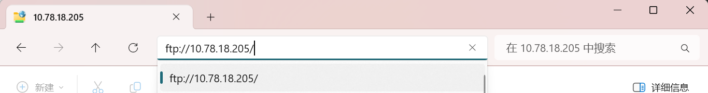

# 数字逻辑设计 - 实验部分

## 实验资源

连接校网，打开文件资源管理器，地址栏输入 `ftp://10.78.18.205/`。里面有Vivado 2020.2软件安装，实验课件，参考实验报告等资料

<figure markdown="span">
    { width="600" }
</figure>

## 实验内容

### final

> 具体要求找不到了，这里只记了个大概

小组合作完成

#### 基础

> 忘了

若选择完成基础，则总得分不超过多少多少

#### 进阶

实现简单游戏的设计

1. [贪吃蛇](./final.md){:target="_blank"}
2. 俄罗斯方块
3. ……（忘了）
4. 其他（需提前和助教确认）

虽然是进阶，但还是强烈建议选择进阶，不然最后分数会很低