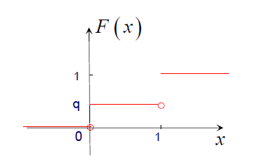
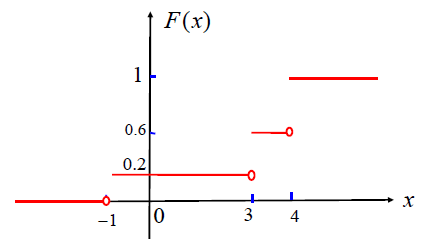
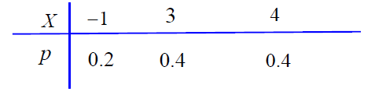
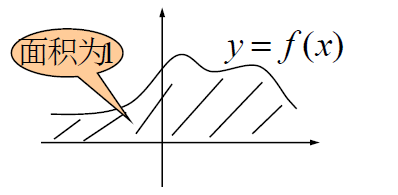
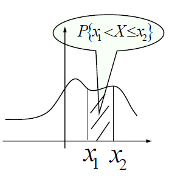

# 随机变量及其概率分布

!!! tip "说明"

    此文档正在更新中……

## 3 随机变量的概率分布函数

### 3.1 定义

设 $X$ 为一随机变量， $x$ 为任意实数，函数
$$
F(x) = P \lbrace X \leqslant x \rbrace
$$
称为随机变量 $X$ 的 **概率分布函数** ，简称 **分布函数**

!!! abstract "几何意义"

    $F(x)$ 的几何意义：
    <figure markdown="span">
        { width="300" }
    </figure>
    将 $X$ 设想成一随机点，那么 $X$ 落在区间 $(- \infty, x]$ 上的概率即为 $F(x)$

对任意的实数 $x_1, x_2 ( x_1 < x_2 )$ ，有
$$
P \lbrace x_1 < X \leqslant x_2 \rbrace = P \lbrace X \leqslant x_2 \rbrace - P \lbrace X \leqslant x_1 \rbrace = F ( x_2 ) -  F ( x_1 )
$$

### 3.2 性质

1. $0 \leqslant F(x) \leqslant 1$，且有 $F(-\infty) = 0, F(+\infty) = 1$
2. $F(x)$ 单调不减 
   当 $x_2 > x_1$ 时， $F(x_2) - F(x_1) = P \lbrace x_1 < X \leqslant x_2 \rbrace \geqslant 0$， 因此 $F(x_2) \geqslant F(x_1)$
3. $F(x)$ 右连续，即 $F(x + 0) = F(x)$
4. $F(x) - F(x - 0) = P \lbrace X = x \rbrace$

???+ example "例题 3.1 - 分布函数"

    设 $X \sim B(1, p), 0 < p < 1, q = 1 - p$。求 $X$ 的分布函数 $F(x)$

    ??? success "答案"

        $F(x) = P \lbrace X \leqslant x \rbrace = \begin{cases}
            0& x < 0 \\
            q& 0 \leqslant x < 1 \\
            1& x \geqslant 1
        \end{cases}$

        <figure markdown="span">
            { width="200" }
        </figure>

一般地，设离散型随机变量 $X$ 的分布律为 $P \lbrace X = x_k \rbrace = p_k, \ k = 1, 2, ...$。由概率的可列可加性得 $X$ 的分布函数为 $F(X) = \sum\limits_{x_k \leqslant x} p_k$。

==分布函数 $F(x)$ 在 $x = x_k, (k = 1, 2, ...)$ 处有跳跃，其跳跃值为 $p_k = P \lbrace X = x_k \rbrace$==

???+ example "例题 3.2 - 跳跃值"

    设 $X$ 的分布函数如下，求 $X$ 的分布律

    $F(x) = \begin{cases}
        0& x < -1 \\
        0.2& -1 \leqslant x < 3 \\
        0.6& 3 \leqslant x < 4 \\
        1& x \geqslant 4
    \end{cases}$

    <figure markdown="span">
        { width="300" }
    </figure>

    ??? success "答案"

        $F(x)$ 是阶梯函数，只在 -1, 3, 4 有跳，跳的幅度分别是 0.2, 0.4, 0.4，所以分布律为

        <figure markdown="span">
            { width="300" }
        </figure>

## 4 连续性随机变量及其密度函数

### 4.1 定义

对于随机变量 $X$ 的分布函数 $F(x)$ ，若存在非负的函数 $f(x)$ ，使对于任意实数 $x$ ， 有：
$$
F(x) = \int_{- \infty}^{x} f(t) dt
$$
则称 $X$ 为连续型随机变量，其中 $f(x)$ 称为 $X$ 的 **概率密度函数**，简称 **密度函数**

### 4.2 性质

1. $f(x) \geqslant 0$
2. $\int_{- \infty}^{+ \infty} f(x) dx = 1$
3. 对于任意的实数 $x_1, x_2 (x_2 > x_1)$， $P \lbrace x_1 < X \leqslant x_2 \rbrace = \int_{x_1}^{x_2} f(t)dt \Rightarrow $ ==$P(X = a) = 0$==
4. 在 $f(x)$ 连续点 $x, F^\prime (x) = f(x)$

<figure markdown="span">
    { width="200" }
</figure>

<figure markdown="span">
    { width="200" }
</figure>

