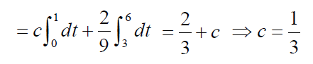

# 2 随机变量及其概率分布

!!! tip "说明"

    此文档正在更新中……

!!! info "说明"

    有些公式块因为已经有图片了，懒得打 $\KaTeX$ 了，所以就直接用图片替代了

## 3 随机变量的概率分布函数

### 3.1 定义

设 $X$ 为一随机变量， $x$ 为任意实数，函数
$$
F(x) = P \lbrace X \leqslant x \rbrace
$$
称为随机变量 $X$ 的 **概率分布函数** ，简称 **分布函数**

!!! abstract "几何意义"

    $F(x)$ 的几何意义：
    <figure markdown="span">
        { width="300" }
    </figure>
    将 $X$ 设想成一随机点，那么 $X$ 落在区间 $(- \infty, x]$ 上的概率即为 $F(x)$

对任意的实数 $x_1, x_2 ( x_1 < x_2 )$ ，有
$$
P \lbrace x_1 < X \leqslant x_2 \rbrace = P \lbrace X \leqslant x_2 \rbrace - P \lbrace X \leqslant x_1 \rbrace = F ( x_2 ) -  F ( x_1 )
$$

### 3.2 性质

1. $0 \leqslant F(x) \leqslant 1$，且有 $F(-\infty) = 0, F(+\infty) = 1$
2. $F(x)$ 单调不减 
   当 $x_2 > x_1$ 时， $F(x_2) - F(x_1) = P \lbrace x_1 < X \leqslant x_2 \rbrace \geqslant 0$， 因此 $F(x_2) \geqslant F(x_1)$
3. $F(x)$ 右连续，即 $F(x + 0) = F(x)$
4. $F(x) - F(x - 0) = P \lbrace X = x \rbrace$

???+ example "例题 3.1 - 分布函数"

    设 $X \sim B(1, p), 0 < p < 1, q = 1 - p$。求 $X$ 的分布函数 $F(x)$

    ??? success "答案"

        $F(x) = P \lbrace X \leqslant x \rbrace = \begin{cases}
            0& x < 0 \\
            q& 0 \leqslant x < 1 \\
            1& x \geqslant 1
        \end{cases}$

        <figure markdown="span">
            { width="200" }
        </figure>

一般地，设离散型随机变量 $X$ 的分布律为 $P \lbrace X = x_k \rbrace = p_k, \ k = 1, 2, ...$。由概率的可列可加性得 $X$ 的分布函数为 $F(X) = \sum\limits_{x_k \leqslant x} p_k$。

==分布函数 $F(x)$ 在 $x = x_k, (k = 1, 2, ...)$ 处有跳跃，其跳跃值为 $p_k = P \lbrace X = x_k \rbrace$==

???+ example "例题 3.2 - 跳跃值"

    设 $X$ 的分布函数如下，求 $X$ 的分布律

    $F(x) = \begin{cases}
        0& x < -1 \\
        0.2& -1 \leqslant x < 3 \\
        0.6& 3 \leqslant x < 4 \\
        1& x \geqslant 4
    \end{cases}$

    <figure markdown="span">
        { width="300" }
    </figure>

    ??? success "答案"

        $F(x)$ 是阶梯函数，只在 -1, 3, 4 有跳，跳的幅度分别是 0.2, 0.4, 0.4，所以分布律为

        <figure markdown="span">
            { width="300" }
        </figure>

???+ example "例题 3.3 - 分布函数"

    设一物体在 A, B 两点间移动，A, B 之间距离 3 个单位。该物体落在 A, B 间任一子区间的概率与区间长度成正比。设它离 A 点的距离为 X ，求 X 的分布函数

    ??? success "答案"

        由“落在 A, B 间任一子区间的概率与区间长度成正比”：
    
        $P(0 \leqslant X \leqslant 3) = 3k = 1$

        $\therefore k = \frac{1}{3}$

        当 $0 \leqslant x < 3$ 时，$F(x) = P\lbrace X \leqslant x \rbrace = \frac{x}{3}$

        $\therefore F(x) = \begin{cases}
            0 & x < 0\\
            \frac{x}{3} & 0 \leqslant x < 3\\
            1 & x \geqslant 3
        \end{cases}$

        <figure markdown="span">
            { width="300" }
        </figure>

## 4 连续型随机变量

### 4.1 定义

对于随机变量 $X$ 的分布函数 $F(x)$ ，若存在非负的函数 $f(x)$ ，使对于任意实数 $x$ ， 有：
$$
F(x) = \int_{- \infty}^{x} f(t) dt
$$
则称 $X$ 为连续型随机变量，其中 $f(x)$ 称为 $X$ 的 **概率密度函数**，简称 **密度函数**

### 4.2 性质

1. $f(x) \geqslant 0$
2. $\int_{- \infty}^{+ \infty} f(x) dx = 1$
3. 对于任意的实数 $x_1, x_2 (x_2 > x_1)$， $P \lbrace x_1 < X \leqslant x_2 \rbrace = \int_{x_1}^{x_2} f(t)dt \Rightarrow $ ==$P(X = a) = 0$==
4. 在 $f(x)$ 连续点 $x, F^\prime (x) = f(x)$

<figure markdown="span">
    { width="200" }
</figure>

<figure markdown="span">
    { width="200" }
</figure>

由性质 3 可得，连续型随机变量取任一定值的概率为 0，因此，连续型随机变量落在开区间与相应闭区间上的概率相等

由性质 4 可得，在 $f(x)$ 的连续点 $x$ 处，当 $\Delta x$ 充分小时，有
$$
P\lbrace x < X \leqslant x + \Delta x \rbrace \approx f(x) \Delta x
$$

!!! question "思考"

    设 $A,\ B$ 为随机事件
    
    1. 若 $P(A) = 1$，则 $A$ 为必然事件吗？
    2. 若 $P(B) = 0$，则 $B$ 为不可能事件吗？
    3. 若 $P(AB) = 0$，则 $A$ 与 $B$ 不相容吗？

    ??? success "答案"

        都不一定，例如：

        $X \in [0, 1],\ f(x) = \begin{cases}
            1& x \in [0, 1]\\
            0& 其他
        \end{cases}$
        
        $A = \lbrace 0 < X < 1 \rbrace,\ B = \lbrace X = 0.5 \rbrace$

        则 $P(A) = 1$，但 $X$ 也可能为 0 或 1；$P(B) = 0$，但 $X$ 确实可能为 0.5；$P(AB) = 0$，但实际上 $A \cap B \not = \varnothing$

        > 看起来挺奇怪的，但就是因为连续型随机变量取任一定值的概率为 0 导致的

???+ example "例题 4.1 - 密度函数"

    设 $X$ 的密度函数为 $f(x) = \begin{cases}
        c & 0 < x < 1\\
        \frac{2}{9} & 3 < x < 6\\
        0 & 其他
    \end{cases}$

    (1) 求常数 $c$ 的值 
    (2) 写出 $X$ 的概率分布函数 
    (3) 要使 $P\lbrace X < k \rbrace = \frac{2}{3}$，求 $k$ 的值

    ??? success "答案"

        解：(1) 由性质 $\int_{- \infty}^{+ \infty} f(t) dt = 1$

        <figure markdown="span">
            { width="300" }
        </figure>

        ---

        (2) 由公式 $F(x) = P \lbrace X \leqslant x \rbrace = \int_{- \infty}^x f(t)dt$

        <figure markdown="span">
            { width="400" }
        </figure>

        ---

        (3) $P \lbrace X < k \rbrace = F(k) = \frac{2}{3}$，由 (2) 分布函数 $F(x)$ 得，$k = 4.5$

### 4.3 连续型随机变量分布

#### 4.3.1 均匀分布

**定义：**

设随机变量 $X$ 具有概率密度函数

$$
f(x) = \begin{cases}
    \dfrac{1}{b - a} & x \in (a, b)\\
    0 & 其他
\end{cases}
$$

则称 $X$ 服从 **区间 $(a, b)$ 上的均匀分布** (uniform distribution)，记为 $X \sim U(a, b)$

根据密度函数的定义，可知 $X$ 的分布函数为

$$
F(x) = \begin{cases}
    0 & x < a\\
    \dfrac{x - a}{b - a} & a \leqslant x < b\\
    1 & x \geqslant b
\end{cases}
$$

<figure markdown="span">
    { width="400" }
</figure>
<figure markdown="span">
    { width="400" }
</figure>

**性质：**

设有实数 $c,\ l$ 满足 $a \leqslant c < c + l \leqslant b$，则
$$
P\lbrace c < X < c + l \rbrace = \int_c^{c + l} \frac{1}{b - a} dx = \frac{l}{b - a}
$$
上式的值与 $c$ 无关，==即 $X$ 落在区间 $(a, b)$ 内任意长度为 $l$ 的子区间的概率为子区间的长度 $l$ 与 $(b - a)$ 的比 $\dfrac{l}{b - a}$==，其概率与 $l$ 成正比，而且仅依赖于子区间的长度，与子区间的位置没有关系