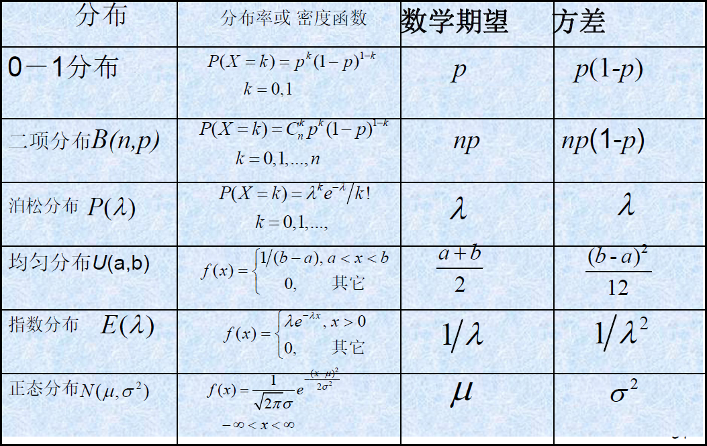

# 4 随机变量的数字特征

!!! tip "说明"

    此文档正在更新中……

!!! info "说明"

    1. 有些公式块因为已经有图片了，懒得打 $\KaTeX$ 了，所以就直接用图片替代了
    2. 本文档仅涉及部分内容，仅可用于复习重点知识

## 整理

<figure markdown="span">
    { width="600" }
</figure>

## 4 数学期望

### 4.1 数学期望的定义

离散型随机变量：$E(X) = \sum\limits_{i=1}^{+\infty}x_ip_i$

连续型随机变量：$E(X) = \int_{-\infty}^{+\infty}xf(x)dx$

### 4.2 随机变量函数的数学期望

离散型随机变量：

$$
E(g(X)) = \sum\limits_{i=1}^{+\infty}g(x_i)p_i\\
E(h(X,Y)) = \sum\limits_{i=1}^{+\infty}\sum\limits_{j=1}^{+\infty}h(x_i,y_i)p_i
$$

连续型随机变量：

$$
E(g(X)) = \int_{-\infty}^{+\infty}g(x)f(x)dx\\
E(h(X,Y)) = \int_{-\infty}^{+\infty}\int_{-\infty}^{+\infty}h(x,y)f(x,y)dxdy
$$

### 4.3 数学期望的性质

$E(c_0 + \sum\limits_{i=1}^nc_i X_i) = c_0 + \sum\limits_{i=1}^nc_i E(X_i)$

若 $n$ 个随机变量相互独立：$E(\prod\limits_{i=1}^n X_i) = \prod\limits_{i=1}^n E(X_i)$

## 2 方差、变异系数

### 2.1 方差的定义

$Var(X) = D(X) = E[(X - E(X))^2]$

$Var(x) = E(X^2) - (E(X))^2$

### 2.2 方差的性质

1. $Var(cX) = c^2Var(X)$
2. $Var(X + c) = Var(X)$
3. $Var(X) \leqslant E[(X - c)^2]$，其中当且仅当 $E(X) = c$ 时等号成立

$Var(\sum\limits_{i=1}^nX_i) = \sum\limits_{i=1}^n Var(X_i) + 2\sum\limits_{1 \leqslant i < j \leqslant n}Cov(X_i,Y_i)$

若 $n$ 个随机变量两两独立：

1. $Var(\sum\limits_{i=1}^n X_i) = \sum\limits_{i=1}^n Var(X_i)$
2. $Var(c_0 + \sum\limits_{i=1}^n c_i X_i) = \sum\limits_{i=1}^n c_i^2 Var(X_i)$
   
### 2.3 标准化随机变量与变异系数

**定义：**

若随机变量 $X$ 的方差存在，则称

$$
X^* = \dfrac{X = E(X)}{\sqrt{Var(X)}}
$$

为 $X$ 的 **标准化随机变量**，简称 **标准化变量**

显然，$E(X^*) = 0,\ Var(X^*) = 1$

## 3 协方差与相关系数

### 3.1 协方差

$Cov(X,Y) = E[(X - E(X))(Y - E(Y))]$

$Cov(X,Y) = E(XY) - E(X)E(Y)$

1. $Cov(X,Y) = Cov(Y,X)$
2. $Cov(X,X) = Var(X)$
3. $Cov(aX,bY) = abCov(X,Y)$
4. $Cov(X_1 + X_2,Y) = Cov(X_1,Y) + Cov(X_2,Y)$
5. 若 $X$ 和 $Y$ 相互独立，则 $Cov(X,Y) = 0$，但反之不然
6. 当 $Var(X)Var(Y) \not ={0}$ 时，有 $(Cov(X,Y))^2 \leqslant Var(X)Var(Y)$，其中等号成立当且仅当 $X$ 与 $Y$ 之间有严格的线性关系（即存在常数 $c_1,c_2$ 使得 $P\lbrace Y = c_1 + c_2 X \rbrace = 1$ 成立）

### 3.2 相关系数

$\rho_{XY} = \dfrac{Cov(X,Y)}{\sqrt{Var(X)}\sqrt{Var(Y)}}$

$\rho_{XY} = Cov(X^*,Y^*)$

**定理：**

对于随机变量 $X$ 和 $Y$，当相关系数 $\rho_{XY}$ 存在时，有

1. 若 $X$ 和 $Y$ 相互独立，则 $\rho_{XY} = 0$，但反之不然
2. $|\rho_{XY}| \leqslant 1$，其中等号成立当且仅当 $X$ 与 $Y$ 之间有严格的线性关系

### 3.3 不相关定义

**定义：** 

当随机变量 $X$ 和 $Y$ 的相关系数
$$
\rho_{XY} = 0
$$
时，称 $X$ 和 $Y$ **不相关** 或 **零相关**

不相关还可以用下面的任意一条来定义：

1. $Cov(X,Y) = 0$
2. $E(XY) = E(X)E(Y)$
3. $Var(X + Y) = Var(X) + Var(Y)$

**定理：** 对于两个相互独立的随机变量，若其方差存在，则一定不相关；但是如果它们不相关，却未必相互独立。反之，若两随机变量相关，则它们一定不独立

但对于一些特定的分布，如正态分布，不相关与相互独立是等价的

## 4 其他数字特征

### 4.1 矩

1. $X$ 的 $k$ 阶（原点）矩：$\mu_k = E(X^k)$
2. $X$ 的 $k$ 阶中心矩：$\nu_k = E[(X - E(X))^k]$
3. $X$ 和 $Y$ 的 $k+l$ 阶混合（原点）矩：$E(X^kY^l)$
4. $X$ 和 $Y$ 的 $k+l$ 阶混合中心矩：$E[(X - E(X))^k(Y - E(Y))^l]$

### 4.2 分位数

**定义：** 

设连续型随机变量 $X$ 的分布函数和密度函数分别为 $F(x)$ 与 $f(x)$，对任意的 $0 < \alpha 1$，称满足条件
$$
P\lbrace X > x_{\alpha} \rbrace = 1 - F(x_{\alpha}) = \int_{-\infty}^{+\infty}f(x)dx = \alpha
$$
的实数 $x_\alpha$ 为随机变量 $X$（或相应的分布）的 **上（侧）$\alpha$ 分位数（或上（侧）$\alpha$ 分位点）**

## 5 多维随机变量的数字特征

### 5.1 多维随机变量的数学期望与协方差矩阵

**定义：** 

记 $n$ 维随机变量 $\mathbf{X} = (X_1,X_2,···,X_n)^T$，若其每一分量的数学期望都存在，则称
$$
E(\mathbf{X}) = (E(X_1),E(X_2),···,E(X_n))^T
$$
为 $n$ 维随机变量 $\mathbf{X}$ 的数学期望（向量）

**定义：** 

记 $n$ 维随机变量 $\mathbf{X} = (X_1,X_2,···,X_n)^T$，若其每一分量的方差都存在，则称

$$
Cov(\mathbf{X}) = E[(\mathbf{X} - E(\mathbf{X}))(\mathbf{X} - E(\mathbf{X}))^T]\\
= \begin{pmatrix}
    Var(X_1)&Cov(X_1,X_2)&···&Cov(X_1,X_n)\\
    Cov(X_2, X_1)&Var(X_2)&···&Cov(X_2,X_n)\\
    \vdots&\vdots& & \vdots\\
    Cov(X_n,X_1)&Cov(X_n,X_2)&\cdots&Var(X_n)
\end{pmatrix}
$$

为 $n$ 维随机变量 $\mathbf{X}$ 的 **协方差矩阵**，简称 **协方差阵**

**定理：** $n$ 维随机变量 $\mathbf{X}$ 的协方差矩阵 $Cov(\mathbf{X})$ 是一个对称的非负定矩阵

### 5.2 多维正态变量

**定义：**

$n$ 维随机变量 $\mathbf{X} = (X_1,X_2,···,X_n)^T$，它的每一分量的方差都存在。记 $\mathbf{X}$ 的协方差矩阵为 $\mathbf{B} = Cov(\mathbf{X})$，数学期望为 $\mathbf{a} = E(\mathbf{X}) = (E(X_1),E(X_2),···,E(X_n))^T$，则由密度函数 $f(\mathbf{x})$ 定义的分布为 $n$ 元正态分布，常记为 $\mathbf{X} \sim N(\mathbf{a}, \mathbf{B})$，其中 $\mathbf{x} = (x_1,x_2,\cdots,x_n)^T$

**$n$ 元正态分布的性质：**

1. $n$ 维正态变量 $(X_1,X_2,···,X_n)^T$ 中的任意 $k$ 维子向量 $(X_{i_1},X_{i_2},\cdots,X_{i_{k}})^T(1 \leqslant k \leqslant n)$ 也服从 $k$ 元正态分布。特别地，$n$ 维正态变量中的每个分量都是服从一元正态分布的。反之，若 $X_i(i=1,2,\cdots,n)$ 都是正态变量，且相互独立，则 $(X_1,X_2,···,X_n)^T$ 服从 $n$ 元正态分布
2. $\mathbf{X} = (X_1,X_2,···,X_n)^T$ 服从 $n$ 元正态分布的充要条件是它的各个分量的任意线性组合均服从一元正态分布，即对任意 $n$ 维实向量 $\mathbf{l} = (l_1,l_2,\cdots,l_n)^T$，有 $\mathbf{X} \sim N(\mathbf{a}, \mathbf{B}) \Leftrightarrow \mathbf{l}^T\mathbf{X} = \sum\limits_{i=1}^n l_iX_i \sim N(\mathbf{l}^T\mathbf{a}, \mathbf{l}^T\mathbf{B}\mathbf{l})$，其中 $l_1,l_2,\cdots,l_n$ 不全为 0
3. 若 $\mathbf{X} = (X_1,X_2,···,X_n)^T$ 服从 $n$ 元正态分布，设 $Y_1,Y_2,\cdots,Y_k$ 都是 $X_1,X_2,\cdots,X_n$ 的线性函数，则 $\mathbf{Y} = (Y_1,Y_2,\cdots,Y_k)^T$ 也服从 $k$ 元正态分布。这一性质也可用矩阵的形式来给出：若 $\mathbf{X} \sim N(\mathbf{a}, \mathbf{B}), \mathbf{C} = (c_{ij})_{k\times n}$ 为 $k \times n$ 实数矩阵，则 $\mathbf{Y} = \mathbf{CX} \sim N(\mathbf{Ca}, \mathbf{CBC}^T)$。一般称此性质为“正态变量的线性变换不变性”
4. 服从 $n$ 元正态分布的随机变量 $\mathbf{X}$ 中的分量 $X_1,X_2,\cdots,X_n$ 相互独立的充要条件是它们两两不相关，也等价于“ $Cov(\mathbf{X})$ 为对角矩阵”