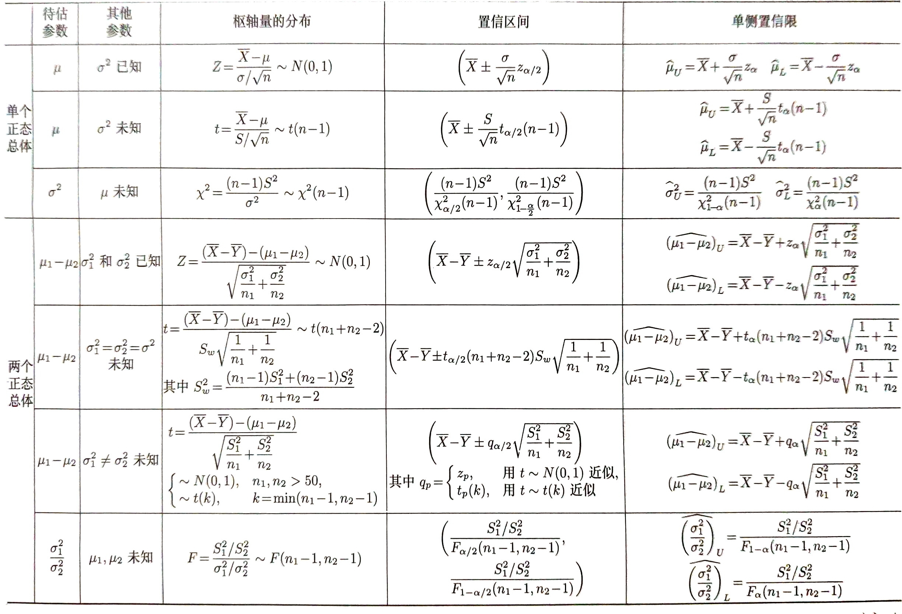

# 7 参数估计

<!-- !!! tip "说明"

    此文档正在更新中…… -->

!!! info "说明"

    1. 有些公式块因为已经有图片了，懒得打 $\KaTeX$ 了，所以就直接用图片替代了
    2. 本文档仅涉及部分内容，仅可用于复习重点知识

## 1 点估计

### 1.1 矩法

$A_k \xrightarrow{P} \mu_k, B_k \xrightarrow{P} \upsilon_k$

### 1.2 极大似然法

#### 离散型

**似然函数：** $L(\theta) = \prod\limits_{i=1}^n p(x_i;\theta)$

选取 $\theta$ 的估计值 $\hat{\theta}$，使得 $L(\theta)$ 取到最大

由此获得的 $\hat{\theta}$ 称为参数 $\theta$ 的 **极大似然估计值**，相应的统计量 $\hat{\theta}$ 称为 $\theta$ 的 **极大似然估计量**（MLE）

#### 连续型

**似然函数：** $L(\theta) = \prod\limits_{i=1}^n f(x_i;\theta)$

寻求极大似然估计常常用微分法

**似然方程：** $\dfrac{dL(\theta)}{d\theta}\bigg| _{\theta = \hat{\theta}} = 0$

**对数似然函数：** $l(\theta) = \ln L(\theta)$

**对数似然方程：** $\dfrac{dl(\theta)}{d\theta}\bigg| _{\theta = \hat{\theta}} = 0$

---

**极大似然估计的不变性：** 设参数 $\theta$ 的极大似然估计为 $\hat{\theta}$，$\theta^* = g(\theta)$ 是 $\theta$ 的连续函数，则参数 $\theta^*$ 的极大似然估计为 $\hat{\theta} = g(\hat{\theta})$

## 2 估计量的评价准则

### 2.1 无偏性准则

**定义：**

设 $\theta \in \Theta$ 是总体 $X$ 的待估参数，$X_1,X_2,\cdots,X_n$ 是来自总体 $X$ 的样本。若估计量 $\hat{\theta}$ 的数学期望存在，且满足

$$
E(\hat{\theta}) = \theta, \forall\theta \in \Theta
$$

则称 $\hat{\theta}$ 是 $\theta$ 的 **无偏估计量** 或 **无偏估计**

- 若 $E(\hat{\theta}) \not ={\theta}$，则称 $E(\hat{\theta}) - \theta$ 为估计量 $\hat{\theta}$ 的 **偏差**
- 若 $E(\hat{\theta}) \not ={\theta}$，但满足 $\lim\limits_{n \rightarrow +\infty} E(\hat{\theta}) = \theta$，则称 $\hat{\theta}$ 是 $\theta$ 的 **渐进无偏估计**

### 2.2 有效性准则

**定义：**

设 $\hat{\theta}_1$ 与 $\hat{\theta}_2$ 都是参数 $\theta$ 的无偏估计，若 $\forall \theta \in \Theta, Var_\theta(\hat{\theta}_1) \leqslant Var_\theta(\hat{\theta}_2)$，且至少有一个 $\theta \in \Theta$ 使不等号成立，则称 $\hat{\theta}_1$ 比 $\hat{\theta}_2$ **有效**

!!! tip "纠偏"

    若 $E(\hat{\theta}) = a\theta + b$，则 $\dfrac{\hat{\theta} - b}{a}$ 为无偏估计量

### 2.3 均方误差准则

**定义：**

设 $\hat\theta$ 是总体参数 $\theta$ 的估计量，称 $E[(\hat{\theta} - \theta)^2] = D(\hat{\theta}) + (E(\hat{\theta}) - \theta)^2$ 是估计量 $\hat{\theta}$ 的 **均方误差**，记为 $Mse(\hat{\theta})$

设 $\hat{\theta}_1$ 与 $\hat{\theta}_2$ 都是 $\theta$ 的估计量，若对于任意 $\theta \in \Theta, Mse(\hat{\theta}_1) \leqslant Mse(\hat{\theta}_2)$，且至少存在某个 $\theta$，使得不等号成立，则称在均方误差准则下，$\hat{\theta}_1$ 优于 $\hat{\theta}_2$ 

### 2.4 相合性误差

**定义：**

设 $\hat{\theta}_n$ 是总体参数 $\theta$ 的估计量，若对任意 $\epsilon > 0$，有

$$
\lim\limits_{n \rightarrow + \infty}P\lbrace |\hat{\theta}_n - \theta| < \epsilon \rbrace = 1
$$

即 $\hat{\theta}_n$ 依概率收敛于 $\theta$，则称 $\hat{\theta}_n$ 是 $\theta$ 的 **相合估计量**，并记为 $\hat{\theta}_n \xrightarrow{P} \theta, n \rightarrow + \infty$

## 3 区间估计

### 3.1 置信区间的定义

**定义：**

$$
P\lbrace \hat{\theta}_L < \theta < \hat{\theta}_U \rbrace \geqslant 1 - \alpha
$$

则称随机区间 $(\hat{\theta}_L, \hat{\theta}_U)$ 是参数 $\theta$ 的 **置信水平** 为 $1 - \alpha$ 的 **置信区间**，$\hat{\theta}_L$ 和 $\hat{\theta}_U$ 分别称为 $\theta$ 的置信水平是 $1 - \alpha$ 的双侧 **置信下限** 和 **置信上限**

称区间的平均长度 $E(\hat{\theta}_U - \hat{\theta}_L)$ 为置信区间 $(\hat{\theta}_L, \hat{\theta}_U)$ 的 **精确度**，并称二分之一区间平均长度为置信区间的 **误差限**

**奈曼原则：** 在保证置信水平达到一定的前提下，尽可能提高精确度

**定义：**

$$
P\lbrace \hat{\theta}_L < \theta \rbrace\geqslant 1 - \alpha, \theta \in \Theta\\
P\lbrace \theta < \hat{\theta}_U \rbrace\geqslant 1 - \alpha, \theta \in \Theta
$$

那么分别称 $\hat{\theta}_L$ 和 $\hat{\theta}_U$ 是参数 $\theta$ 的置信水平为 $1 - \alpha$ 的 **单侧置信下限** 和 **单侧置信上限**

**引理：**

设统计量 $\hat{\theta}_L$ 和 $\hat{\theta}_U$ 分别是参数 $\theta$ 的置信水平为 $1 - \alpha_1$ 和  $1 - \alpha_2$ 的单侧置信下限、单侧置信上限，且 $\hat{\theta}_L < \hat{\theta}_U$，那么 $(\hat{\theta}_L,\hat{\theta}_U)$ 是 $\theta$ 的置信水平为 $1-\alpha_1-\alpha_2$ 的置信区间

### 3.2 枢轴量法

## 4 正态总体参数的区间估计

<figure markdown="span">
    { width="800" }
</figure>
